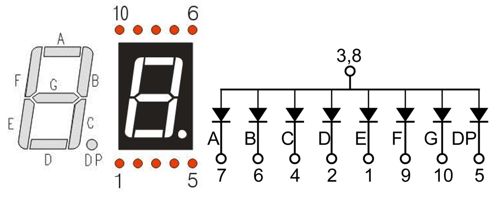
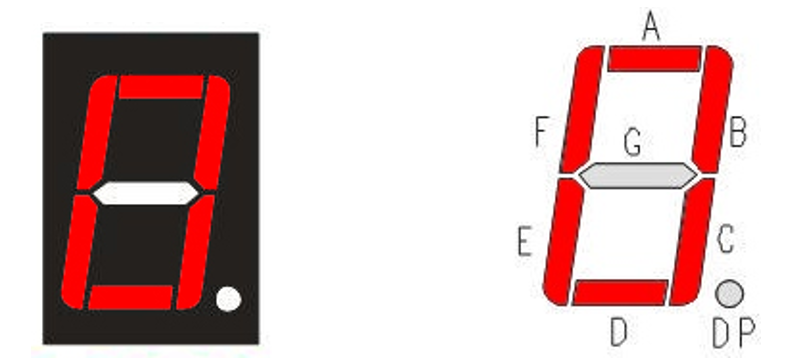

##############################################################################
Chapter 74HC595 & 7-Segment Display
##############################################################################

In this chapter, we will introduce the 7-Segment Display.

Project 7-Segment Display
****************************************************************

We will use a 74HC595 IC Chip to control a 7-Segment Display and make it display sixteen decimal characters "0” to “F".

Component List
================================================================

+-------------------------------------------------+-------------------------------------------------+
|1. Raspberry Pi (with 40 GPIO) x1                |                                                 |     
|                                                 |   Jumper Wires x18                              |       
|2. GPIO Extension Board & Ribbon Cable x1        |                                                 |       
|                                                 |     |jumper-wire|                               |                                                            
|3. Breadboard x1                                 |                                                 |                                                                 
+-----------------------------+-------------------+--------------+----------------------------------+
| 74HC595 x1                  | 7-Segment Display x1             | Resistor 220Ω x8                 |
|                             |                                  |                                  |
|  |74HC595|                  |  |7_Segment_Display|             |  |res-220R|                      |
+-----------------------------+----------------------------------+----------------------------------+

.. |jumper-wire| image:: ../_static/imgs/jumper-wire.png
.. |74HC595| image:: ../_static/imgs/74HC595.png
    :width: 40%
.. |7_Segment_Display| image:: ../_static/imgs/7_Segment_Display.png
    :width: 75%
.. |res-220R| image:: ../_static/imgs/res-220R.png
    :width: 20%

Component knowledge
================================================================

7-segment display
----------------------------------------------------------------

A 7-Segment Display is a digital electronic display device. There is a figure "8" and a decimal point represented, which consists of 8 LEDs. The LEDs have a Common Anode and individual Cathodes. Its internal structure and pin designation diagram is shown below:

As we can see in the above circuit diagram, we can control the state of each LED separately. Also, by combining LEDs with different states of ON and OFF, we can display different characters (Numbers and Letters). For example, to display a “0”: we need to turn ON LED segments A, B, C, D, E and F, and turn OFF LED segments G and DP.

In this project, we will use a 7-Segment Display with a Common Anode. Therefore, when there is an input low level to an LED segment the LED will turn ON. Defining segment “A” as the lowest level and segment “DP” as the highest level, from high to low would look like this: “DP”, “G”, “F”, “E”, “D”, “C”, “B”, “A”. Character "0" corresponds to the code: 1100 0000b=0xc0.

Circuit
================================================================

+------------------------------------------------------------------------------------------------+
|   Schematic diagram                                                                            |
|                                                                                                |
|   |7_Segment_Sc|                                                                               |
+------------------------------------------------------------------------------------------------+
|   Hardware connection. If you need any support,please feel free to contact us via:             |
|                                                                                                |
|   support@freenove.com                                                                         |
|                                                                                                |
|   |7_Segment_Fr|                                                                               | 
|                                                                                                |
|   **Video:** https://youtu.be/KSE0LdyuOFM                                                      |
+------------------------------------------------------------------------------------------------+

.. |7_Segment_Sc| image:: ../_static/imgs/7_Segment_Sc.png
.. |7_Segment_Fr| image:: ../_static/imgs/7_Segment_Fr.png

.. raw:: html

   <iframe height="500" width="690" src="https://www.youtube.com/embed/KSE0LdyuOFM" frameborder="0" allowfullscreen></iframe>
  
Code
================================================================

This code uses a 74HC595 IC Chip to control the 7-Segment Display. The use of the 74HC595 IC Chip is generally the same throughout this Tutorial. We need code to display the characters “0” to “F” one character at a time, and then output to display them with the 74HC595 IC Chip.

C Code SevenSegmentDisplay
----------------------------------------------------------------

First, observe the project result, and then learn about the code in detail.

.. hint:: 

    :red:`If you have any concerns, please contact us via:` support@freenove.com

1.	Use ``cd`` command to enter 18.1.1_SevenSegmentDisplay directory of C code.

.. code-block:: console

    $ cd ~/Freenove_Kit/Code/C_Code/18.1.1_SevenSegmentDisplay

2.	Use following command to compile ``SevenSegmentDisplay.c`` and generate executable file ``SevenSegmentDisplay``.

.. code-block:: console

    $ gcc SevenSegmentDisplay.c -o SevenSegmentDisplay -lwiringPi

3.	Then run the generated file ``SevenSegmentDisplay``.

.. code-block:: console

    $ sudo ./SevenSegmentDisplay

After the program is executed, the 7-Segment Display starts to display the characters “0” to “F” in succession.

The following is the program code:

.. literalinclude:: ../../../freenove_Kit/Code/C_Code/18.1.1_SevenSegmentDisplay/SevenSegmentDisplay.c
    :linenos: 
    :language: C
    :dedent:

First, we need to create encoding for characters “0” to “F” in the array.

.. code-block:: c

    unsigned char num[]={0xc0,0xf9,0xa4,0xb0,0x99,0x92,0x82,0xf8,0x80,0x90,0x88,0x83,0xc6,0xa1,0x86,0x8e};

In the “for” loop of loop() function, use the 74HC595 IC Chip to output contents of array “num” successively. SevenSegmentDisplay can then correctly display the corresponding characters. Pay attention to this in regard to shiftOut function, the transmission bit, flag bit and highest bit will be transmitted preferentially.

.. code-block:: c

    for(i=0;i<sizeof(num);i++){
        digitalWrite(latchPin,LOW);
        _shiftOut(dataPin,clockPin,MSBFIRST,num[i]);//Output the figures and the highest level is transfered preferentially.
        digitalWrite(latchPin,HIGH);
        delay(500);
    }

If you want to display the decimal point, make the highest bit of each array “0”, which can be implemented easily by num[i]&0x7f.

.. code-block:: c

    _shiftOut(dataPin,clockPin,MSBFIRST,num[i] & 0x7f);

.. include:: 74HC595 & 4-7-Segment Display.rst