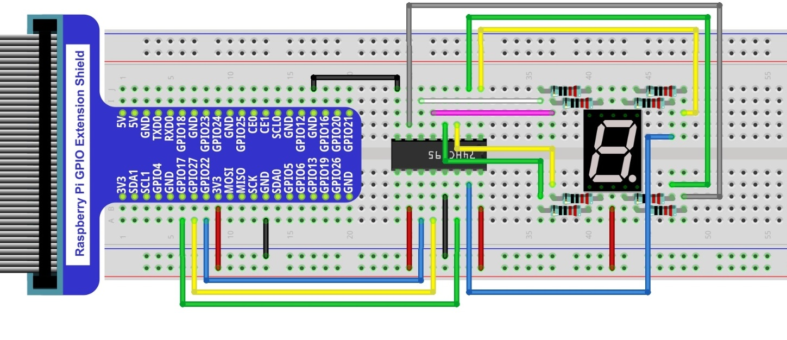
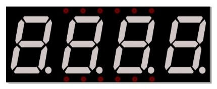
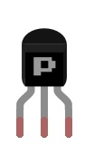

##############################################################################
Chapter 74HC595 & 7-Segment Display
##############################################################################

In this chapter, we will introduce the 7-Segment Display.

Project 7-Segment Display
****************************************************************

We will use a 74HC595 IC Chip to control a 7-Segment Display and make it display sixteen decimal characters "0” to “F".

Component List
================================================================

+-------------------------------------------------+-------------------------------------------------+
|1. Raspberry Pi (with 40 GPIO) x1                |                                                 |     
|                                                 |   Jumper Wires x18                              |       
|2. GPIO Extension Board & Ribbon Cable x1        |                                                 |       
|                                                 |     |jumper-wire|                               |                                                            
|3. Breadboard x1                                 |                                                 |                                                                 
+-----------------------------+-------------------+--------------+----------------------------------+
| 74HC595 x1                  | 7-Segment Display x1             | Resistor 220Ω x8                 |
|                             |                                  |                                  |
|  |74HC595|                  |  |7_Segment_Display|             |  |res-220R|                      |
+-----------------------------+----------------------------------+----------------------------------+

.. |jumper-wire| image:: ../_static/imgs/jumper-wire.png
.. |74HC595| image:: ../_static/imgs/74HC595.png
    :width: 40%
.. |7_Segment_Display| image:: ../_static/imgs/7_Segment_Display.png
    :width: 75%
.. |res-220R| image:: ../_static/imgs/res-220R.png
    :width: 20%

Component knowledge
================================================================

7-segment display
----------------------------------------------------------------

A 7-Segment Display is a digital electronic display device. There is a figure "8" and a decimal point represented, which consists of 8 LEDs. The LEDs have a Common Anode and individual Cathodes. Its internal structure and pin designation diagram is shown below:

.. image:: ../_static/imgs/7_Segment_Display_1.png
    :align: center

As we can see in the above circuit diagram, we can control the state of each LED separately. Also, by combining LEDs with different states of ON and OFF, we can display different characters (Numbers and Letters). For example, to display a “0”: we need to turn ON LED segments A, B, C, D, E and F, and turn OFF LED segments G and DP.

.. image:: ../_static/imgs/7_Segment_Display_2.png
    :align: center
    :width: 80%

In this project, we will use a 7-Segment Display with a Common Anode. Therefore, when there is an input low level to an LED segment the LED will turn ON. Defining segment “A” as the lowest level and segment “DP” as the highest level, from high to low would look like this: “DP”, “G”, “F”, “E”, “D”, “C”, “B”, “A”. Character "0" corresponds to the code: 1100 0000b=0xc0.

Circuit
================================================================

+------------------------------------------------------------------------------------------------+
|   Schematic diagram                                                                            |
|                                                                                                |
|   |7_Segment_Sc|                                                                               |
+------------------------------------------------------------------------------------------------+
|   Hardware connection. If you need any support,please feel free to contact us via:             |
|                                                                                                |
|   support@freenove.com                                                                         |
|                                                                                                |
|   |7_Segment_Fr|                                                                               | 
|                                                                                                |
|   **Video:** https://youtu.be/KSE0LdyuOFM                                                      |
+------------------------------------------------------------------------------------------------+

.. |7_Segment_Sc| image:: ../_static/imgs/7_Segment_Sc.png

  
Code
================================================================

This code uses a 74HC595 IC Chip to control the 7-Segment Display. The use of the 74HC595 IC Chip is generally the same throughout this Tutorial. We need code to display the characters “0” to “F” one character at a time, and then output to display them with the 74HC595 IC Chip.

C Code 18.1.1 SevenSegmentDisplay
----------------------------------------------------------------

First, observe the project result, and then learn about the code in detail.

.. hint:: 
    :red:`If you have any concerns, please contact us via:` support@freenove.com

1.	Use ``cd`` command to enter 18.1.1_SevenSegmentDisplay directory of C code.

.. code-block:: console

    $ cd ~/Freenove_Kit/Code/C_Code/18.1.1_SevenSegmentDisplay

2.	Use following command to compile ``SevenSegmentDisplay.c`` and generate executable file ``SevenSegmentDisplay``.

.. code-block:: console

    $ gcc SevenSegmentDisplay.c -o SevenSegmentDisplay -lwiringPi

3.	Then run the generated file ``SevenSegmentDisplay``.

.. code-block:: console

    $ sudo ./SevenSegmentDisplay

After the program is executed, the 7-Segment Display starts to display the characters “0” to “F” in succession.

The following is the program code:

.. literalinclude:: ../../../freenove_Kit/Code/C_Code/18.1.1_SevenSegmentDisplay/SevenSegmentDisplay.c
    :linenos: 
    :language: C

First, we need to create encoding for characters “0” to “F” in the array.

.. code-block:: c

    unsigned char num[]={0xc0,0xf9,0xa4,0xb0,0x99,0x92,0x82,0xf8,0x80,0x90,0x88,0x83,0xc6,0xa1,0x86,0x8e};

In the “for” loop of loop() function, use the 74HC595 IC Chip to output contents of array “num” successively. SevenSegmentDisplay can then correctly display the corresponding characters. Pay attention to this in regard to shiftOut function, the transmission bit, flag bit and highest bit will be transmitted preferentially.

.. code-block:: c

    for(i=0;i<sizeof(num);i++){
        digitalWrite(latchPin,LOW);
        _shiftOut(dataPin,clockPin,MSBFIRST,num[i]);//Output the figures and the highest level is transfered preferentially.
        digitalWrite(latchPin,HIGH);
        delay(500);
    }

If you want to display the decimal point, make the highest bit of each array “0”, which can be implemented easily by num[i]&0x7f.

.. code-block:: c

    _shiftOut(dataPin,clockPin,MSBFIRST,num[i] & 0x7f);

Project 4-Digit 7-Segment Display
****************************************************************

Now, let's try to control more-than-one digit displays by using a Four 7-Segment Display in one project.

Component List
================================================================

+-------------------------------------------------+-------------------------------------------------+
|1. Raspberry Pi (with 40 GPIO) x1                |                                                 |     
|                                                 |   Jumper Wires x18                              |       
|2. GPIO Extension Board & Ribbon Cable x1        |                                                 |       
|                                                 |     |jumper-wire|                               |                                                            
|3. Breadboard x1                                 |                                                 |                                                                 
+-----------------------------+-------------------+--------------+----------------------------------+
| 74HC595 x1                  | Resistor 1KΩ x4                  | Resistor 220Ω x8                 |
|                             |                                  |                                  |
|  |74HC595|                  |  |Resistor-1kΩ|                  |  |res-220R|                      |
+-----------------------------+-------------------+--------------+----------------------------------+
| 4-Digit 7-Segment Display x1                    | PNP transistor x4                               |       
|                                                 |                                                 |                                                            
|  |4_7_Segment_Display|                          |  |PNP|                                          | 
+-------------------------------------------------+-------------------------------------------------+

.. |jumper-wire| image:: ../_static/imgs/jumper-wire.png
.. |74HC595| image:: ../_static/imgs/74HC595.png
    :width: 30%

.. |res-220R| image:: ../_static/imgs/res-220R.png
    :width: 20%

.. |Resistor-1kΩ| image:: ../_static/imgs/Resistor-1kΩ.png
    :width: 25%

Component knowledge
================================================================

4 Digit 7-Segment Display
----------------------------------------------------------------

A 4 Digit 7-segment display integrates four 7-Segment Displays into one module, therefore it can display more characters. All of the LEDs contained have a Common Anode and individual Cathodes. Its internal structure and pin designation diagram is shown below:

.. image:: ../_static/imgs/4_7_Segment_Display_1.png
    :align: center
    :width: 60%

The internal electronic circuit is shown below, and all 8 LED cathode pins of each 7-Segment Display are connected together.

.. image:: ../_static/imgs/4_7_Segment_Display_2.png
    :align: center

Display method of 4 Digit 7-segment display is similar to 1 Digit 7-segment display. The difference between them is that the 4-Digit displays each Digit is visible in turn, one by one and not together. We need to first send high level to the common end of the first Digit Display, and send low level to the remaining three common ends, and then send content to 8 LED cathode pins of the first Digit Display. At this time, the first 7-Segment Display will show visible content and the remaining three will be OFF.

Similarly, the second, third and fourth 7-Segment Displays will show visible content in turn by scanning the display. Although the four number characters are displayed in turn separately, this process is so very fast that it is unperceivable to the naked eye. This is due to the principle of optical afterglow effect and the vision persistence effect in human sight. This is how we can see all 4 number characters at the same time. However, if each number character is displayed for a longer period, you will be able to see that the number characters are displayed separately. 

Circuit
================================================================

+------------------------------------------------------------------------------------------------+
|   Schematic diagram                                                                            |
|                                                                                                |
|   |4_7_Segment_Sc|                                                                             |
+------------------------------------------------------------------------------------------------+
|   Hardware connection                                                                          |
|                                                                                                |
|   |4_7_Segment_Fr|                                                                             | 
+------------------------------------------------------------------------------------------------+

.. |4_7_Segment_Sc| image:: ../_static/imgs/4_7_Segment_Sc.png
.. |4_7_Segment_Fr| image:: ../_static/imgs/4_7_Segment_Fr.png

Code
================================================================

In this code, we use the 74HC595 IC Chip to control the 4-Digit 7-Segment Display, and use the dynamic scanning method to show the changing number characters.

C Code 18.2.1 StopWatch
----------------------------------------------------------------

First, observe the project result, and then learn about the code in detail.\

.. hint:: 
    :red:`If you have any concerns, please contact us via:` support@freenove.com

1.	Use ``cd`` command to enter directory of C code.

.. code-block:: console

    $ cd ~/Freenove_Kit/Code/C_Code/18.2.1_StopWatch

2.	Use following command to compile ``StopWatch.c`` and generate executable file ``StopWatch``. 

.. code-block:: console

    $ gcc StopWatch.c -o StopWatch -lwiringPi

3.	Run the generated file ``SteppingMotor``.

.. code-block:: console

    $ sudo ./StopWatch

After the program is executed, the 4-Digit 7-Segment Display starts displaying a four-digit number dynamically, and the numeric value of this number will increase by plus 1 each second thereafter.

The following is the program code:

.. literalinclude:: ../../../freenove_Kit/Code/C_Code/18.2.1_StopWatch/StopWatch.c
    :linenos: 
    :language: C

First, we define the pin of the 74HC595 IC Chip and the 7-Segment Display Common Anode, use character encoding and a variable "counter" to enable the counter to be visible on the 7-Segment Display.

.. literalinclude:: ../../../freenove_Kit/Code/C_Code/18.2.1_StopWatch/StopWatch.c
    :linenos: 
    :language: C
    :lines: 12-18

Subfunction selectDigit (int digit) function is used to open one of the 7-Segment Displays while closing the other 7-Segment Displays, where the parameter digit value can be 1,2,4,8. Using "|" can open a number of a 7-Segment Display.

.. literalinclude:: ../../../freenove_Kit/Code/C_Code/18.2.1_StopWatch/StopWatch.c
    :linenos: 
    :language: C
    :lines: 20-25

Subfunction outData (int8_t data) is used to make the 74HC595 IC Chip output an 8-bit data immediately.

.. literalinclude:: ../../../freenove_Kit/Code/C_Code/18.2.1_StopWatch/StopWatch.c
    :linenos: 
    :language: C
    :lines: 42-46

Subfunction display (int dec) is used to make a 4-Digit 7-Segment Display a 4-bit integer. First open the common end of first 7-Segment Display Digit and turn OFF the other three Digits, now it can be used as 1-Digit 7-Segment Display. The first Digit is used for displaying single digits of "dec", the second Digit is for tens, the third for hundreds and fourth for thousands respectively. Each digit will be displayed for a period by using delay (). The time in this code is very brief, so you will see digits all together. If the time is set long enough, you will see that every digit is displayed independently.

.. literalinclude:: ../../../freenove_Kit/Code/C_Code/18.2.1_StopWatch/StopWatch.c
    :linenos: 
    :language: C
    :lines: 47-68

Subfunction timer (int sig) is the timer function, which will set an alarm to signal. This function will be executed once at set time intervals. Accompanied by the execution, “1” will be added as the variable counter and then reset the time of timer to 1s.

.. literalinclude:: ../../../freenove_Kit/Code/C_Code/18.2.1_StopWatch/StopWatch.c
    :linenos: 
    :language: C
    :lines: 69-75

Finally, in the main function, configure the GPIO, and set the timer function.

.. literalinclude:: ../../../freenove_Kit/Code/C_Code/18.2.1_StopWatch/StopWatch.c
    :linenos: 
    :language: C
    :lines: 84-93

In the while loop, make the digital display variable counter value “1”. The value will change in function timer (), so the content displayed by the 7-Segment Display will change accordingly.

.. literalinclude:: ../../../freenove_Kit/Code/C_Code/18.2.1_StopWatch/StopWatch.c
    :linenos: 
    :language: C
    :lines: 94-96
