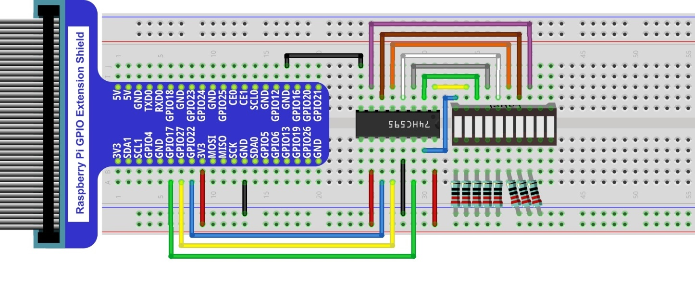

##############################################################################
Chapter 74HC595 & Bar Graph LED
##############################################################################

We have used LED Bar Graph to make a flowing water light, in which 10 GPIO ports of RPi are occupied. More GPIO ports mean that more peripherals can be connected to RPi, so GPIO resource is very precious. Can we make flowing water light with less GPIO ports? In this chapter, we will learn a component, 74HC595, which can achieve the target.

Project FollowLight
****************************************************************

Now let us learn how to use the 74HC595 IC Chip to make a flowing water light using less GPIO.

Component List
================================================================

+-------------------------------------------------+-------------------------------------------------+
|1. Raspberry Pi (with 40 GPIO) x1                |                                                 |     
|                                                 |   Jumper Wires x17                              |       
|2. GPIO Extension Board & Ribbon Cable x1        |                                                 |       
|                                                 |     |jumper-wire|                               |                                                            
|3. Breadboard x1                                 |                                                 |                                                                 
+-----------------------------+-------------------+--------------+----------------------------------+
| 74HC595 x1                  | Bar Graph LED x1                 | Resistor 220Ω x8                 |
|                             |                                  |                                  |
|  |74HC595|                  |  |LED-BAR|                       |  |res-220R|                      |
+-----------------------------+----------------------------------+----------------------------------+

.. |jumper-wire| image:: ../_static/imgs/jumper-wire.png
.. |74HC595| image:: ../_static/imgs/74HC595.png
    :width: 20%
.. |LED-BAR| image:: ../_static/imgs/LED-BAR.png
    :width: 100%
.. |res-220R| image:: ../_static/imgs/res-220R.png
    :width: 15%

Component knowledge
================================================================

A 74HC595 chip is used to convert serial data into parallel data. A 74HC595 chip can convert the serial data of one byte into 8 bits, and send its corresponding level to each of the 8 ports correspondingly. With this characteristic, the 74HC595 chip can be used to expand the IO ports of a Raspberry Pi. At least 3 ports on the RPI board are required to control the 8 ports of the 74HC595 chip.

.. image:: ../_static/imgs/74HC595-1.png
    :align: center

The ports of the 74HC595 chip are described as follows:

+----------+--------------+---------------------------------------------------------------------------+
| Pin name | Pin number   |                    Description                                            |   
+==========+==============+===========================================================================+
| Q0-Q7    | 15, 1-7      | Parallel Data Output                                                      |                   
+----------+--------------+---------------------------------------------------------------------------+                                                  
| VCC      | 16           | The Positive Electrode of the Power Supply, the Voltage is 2~6V           |
+----------+--------------+---------------------------------------------------------------------------+  
| GND      | 8            | The Negative Electrode of Power Supply                                    |
+----------+--------------+---------------------------------------------------------------------------+  
| DS       | 14           | Serial Data Input                                                         |                                      
+----------+--------------+---------------------------------------------------------------------------+
|          |              | Enable Output,                                                            |
|          |              |                                                                           |
| OE       | 13           | When this pin is in high level, Q0-Q7 is in high resistance state         |  
|          |              |                                                                           |  
|          |              | When this pin is in low level, Q0-Q7 is in output mode                    |                                       
+----------+--------------+---------------------------------------------------------------------------+                                                   
|          |              | Parallel Update Output: when its electrical level is rising,              | 
| ST_CP    | 12           |                                                                           |  
|          |              | it will update the parallel data output.                                  |                                      
+----------+--------------+---------------------------------------------------------------------------+
|          |              | Serial Shift Clock: when its electrical level is rising,                  |
| SH_CP    | 11           |                                                                           |
|          |              | it will update the parallel data output.                                  | 
+----------+--------------+---------------------------------------------------------------------------+
|          |              | Remove Shift Register: When this pin is in low level,                     | 
| MR       | 10           |                                                                           |
|          |              | the content in shift register will be cleared.                            | 
+----------+--------------+---------------------------------------------------------------------------+                                                  
|          | 9            | Serial Data Output: it can be connected to more 74HC595 chips             |                                   
|  Q7      |              |                                                                           |
|          |              | in series.                                                                |
+----------+--------------+---------------------------------------------------------------------------+ 

.. seealso::

    For more details, please refer to the datasheet on the 74HC595 chip.

Circuit
================================================================

+------------------------------------------------------------------------------------------------+
|   Schematic diagram                                                                            |
|                                                                                                |
|   |74HC595-Sc|                                                                                 |
+------------------------------------------------------------------------------------------------+
|   Hardware connection. If you need any support,please feel free to contact us via:             |
|                                                                                                |
|   support@freenove.com                                                                         |
|                                                                                                |
|   |74HC595-Fr|                                                                                 | 
+------------------------------------------------------------------------------------------------+

.. |74HC595-Sc| image:: ../_static/imgs/74HC595-Sc.png

Code
================================================================

C Code 17.1.1 LightWater02
----------------------------------------------------------------

First, observe the project result, and then learn about the code in detail.

.. hint:: 
    :red:`If you have any concerns, please contact us via:` support@freenove.com

1.	Use ``cd`` command to enter 17.1.1_LightWater02 directory of C code.

.. code-block:: console

    $ cd ~/Freenove_Kit/Code/C_Code/17.1.1_LightWater02

2.	Use following command to compile ``LightWater02.c`` and generate executable file ``LightWater02``.

.. code-block:: console

    $ gcc LightWater02.c -o LightWater02 -lwiringPi

3.	Then run the generated file ``LightWater02``.

.. code-block:: console

    $ sudo ./LightWater02

After the program is executed, you will see that Bar Graph LED starts with the flowing water pattern flashing from left to right and then back from right to left.

The following is the program code:

.. literalinclude:: ../../../freenove_Kit/Code/C_Code/17.1.1_LightWater02/LightWater02.c
    :linenos: 
    :language: C

In the code, we configure three pins to control the 74HC595 chip and define a one-byte variable to control the state of the 8 LEDs (in the Bar Graph LED Module) through the 8 bits of the variable. The LEDs light ON when the corresponding bit is 1. If the variable is assigned to 0x01, that is 00000001 in binary, there will be only one LED ON. 

.. code-block:: c

    x=0x01;

In the “while” cycle of main function, use two cycles to send x to 74HC595 output pin to control the LED. In one cycle, x will shift one bit to the LEFT in one cycle, then when data of x is sent to 74HC595, the LED that is turned ON will move one bit to the LEFT once.

.. code-block:: c

    for(i=0;i<8;i++){
        digitalWrite(latchPin,LOW);     // Output low level to latchPin
        _shiftOut(dataPin,clockPin,LSBFIRST,x);// Send serial data to 74HC595
        digitalWrite(latchPin,HIGH); // Output high level to latchPin, and 74HC595 will update the data to the parallel output port.
        x<<=1; // make the variable move one bit to left once, then the bright LED move one step to the left once.
        delay(100);
    }

In second cycle, the situation is the same. The difference is that x is shift from 0x80 to the RIGHT in order.

.. c:function:: << operator

    .. image:: ../_static/imgs/operator.png
        :align: center

About shift function

.. c:function:: uint8_t shiftIn (uint8_t dPin, uint8_t cPin, uint8_t order) ;

    This is used to shift an 8-bit data value in with the data appearing on the dPin and the clock being sent out on the cPin. Order is either LSBFIRST or MSBFIRST. The data is sampled after the cPin goes high. (So cPin high, sample data, cPin low, repeat for 8 bits) The 8-bit value is returned by the function.

.. c:function:: void _shiftOut (uint8_t dPin, uint8_t cPin, uint8_t order, uint8_t val) ;

    This is used to shift an 8-bit data value out with the data being sent out on dPin and the clock being sent out on the cPin. order is as above. Data is clocked out on the rising or falling edge - ie. dPin is set, then cPin is taken high then low - repeated for the 8 bits.

.. hint::

    For more details about shift function, please refer to: https://github.com/WiringPi/WiringPi