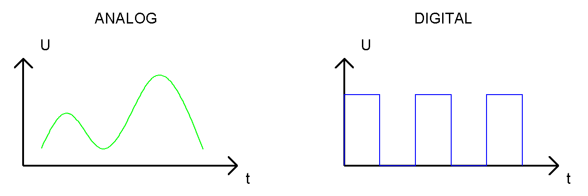
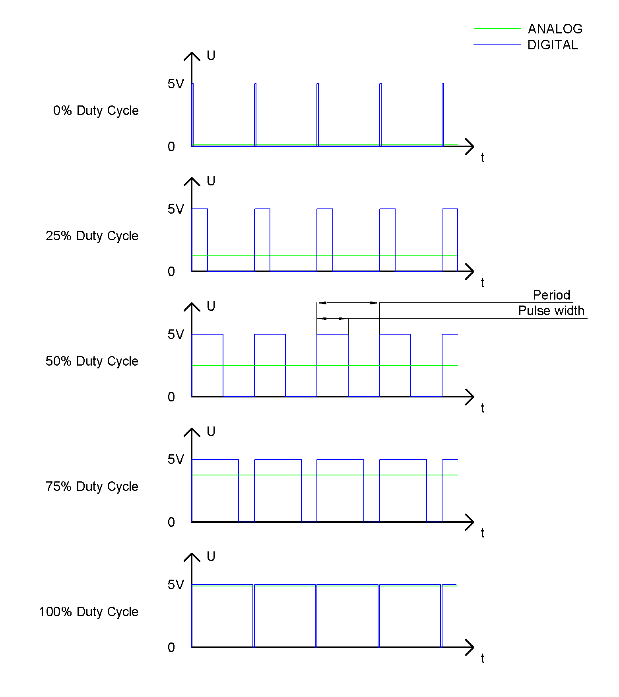
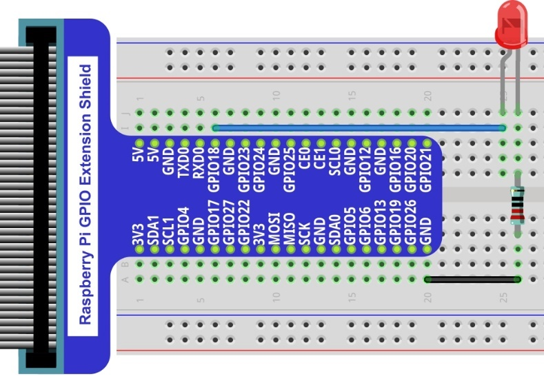
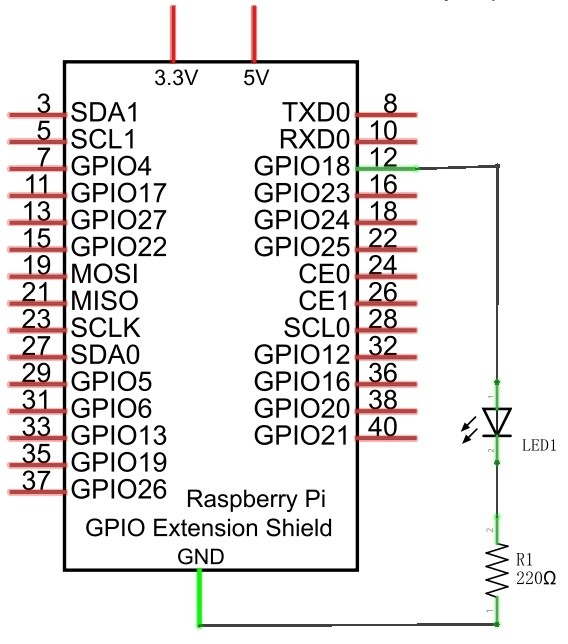

##############################################################################
Chapter Analog & PWM
##############################################################################

In previous chapters, we learned that a Push Button Switch has two states: Pressed (ON) and Released (OFF), and an LED has a Light ON and OFF state. Is there a middle or intermediated state? We will next learn how to create an intermediate output state to achieve a partially bright (dim) LED.

First, let us learn how to control the brightness of an LED.

Project Breathing LED
****************************************************************

We describe this project as a Breathing Light. This means that an LED that is OFF will then turn ON gradually and then gradually turn OFF like "breathing". Okay, so how do we control the brightness of an LED to create a Breathing Light? We will use PWM to achieve this goal.
    
Component List
================================================================

+-------------------------------------------------+-------------------------------------------------+
|1. Raspberry Pi (with 40 GPIO) x1                |                                                 |     
|                                                 |   Jumper Wires                                  |       
|2. GPIO Extension Board & Ribbon Cable x1        |                                                 |       
|                                                 |     |jumper-wire|                               |                                                            
|3. Breadboard x1                                 |                                                 |                                                                 
+-------------------------------------------------+-------------------------------------------------+
|  LED x1                                         |   Resistor 220Ω x 1                             |
|                                                 |                                                 |
|   |LED|                                         |    |res-220R-hori|                              |
+-------------------------------------------------+-------------------------------------------------+

.. |jumper-wire| image:: ../_static/imgs/jumper-wire.png
.. |res-220R-hori| image:: ../_static/imgs/res-220R-hori.png
    :width: 60%
.. |LED| image:: ../_static/imgs/red-led.png
    :width: 20%

Component Knowledge
================================================================

Analog & Digital
----------------------------------------------------------------
An Analog Signal is a continuous signal in both time and value. On the contrary, a Digital Signal or discrete-time signal is a time series consisting of a sequence of quantities. Most signals in life are analog signals. A familiar example of an Analog Signal would be how the temperature throughout the day is continuously changing and could not suddenly change instantaneously from 0℃ to 10℃. However, Digital Signals can instantaneously change in value. This change is expressed in numbers as 1 and 0 (the basis of binary code). Their differences can more easily be seen when compared when graphed as below.

Note that the Analog signals are curved waves and the Digital signals are “Square Waves”. 
In practical applications, we often use binary as the digital signal, that is a series of 0's and 1’s. Since a binary signal only has two values (0 or 1) it has great stability and reliability. Lastly, both analog and digital signals can be converted into the other.

PWM
----------------------------------------------------------------

PWM, Pulse-Width Modulation, is a very effective method for using digital signals to control analog circuits. Digital processors cannot directly output analog signals. PWM technology makes it very convenient to achieve this conversion (translation of digital to analog signals).
PWM technology uses digital pins to send certain frequencies of square waves, that is, the output of high levels and low levels, which alternately last for a while. The total time for each set of high levels and low levels is generally fixed, which is called the period (Note: the reciprocal of the period is frequency). The time of high level outputs are generally called “pulse width”, and the duty cycle is the percentage of the ratio of pulse duration, or pulse width (PW) to the total period (T) of the waveform. The longer the output of high levels last, the longer the duty cycle and the higher the corresponding voltage in the analog signal will be. The following figures show how the analog signal voltages vary between 0V-5V (high level is 5V) corresponding to the pulse width 0%-100%:

The longer the PWM duty cycle is, the higher the output power will be. Now that we understand this relationship, we can use PWM to control the brightness of an LED or the speed of DC motor and so on.
It is evident, from the above, that PWM is not actually analog but the effective value of voltage is equivalent to the corresponding analog value. Therefore, by using PWM, we can control the output power of to an LED and control other devices and modules to achieve multiple effects and actions.
In RPi, GPIO18 pin has the ability to output to hardware via PWM with a 10-bit accuracy. This means that 100% of the pulse width can be divided into 210=1024 equal parts.
The wiringPi library of C provides both a hardware PWM and a software PWM method.

The hardware PWM only needs to be configured, does not require CPU resources and is more precise in time control. The software PWM requires the CPU to work continuously by using code to output high level and low level. This part of the code is carried out by multi-threading, and the accuracy is relatively not high enough. 

In order to keep the results running consistently, we will use PWM.

Circuit
================================================================

==================  ==================================================================
Schematic diagram   Hardware connection. If you need any support,
 
                    please feel free to contact us via: 
                    
                    support@freenove.com

|PWM-Schematic|     |PWM-fritizing|

                    Youtube video: https://www.youtube.com/watch?v=Yox30YfYg8M
==================  ==================================================================

.. raw:: html

   <iframe height="500" width="690" src="https://www.youtube.com/embed/Yox30YfYg8M" frameborder="0" allowfullscreen></iframe>

Code
================================================================

This project uses the PWM output from the GPIO18 pin to make the pulse width gradually increase from 0% to 100% and then gradually decrease from 100% to 0% to make the LED glow brighter then dimmer. 

C Code BreathingLED
----------------------------------------------------------------

First, observe the project result, and then learn about the code in detail.

.. hint:: 
    
    :red:`If you have any concerns, please contact us via:` support@freenove.com

1.	Use ``cd`` command to enter 04.1.1_BreathingLED directory of C code.

.. code-block:: console

    $ cd ~/Freenove_Kit/Code/C_Code/04.1.1_BreathingLED

2.	Use following command to compile ``BreathingLED.c`` and generate executable file ``BreathingLED``.

.. code-block:: console

    $ gcc BreathingLED.c -o BreathingLED -lwiringPi

3.	Then run the generated file ``BreathingLED``

.. code-block:: console

    $ sudo ./BreathingLED

After the program is executed, you'll see that LED is turned from on to off and then from off to on gradually like breathing.

The following is the program code:

.. literalinclude:: ../../../freenove_Kit/Code/C_Code/04.1.1_BreathingLED/BreathingLED.c
    :linenos: 
    :language: C

First, create a software PWM pin.

.. code-block:: c
    :linenos:

    softPwmCreate(ledPin,  0, 100);//Creat SoftPWM pin

There are two “for” loops in the next endless “while” loop. The first loop outputs a power signal to the ledPin PWM from 0% to 100% and the second loop outputs a power signal to the ledPin PWM from 100% to 0%. 

.. literalinclude:: ../../../freenove_Kit/Code/C_Code/04.1.1_BreathingLED/BreathingLED.c
    :linenos: 
    :language: C
    :lines: 23-34

You can also adjust the rate of the state change of LED by changing the parameter of the delay() function in the “for” loop.

.. c:function:: int softPwmCreate (int pin, int initialValue, int pwmRange) ;

    This creates a software controlled PWM pin.

.. c:function:: void softPwmWrite (int pin, int value) ;

    This updates the PWM value on the given pin.

.. hint:: 
    
    For more details, please refer https://github.com/WiringPi/WiringPi