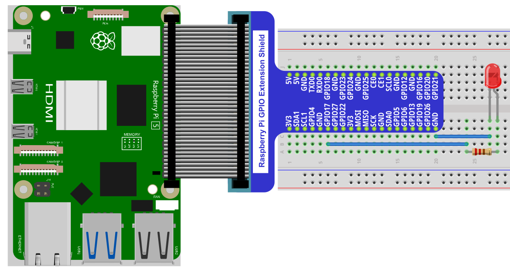
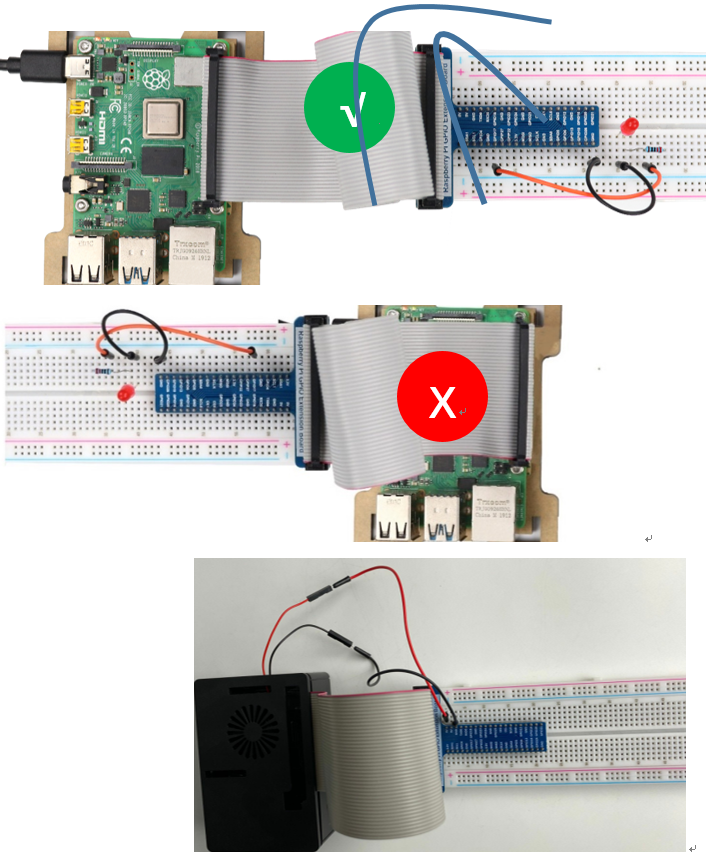
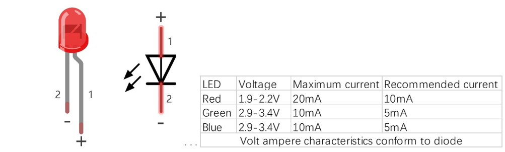
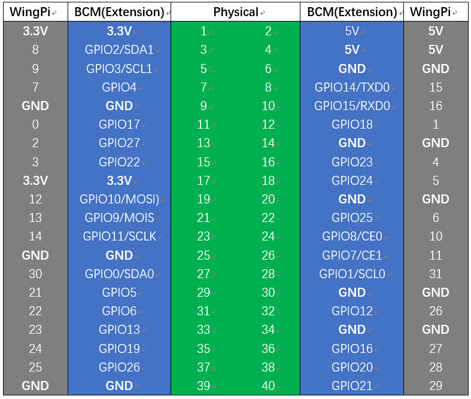
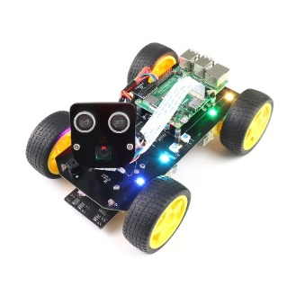

################################################################
Chapter LED
################################################################

This chapter is the Start Point in the journey to build and explore RPi electronic projects. We will start with simple “Blink” project.

Project Blink
****************************************************************

In this project, we will use RPi to control blinking a common LED.

Component List
================================================================

+-----------------------------------------------------------+
|    Raspberry Pi                                           |     
|                                                           |       
|    (Recommended: Raspberry Pi 5 / 4B / 3B+ / 3B)          |       
|                                                           |                                                            
|    (Compatible: 3A+ / 2B / 1B+ / 1A+ / Zero W / Zero)     |                                                                 
|                                                           | 
|     |raspberrypi5|                                        | 
+-----------------------------------------------------------+
| Breadboard x1                                             |
|                                                           |
|  |breadborad-830|                                         |                         
+--------------------------------------+--------------------+
|  GPIO Extension Board & Ribbon Cable | Resistor 220Ω x1   |
|                                      |                    | 
|   |extension-board|                  |  |res-220R|        |
+--------------------------------------+-------+------------+
| Jumper                                       | LED x1     | 
|                                              |            | 
| **Specific quantity depends on the circuit.**| |red-led|  | 
|                                              |            | 
| |jumper-wire|                                |            | 
+----------------------------------------------+------------+

.. |raspberrypi5| image:: ../_static/imgs/raspberrypi5.png
    :width: 60%
.. |jumper-wire| image:: ../_static/imgs/jumper-wire.png
    :width: 60%
.. |extension-board| image:: ../_static/imgs/raspberrypi-extension-board.jpg
    :width: 70%
.. |breadborad-830| image:: ../_static/imgs/breadborad-830.jpg
    :width: 80%
.. |red-led| image:: ../_static/imgs/red-led.png
    :width: 30%
.. |res-220R| image:: ../_static/imgs/res-220R.png
    :width: 20%

In the components list, 3B GPIO, Extension Shield Raspberry and Breadboard are necessary for each project. Later, they will be reference by text only (no images as in above).

GPIO
================================================================

GPIO: General Purpose Input/Output. Here we will introduce the specific function of the pins on the Raspberry Pi and how you can utilize them in all sorts of ways in your projects. Most RPi Module pins can be used as either an input or output, depending on your program and its functions.

When programming GPIO pins there are 3 different ways to reference them: **GPIO Numbering**, **Physical Numbering** and **WiringPi GPIO Numbering**.

BCM GPIO Numbering
---------------------------------------------------------------
The Raspberry Pi CPU uses Broadcom (BCM) processing chips BCM2835, BCM2836 or BCM2837. GPIO pin numbers are assigned by the processing chip manufacturer and are how the computer recognizes each pin. The pin numbers themselves do not make sense or have meaning as they are only a form of identification. Since their numeric values and physical locations have no specific order, there is no way to remember them so you will need to have a printed reference or a reference board that fits over the pins.

Each pin's functional assignment is defined in the image below:

    .. image:: ../_static/imgs/raspberrypi5-cc90.png
        :height: 500

    .. image:: ../_static/imgs/raspberrypi-pinout-bcm.png
        :height: 500

.. seealso:: 
    
    For more details about pin definition of GPIO, please refer to `<http://pinout.xyz/>`_

PHYSICAL Numbering
---------------------------------------------------------------

Another way to refer to the pins is by simply counting across and down from pin 1 at the top left (nearest to the SD card). This is 'Physical Numbering', as shown below:

.. image:: ../_static/imgs/PHYSICAL-Numbering.png
    :height: 200

WiringPi GPIO Numbering
---------------------------------------------------------------

Different from the previous two types of GPIO serial numbers, RPi GPIO serial number of the WiringPi are numbered according to the BCM chip use in RPi.

.. seealso:: 
    For more details, please refer to `<https://projects.drogon.net/raspberry-pi/wiringpi/pins/>`_ 

You can also use the following command to view their correlation.

.. code-block:: console

    $ gpio readall

Circuit
================================================================

First, disconnect your RPi from the GPIO Extension Shield. Then build the circuit according to the circuit and hardware diagrams. After the circuit is built and verified correct, connect the RPi to GPIO Extension Shield. 

.. caution:: 

    CAUTION: Avoid any possible short circuits (especially connecting 5V or GND, 3.3V and GND)! 

.. warning:: 

    WARNING: A short circuit can cause high current in your circuit, create excessive component heat and cause permanent damage to your RPi!

**Schematic diagram**

.. image:: ../_static/imgs/blink-sch.png
    :height: 400

**Hardware connection** 

.. tip:: 
     :red:`If you need any support, please contact us via:` :blue:`support@freenove.com`

.. attention:: 
    Do NOT rotate Raspberry Pi to change the way of this connection.
    Please plug T extension fully into breadboard.

.. note:: 

    Youtube video: https://www.youtube.com/watch?v=zS75zSSBmic

.. raw:: html

   <iframe height="500" width="690" src="https://www.youtube.com/embed/zS75zSSBmic" frameborder="0" allowfullscreen></iframe>

The connection of Raspberry Pi T extension board is as below. **Don't reverse the ribbon**.

.. note:: 
    If you have a fan, you can connect it to 5V GND of breadboard via jumper wires.

**How to distinguish resistors?**

There are only three kind of resistors in this kit.

1. The one with *1 red ring* is 10KΩ \

    .. image:: ../_static/imgs/res-10K-hori.png
        :height: 17

2. The one with *1 red ring* is 10KΩ 

    .. image:: ../_static/imgs/res-220R-hori.png
        :height: 20

#. The one with *1 red ring* is 10KΩ 

    .. image:: ../_static/imgs/res-1K-hori.png
        :height: 20

.. note:: 
    Future hardware connection diagrams will only show that part of breadboard and GPIO Extension Shield.

Component knowledge
================================================================

LED
----------------------------------------------------------------
An LED is a type of diode. All diodes only work if current is flowing in the correct direction and have two Poles. An LED will only work (light up) if the longer pin (+) of LED is connected to the positive output from a power source and the shorter pin is connected to the negative (-) output, which is also referred to as Ground (GND). This type of component is known as “Polar” (think One-Way Street).

All common 2 lead diodes are the same in this respect. Diodes work only if the voltage of its positive electrode is higher than its negative electrode and there is a narrow range of operating voltage for most all common diodes of 1.9 and 3.4V. If you use much more than 3.3V the LED will be damaged and burnt out.

.. note:: 
    Note: LEDs cannot be directly connected to a power supply, which usually ends in a damaged component. A resistor with a specified resistance value must be connected in series to the LED you plan to use.

Resistor
----------------------------------------------------------------

Resistors use Ohms (Ω) as the unit of measurement of their resistance (R). 1MΩ=1000kΩ, 1kΩ=1000Ω.
A resistor is a passive electrical component that limits or regulates the flow of current in an electronic circuit.
On the left, we see a physical representation of a resistor, and the right is the symbol used to represent the presence of a resistor in a circuit diagram or schematic.

.. image:: ../_static/imgs/res-describe.png
    :align: center

The bands of color on a resistor is a shorthand code used to identify its resistance value. For more details of resistor color codes, please refer to the card in the kit package.
With a fixed voltage, there will be less current output with greater resistance added to the circuit. The relationship between Current, Voltage and Resistance can be expressed by this formula: I=V/R known as Ohm’s Law where I = Current, V = Voltage and R = Resistance. Knowing the values of any two of these allows you to solve the value of the third.

In the following diagram, the current through R1 is: 

.. math:: I=U/R=5V/10kΩ=0.0005A=0.5mA.

.. image:: ../_static/imgs/res-current.png
    :align: center

.. warning:: 
    WARNING: Never connect the two poles of a power supply with anything of low resistance value (i.e. a metal object or bare wire) this is a Short and results in high current that may damage the power supply and electronic components.

.. note:: 
    Note: Unlike LEDs and Diodes, Resistors have no poles and re non-polar (it does not matter which direction you insert them into a circuit, it will work the same)

Breadboard
----------------------------------------------------------------

Here we have a small breadboard as an example of how the rows of holes (sockets) are electrically attached. The left picture shows the ways the pins have shared electrical connection and the right picture shows the actual internal metal, which connect these rows electrically.

.. image:: ../_static/imgs/breadborad-top-wire.png
    :width: 48%
    
.. image:: ../_static/imgs/breadborad-bottom-wire.png
    :width: 48%

GPIO Extension Board
----------------------------------------------------------------

GPIO board is a convenient way to connect the RPi I/O ports to the breadboard directly. The GPIO pin sequence on Extension Board is identical to the GPIO pin sequence of RPi. 

.. image:: ../_static/imgs/raspberrypi-extension-describe.png
    :width: 90%
    :align: center

Code
================================================================

According to the circuit, when the GPIO17 of RPi output level is high, the LED turns ON. Conversely, when the GPIO17 RPi output level is low, the LED turns OFF. Therefore, we can let GPIO17 cycle output high and output low level to make the LED blink. We will use both C code to achieve the target.

C Code Blink
----------------------------------------------------------------
First, enter this command into the Terminal one line at a time. Then observe the results it brings on your project, and learn about the code in detail. 

If you want to execute it with editor, please refer to section Code Editor<> to configure.

.. hint:: 
    :red:`If you have any concerns, please contact us via:` support@freenove.com

It is recommended that to execute the code via command line.

1. If you did not update wiring pi, please execute following commands **one by one**.

.. code-block:: console

    $ sudo apt-get update
    $ git clone https://github.com/WiringPi/WiringPi
    $ cd WiringPi
    $ ./build

2. Use ``cd`` command to enter 01.1.1_Blink directory of C code.

.. code-block:: console

    $ cd ~/Freenove_Kit/Code/C_Code/01.1.1_Blink

3. Use the following command to compile the code “Blink.c” and generate executable file “Blink”.

.. code-block:: console

    $ gcc Blink.c -o Blink -lwiringPi

4. Then run the generated file “blink”.

.. code-block:: console

    $ sudo ./Blink

Now your LED should start blinking! CONGRATUALTIONS! You have successfully completed your first RPi circuit! 

You can also use the file browser. On the left of folder tree, right-click the folder you want to enter, and click "Open in Terminal".

You can press ``Ctrl+C`` to end the program. The following is the program code:

.. literalinclude:: ../../../freenove_Kit/Code/C_Code/01.1.1_Blink/Blink.c
    :linenos: 
    :language: C
    :dedent:

In the code above, the configuration function for GPIO is shown below as:

.. c:function:: void pinMode(int pin, int mode);

    This sets the mode of a pin to either INPUT, OUTPUT, PWM_OUTPUT or GPIO_CLOCK. Note that only wiringPi pin 1 (BCM_GPIO 18) supports PWM output and only wiringPi pin 7 (BCM_GPIO 4) supports CLOCK output modes.
    
    This function has no effect when in Sys mode. If you need to change the pin mode, then you can do it with the gpio program in a script before you start your program 

.. c:function:: void digitalWrite (int pin, int value);

    Writes the value HIGH or LOW (1 or 0) to the given pin, which must have been previously set as an output.

.. seealso:: 

    For more related wiringpi functions, please refer to https://github.com/WiringPi/WiringPi

GPIO connected to ledPin in the circuit is GPIO17 and GPIO17 is defined as 0 in the wiringPi numbering. So ledPin should be defined as 0 pin. You can refer to the corresponding table in Chapter 0.

.. code-block:: c

    #define  ledPin    0 //define the led pin number

GPIO Numbering Relationship

In the main function ``main()``, initialize ``wiringPi`` first.

.. code-block:: c

    wiringPiSetup(); //Initialize wiringPi.

After the wiringPi is initialized successfully, you can set the ledPin to output mode and then enter the while loop, 
which is an endless loop (a while loop). 
That is, the program will always be executed in this cycle, 
unless it is ended because of external factors. In this loop, 
use ``digitalWrite (ledPin, HIGH)`` to make ledPin output high level, then LED turns ON. 
After a period of time delay, use ``digitalWrite(ledPin, LOW)`` to make ledPin output low level, 
then LED turns OFF, which is followed by a delay. Repeat the loop, then LED will start blinking.

.. literalinclude:: ../../../freenove_Kit/Code/C_Code/01.1.1_Blink/Blink.c
    :linenos: 
    :language: C
    :lines: 16-27
    :dedent:

Other Code Editors (Optional)
=======================================

If you want to use other editor to edit and execute the code, you can learn them in this section.

nano
---------------------------------

Use the nano editor to open the file "Hello.c", then press " Ctrl+X " to exit.

.. code-block:: console
    
    $ nano Hello.c

As is shown below:

Use the following command to compile the code to generate the executable file “Hello”.

.. code-block:: console
    
    $ gcc Hello.c  -o Hello 

Use the following command to run the executable file “Hello”.

.. code-block:: console
    
    $ sudo ./Hello 

After the execution, "Hello, World!" is printed out in terminal.

geany
------------------------

Next, learn to use the Geany editor. Use the following command to open the Geany in the sample file "Hello.c" file directory path.

.. code-block:: console
    
    $ geany Hello.c

Or find and open Geany directly in the desktop main menu, and then click FileOpen to open the "Hello.c", Or drag "Hello.c" to Geany directly.

If you want to create a new code, click FileNewFileSave as (name.c or name.py). Then write the code.

Generate an executable file by clicking menu bar Build->Build.

Then execute the generated file by clicking menu bar Build->Execute.

After the execution, a new terminal window will output the characters “Hello, World!”, as shown below:

You can click Build->Set Build Commands to set compiler commands. In later projects, we will use various compiler command options. :red:`If you choose to use Geany, you will need change the compiler command here`. As is shown below:

Here we have identified three code editors: vi, nano and Geany. There are also many other good code editors available to you, and you can choose whichever you prefer to use. 

In later projects, we will only use terminal to execute the project code. This way will not modify the code by mistake.

Freenove Car, Robot and other products for Raspberry Pi
================================================================

We also have car and robot kits for Raspberry Pi. You can visit our website for details.

https://www.amazon.com/freenove

**FNK0043**--:green:`Freenove 4WD Smart Car Kit for Raspberry Pi`

.. image:: ../_static/imgs/43_2.png

.. raw:: html

   <iframe height="500" width="690" src="https://www.youtube.com/embed/4Zv0GZUQjZc" frameborder="0" allowfullscreen></iframe>
  
**FNK0050**--:green:`Freenove Robot Dog Kit for Raspberry Pi`

.. image:: ../_static/imgs/50_1.png

.. image:: ../_static/imgs/50_2.png

.. raw:: html

   <iframe height="500" width="690" src="https://www.youtube.com/embed/7BmIZ8_R9d4" frameborder="0" allowfullscreen></iframe>

**FNK0052**--:green:`Freenove_Big_Hexapod_Robot_Kit_for_Raspberry_Pi`

.. image:: ../_static/imgs/52_1.png
    :width: 50%

.. image:: ../_static/imgs/52_2.png
    :width: 40%

.. raw:: html

   <iframe height="500" width="690" src="https://www.youtube.com/embed/LvghnJ2DNZ0" frameborder="0" allowfullscreen></iframe>