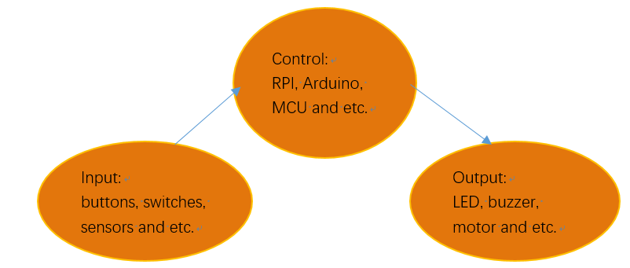

################################################################
Chapter Button and leds
################################################################

Usually, there are three essential parts in a complete automatic control device: INPUT, OUTPUT, and CONTROL. In last section, the LED module was the output part and RPI was the control part. In practical applications, we not only make LEDs flash, but also make a device sense the surrounding environment, receive instructions and then take the appropriate action such as turn on LEDs, make a buzzer beep and so on.

Next, we will build a simple control system to control an LED through a push button switch.

Project Push Button Switch & LED
****************************************************************

In the project, we will control the LED state through a Push Button Switch. When the button is pressed, our LED will turn ON, and when it is released, the LED will turn OFF. This describes a Momentary Switch.

Component List
================================================================

+-----------------------------------------------------------+
|    Raspberry Pi                                           |     
|                                                           |       
|    (Recommended: Raspberry Pi 5 / 4B / 3B+ / 3B)          |       
|                                                           |                                                            
|    (Compatible: 3A+ / 2B / 1B+ / 1A+ / Zero W / Zero)     |                                                                 
|                                                           | 
|     |raspberrypi5|                                        | 
+---------------------------+-------------------------------+
| LED x1                    | Breadboard x1                 |
|                           |                               |
|  |red-led|                |  |breadborad-830|             |                         
+---------------------------+----------+--------------------+
|  GPIO Extension Board & Ribbon Cable | Resistor 220Ω x1   |
|                                      |                    | 
|   |extension-board|                  |  |res-220R|        |
+---------------------------+----------+--------------------+
| Push Button Switch x1     | Resistor 10KΩ x2              |
|                           |                               |
|  |button-small|           |  |res-10k|                    |                         
+---------------------------+-------------------------------+
| Jumper (some)                                             |
|                                                           |
|  |jumper-wire|                                            |
+-----------------------------------------------------------+

.. |raspberrypi5| image:: ../_static/imgs/raspberrypi5.png
    :width: 60%
.. |jumper-wire| image:: ../_static/imgs/jumper-wire.png
    :width: 60%
.. |extension-board| image:: ../_static/imgs/raspberrypi-extension-board.jpg
    :width: 70%
.. |breadborad-830| image:: ../_static/imgs/breadborad-830.jpg
    :width: 80%
.. |red-led| image:: ../_static/imgs/red-led.png
    :width: 15%
.. |res-220R| image:: ../_static/imgs/res-220R.png
    :width: 10%
.. |res-10k| image:: ../_static/imgs/res-10K-hori.png
    :width: 50%
.. |button-small| image:: ../_static/imgs/button-small.jpg
    :width: 30%
    
.. note:: 
    Please Note: In the code “button” represents switch action.

Component knowledge
================================================================

Push Button Switch
----------------------------------------------------------------
This type of Push Button Switch has 4 pins (2 Pole Switch). Two pins on the left are connected, and both left and right sides are the same per the illustration:

    .. image:: ../_static/imgs/button-small-img-sch.jpg
        :align: center

When the button on the switch is pressed, the circuit is completed (your project is Powered ON).

Circuit
================================================================
1. **Schematic diagram**

    .. image:: ../_static/imgs/button-led-sch1.jpg
        :height: 400

    .. note:: 
        R3 is used to limit current to protect GPIO 18, if you set it to output HIGH level by mistake.

2. **Hardware connection** 

.. image:: ../_static/imgs/button-led-hdc1.jpg
    :width: 100%

.. note::
    | There are two kinds of push button switch in this kit. 
    | :red:`The smaller push button switches are contained in a plastic bag.` 
.. note:: 
    Youtube video: https://youtu.be/_5ge1d6f1nM

.. raw:: html

   <iframe height="500" width="690" src="https://www.youtube.com/embed/_5ge1d6f1nM" frameborder="0" allowfullscreen></iframe>

.. hint:: 
    If you need any support, please feel free to contact us via: support@freenove.com

3. This is how it works. When button switch is released:

.. image:: ../_static/imgs/button-led-released.png
    :width: 100%
    
4. This is how it works. When button switch is released:

.. image:: ../_static/imgs/button-led-pressed.png
    :width: 100%

Code
================================================================

This project is designed for learning how to use Push Button Switch to control an LED. We first need to read the state of switch, and then determine whether to turn the LED ON in accordance to the state of the switch.

C language codes 
----------------------------------------------------------------
First, observe the project result, then learn about the code in detail.

.. hint:: 
    If you need any support, please feel free to contact us via: support@freenove.com

1. Use ``cd`` command to enter ``ButtonLED`` directory of C code.

.. code-block:: console

    $ cd ~/Freenove_Kit/Code/C_Code/ButtonLED

2. Use the following command to compile the code ``ButtonLED.c`` and generate executable file ``ButtonLED``.

.. code-block:: console

    $ gcc ButtonLED.c -o ButtonLED -lwiringPi

3. Then run the generated file ``blink``.

.. code-block:: console

    $ sudo ./ButtonLED

Later, the terminal window continues to print out the characters “led off…”. Press the button, then LED is turned on and then terminal window prints out the "led on…". 
Release the button, then LED is turned off and then terminal window prints out the "led off…". You can press ``Ctrl+C`` to terminate the program.

The following is the program code:

.. literalinclude:: ../../../freenove_Kit/Code/C_Code/02.1.1_ButtonLED/ButtonLED.c
    :linenos: 
    :language: C

In the circuit connection, LED and Button are connected with GPIO17 and GPIO18 respectively, which correspond to 0 and 1 respectively in wiringPI. So define ledPin and buttonPin as 0 and 1 respectively.

.. code-block:: c

    #define ledPin    0     //define the ledPin
    #define buttonPin 1     //define the buttonPin

In the while loop of main function, use digitalRead(buttonPin) to determine the state of Button. When the button is pressed, the function returns low level, the result of “if” is true, and then turn on LED. Or, turn off LED

.. literalinclude:: ../../../freenove_Kit/Code/C_Code/02.1.1_ButtonLED/ButtonLED.c
    :linenos: 
    :language: C
    :lines: 24-31

.. c:function:: int digitalRead (int pin);

    This function returns the value read at the given pin. It will be “HIGH” or “LOW”(1 or 0) depending on the logic level at the pin.

