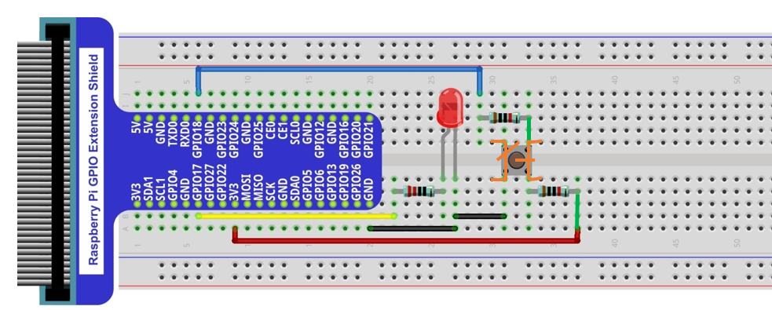

################################################################
Chapter Button and leds
################################################################

Usually, there are three essential parts in a complete automatic control device: INPUT, OUTPUT, and CONTROL. In last section, the LED module was the output part and RPI was the control part. In practical applications, we not only make LEDs flash, but also make a device sense the surrounding environment, receive instructions and then take the appropriate action such as turn on LEDs, make a buzzer beep and so on.

.. image:: ../_static/imgs/button-led-flow-chart.png
    :width: 80%

Next, we will build a simple control system to control an LED through a push button switch.

Project Push Button Switch & LED
****************************************************************

In the project, we will control the LED state through a Push Button Switch. When the button is pressed, our LED will turn ON, and when it is released, the LED will turn OFF. This describes a Momentary Switch.

Component List
================================================================

+-----------------------------------------------------------+
|    Raspberry Pi                                           |     
|                                                           |       
|    (Recommended: Raspberry Pi 5 / 4B / 3B+ / 3B)          |       
|                                                           |                                                            
|    (Compatible: 3A+ / 2B / 1B+ / 1A+ / Zero W / Zero)     |                                                                 
|                                                           | 
|     |raspberrypi5|                                        | 
+---------------------------+-------------------------------+
| LED x1                    | Breadboard x1                 |
|                           |                               |
|  |red-led|                |  |breadborad-830|             |                         
+---------------------------+----------+--------------------+
|  GPIO Extension Board & Ribbon Cable | Resistor 220Ω x1   |
|                                      |                    | 
|   |extension-board|                  |  |res-220R|        |
+---------------------------+----------+--------------------+
| Push Button Switch x1     | Resistor 10KΩ x2              |
|                           |                               |
|  |button-small|           |  |res-10k|                    |                         
+---------------------------+-------------------------------+
| Jumper (some)                                             |
|                                                           |
|  |jumper-wire|                                            |
+-----------------------------------------------------------+

.. |raspberrypi5| image:: ../_static/imgs/raspberrypi5.png
    :width: 60%
.. |jumper-wire| image:: ../_static/imgs/jumper-wire.png
    :width: 60%
.. |extension-board| image:: ../_static/imgs/raspberrypi-extension-board.jpg
    :width: 70%
.. |breadborad-830| image:: ../_static/imgs/breadborad-830.jpg
    :width: 80%
.. |red-led| image:: ../_static/imgs/red-led.png
    :width: 15%
.. |res-220R| image:: ../_static/imgs/res-220R.png
    :width: 10%
.. |res-10k| image:: ../_static/imgs/res-10K-hori.png
    :width: 50%
.. |button-small| image:: ../_static/imgs/button-small.jpg
    :width: 20%
    
.. note:: 
    Please Note: In the code “button” represents switch action.

Component knowledge
================================================================

Push Button Switch
----------------------------------------------------------------

This type of Push Button Switch has 4 pins (2 Pole Switch). Two pins on the left are connected, and both left and right sides are the same per the illustration:

When the button on the switch is pressed, the circuit is completed (your project is Powered ON).

Circuit
================================================================

1. **Schematic diagram**

    .. image:: ../_static/imgs/button-led-sch1.jpg
        :height: 400

    .. note:: 
        R3 is used to limit current to protect GPIO 18, if you set it to output HIGH level by mistake.

2. **Hardware connection** 

.. image:: ../_static/imgs/button-led-hdc1.jpg
    :width: 100%

.. note::
    | There are two kinds of push button switch in this kit. 
    | :red:`The smaller push button switches are contained in a plastic bag.` 
.. note:: 

    Youtube video: https://www.youtube.com/watch?v=btp5GbaV0xI

.. raw:: html

   <iframe height="500" width="690" src="https://www.youtube.com/embed/btp5GbaV0xI" frameborder="0" allowfullscreen></iframe>

.. hint:: 

    If you need any support, please feel free to contact us via: support@freenove.com

This is how it works. When button switch is released:

    
This is how it works. When button switch is released:

.. image:: ../_static/imgs/button-led-pressed.png
    :width: 100%

Code
================================================================

This project is designed for learning how to use Push Button Switch to control an LED. We first need to read the state of switch, and then determine whether to turn the LED ON in accordance to the state of the switch.

C Code ButtonLED
----------------------------------------------------------------
First, observe the project result, then learn about the code in detail.

.. hint:: 

    :red:`If you need any support, please feel free to contact us via:` support@freenove.com

1. Use ``cd`` command to enter ``ButtonLED`` directory of C code.

.. code-block:: console

    $ cd ~/Freenove_Kit/Code/C_Code/02.1.1ButtonLED

2. Use the following command to compile the code ``ButtonLED.c`` and generate executable file ``ButtonLED``.

.. code-block:: console

    $ gcc ButtonLED.c -o ButtonLED -lwiringPi

3. Then run the generated file ``ButtonLED``.

.. code-block:: console

    $ sudo ./ButtonLED

Later, the terminal window continues to print out the characters “led off…”. Press the button, then LED is turned on and then terminal window prints out the "led on…". 
Release the button, then LED is turned off and then terminal window prints out the "led off…". You can press ``Ctrl+C`` to terminate the program.

The following is the program code:

.. literalinclude:: ../../../freenove_Kit/Code/C_Code/02.1.1_ButtonLED/ButtonLED.c
    :linenos: 
    :language: C
    :dedent:

In the circuit connection, LED and Button are connected with GPIO17 and GPIO18 respectively, which correspond to 0 and 1 respectively in wiringPI. So define ledPin and buttonPin as 0 and 1 respectively.

.. code-block:: c

    #define ledPin    0     //define the ledPin
    #define buttonPin 1     //define the buttonPin

In the while loop of main function, use digitalRead(buttonPin) to determine the state of Button. When the button is pressed, the function returns low level, the result of “if” is true, and then turn on LED. Or, turn off LED

.. literalinclude:: ../../../freenove_Kit/Code/C_Code/02.1.1_ButtonLED/ButtonLED.c
    :linenos: 
    :language: C
    :lines: 24-31
    :dedent:

Reference
---------------------------------

.. c:function:: int digitalRead (int pin);

    This function returns the value read at the given pin. It will be “HIGH” or “LOW”(1 or 0) depending on the logic level at the pin.

Project MINI Table Lamp
**********************************

We will also use a Push Button Switch, LED and RPi to make a MINI Table Lamp but this will function differently: Press the button, the LED will turn ON, and pressing the button again, the LED turns OFF. The ON switch action is no longer momentary (like a door bell) but remains ON without needing to continually press on the Button Switch.

First, let us learn something about the push button switch.

Debounce a Push Button Switch
=================================

When a Momentary Push Button Switch is pressed, it will not change from one state to another state immediately. Due to tiny mechanical vibrations, there will be a short period of continuous buffeting before it stabilizes in a new state too fast for Humans to detect but not for computer microcontrollers. The same is true when the push button switch is released. This unwanted phenomenon is known as “bounce”.

Therefore, if we can directly detect the state of the Push Button Switch, there are multiple pressing and releasing actions in one pressing cycle. This buffeting will mislead the high-speed operation of the microcontroller to cause many false decisions. Therefore, we need to eliminate the impact of buffeting. Our solution: to judge the state of the button multiple times. Only when the button state is stable (consistent) over a period of time, can it indicate that the button is actually in the ON state (being pressed).

This project needs the same components and circuits as we used in the previous section.

Code
=============================

In this project, we still detect the state of Push Button Switch to control an LED. Here we need to define a variable to define the state of LED. When the button switch is pressed once, the state of LED will be changed once. This will allow the circuit to act as a virtual table lamp.

C Code Tablelamp
-----------------------------

First, observe the project result, and then learn about the code in detail.

If you have any concerns, please contact us via: support@freenove.com

1.	Use cd command to enter 02.2.1_Tablelamp directory of C code.

.. code-block:: console

    $ cd ~/Freenove_Kit/Code/C_Code/02.2.1_Tablelamp

2.	Use the following command to compile “Tablelamp.c” and generate executable file “Tablelamp”.

.. code-block:: console

    $ gcc Tablelamp.c -o Tablelamp -lwiringPi

3.	Tablelamp: Then run the generated file “Tablelamp”.

.. code-block:: console

    $ sudo ./Tablelamp

When the program is executed, press the Button Switch once, the LED turns ON. Pressing the Button Switch again turns the LED OFF.

.. literalinclude:: ../../../freenove_Kit/Code/C_Code/02.2.1_Tablelamp/Tablelamp.c
    :linenos: 
    :language: C
    :dedent:

This code focuses on eliminating the buffeting (bounce) of the button switch. We define several variables to define the state of LED and button switch. Then read the button switch state constantly in while () to determine whether the state has changed. If it has, then this time point is recorded. 

.. literalinclude:: ../../../freenove_Kit/Code/C_Code/02.2.1_Tablelamp/Tablelamp.c
    :linenos: 
    :language: C
    :lines: 29-32
    :dedent:

.. py:function:: millis()

    This returns a number representing the number of milliseconds since your program called one of the wiringPiSetup functions. It returns to an unsigned 32-bit number value after 49 days because it “wraps” around and restarts to value 0.

Then according to the recorded time point, evaluate the duration of the button switch state change. If the duration exceeds captureTime (buffeting time) we have set, it indicates that the state of the button switch has changed. During that time, the while () is still detecting the state of the button switch, so if there is a change, the time point of change will be updated. Then the duration will be evaluated again until the duration is determined to be a stable state because it exceeds the time value we set. 

.. literalinclude:: ../../../freenove_Kit/Code/C_Code/02.2.1_Tablelamp/Tablelamp.c
    :linenos: 
    :language: C
    :lines: 35-38
    :dedent:

Finally, we need to judge the state of Button Switch. If it is low level, the changing state indicates that the button Switch has been pressed, if the state is high level, then the button has been released. Here, we change the status of the LED variable, and then update the state of the LED.

.. literalinclude:: ../../../freenove_Kit/Code/C_Code/02.2.1_Tablelamp/Tablelamp.c
    :linenos: 
    :language: C
    :lines: 40-49
    :dedent: