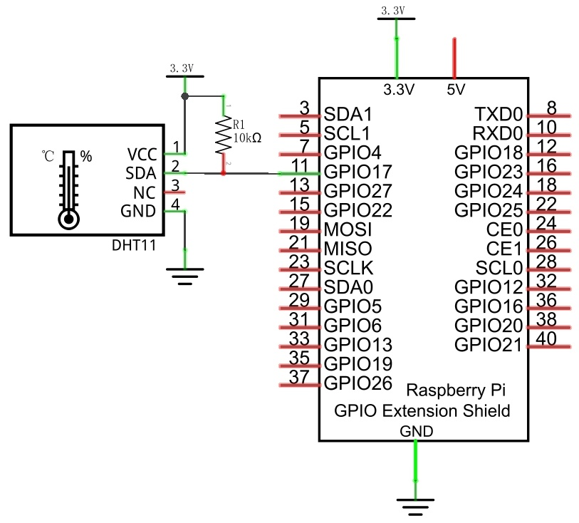
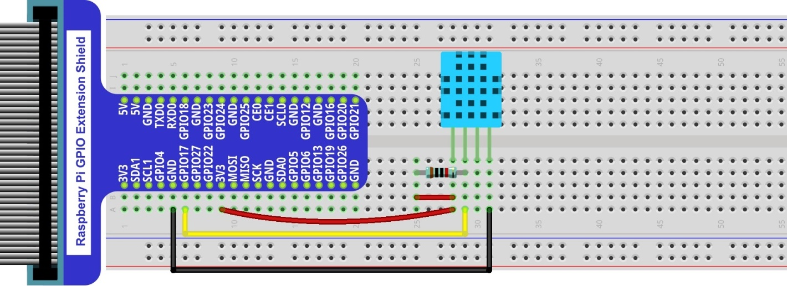

##############################################################################
Chapter Hygrothermograph DHT11
##############################################################################

In this chapter, we will learn about a commonly used sensor called a Hygrothermograph DHT11.

Project Hygrothermograph
****************************************************************

Hygrothermograph is an important tool in our lives to give us data on the temperature and humidity in our environment. In this project, we will use the RPi to read Temperature and Humidity data of the DHT11 Module.

Component List
================================================================

+-------------------------------------------------+-------------------------------------------------+
|1. Raspberry Pi (with 40 GPIO) x1                |                                                 |     
|                                                 | Jumper Wires x36                                |       
|2. GPIO Extension Board & Ribbon Cable x1        |                                                 |       
|                                                 |  |jumper-wire|                                  |                                                            
|3. Breadboard x1                                 |                                                 |                                                                 
+-------------------------------------------------+-------------------------------------------------+
| DHT11 x1                                        | Resistor 10kΩ x1                                |
|                                                 |                                                 |
|  |DHT11|                                        |  |Resistor-10kΩ|                                |
+-------------------------------------------------+-------------------------------------------------+

.. |jumper-wire| image:: ../_static/imgs/jumper-wire.png
.. |Resistor-10kΩ| image:: ../_static/imgs/Resistor-10kΩ.png
    :width: 10%
.. |DHT11| image:: ../_static/imgs/DHT11.png
    :width: 50%

Component knowledge
================================================================

The Temperature & Humidity Sensor DHT11 is a compound temperature & humidity sensor, and the output digital signal has been calibrated by its manufacturer.

.. image:: ../_static/imgs/DHT11_1.png
    :align: center

After being powered up, it will initialize in 1 second. Its operating voltage is within the range of 3.3V-5.5V.

The SDA pin is a data pin, which is used to communicate with other devices. 

The NC pin (Not Connected Pin) are a type of pin found on various integrated circuit packages. Those pins have no functional purpose to the outside circuit (but may have an unknown functionality during manufacture and test). Those pins should not be connected to any of the circuit connections.

Circuit
================================================================

+------------------------------------------------------------------------------------------------+
|   Schematic diagram                                                                            |
|                                                                                                |
|   |DHT11_Sc|                                                                                   |
+------------------------------------------------------------------------------------------------+
|   Hardware connection. If you need any support,please feel free to contact us via:             |
|                                                                                                |
|   support@freenove.com                                                                         |
|                                                                                                |
|   |DHT11_Fr|                                                                                   | 
+------------------------------------------------------------------------------------------------+

Code
================================================================

The code is used to read the temperature and humidity data of DHT11, and display them.

C Code 21.1.1 DHT11
----------------------------------------------------------------

First, observe the project result, and then learn about the code in detail.

.. hint:: 
    :red:`If you have any concerns, please contact us via:` support@freenove.com

1.	Use ``cd`` command to enter 21.1.1_DHT11 directory of C code.

.. code-block:: console

    $ cd ~/Freenove_Kit/Code/C_Code/21.1.1_DHT11

2.	The code used in this project contains a custom header file. Use the following command to compile the code DHT11.cpp and DHT.cpp and generate executable file DHT11. The custom header file will be compiled at the same time.

.. code-block:: console

    $ gcc DHT.cpp DHT11.cpp -o DHT11 -lwiringPi

3.	Run the generated file ``DHT11``.

.. code-block:: console

    $ sudo ./DHT11

After the program is executed, the Terminal window will display the current total number of read times, the read state, as well as temperature and humidity values as is shown below:

The following is the program code:

.. literalinclude:: ../../../freenove_Kit/Code/C_Code/21.1.1_DHT11/DHT11.cpp
    :linenos: 
    :language: C

In this project code, we use a custom library file "DHT.hpp". It is located in the same directory with the program files "DHT11.cpp" and "DHT.cpp", and methods for reading DHT sensor are provided in the library file. By using this library, we can easily read the DHT Sensor. First, we create a DHT class object in the code.

.. code-block:: c
    
    DHT dht;

Then in the "while" loop, use chk = dht.**readDHT11** (DHT11_Pin) to read the DHT11, and determine whether the data read is normal according to the return value "chk". If the value is OK, end for loop and move on. Otherwise, try 15 times in total. Then use variable counts to record number of times to read.

.. literalinclude:: ../../../freenove_Kit/Code/C_Code/21.1.1_DHT11/DHT11.cpp
    :linenos: 
    :language: C
    :lines: 20-33

Finally display the results:

.. code-block:: c
    
    printf("Humidity is %.2f %%, \t Temperature is %.2f *C\n\n",dht.humidity,dht.temperature);

Library file "DHT.hpp" contains a DHT class and this public member function int readDHT11 (int pin) is used to read sensor DHT11 and store the temperature and humidity data read to member variables double humidity and temperature. The implementation method of the function is included in the file "DHT.cpp".

.. literalinclude:: ../../../freenove_Kit/Code/C_Code/21.1.1_DHT11/DHT.hpp
    :linenos: 
    :language: C

