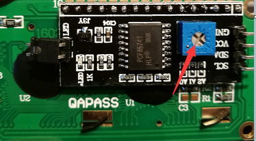

##############################################################################
Chapter LCD1602
##############################################################################

In this chapter, we will learn about the LCD1602 Display Screen

Project I2C LCD1602
****************************************************************

There are LCD1602 display screen and the I2C LCD. We will introduce both of them in this chapter. But what we use in this project is an I2C LCD1602 display screen. The LCD1602 Display Screen can display 2 lines of characters in 16 columns. It is capable of displaying numbers, letters, symbols, ASCII code and so on. As shown below is a monochrome LCD1602 Display Screen along with its circuit pin diagram

.. image:: ../_static/imgs/LCD1602_1.png
    :align: center

I2C LCD1602 Display Screen integrates a I2C interface, which connects the serial-input & parallel-output module to the LCD1602 Display Screen. This allows us to only use 4 lines to operate the LCD1602.

.. image:: ../_static/imgs/LCD1602_2.png
    :align: center

The serial-to-parallel IC chip used in this module is PCF8574T (PCF8574AT), and its default I2C address is 0x27(0x3F). You can also view the RPI bus on your I2C device address through command "i2cdetect -y 1" (refer to the "configuration I2C" section below). 

Below is the PCF8574 chip pin diagram and its module pin diagram:

.. image:: ../_static/imgs/PCF8574.png
    :align: center

PCF8574 module pins and LCD1602 pins correspond to each other and connected to each other:

.. image:: ../_static/imgs/PCF8574_1.png
    :align: center

Because of this, as stated earlier, we only need 4 pins to control the16 pins of the LCD1602 Display Screen through the I2C interface.

In this project, we will use the I2C LCD1602 to display some static characters and dynamic variables.

Component List
================================================================

+-------------------------------------------------+-------------------------------------------------+
|1. Raspberry Pi (with 40 GPIO) x1                |                                                 |     
|                                                 |   Jumper Wires x4                               |       
|2. GPIO Extension Board & Ribbon Cable x1        |                                                 |       
|                                                 |     |jumper-wire|                               |                                                            
|3. Breadboard x1                                 |                                                 |                                                                 
+-------------------------------------------------+-------------------------------------------------+
| I2C LCD1602 Module x1                                                                             |
|                                                                                                   |
|  |LCD1602|                                                                                        |
+---------------------------------------------------------------------------------------------------+

.. |jumper-wire| image:: ../_static/imgs/jumper-wire.png
.. |LCD1602| image:: ../_static/imgs/LCD1602.png

Circuit
================================================================

Note that the power supply for I2C LCD1602 in this circuit is 5V.

+------------------------------------------------------------------------------------------------+
|   Schematic diagram                                                                            |
|                                                                                                |
|   |LCD1602_Sc|                                                                                 |
+------------------------------------------------------------------------------------------------+
|   Hardware connection. If you need any support,please feel free to contact us via:             |
|                                                                                                |
|   support@freenove.com                                                                         |
|                                                                                                |
|   |LCD1602_Fr|                                                                                 | 
+------------------------------------------------------------------------------------------------+

.. |LCD1602_Sc| image:: ../_static/imgs/LCD1602_Sc.png
.. |LCD1602_Fr| image:: ../_static/imgs/LCD1602_Fr.png

.. note::
    
    It is necessary to configure 12C and install Smbus first (see :doc:`Chapter 7 ADC <ADC>` for details)

Code
================================================================

This code will have your RPi's CPU temperature and System Time Displayed on the LCD1602.

C Code 20.1.1 I2CLCD1602
----------------------------------------------------------------

If you did not configure I2C and install Smbus, please refer to :doc:`Chapter 7 ADC <ADC>`. If you did, please continue.

First, observe the project result, and then learn about the code in detail.

.. hint:: 
    :red:`If you have any concerns, please contact us via:` support@freenove.com

1.	Use ``cd`` command to enter ``20.1.1_ I2CLCD1602`` directory of C code.

.. code-block:: console

    $ cd ~/Freenove_Kit/Code/C_Code/20.1.1_I2CLCD1602

2.	Use following command to compile “I2CLCD1602.c” and generate executable file ``I2CLCD1602``.

.. code-block:: console

    $ gcc I2CLCD1602.c -o I2CLCD1602 -lwiringPi -lwiringPiDev

3.	Then run the generated file “I2CLCD1602”.

.. code-block:: console

    $ sudo ./I2CLCD1602

After the program is executed, the LCD1602 Screen will display your RPi's CPU Temperature and System Time. 
So far, at this writing, we have two types of LCD1602 on sale. One needs to adjust the backlight, and the other does not.

The LCD1602 that does not need to adjust the backlight is shown in the figure below.

.. image:: ../_static/imgs/LCD1602_back.png
    :align: center
    :width: 50%

If the LCD1602 you received is the following one, and you cannot see anything on the display or the display is not clear, try rotating the white knob on back of LCD1602 slowly, which adjusts the contrast, until the screen can display clearly.

The following is the program code:

.. literalinclude:: ../../../freenove_Kit/Code/C_Code/20.1.1_I2CLCD1602/I2CLCD1602.c
    :linenos: 
    :language: C

From the code, we can see that the PCF8591 and the PCF8574 have many similarities in using the I2C interface to expand the GPIO RPI. 
First, define the I2C address of the PCF8574 and the Extension of the GPIO pin, which is connected to the GPIO pin of the LCD1602. LCD1602 has two different i2c addresses. Set 0x27 as default.

.. literalinclude:: ../../../freenove_Kit/Code/C_Code/20.1.1_I2CLCD1602/I2CLCD1602.c
    :linenos: 
    :language: C
    :lines: 15-25

Then, in main function, initialize the PCF8574, set all the pins to output mode, and turn ON the LCD1602 backlight (without the backlight the Display is difficult to read). 

.. literalinclude:: ../../../freenove_Kit/Code/C_Code/20.1.1_I2CLCD1602/I2CLCD1602.c
    :linenos: 
    :language: C
    :lines: 83-87

Then use lcdInit() to initialize LCD1602 and set the RW pin of LCD1602 to 0 (can be written) according to requirements of this function. The return value of the function called "Handle" is used to handle LCD1602".

.. code-block:: c

    lcdhd = lcdInit(2,16,4,RS,EN,D4,D5,D6,D7,0,0,0,0);// initialize LCD and return “handle” used to handle LCD

Details about lcdInit():

.. c:function:: int lcdInit (int rows, int cols, int bits, int rs, int strb, int d0, int d1, int d2, int d3, int d4, int d5, int d6, int d7) ;

    This is the main initialization function and must be executd first before you use any other LCD functions. Rows and cols are the rows and columns of the Display (e.g. 2, 16 or 4, 20). Bits is the number of how wide the number of bits is on the interface (4 or 8). The rs and strb represent the pin numbers of the Display’s RS pin and Strobe (E) pin. The parameters d0 through d7 are the pin numbers of the 8 data pins connected from the RPi to the display. Only the first 4 are used if you are running the display in 4-bit mode.
    The return value is the 'handle' to be used for all subsequent calls to the lcd library when dealing with that LCD, or -1 to indicate a fault (usually incorrect parameter)
    For more details about LCD Library, please refer to: https://projects.drogon.net/raspberry-pi/wiringpi/lcd-library/ 

In the next “while”, two subfunctions are called to display the RPi's CPU Temperature and the SystemTime. First look at subfunction printCPUTemperature(). The CPU temperature data is stored in the :red:`"/sys/class/thermal/thermal_zone0/temp"` file. We need to read the contents of this file, which converts it to temperature value stored in variable CPU_temp and uses lcdPrintf() to display it on LCD.

.. literalinclude:: ../../../freenove_Kit/Code/C_Code/20.1.1_I2CLCD1602/I2CLCD1602.c
    :linenos: 
    :language: C
    :lines: 28-40

Details about lcdPosition() and lcdPrintf():

.. c:function:: lcdPosition (int handle, int x, int y);

    Set the position of the cursor for subsequent text entry.

.. c:function:: lcdPutchar (int handle, uint8_t data) & lcdPuts (int handle, char *string) & lcdPrintf (int handle, char *message, …)

    These output a single ASCII character, a string or a formatted string using the usual print formatting commands to display individual characters (it is how you are able to see characters on your computer monitor).

Next is subfunction printDataTime() used to display System Time. First, it gets the Standard Time and stores it into variable Rawtime, and then converts it to the Local Time and stores it into timeinfo, and finally displays the Time information on the LCD1602 Display.

.. literalinclude:: ../../../freenove_Kit/Code/C_Code/20.1.1_I2CLCD1602/I2CLCD1602.c
    :linenos: 
    :language: C
    :lines: 41-49