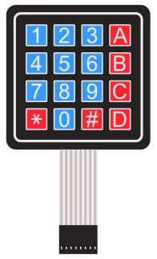
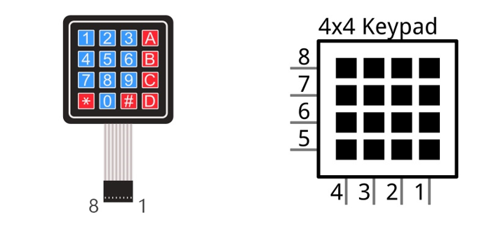
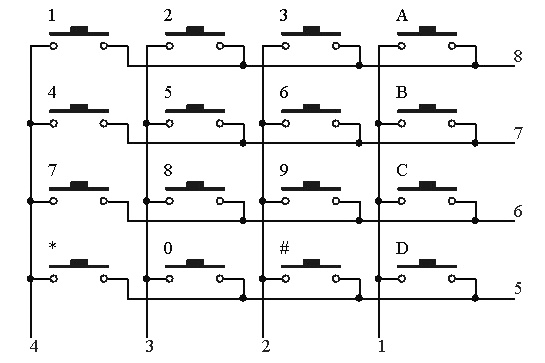
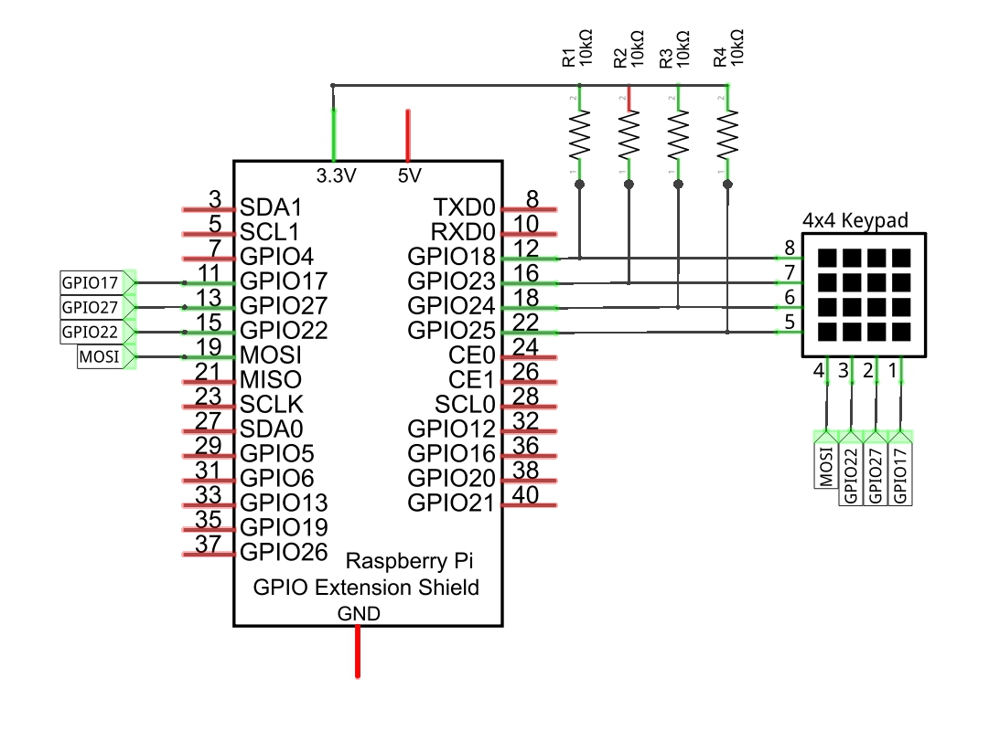
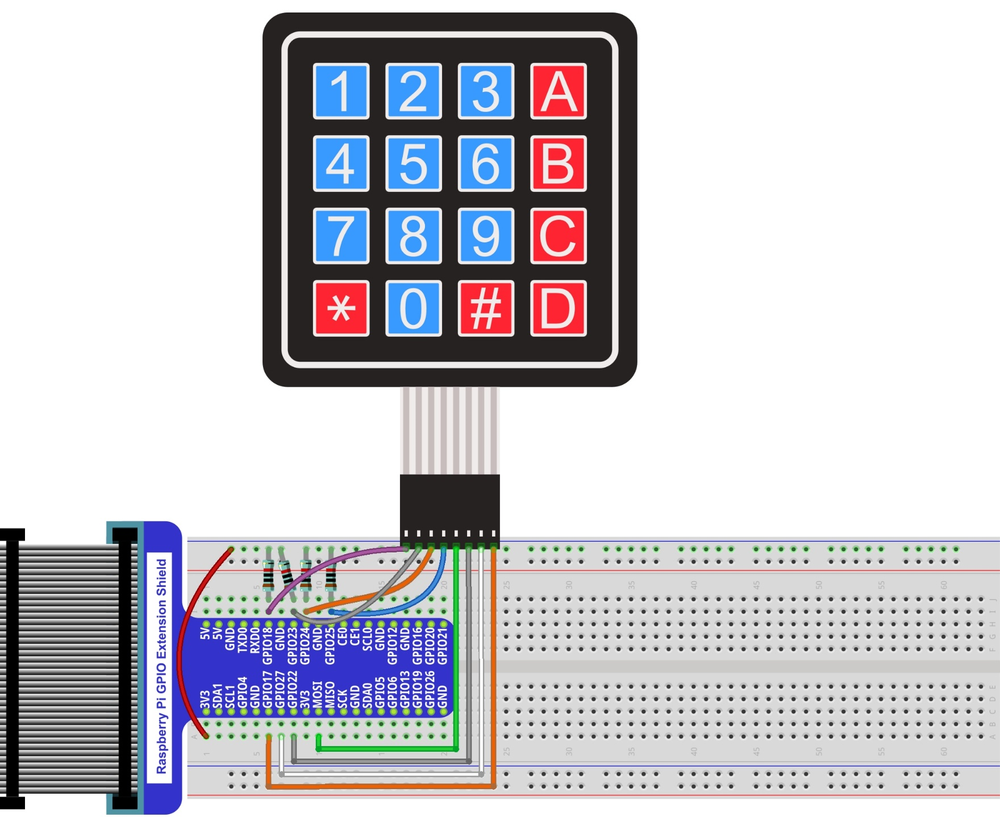
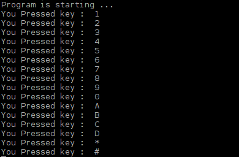

##############################################################################
Chapter Matrix Keypad
##############################################################################

Earlier we learned about a single Push Button Switch. In this chapter, we will learn about Matrix Keyboards, which integrates a number of Push Button Switches as Keys for the purposes of Input.

Project 22.1 Matrix Keypad
****************************************************************

In this project, we will attempt to get every key code on the Matrix Keypad to work.

Component List
================================================================

+-------------------------------------------------+-------------------------------------------------+
|1. Raspberry Pi (with 40 GPIO) x1                |                                                 |     
|                                                 |                                                 |       
|2. GPIO Extension Board & Ribbon Cable x1        |                                                 |       
|                                                 |                                                 |                                                            
|3. Breadboard x1                                 |   4x4 Matrix Keypad x1                          |                                                                 
+-------------------------------------------------+                                                 |
| Jumper wire                                     |     |Keypad|                                    |
|                                                 |                                                 |
|  |jumper-wire|                                  |                                                 |
+-------------------------------------------------+                                                 |
| Resistor 10kΩ x4                                |                                                 |
|                                                 |                                                 |
|  |Resistor-10kΩ|                                |                                                 |
+-------------------------------------------------+-------------------------------------------------+

.. |jumper-wire| image:: ../_static/imgs/jumper-wire.png
    :width: 50%
.. |Resistor-10kΩ| image:: ../_static/imgs/Resistor-10kΩ.png
    :width: 5%

Component knowledge
================================================================

4x4 Matrix Keypad
----------------------------------------------------------------

A Keypad Matrix is a device that integrates a number of keys in one package. As is shown below, a 4x4 Keypad Matrix integrates 16 keys (think of this as 16 Push Button Switches in one module):

Similar to the integration of an LED Matrix, the 4x4 Keypad Matrix has each row of keys connected with one pin and this is the same for the columns. Such efficient connections reduce the number of processor ports required. The internal circuit of the Keypad Matrix is shown below.

The method of usage is similar to the Matrix LED, by using a row or column scanning method to detect the state of each key's position by column and row. Take column scanning method as an example, send low level to the first 1 column (Pin1), detect level state of row 5, 6, 7, 8 to judge whether the key A, B, C, D are pressed. Then send low level to column 2, 3, 4 in turn to detect whether other keys are pressed. Therefore, you can get the state of all of the keys.

Circuit
================================================================

+------------------------------------------------------------------------------------------------+
|   Schematic diagram                                                                            |
|                                                                                                |
|   |Keypad_Sc|                                                                                  |
+------------------------------------------------------------------------------------------------+
|   Hardware connection. If you need any support,please feel free to contact us via:             |
|                                                                                                |
|   support@freenove.com                                                                         |
|                                                                                                |
|   |Keypad_Fr|                                                                                  | 
+------------------------------------------------------------------------------------------------+

Code
================================================================

This code is used to obtain all key codes of the 4x4 Matrix Keypad, when one of the keys is pressed, the key code will be displayed in the terminal window.

C Code 22.1.1 MatrixKeypad
----------------------------------------------------------------

First, observe the project result, and then learn about the code in detail.

.. hint:: 
    :red:`If you have any concerns, please contact us via:` support@freenove.com

1.	Use cd command to enter 22.1.1_MatrixKeypad directory of C code.

.. code-block:: console

    $ cd ~/Freenove_Kit/Code/C_Code/22.1.1_MatrixKeypad

2.	Code of this project contains a custom header file. Use the following command to compile the code MatrixKeypad.cpp, Keypad.cpp and Key.cpp generate executable file MatrixKeypad. The custom header file will be compiled at the same time.

.. code-block:: console

    $ gcc MatrixKeypad.cpp Keypad.cpp Key.cpp -o MatrixKeypad -lwiringPi

3.	Run the generated file "MatrixKeypad".

.. code-block:: console

    $ sudo ./MatrixKeypad

After the program is executed, pressing any key on the MatrixKeypad, will display the corresponding key code on the Terminal. As is shown below:

The following is the program code:

.. literalinclude:: ../../../freenove_Kit/Code/C_Code/22.1.1_MatrixKeypad/MatrixKeypad.cpp
    :linenos: 
    :language: C

In this project code, we use two custom library file **"Keypad.hpp"** and **"Key.hpp"**. They are located in the same directory with program files **"MatrixKeypad.cpp"**, **"Keypad.cpp"** and **"Key.cpp"**. The Library Keypad is “transplanted” from the Arduino Library Keypad. This library file provides a method to read the Matrix Keyboard’s input. By using this library, we can easily read the pressed keys of the Matrix Keyboard.

First, we define the information of the Matrix Keyboard used in this project: the number of rows and columns, code designation of each key and GPIO pin connected to each column and row. It is necessary to include the header file **"Keypad.hpp"**.

.. literalinclude:: ../../../freenove_Kit/Code/C_Code/22.1.1_MatrixKeypad/MatrixKeypad.cpp
    :linenos: 
    :language: C
    :lines: 7-18

Then, based on the above information, initiates a Keypad class object to operate the Matrix Keyboard.

.. code-block:: c

    Keypad keypad = Keypad( makeKeymap(keys), rowPins, colPins, ROWS, COLS );

Set the debounce time to 50ms, and this value can be set based on the actual characteristics of the keyboard's flexibly, with a default time of 10ms.

.. code-block:: c

    keypad.setDebounceTime(50);

In the "while" loop, use the function key= keypad.getKey () to read the keyboard constantly. If there is a key pressed, its key code will be stored in the variable "key", then be displayed.

.. literalinclude:: ../../../freenove_Kit/Code/C_Code/22.1.1_MatrixKeypad/MatrixKeypad.cpp
    :linenos: 
    :language: C
    :lines: 29-34

The Keypad Library used for the RPi is transplanted from the Arduino Keypad Library. And the source files can be obtained by visiting http://playground.arduino.cc/Code/Keypad. As for transplanted function library, the function and method of all classes, functions, variables, etc. are the same as the original library. Partial contents of the Keypad library are described below:

.. c:function:: class Keypad
    
    .. code-block:: c
        
        Keypad(char *userKeymap, byte *row, byte *col, byte numRows, byte numCols);
    
    Constructor, the parameters are: key code of keyboard, row pin, column pin, the number of rows, the number of columns.

    .. code-block:: c

        char getKey();
    
    Get the key code of the pressed key. If no key is pressed, the return value is NULL.

    .. code-block:: c

        void setDebounceTime(uint);
    
    Set the debounce time. And the default time is 10ms.

    .. code-block:: c

        void setHoldTime(uint);
    
    Set the time when the key holds stable state after pressed.

    .. code-block:: c

        bool isPressed(char keyChar);
    
    Judge whether the key with code "keyChar" is pressed.

    .. code-block:: c

        bool isPressed(char keyChar);

    Wait for a key to be pressed, and return key code of the pressed key.

    .. code-block:: c
        
        KeyState getState();
    
    Get state of the keys.

    .. code-block:: c
        
        bool keyStateChanged();

    Judge whether there is a change of key state, then return True or False.

.. seealso::

    For More information about Keypad, please visit: http://playground.arduino.cc/Code/Keypad or through the opening file "Keypad.hpp".
