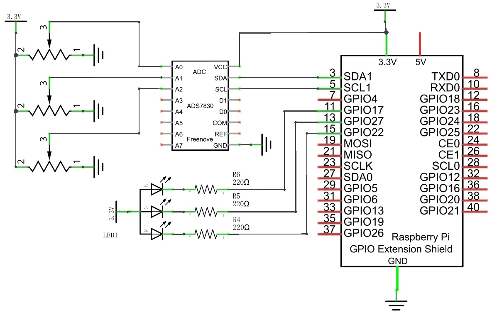
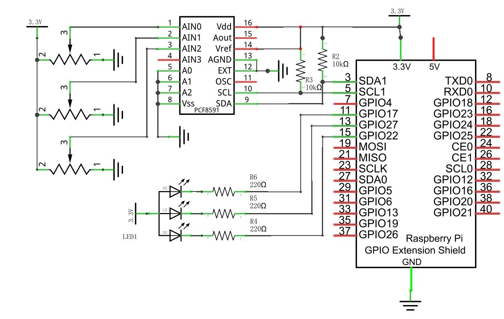
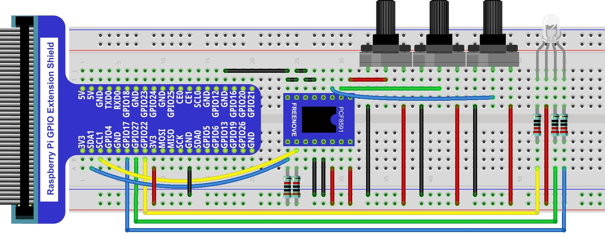
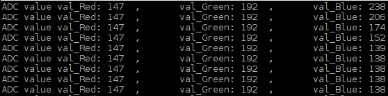

##############################################################################
Chapter Potentiometer & RGBLED
##############################################################################

In this chapter, we will use 3 potentiometers to control the brightness of 3 LEDs of RGBLED to create multiple colors.

Project Colorful Light 
****************************************************************

In this project, 3 potentiometers are used to control the RGB LED and in principle it is the same as with the Soft Light. project. Namely, read the voltage value of the potentiometer and then convert it to PWM used to control LED brightness. Difference is that the previous soft light project needed only one LED while this one required (3) RGB LEDs.

Component List
================================================================

.. table:: 
    :width: 50%
    :widths: 20 50
    :align: center

+-------------------------------------------------+-------------------------------+
|1. Raspberry Pi (with 40 GPIO) x1                |    220Ω x3                    |     
|                                                 |                               |       
|2. GPIO Extension Board & Ribbon Cable x1        |   |res-220R|                  |       
|                                                 |                               |                                                            
|3. Breadboard x1                                 |                               |                                                                 
+-------------------------------------------------+-------------------------------+
| Rotary potentiometer x3                         |   Resistor 10kΩ x2            |
|                                                 |                               |
| |Rotary-potentiometer|                          |  |Resistor-10kΩ|              |                           
+-------------------------------------------------+-------------------------------+
| ADC module x1 (Only one)                        |   RGB LED x1                  |
|                                                 |                               |
| |ADC-module-1|   :xx-large:`or`  |ADC-module-2| |   |RGB-LED-real|              |                   
|                                                 |                               |  
+-------------------------------------------------+-------------------------------+
|   Jumper Wire M/M x17                                                           |
|                                                                                 | 
|      |jumper-wire|                                                              |
+---------------------------------------------------------------------------------+

.. |jumper-wire| image:: ../_static/imgs/jumper-wire.png
    :width: 70%
.. |Resistor-10kΩ| image:: ../_static/imgs/Resistor-10kΩ.png
    :width: 20%
.. |res-220R| image:: ../_static/imgs/res-220R.png
    :width: 20%
.. |Rotary-potentiometer| image:: ../_static/imgs/Rotary-potentiometer.png
    :width: 25%
.. |ADC-module-1| image:: ../_static/imgs/ADC-module-1.png
.. |ADC-module-2| image:: ../_static/imgs/ADC-module-2.png
.. |RGB-LED-real| image:: ../_static/imgs/RGB-LED-real.png
    :width: 40%

Circuit with ADS7830
================================================================

+------------------------------------------------------------------------------------------------+
|   Schematic diagram                                                                            |
|                                                                                                |
|   |ADS7830-Schematic-3|                                                                        |
+------------------------------------------------------------------------------------------------+
|   Hardware connection. If you need any support,please feel free to contact us via:             |
|                                                                                                |
|   support@freenove.com                                                                         |
|                                                                                                |
|   |ADS7830-fritizing-3|                                                                        |
|                                                                                                |
|   **If circuit above doesn't work, please try following wiring.**                              |
|                                                                                                |
|   |ADS7830-fritizing-4|                                                                        |
+------------------------------------------------------------------------------------------------+

.. |ADS7830-fritizing-3| image:: ../_static/imgs/ADS7830-fritizing-3.png
.. |ADS7830-fritizing-4| image:: ../_static/imgs/ADS7830-fritizing-4.png

Circuit with PCF8591
================================================================

+------------------------------------------------------------------------------------------------+
|   Schematic diagram                                                                            |
|                                                                                                |
|   |PCF8591-Schematic-3|                                                                        |
+------------------------------------------------------------------------------------------------+
|   Hardware connection.                                                                         |
|                                                                                                |
|   |PCF8591-fritizing-3|                                                                        |
+------------------------------------------------------------------------------------------------+

.. note:: 
        **Youtube video:** https://youtu.be/CmLLNsBMN2U

.. raw:: html

   <iframe height="500" width="690" src="https://www.youtube.com/embed/CmLLNsBMN2U" frameborder="0" allowfullscreen></iframe>

Code
================================================================

C Code Colorful Softlight
----------------------------------------------------------------

If you did not configure I2C, please refer to :ref:`Chapter 7 <ADC>`. If you did, please continue.

First, observe the project result, and then learn about the code in detail.

.. hint:: 
    
    :red:`If you have any concerns, please contact us via:` support@freenove.com

1.	Use ``cd`` command to enter 09.1.1_ColorfulSoftlight directory of C code.

.. code-block:: console

    $ cd ~/Freenove_Kit/Code/C_Code/09.1.1_ColorfulSoftlight

2.	Use following command to compile ``ColorfulSoftlight.cpp`` and generate executable file ``ColorfulSoftlight``.

.. code-block:: console

    $ g++ ColorfulSoftlight.cpp -o ColorfulSoftlight -lwiringPi -lADCDevice

3.	Then run the generated file ``ColorfulSoftlight``.

.. code-block:: console

    $ sudo ./ColorfulSoftlight

After the program is executed, rotate one of the potentiometers, then the color of RGB LED will change. The Terminal window will display the ADC value of each potentiometer. 

The following is the program code:

.. literalinclude:: ../../../freenove_Kit/Code/C_Code/09.1.1_ColorfulSoftlight/ColorfulSoftlight.cpp
    :linenos: 
    :language: C

In the code you can read the ADC values of the 3 potentiometers and map it into a PWM duty cycle to control the 3 LED elements to vary the color of their respective RGB LED.