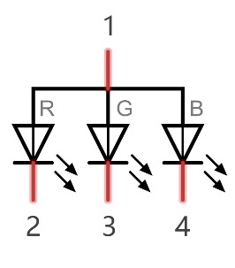

##############################################################################
Chapter RGB LED
##############################################################################

In this chapter, we will learn how to control a RGB LED.

An RGB LED has 3 LEDs integrated into one LED component. It can respectively emit Red, Green and Blue light. In order to do this, it requires 4 pins (this is also how you identify it). The long pin (1) is the common which is the Anode (+) or positive lead, the other 3 are the Cathodes (-) or negative leads. A rendering of a RGB LED and its electronic symbol are shown below. We can make RGB LED emit various colors of light and brightness by controlling the 3 Cathodes (2, 3 & 4) of the RGB LED

.. list-table::
   :widths: 50 50
   :align: center

   * - |RGB-LED-real|
     - |RGB-LED-sc|

.. |RGB-LED-real| image:: ../_static/imgs/RGB-LED-real.png
    :width: 40%

Red, Green, and Blue light are called 3 Primary Colors when discussing light (Note: for pigments such as paints, the 3 Primary Colors are Red, Blue and Yellow). When you combine these three Primary Colors of light with varied brightness, they can produce almost any color of visible light. Computer screens, single pixels of cell phone screens, neon lamps, etc. can all produce millions of colors due to phenomenon.

.. image:: ../_static/imgs/RGB.png
        :width: 50%
        :align: center

.. container:: centered
    
    :x-large:`RGB`

If we use a three 8 bit PWM to control the RGB LED, in theory, we can create 28*28*28=16777216 (16 million) colors through different combinations of RGB light brightness.

Next, we will use RGB LED to make a multicolored LED. 

Project Multicolored LED
****************************************************************

Component List
================================================================
    
+------------------------------------------------------+------------------------------------------------------+
|    Raspberry Pi (with 40 GPIO) x1                    |        RGB LED x1                                    |
|                                                      |                                                      |   
|    GPIO Extension Board & Ribbon Cable x1            |       |RGB-LED-real|                                 |
|                                                      |                                                      |
|    Breadboard x1                                     |                                                      |
+------------------------------------------------------+------------------------------------------------------+
|                    Jumper Wire                       |                   Resistor 220Ω x3                   |
|                                                      |                                                      |
|   |jumper-wire|                                      |    |res-220R-hori|                                   |        
+------------------------------------------------------+------------------------------------------------------+

.. |jumper-wire| image:: ../_static/imgs/jumper-wire.png
.. |res-220R-hori| image:: ../_static/imgs/res-220R-hori.png

Circuit
================================================================

+------------------------------------------------------------------------------------------------+
|   Schematic diagram                                                                            |
|                                                                                                |
|   |RGB-LED-Scbematic|                                                                          |
+------------------------------------------------------------------------------------------------+
|   Hardware connection. If you need any support,please feel free to contact us via:             |
|                                                                                                |
|   support@freenove.com                                                                         | 
|                                                                                                |
|   |RGB-LED-fritizing|                                                                          |
|                                                                                                |
|    **Video:** https://youtu.be/tbnX2AsX2y4                                                     |
+------------------------------------------------------------------------------------------------+

.. |RGB-LED-Scbematic| image:: ../_static/imgs/RGB-LED-Scbematic.png
    :width: 80%
.. |RGB-LED-fritizing| image:: ../_static/imgs/RGB-LED-fritizing.png

.. raw:: html

   <iframe height="500" width="690" src="https://www.youtube.com/embed/tbnX2AsX2y4" frameborder="0" allowfullscreen></iframe>

.. note:: 
    In this kit, the RGB led is Common anode. The voltage difference between LED will make it work. There is no visible GND. The GPIO ports can also receive current while in output mode.If circuit above doesn’t work, the RGB LED may be common cathode. Please try following wiring.There is no need to modify code for random color.

.. image:: ../_static/imgs/RGB-LED-fritizing2.png
    :width: 100%
    :align: center
    
Code
================================================================

We need to use the software to make the ordinary GPIO output PWM, since this project requires 3 PWM and in RPi only one GPIO has the hardware capability to output PWM,

C Code 5.1.1 Colorful LED
----------------------------------------------------------------

First, observe the project result, and then learn about the code in detail.

.. hint:: 
    :red:`If you have any concerns, please contact us via:` support@freenove.com

1.	Use ``cd`` command to enter 05.1.1_ColorfulLED directory of C code.

.. code-block:: console
    
    $ cd ~/Freenove_Kit/Code/C_Code/05.1.1_ColorfulLED
2.	Use following command to compile ``ColorfulLED.c`` and generate executable file ``ColorfulLED``.

.. note:: 
    in this project, the software PWM uses a multi-threading mechanism. So ``-lpthread`` option need to be add to the compiler.

.. code-block:: console    
    
    $ gcc ColorfulLED.c -o ColorfulLED -lwiringPi -lpthread

3.	And then run the generated file ``ColorfulLED``.

.. code-block:: console
    
    $ sudo ./ColorfulLED
After the program is executed, you will see that the RGB LED shows lights of different colors randomly.

The following is the program code:

.. literalinclude:: ../../../freenove_Kit/Code/C_Code/05.1.1_ColorfulLED/ColorfulLED.c
    :linenos: 
    :language: C

First, in subfunction of ledInit(), create the software PWM control pins used to control the R, G, B pin respectively.

.. literalinclude:: ../../../freenove_Kit/Code/C_Code/05.1.1_ColorfulLED/ColorfulLED.c
    :linenos: 
    :language: C
    :lines: 10-15

Then create subfunction, and set the PWM of three pins.

.. literalinclude:: ../../../freenove_Kit/Code/C_Code/05.1.1_ColorfulLED/ColorfulLED.c
    :linenos: 
    :language: C
    :lines: 17-22

Finally, in the “while” loop of main function, get three random numbers and specify them as the PWM duty cycle, which will be assigned to the corresponding pins. So RGB LED can switch the color randomly all the time.

.. literalinclude:: ../../../freenove_Kit/Code/C_Code/05.1.1_ColorfulLED/ColorfulLED.c
    :linenos: 
    :language: C
    :lines: 33-42

The related function of PWM Software can be described as follows:

.. c:function:: long random();

This function will return a random number.

.. hint:: 
    For more details about Software PWM, please refer to: https://github.com/WiringPi/WiringPi
