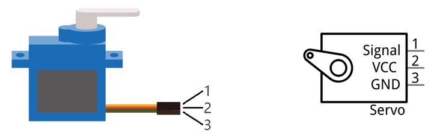

##############################################################################
Chapter Servo
##############################################################################

Previously, we learned how to control the speed and rotational direction of a DC Motor. In this chapter, we will learn about Servos which are a rotary actuator type motor that can be controlled rotate to specific angles.

Project Servo Sweep
****************************************************************

First, we need to learn how to make a Servo rotate.

Component List
================================================================

+-------------------------------------------------+-------------------------------------------------+
|1. Raspberry Pi (with 40 GPIO) x1                |                                                 |     
|                                                 | Servo x1                                        |       
|2. GPIO Extension Board & Ribbon Cable x1        |                                                 |       
|                                                 |  |Servo|                                        |                                                            
|3. Breadboard x1                                 |                                                 |                                                                 
+-------------------------------------------------+-------------------------------------------------+
|  Jumper Wires x3                                                                                  |
|                                                                                                   |
|  |jumper-wire|                                                                                    |                           
+---------------------------------------------------------------------------------------------------+

.. |jumper-wire| image:: ../_static/imgs/jumper-wire.png
    :width: 70%
.. |Servo| image:: ../_static/imgs/Servo.png
    :width: 70%

Component knowledge
================================================================

Servo
----------------------------------------------------------------

Servo is a compact package which consists of a DC Motor, a set of reduction gears to provide torque, a sensor and control circuit board. Most Servos only have a 180-degree range of motion via their “horn”. Servos can output higher torque than a simple DC Motor alone and they are widely used to control motion in model cars, model airplanes, robots, etc. Servos have three wire leads which usually terminate to a male or female 3-pin plug. Two leads are for electric power: Positive (2-VCC, Red wire), Negative (3-GND, Brown wire), and the signal line (1-Signal, Orange wire) as represented in the Servo provided in your Kit.

We will use a 50Hz PWM signal with a duty cycle in a certain range to drive the Servo. The lasting time 0.5ms-2.5ms of PWM single cycle high level corresponds to the Servo angle 0 degrees - 180 degree linearly. Part of the corresponding values are as follows:

.. note:: 
    
    the lasting time of high level corresponding to the servo angle is absolute instead of accumulating. For example, the high level time lasting for 0.5ms correspond to the 0 degree of the servo. If the high level time lasts for another 1ms, the servo rotates to 45 degrees.

.. table:: 
    :width: 100%
    :widths: 50 50
    :align: center

================  ================
 High level time  Servo angle
================  ================
0.5ms             0 degree
1ms               45 degree
1.5ms             90 degree
2ms               135 degree
2.5ms             180 degree
================  ================

When you change the Servo signal value, the Servo will rotate to the designated angle.

Circuit
================================================================

Use caution when supplying power to the Servo it should be 5V. Make sure you do not make any errors when connecting the Servo to the power supply.

+------------------------------------------------------------------------------------------------+
|   Schematic diagram                                                                            |
|                                                                                                |
|   |Servo-Sc|                                                                                   |
+------------------------------------------------------------------------------------------------+
|   Hardware connection. If you need any support,please feel free to contact us via:             |
|                                                                                                |
|   support@freenove.com                                                                         |
|                                                                                                |
|   |Servo-Fr|                                                                                   |
|                                                                                                |
|    **Video:** https://youtu.be/leptbJh32ZI                                                     |
|                                                                                                |
|    **Sorry latter chapters don't have videos yet.**                                            |
+------------------------------------------------------------------------------------------------+

.. raw:: html

   <iframe height="500" width="690" src="https://www.youtube.com/embed/leptbJh32ZI" frameborder="0" allowfullscreen></iframe>

.. |Servo-Sc| image:: ../_static/imgs/Servo-Sc.png
.. |Servo-Fr| image:: ../_static/imgs/Servo-Fr.png

Code
================================================================

In this project, we will make a Servo rotate from 0 degrees to 180 degrees and then reverse the direction to make it rotate from 180 degrees to 0 degrees and repeat these actions in an endless loop.

C Code 15.1.1 Sweep
----------------------------------------------------------------

First, observe the project result, and then learn about the code in detail.

.. hint:: 
    :red:`If you have any concerns, please contact us via:` support@freenove.com

1.	Use ``cd`` command to enter 15.1.1_Sweep directory of C code.

.. code-block:: console

    $ cd ~/Freenove_Kit/Code/C_Code/15.1.1_Sweep

2.	Use following command to compile ``Sweep.c`` and generate executable file ``Sweep``. 

.. code-block:: console

    $ gcc Sweep.c -o Sweep -lwiringPi

3.	Run the generated file ``Sweep``.

.. code-block:: console

    $ sudo ./Sweep

After the program is executed, the Servo will rotate from 0 degrees to 180 degrees and then reverse the direction to make it rotate from 180 degrees to 0 degrees and repeat these actions in an endless loop.

The following is the program code:

.. literalinclude:: ../../../freenove_Kit/Code/C_Code/15.1.1_Sweep/Sweep.c
    :linenos: 
    :language: C

A 50 Hz pulse for a 20ms cycle is required to control the Servo. In function softPwmCreate (int pin, int initialValue, int pwmRange), the unit of the third parameter pwmRange is 100US, specifically 0.1ms. In order to get the PWM with a 20ms cycle, the pwmRange shoulde be set to 200. So in the subfunction of servoInit (), we create a PWM pin with a pwmRange of 200.

.. literalinclude:: ../../../freenove_Kit/Code/C_Code/15.1.1_Sweep/Sweep.c
    :linenos: 
    :language: C
    :lines: 18-20

Since 0-180 degrees of the Servo's motion corresponds to the PWM pulse width of 0.5-2.5ms, with a PwmRange of 200 ms. We then need the function softPwmWrite (int pin, int value) and the scope 5-25 of the parameter values to correspond to 0-180 degrees’ motion of the Servo. What’s more, the number written in subfunction servoWriteMS () should be within the range of 5-25. However, in practice, due to the inherent error manufactured into each Servo, the pulse width will have a deviation. So we need to define a minimum and maximum pulse width and an error offset (this is essential in robotics).

.. code-block:: c

    #define OFFSET_MS 3     //Define the unit of servo pulse offset: 0.1ms
    #define SERVO_MIN_MS 5+OFFSET_MS        //define the pulse duration for minimum angle of servo
    #define SERVO_MAX_MS 25+OFFSET_MS       //define the pulse duration for maximum angle of servo
    .......
    void servoWriteMS(int pin, int ms){
        if(ms > SERVO_MAX_MS)
            ms = SERVO_MAX_MS;
        if(ms < SERVO_MIN_MS)
            ms = SERVO_MIN_MS;
        softPwmWrite(pin,ms);
    }

In subfunction servoWrite (), directly input an angle value (0-180 degrees), map the angle to the pulse width and then output it.

.. literalinclude:: ../../../freenove_Kit/Code/C_Code/15.1.1_Sweep/Sweep.c
    :linenos: 
    :language: C
    :lines: 21-27

Finally, in the "while" loop of the main function, use two "for" cycle to make servo rotate from 0 degrees to 180 degrees, and then from 180 degrees to 0 degrees.

.. literalinclude:: ../../../freenove_Kit/Code/C_Code/15.1.1_Sweep/Sweep.c
    :linenos: 
    :language: C
    :lines: 44-55
