##############################################################################
Chapter Soldering a Circuit Board
##############################################################################

From previous chapters, we have learned about electronic circuits and components and have built a variety of circuits using a Breadboard device, which is not designed to be used permanently. We now will take a further step to make permanent projects using a Perfboard (a type of Prototype Circuit Board). Note: Perfboard is a stiff, thin sheet of insulated material with holes bored on a grid. The grid is usually a squared off shape with a spacing of 0.1 inches. Square copper pads cover these holes to make soldering electronic components easier. 

To finish this chapter, you need to prepare the necessary soldering equipment, including an electric soldering iron (or soldering pencil) and solder. We have already prepared the Perfboard for you. 

.. catuion::

    :red:`Please use extreme caution and attention to safety when you operate soldering tools used in these projects.`

Project 35.1 Soldering a Buzzer
****************************************************************

You should be familiar with the Buzzer from our previous project. We will solder a permanent circuit that when a Push Button Switch is pressed a Buzzer sounds

.. note::
    
    This circuit does not require programming and will work when it is powered ON. When the button is not pressed and the Buzzer is not in use, there is no power consumption.

You can install it on your bicycle, your bedroom door or any other place where you want a Buzzer.

Component list
================================================================

+------------------------+------------+-------------------+---------------------+
|  Female Pin Header x2  | LED x1     |  Active buzzer x1 |  Push button x1     |
|                        |            |                   |                     |
|  |Fe_pin_Header|       ||green_led| |  |Active-buzzer|  |  |button-small|     |
+------------------------+------------+-----+-------------+---------------------+
| AA Battery Holder x1 and AA Batteries x2  | Resistor 220Ω x1                  |
|                                           |                                   |
| |battery|                                 |  |res-220R-hori|                  |
+-------------------------------------------+-----------------------------------+

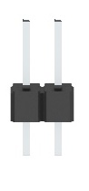
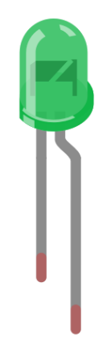
.. |res-220R-hori| image:: ../_static/imgs/res-220R-hori.png
.. |Active-buzzer| image:: ../_static/imgs/Active-buzzer.png
    :width: 50%
.. |button-small| image:: ../_static/imgs/button-small.jpg
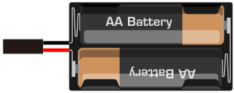

Circuit
================================================================

============================================== ==============================================
    Schematic diagram                           Hardware connection. If you need any support,
    
                                                please feel free to contact us via:
    
                                                support@freenove.com

    |solder_Sc|                                  |solder_Fr|
============================================== ==============================================

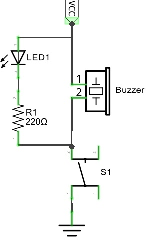
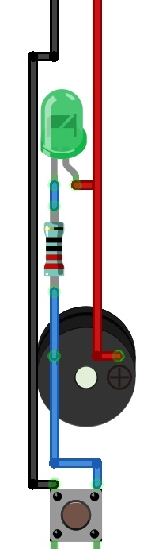

.. note::

    If you are new to soldering electronic components on any type of circuit board we strongly recommend that you watch some instructional How-To videos by doing an Internet search and practice your soldering technique before attempting to solder the following projects. Some components can be damaged by exposure to excessive heat for prolonged times and there are various techniques you can learn that will help with making neater solder joints.

Solder the Circuit 
================================================================

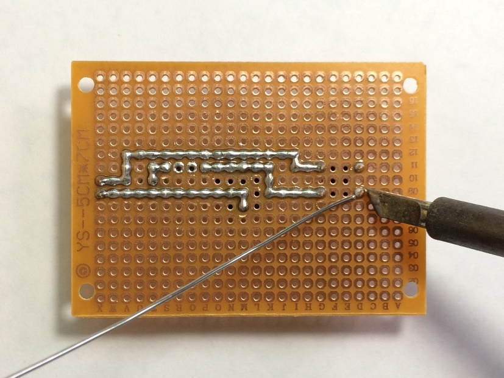

Here is a diagram after soldering from both sides of the Perfboard:

=================== ===================
Front                Back

|solder_front|       |solder_back|

=================== ===================

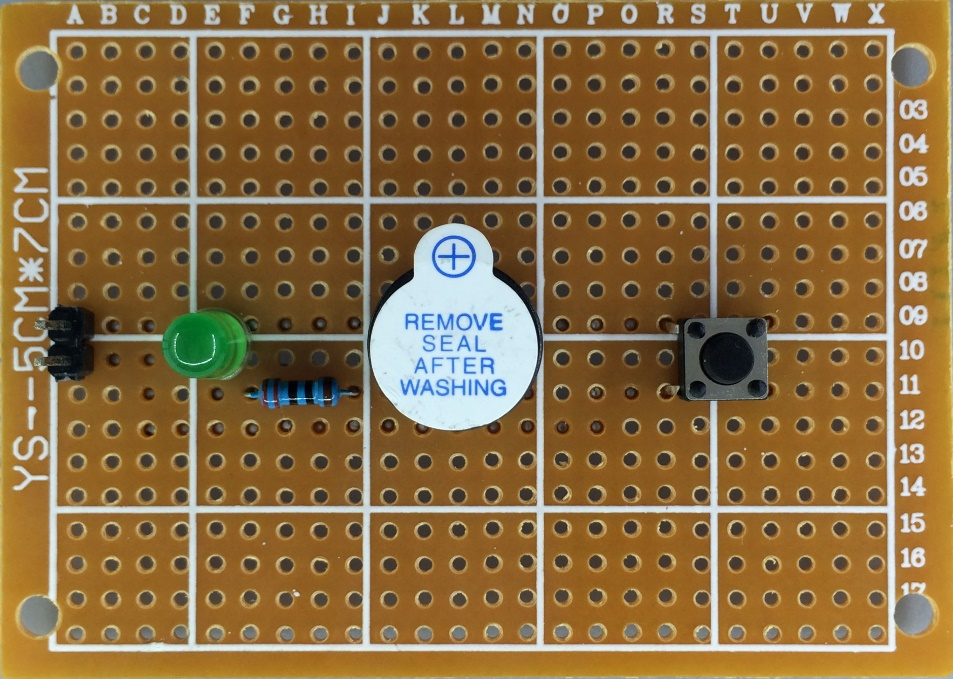
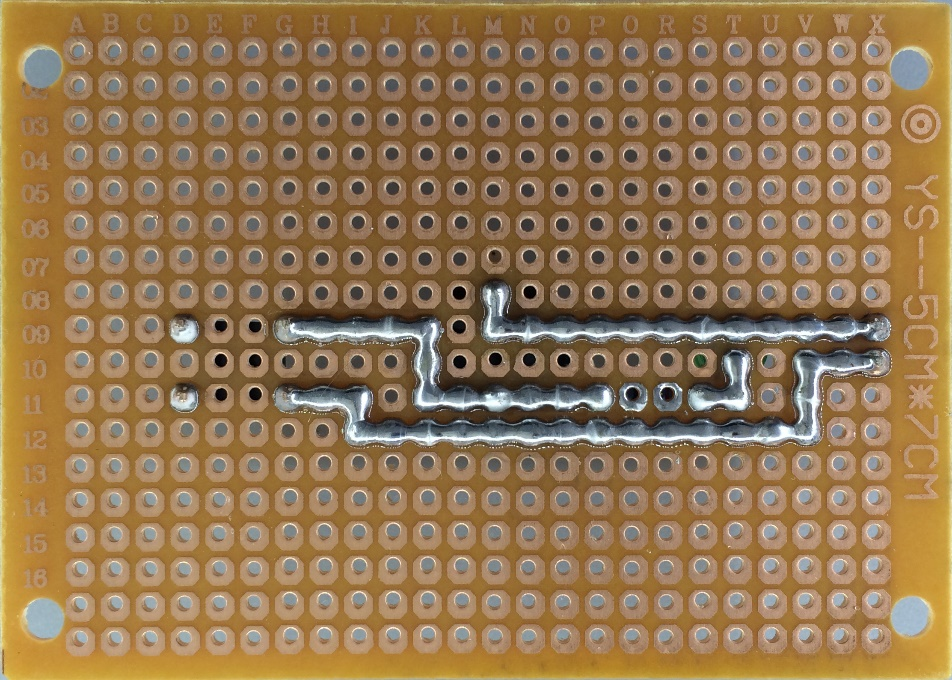

Test the Circuit
================================================================

Connect the circuit board to a power supply (3~5V). You can use Raspberry Pi board or your 2 AA Cell Battery Box as the power supply.

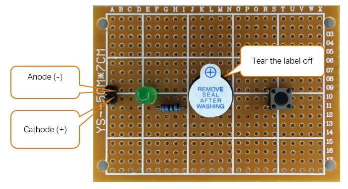

Press the Push Button Switch after connecting the power and then the buzzer will sound.

Project 35.2 Soldering a Flowing Water Light
****************************************************************

You should be familiar with the Flowing Water Light from our previous project. We will solder a permanent circuit using improved code to make a more interesting Flowing Water Light.

Component List
================================================================

====================== ====================== ====================== ======================
 Female Pin Header x5   Resistor 220Ω x8       LED x8                 74HC595 x1

   |Fe_pin_Header|      |res-220R|              |red-led|               |74HC595|
====================== ====================== ====================== ======================

.. |red-led| image:: ../_static/imgs/red-led.png
    :width: 60%
.. |res-220R| image:: ../_static/imgs/res-220R.png
    :width: 25%
.. |74HC595| image:: ../_static/imgs/74HC595.png
    :width: 60%

Circuit
================================================================

Solder the following circuit on the Perfboard.

===================== =====================
Schematic diagram      Hardware connection

|solder_Sc_1|          |solder_Fr_1|
===================== =====================

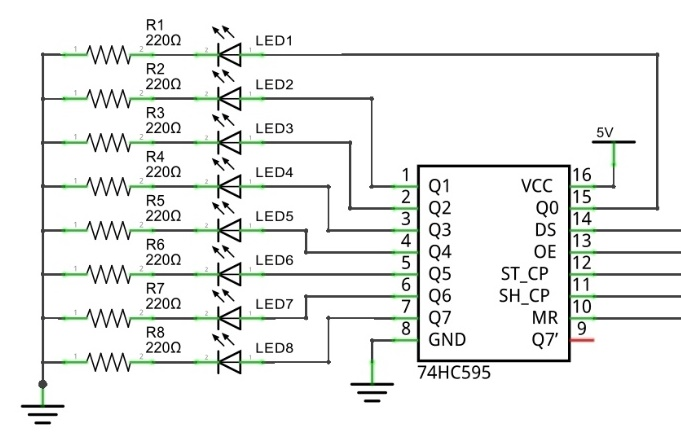
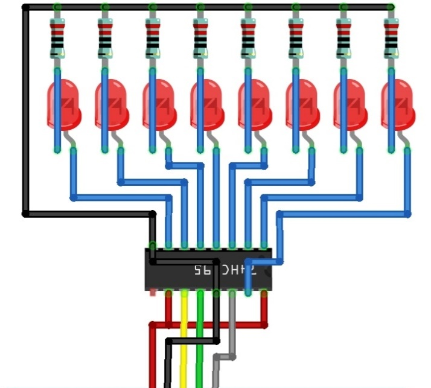

Soldering the Circuit
================================================================

Insert the components in the Perfboard, and solder the circuit on the back per earlier instructions. 

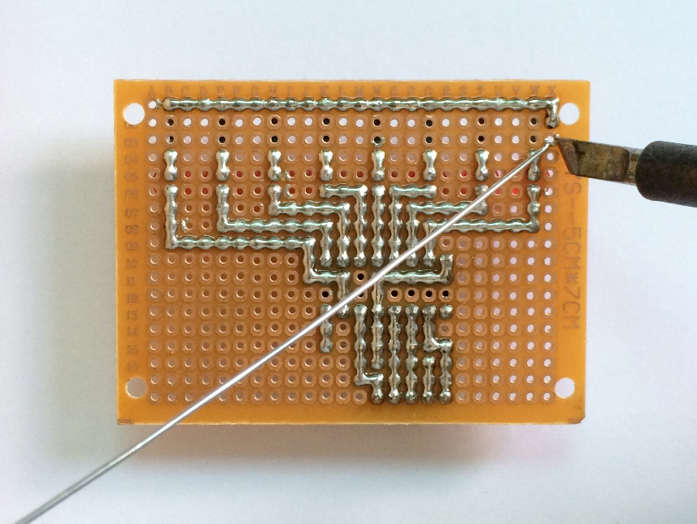

Here is a diagram after soldering from both sides of the Perfboard:

=================== ===================
Front                Back

|solder_front_1|     |solder_back_1|

=================== ===================

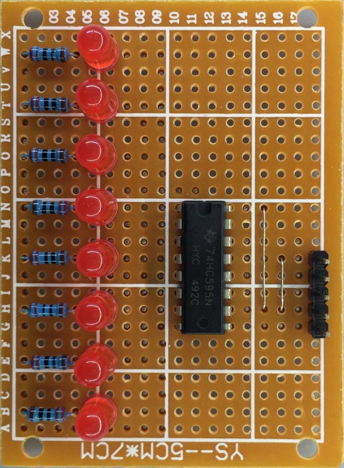
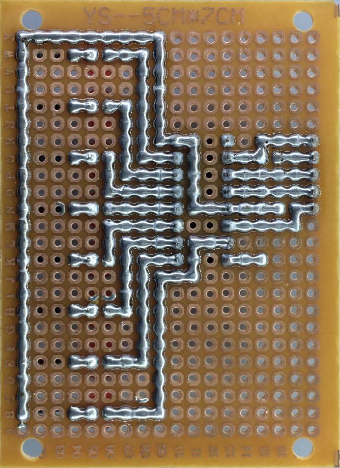

Connecting the Circuit
================================================================

Connect the board to Raspberry Pi with jumper wire in the following way.

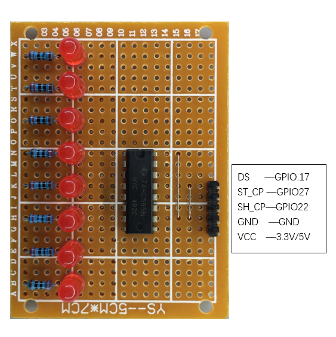

Code
================================================================

This now will be the third time we have made the Flowing Water Light. In this project, we will solder a completely new circuit for Flowing Water Light. Additionally, the program is also different from the previous ones we have used. When this light flows, it will have a long “tail”.

C Code 35.2.1 LightWater03
----------------------------------------------------------------

First, observe the project result, and then learn about the code in detail.

.. hint:: 
    :red:`If you have any concerns, please contact us via:` support@freenove.com

1.	Use ``cd`` command to enter 35.2.1_LightWater03 directory of C code.

.. code-block:: console    
    
    $ cd ~/Freenove_Kit/Code/C_Code/35.2.1_LightWater03

2.	Use following command to compile ``LightWater03.c`` and generate executable file ``LightWater03``.

.. code-block:: console    
    
    $ gcc LightWater03.c  -o LightWater03  -lwiringPi

3.	Then run the generated file ``LightWater03``.

.. code-block:: console    
    
    $ sudo ./LightWater03

After the program is executed, the LEDs will light up in the form of flowing water with a long “tail”.

The following is the program code:

.. literalinclude:: ../../../freenove_Kit/Code/C_Code/35.2.1_LightWater03/LightWater03.c
    :linenos: 
    :language: C

We can see that this program is different from the previous one that we had used. We define an array to modulate different PWM pulse widths for LEDs, in doing so different LEDs can emit varied brightness. Starting from the array index 0, take an array of 8 adjacent numbers as the LED duty cycle and output it one at a time. Increasing the starting index number in turn, then it will create a flowing effect.

.. code-block:: c

    const int pluseWidth[]={0,0,0,0,0,0,0,0,64,32,16,8,4,2,1,0,0,0,0,0,0,0,0};

By recording the moving time point to control the speed of the movement of index number, controls the speed of the Flowing Water Light. Variable moveSpeed saves the time interval of each move, and the greater the value is, the slower the rate of the flowing movement (the reverse creates faster flowing movement).

.. literalinclude:: ../../../freenove_Kit/Code/C_Code/35.2.1_LightWater03/LightWater03.c
    :linenos: 
    :language: C
    :lines: 38-42

Finally, in a “for” loop with i=64, modulate the output pulse width of the PWM square wave. The process, from the beginning of implementing the for loop to the end, is a PWM cycle. In the loop, there is another for loop with j=8 and in this loop, it compares the number “i” to the value of the array to determine output high or low level. Then, the data will be sent to the 74HC595 IC Chip.

.. literalinclude:: ../../../freenove_Kit/Code/C_Code/35.2.1_LightWater03/LightWater03.c
    :linenos: 
    :language: C
    :lines: 43-51
