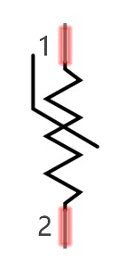
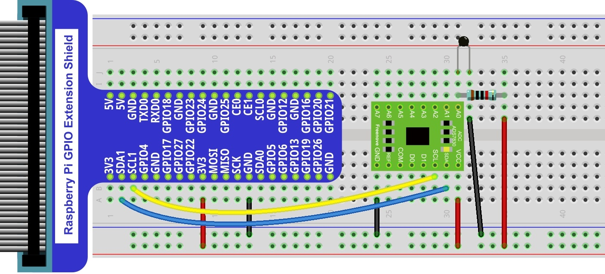

##############################################################################
Chapter Thermistor
##############################################################################

In this chapter, we will learn about Thermistors which are another kind of Resistor.

Project Thermometer
****************************************************************

A Thermistor is a type of Resistor whose resistance value is dependent on temperature and changes in temperature. Therefore, we can take advantage of this characteristic to make a Thermometer.

Component List
================================================================

+---------------------------------------------------------------+
|1. Raspberry Pi (with 40 GPIO) x1                              |     
|                                                               |       
|2. GPIO Extension Board & Ribbon Cable x1                      |       
|                                                               |                                                            
|3. Breadboard x1                                               |                                                                 
+===============================+===============================+
| Thermistor x1                 |   Resistor 10kΩ x3            |
|                               |                               |
| |Thermistor|                  |  |Resistor-10kΩ|              |                           
+-------------------------------+-------------------------------+
| ADC module x1                                                 |
|                                                               |
|   |ADC-module-1|   :xx-large:`or`  |ADC-module-2|             |                   
|                                                               |  
+---------------------------------------------------------------+
|   Jumper Wire M/M x14                                         |
|                                                               | 
|      |jumper-wire|                                            |
+---------------------------------------------------------------+

.. |jumper-wire| image:: ../_static/imgs/jumper-wire.png
    :width: 80%
.. |Resistor-10kΩ| image:: ../_static/imgs/Resistor-10kΩ.png
    :width: 10%
.. |Thermistor| image:: ../_static/imgs/Thermistor.png
    :width: 30%
.. |ADC-module-1| image:: ../_static/imgs/ADC-module-1.png
.. |ADC-module-2| image:: ../_static/imgs/ADC-module-2.png

Component knowledge
================================================================

Thermistor
----------------------------------------------------------------

Thermistor is a temperature sensitive resistor. When it senses a change in temperature, the resistance of the Thermistor will change. We can take advantage of this characteristic by using a Thermistor to detect temperature intensity. A Thermistor and its electronic symbol are shown below.

.. image:: ../_static/imgs/Thermistor.png
        :width: 10%
        :align: center

The relationship between resistance value and temperature of a thermistor is:

.. container:: centered

    :xx-large:`Rt=R*EXP [B*(1/T2-1/T1)]`

- Where:
    - Rt is the thermistor resistance under T2 temperature;
    - R is in the nominal resistance of thermistor under T1 temperature;
    - EXP[n] is nth power of e;
    - B is for thermal index;
    - T1, T2 is Kelvin temperature (absolute temperature). Kelvin temperature=273.15 + Celsius temperature.

For the parameters of the Thermistor, we use: B=3950, R=10k, T1=25.

The circuit connection method of the Thermistor is similar to photoresistor, as the following:

.. image:: ../_static/imgs/Thermistor-3.png
        :width: 20%
        :align: center

We can use the value measured by the ADC converter to obtain the resistance value of Thermistor, and then we can use the formula to obtain the temperature value.

Therefore, the temperature formula can be derived as:

.. container:: centered

    :xx-large:`T2 = 1/(1/T1 + ln(Rt/R)/B)`

Circuit with ADS7830
================================================================

The circuit of this project is similar to the one in last chapter. The only difference is that the Photoresistor is replaced by the Thermistor.

+------------------------------------------------------------------------------------------------+
|   Schematic diagram                                                                            |
|                                                                                                |
|   |PCF8591-Schematic-5|                                                                        |
+------------------------------------------------------------------------------------------------+
|   Hardware connection. If you need any support,please feel free to contact us via:             |
|                                                                                                |
|   support@freenove.com                                                                         |
|                                                                                                |
|   |ADS7830-fritizing-6|                                                                        |
|                                                                                                |
|    **Thermistor has longer pins than the one shown in circuit.**                               |
|                                                                                                |
|    **Video:** https://youtu.be/-CvWcobXSFI                                                     |
+------------------------------------------------------------------------------------------------+

.. |ADS7830-Schematic-5| image:: ../_static/imgs/ADS7830-Schematic-5.png

.. raw:: html

   <iframe height="500" width="690" src="https://www.youtube.com/embed/-CvWcobXSFI" frameborder="0" allowfullscreen></iframe>

Circuit with PCF8591
================================================================

The circuit of this project is similar to the one in the last chapter. The only difference is that the Photoresistor is replaced by the Thermistor.

+------------------------------------------------------------------------------------------------+
|   Schematic diagram                                                                            |
|                                                                                                |
|   |PCF8591-Schematic-5|                                                                        |
+------------------------------------------------------------------------------------------------+
|   Hardware connection. If you need any support,please feel free to contact us via:             |
|                                                                                                |
|   support@freenove.com                                                                         |
|                                                                                                |
|   |PCF8591-fritizing-5|                                                                        |
|                                                                                                |
|   **Thermistor has longer pins than the one shown in circuit.**                                |
+------------------------------------------------------------------------------------------------+

.. |PCF8591-fritizing-5| image:: ../_static/imgs/PCF8591-fritizing-5.png

Code
================================================================

In this project code, the ADC value still needs to be read, but the difference here is that a specific formula is used to calculate the temperature value.

C Code 11.1.1 Thermometer
----------------------------------------------------------------

If you did not configure I2C, please refer to :doc:`Chapter 7 ADC <ADC>`. If you did, please continue.

First, observe the project result, and then learn about the code in detail.

.. hint:: 
    :red:`If you have any concerns, please contact us via:` support@freenove.com

1.	Use ``cd`` command to enter 11.1.1_Thermometer directory of C code.

.. code-block:: console

    $ cd ~/Freenove_Kit/Code/C_Code/11.1.1_Thermometer

2.	Use following command to compile ``Thermometer.cpp`` and generate executable file ``Thermometer``.

.. code-block:: console

    $ g++ Thermometer.cpp -o Thermometer -lwiringPi -lADCDevice

3.	Then run the generated file ``Thermometer``.

.. code-block:: console

    $ sudo ./Thermometer

After the program is executed, the Terminal window will display the current ADC value, voltage value and temperature value. Try to “pinch” the thermistor (without touching the leads) with your index finger and thumb for a brief time, you should see that the temperature value increases.

.. image:: ../_static/imgs/ADC-value-2.png
        :width: 100%
        :align: center

The following is the code:

.. literalinclude:: ../../../freenove_Kit/Code/C_Code/11.1.1_Thermometer/Thermometer.cpp
    :linenos: 
    :language: C

In the code, the ADC value of ADC module A0 port is read, and then calculates the voltage and the resistance of Thermistor according to Ohms Law. Finally, it calculates the temperature sensed by the Thermistor, according to the formula. 
