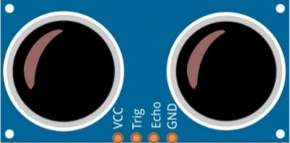
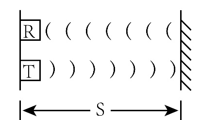
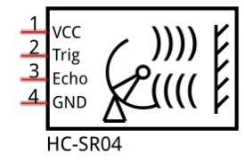
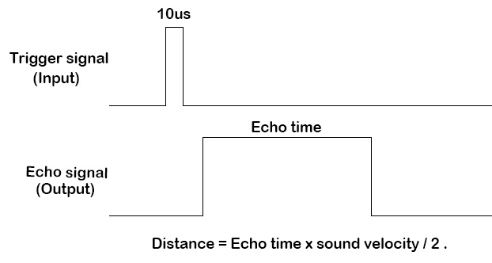
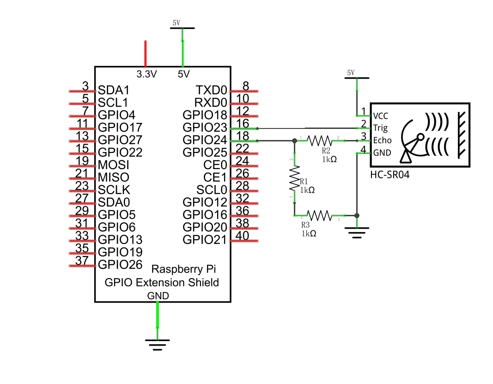
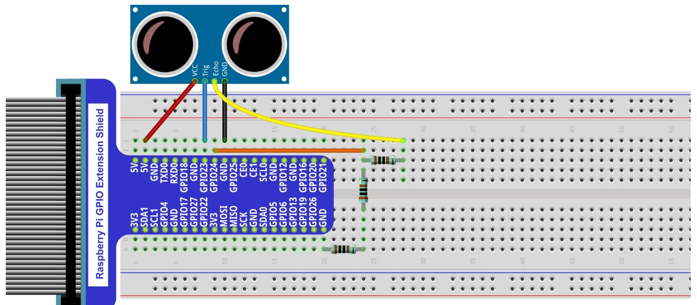
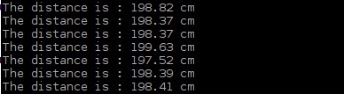

##############################################################################
Chapter Ultrasonic Ranging
##############################################################################

In this chapter, we learn a module which use ultrasonic to measure distance.

Project Ultrasonic Ranging
****************************************************************

In this project, we use ultrasonic ranging module to measure distance, and print out the data in the terminal.

Component List
================================================================

+-------------------------------------------------+-------------------------------------------------+
|1. Raspberry Pi (with 40 GPIO) x1                |                                                 |     
|                                                 | Jumper Wires x4                                 |       
|2. GPIO Extension Board & Ribbon Cable x1        |                                                 |       
|                                                 |  |jumper-wire|                                  |                                                            
|3. Breadboard x1                                 |                                                 |                                                                 
+-------------------------------------------------+-------------------------------------------------+
| Ultrasonic Module x1                            | Resistor 1kΩ x3                                 |     
|                                                 |                                                 |       
|  |Ultrasonic_Module|                            |  |res-1K-hori|                                  |       
+-------------------------------------------------+-------------------------------------------------+

.. |jumper-wire| image:: ../_static/imgs/jumper-wire.png

Component Knowledge
================================================================

The Ultrasonic Ranging Module uses the principle that ultrasonic waves will be reflected when they encounter any obstacles. This is possible by counting the time interval between when the ultrasonic wave is transmitted to when the ultrasonic wave reflects back after encountering an obstacle. Time interval counting will end after an ultrasonic wave is received, and the time difference (delta) is the total time of the ultrasonic wave’s journey from being transmitted to being received. Because the speed of sound in air is a constant, and is about v=340m/s, we can calculate the distance between the Ultrasonic Ranging Module and the obstacle: s=vt/2.

.. container:: centered
    
    2S=V·t.

The Ultrasonic Ranging Module integrates a both an ultrasonic transmitter and a receiver. The transmitter is used to convert electrical signals (electrical energy) into high frequency (beyond human hearing) sound waves (mechanical energy) and the function of the receiver is opposite of this. The picture and the diagram of the Ultrasonic Ranging Module are shown below:

.. list-table::
   :widths: 50 50
   :align: center

   * - |Ultrasonic_Module|
     - |HC_SR04|

Pin description:

.. list-table::
   :widths: 50 50
   :align: center

   * - VCC
     - power supply pin

   * - Trig
     - trigger pin

   * - Echo
     - Echo pin
    
   * - GND
     - GND

Technical specs:

.. list-table::
   :widths: 50 50
   :align: center

   * - Working voltage: 5V 
     - Working current: 12mA

   * - Minimum measured distance: 2cm
     - Maximum measured distance: 200cm

Instructions for Use: output a high-level pulse in Trig pin lasting for least 10uS, the module begins to transmit ultrasonic waves. At the same time, the Echo pin is pulled up. When the module receives the returned ultrasonic waves from encountering an obstacle, the Echo pin will be pulled down. The duration of high level in the Echo pin is the total time of the ultrasonic wave from transmitting to receiving, s=vt/2. This is done constantly.

Circuit
================================================================

Note that the voltage of ultrasonic module is 5V in this circuit.

+------------------------------------------------------------------------------------------------+
|   Schematic diagram                                                                            |
|                                                                                                |
|   |Ultrasonic_Sc|                                                                              |
+------------------------------------------------------------------------------------------------+
|   Hardware connection. If you need any support,please feel free to contact us via:             |
|                                                                                                |
|   support@freenove.com                                                                         | 
|                                                                                                |
|   |Ultrasonic_Fr|                                                                              |
+------------------------------------------------------------------------------------------------+

video: https://www.youtube.com/watch?v=6nffzlN-lUE

.. raw:: html

   <iframe height="500" width="690" src="https://www.youtube.com/embed/6nffzlN-lUE" frameborder="0" allowfullscreen></iframe>

Code
================================================================

C Code SenseLED
----------------------------------------------------------------

First, observe the project result, and then learn about the code in detail.

.. hint:: 
    :red:`If you have any concerns, please contact us via:` support@freenove.com

1.	Use ``cd`` command to enter 24.1.1_UltrasonicRanging directory of C code.

.. code-block:: console

    $ cd ~/Freenove_Kit/Code/C_Code/24.1.1_UltrasonicRanging

2.	Use following command to compile "UltrasonicRanging.c" and generate executable file ``UltrasonicRanging``. 

.. code-block:: console

    $ gcc UltrasonicRanging.c -o UltrasonicRanging -lwiringPi

3.	Then run the generated file ``UltrasonicRanging``.

.. code-block:: console

    $ sudo ./UltrasonicRanging

After the program is executed, aim the Ultrasonic Ranging Module's detectors (“eyes”) perpendicular to the surface of an object (try using your hand). The distance between the ultrasonic module and the object will be displayed in the terminal. As is shown below:

The following is the program code:

.. literalinclude:: ../../../freenove_Kit/Code/C_Code/24.1.1_UltrasonicRanging/UltrasonicRanging.c
    :linenos: 
    :language: C
    :lines: 7-42

First, define the pins and the maximum measurement distance.

.. code-block:: console

    #define trigPin 4
    #define echoPin 5
    #define MAX_DISTANCE 220        //define the maximum measured distance

If the module does not return high level, we cannot wait for this forever, so we need to calculate the time period for the maximum distance, that is, time Out. **timeOut= 2*MAX_DISTANCE/100/340*1000000**. The result of the constant part in this formula is approximately 58.8.

.. code-block:: console

    #define timeOut MAX_DISTANCE*60

Subfunction **getSonar()** function is used to start the Ultrasonic Module to begin measurements and return the measured distance in cm units. In this function, first let trigPin send 10us high level to start the Ultrasonic Module. Then use **pulseIn()** to read the Ultrasonic Module and return the duration time of high level. Finally, the measured distance according to the time is calculated.

.. literalinclude:: ../../../freenove_Kit/Code/C_Code/24.1.1_UltrasonicRanging/UltrasonicRanging.c
    :linenos: 
    :language: C
    :lines: 17-26

Lastly, in the while loop of main function, get the measurement distance and display it continually.

.. literalinclude:: ../../../freenove_Kit/Code/C_Code/24.1.1_UltrasonicRanging/UltrasonicRanging.c
    :linenos: 
    :language: C
    :lines: 36-40

About function **pulseIn()** :

.. c:function:: int pulseIn(int pin, int level, int timeout);

    Return the length of the pulse (in microseconds) or 0 if no pulse is completed before the timeout (unsigned long).