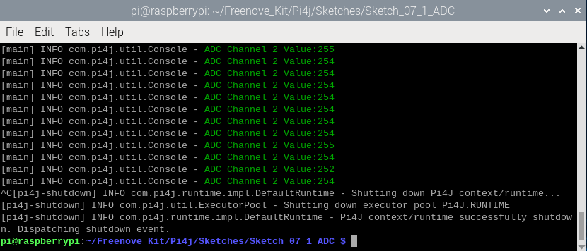

##############################################################################
(Important) Chapter ADC
##############################################################################

We have learned how to control the brightness of an LED through PWM and that PWM is not a real analog signal. In this chapter, we will learn how to read analog values via an ADC Module and convert these analog values into digital.

Project Read the Voltage of Potentiometer 
****************************************************************

In this project, we will use the ADC function of an ADC Module to read the voltage value of a potentiometer.

Component List
================================================================

+---------------------------------------------------------------+
|1. Raspberry Pi (with 40 GPIO) x1                              |     
|                                                               |       
|2. GPIO Extension Board & Ribbon Cable x1                      |       
|                                                               |                                                            
|3. Breadboard x1                                               |                                                                 
+===============================+===============================+
| Rotary potentiometer x1       |   Resistor 10kΩ x2            |
|                               |                               |
| |Rotary-potentiometer|        |  |Resistor-10kΩ|              |                           
+-------------------------------+-------------------------------+
| ADC module x1                                                 |
|                                                               |
|   |ADC-module-2|                                              |                   
|                                                               |  
+---------------------------------------------------------------+
|   Jumper Wire                                                 |
|                                                               | 
|      |jumper-wire|                                            |
+---------------------------------------------------------------+

.. |jumper-wire| image:: ../_static/imgs/jumper-wire.png
    :width: 70%   
.. |Resistor-10kΩ| image:: ../_static/imgs/Resistor-10kΩ.png
    :width: 15%
.. |Rotary-potentiometer| image:: ../_static/imgs/Rotary-potentiometer.png
    :width: 35%
.. |ADC-module-2| image:: ../_static/imgs/ADC-module-2.png

Circuit knowledge
================================================================

ADC
----------------------------------------------------------------

**An ADC is an electronic integrated circuit used to convert analog signals such as voltages to digital or binary form consisting of 1s and 0s.** The range of our ADC module is 8 bits, that means the resolution is 2^8=256, so that its range (at 3.3V) will be divided equally to 256 parts. 
Any analog value can be mapped to one digital value using the resolution of the converter. So the more bits the ADC has, the denser the partition of analog will be and the greater the precision of the resulting conversion.

Subsection 1: the analog in range of 0V-3.3/256 V corresponds to digital 0;

Subsection 2: the analog in range of 3.3 /256 V-2*3.3 /256V corresponds to digital 1;

…

The resultant analog signal will be divided accordingly.

DAC
----------------------------------------------------------------

The reversing this process requires a DAC, Digital-to-Analog Converter. The digital I/O port can output high level and low level (0 or 1), but cannot output an intermediate voltage value. This is where a DAC is useful. The DAC module PCF8591 has a DAC output pin with 8-bit accuracy, which can divide VDD (here is 3.3V) into 28=256 parts. For example, when the digital quantity is 1, the output voltage value is 3.3/256 *1 V, and when the digital quantity is 128, the output voltage value is 3.3/256 *128=1.65V, the higher the accuracy of DAC, the higher the accuracy of output voltage value will be.

Component knowledge
================================================================

Potentiometer
----------------------------------------------------------------

Potentiometer is a resistive element with three Terminal parts. Unlike the resistors that we have used thus far in our project which have a fixed resistance value, the resistance value of a potentiometer can be adjusted. A potentiometer is often made up by a resistive substance (a wire or carbon element) and movable contact brush. When the brush moves along the resistor element, there will be a change in the resistance of the potentiometer’s output side (3) (or change in the voltage of the circuit that is a part). The illustration below represents a linear sliding potentiometer and its electronic symbol on the right.

Between potentiometer pin 1 and pin 2 is the resistive element (a resistance wire or carbon) and pin 3 is connected to the brush that makes contact with the resistive element. In our illustration, when the brush moves from pin 1 to pin 2, the resistance value between pin 1 and pin 3 will increase linearly (until it reaches the highest value of the resistive element) and at the same time the resistance between pin 2 and pin 3 will decrease linearly and conversely down to zero. At the midpoint of the slider the measured resistance values between pin 1 and 3 and between pin 2 and 3 will be the same.

In a circuit, both sides of resistive element are often connected to the positive and negative electrodes of power. When you slide the brush “pin 3”, you can get variable voltage within the range of the power supply.

.. image:: ../_static/imgs/1-32-fritizing.png
        :width: 30%
        :align: center

Rotary potentiometer
----------------------------------------------------------------

Rotary potentiometers and linear potentiometers have the same function; the only difference being the physical action being a rotational rather than a sliding movement.

.. image:: ../_static/imgs/Rotary-potentiometer-turn.png
        :width: 30%
        :align: center

ADS7830
----------------------------------------------------------------

The ADS7830 is a single-supply, low-power, 8-bit data acquisition device that features a serial I2C interface and an 8-channel multiplexer. The following table is the pin definition diagram of ADS7830.

+-----------+-----+---------------------------------------------------+-----------------------------------------------+
| SYMBOL    | PIN |                    DESCRIPTION                    |                    TOP VIEW                   |
+===========+=====+===================================================+===============================================+
|  CH0      |  1  |                                                   |                                               |
+-----------+-----+                                                   |                                               |
|  CH1      |  2  |                                                   |                                               |
+-----------+-----+                                                   |                                               |
|  CH2      |  3  |                                                   |                                               |
+-----------+-----+                                                   |                                               |
|  CH3      |  4  |                                                   |                                               |                                               
+-----------+-----+       Analog input channels  (A/D converter)      |                                               |
|  CH4      |  5  |                                                   |                                               |
+-----------+-----+                                                   |                                               |
|  CH5      |  6  |                                                   |                                               |
+-----------+-----+                                                   |                                               |
|  CH6      |  7  |                                                   |                                               |
+-----------+-----+                                                   |                                               |
|  CH7      |  8  |                                                   ||ADS7830-top|                                  |
+-----------+-----+---------------------------------------------------+                                               |
|  GND      |  9  |   Ground                                          |                                               |
+-----------+-----+---------------------------------------------------+                                               |
|REF in/out |  10 | Internal +2.5V Reference,External Reference Input |                                               |
+-----------+-----+---------------------------------------------------+                                               |
|  COM      |  11 |   Common to Analog Input Channel                  |                                               |
+-----------+-----+---------------------------------------------------+                                               |
|  A0       |  12 |                                                   |                                               |
+-----------+-----+   Hardware address                                |                                               |
|  A1       |  13 |                                                   |                                               |
+-----------+-----+---------------------------------------------------+                                               |
|  SCL      |  14 |   Serial Clock                                    |                                               |
+-----------+-----+---------------------------------------------------+                                               |
|  SDA      |  15 |   Serial Sata                                     |                                               |
+-----------+-----+---------------------------------------------------+                                               |
|  +VDD     |  16 |   Power Supply, 3.3V Nominal                      |                                               |
+-----------+-----+---------------------------------------------------+-----------------------------------------------+

.. |ADS7830-top| image:: ../_static/imgs/ADS7830-top.png

I2C communication
----------------------------------------------------------------

I2C (Inter-Integrated Circuit) has a two-wire serial communication mode, which can be used to connect a micro-controller and its peripheral equipment. Devices using I2C communications must be connected to the serial data line (SDA), and serial clock line (SCL) (called I2C bus). Each device has a unique address which can be used as a transmitter or receiver to communicate with devices connected via the bus.

Circuit
================================================================

+------------------------------------------------------------------------------------------------+
|   Schematic diagram                                                                            |
|                                                                                                |
|   |ADS7830-Schematic|                                                                          |
+------------------------------------------------------------------------------------------------+
|   Hardware connection. If you need any support,please feel free to contact us via:             |
|                                                                                                |
|   support@freenove.com                                                                         |
|                                                                                                |
|   **This product contains only one ADC module.**                                               |
|                                                                                                |
|   |ADS7830-fritizing|                                                                          |
+------------------------------------------------------------------------------------------------+

.. |ADS7830-Schematic| image:: ../_static/imgs/ADS7830-Schematic.png
        :width: 80%
.. |ADS7830-fritizing| image:: ../_static/imgs/ADS7830-fritizing.png

Configure I2C and Install Smbus 
================================================================

Enable I2C
----------------------------------------------------------------

The I2C interface in Raspberry Pi is disabled by default. You will need to open it manually and enable the I2C interface as follows:

Type command in the Terminal:

.. code-block:: console
    
    $ sudo raspi-config

Then open the following dialog box:

.. image:: ../_static/imgs/Enable-I2C.png
        :width: 100%
        :align: center

Choose “3 Interfacing Options” then “I4 I2C” then “Yes” and then “Finish” in this order and restart your RPi. The I2C module will then be started.

Type a command to check whether the I2C module is started:

.. code-block:: console

    $ lsmod | grep i2c

If the I2C module has been started, the following content will be shown. “bcm2708" refers to the CPU model. Different models of Raspberry Pi display different contents depending on the CPU installed:

.. image:: ../_static/imgs/Enable-I2C-2.png
        :width: 100%
        :align: center

Sketch
================================================================

In this chapter, we will learn the combined usage of ADC and potentiometer.

Sketch_07_1_ADC
----------------------------------------------------------------

First, enter where the project is located:

.. code-block:: console

    $ cd ~/Freenove_Kit/Pi4j/Sketches/Sketch_07_1_ADC

Enter the command to run the code.

.. code-block:: console

    $ jbang ADC.java

When the code is running, rotate the potentiometer marked below.

.. image:: ../_static/imgs/ADS7830-fritizing.png
    :align: center

You can see that the ADC values change with the rotation of the potentiometer. The value 0 means that the potentiometer’s voltage read by ADC is 0V, 255 indicates that the voltage is 5V.

Press Ctrl+C to exit the code.

You can open the code with Geany with the following command to view and edit it.

.. code-block:: console

    $ geany ADC.java

Click the icon to run the code.

If the code fails to run, please check :doc:`Geany Configuration`.

The following is program code:

.. literalinclude:: ../../../freenove_Kit/Pi4j/Sketches/Sketch_07_1_ADC/ADC.java
    :linenos: 
    :language: java

Dependency declaration, these libraries will be automatically downloaded by jbang at runtime and added to the classpath.

.. literalinclude:: ../../../freenove_Kit/Pi4j/Sketches/Sketch_07_1_ADC/ADC.java
    :linenos: 
    :language: java
    :lines: 3-8

Import I2C library. In this project, we use I2C to read the channel value of ADS7830.

.. literalinclude:: ../../../freenove_Kit/Pi4j/Sketches/Sketch_07_1_ADC/ADC.java
    :linenos: 
    :language: java
    :lines: 10-15

Constructor of ADCDevice class, which is used to initialize I2C bus to facilitate later reading and writing ADS7830 chip.

.. literalinclude:: ../../../freenove_Kit/Pi4j/Sketches/Sketch_07_1_ADC/ADC.java
    :linenos: 
    :language: java
    :lines: 21-25

Write a byte to the target chip, and then read the data. If the data can be read, it means the target chip exists and communication is successful. If an I2C exception is detected, it means the target chip does not exist.

.. literalinclude:: ../../../freenove_Kit/Pi4j/Sketches/Sketch_07_1_ADC/ADC.java
    :linenos: 
    :language: java
    :lines: 27-36

Write the read command to the ADS7830 and read the corresponding ADC value. It is returned by the return value.

.. literalinclude:: ../../../freenove_Kit/Pi4j/Sketches/Sketch_07_1_ADC/ADC.java
    :linenos: 
    :language: java
    :lines: 38-49

Create a pi4j context to get the Raspberry PI i2c interface.

.. literalinclude:: ../../../freenove_Kit/Pi4j/Sketches/Sketch_07_1_ADC/ADC.java
    :linenos: 
    :language: java
    :lines: 60-61

The I2C address of the ADS7830 is 0x48.

Create an ADCDevice class, associate it with the Raspberry PI I2C interface, and assign a value to the adcDevice.

.. literalinclude:: ../../../freenove_Kit/Pi4j/Sketches/Sketch_07_1_ADC/ADC.java
    :linenos: 
    :language: java
    :lines: 63-64

Check whether the chip can communicate normally. If the communication is successful, read channel 0 of the ADS7830 chip and print it out in the terminal.

.. literalinclude:: ../../../freenove_Kit/Pi4j/Sketches/Sketch_07_1_ADC/ADC.java
    :linenos: 
    :language: java
    :lines: 65-77

If communication with the chip fails, a prompt message is printed on the terminal.

.. literalinclude:: ../../../freenove_Kit/Pi4j/Sketches/Sketch_07_1_ADC/ADC.java
    :linenos: 
    :language: java
    :lines: 78-80

When the code finishes running, close the Pi4J context.

.. literalinclude:: ../../../freenove_Kit/Pi4j/Sketches/Sketch_07_1_ADC/ADC.java
    :linenos: 
    :language: java
    :lines: 82-84

Project Soft Light
****************************************************************

Component List
================================================================

+---------------------------------------------------------------------------------+
|1. Raspberry Pi (with 40 GPIO) x1                                                |     
|                                                                                 |       
|2. GPIO Extension Board & Ribbon Cable x1                                        |       
|                                                                                 |                                                            
|3. Breadboard x1                                                                 |                                                                 
+=========================+=======================+===============================+
| Rotary potentiometer x1 | Resistor 220Ω x1      |   Resistor 10kΩ x2            |
|                         |                       |                               |
| |Rotary-potentiometer|  |  |res-220R|           |  |Resistor-10kΩ|              |                           
+-------------------------+-----------------------+-------------------------------+
| ADC module x1 (Only one)                        |   LED x1                      |
|                                                 |                               |
| |ADC-module-2|                                  |   |red-led|                   |                   
|                                                 |                               |  
+-------------------------------------------------+-------------------------------+
|   Jumper Wire M/M x17                                                           |
|                                                                                 | 
|      |jumper-wire|                                                              |
+---------------------------------------------------------------------------------+

.. |jumper-wire| image:: ../_static/imgs/jumper-wire.png
    :width: 70%
.. |Resistor-10kΩ| image:: ../_static/imgs/Resistor-10kΩ.png
    :width: 20%
.. |res-220R| image:: ../_static/imgs/res-220R.png
    :width: 20%
.. |Rotary-potentiometer| image:: ../_static/imgs/Rotary-potentiometer.png
    :width: 25%
.. |ADC-module-2| image:: ../_static/imgs/ADC-module-2.png
.. |red-led| image:: ../_static/imgs/red-led.png
    :width: 30%

Circuit
================================================================

+------------------------------------------------------------------------------------------------+
|   Schematic diagram                                                                            |
|                                                                                                |
|   |ADS7830-Schematic-2|                                                                        |
+------------------------------------------------------------------------------------------------+
|   Hardware connection. If you need any support,please feel free to contact us via:             |
|                                                                                                |
|   support@freenove.com                                                                         |
|                                                                                                |
|   |ADS7830-fritizing-2|                                                                        |
+------------------------------------------------------------------------------------------------+

.. |ADS7830-Schematic-2| image:: ../_static/imgs/ADS7830-Schematic-2.png
.. |ADS7830-fritizing-2| image:: ../_static/imgs/ADS7830-fritizing-2.png

Sketch
================================================================

In this project, we learn how to control the brightness of LED with the potentiometer.

Sketch_07_2_Softlight
----------------------------------------------------------------

First, enter where the project is located:

.. code-block:: console

    $ cd ~/Freenove_Kit/Pi4j/Sketches/Sketch_07_2_Softlight

Enter the command to run code.

.. code-block:: console

    $ jbang Softlight.java

When the code is running, turn the potentiometer marked below and you can see the brightness of the LED change.

.. image:: ../_static/imgs/ADS7830-fritizing-2.png
    :align: center

On the Terminal, you can see the printed ADC values and the calculated voltage values.

Press Ctrl+C to exit the program.

You can open the code with Geany with the following command to view and edit it.

.. code-block:: console

    $ geany Softlight.java
    
Click the icon to run the code.

If the code fails to run, please check :doc:`Geany Configuration`.

The following is program code:

.. literalinclude:: ../../../freenove_Kit/Pi4j/Sketches/Sketch_07_2_Softlight/Softlight.java
    :linenos: 
    :language: java

The ADC value of the potentiometer is obtained every 100 milliseconds and printed on the terminal. Meanwhile, the ADC value is converted into the duty cycle value of the LED to control the brightness of the LED.

.. literalinclude:: ../../../freenove_Kit/Pi4j/Sketches/Sketch_07_2_Softlight/Softlight.java
    :linenos: 
    :language: java
    :lines: 158-168

Project Colorful Light 
****************************************************************

In this project, 3 potentiometers are used to control the RGB LED and in principle, it is the same as with the ‘Soft Light’ project. Namely, read the voltage value of the potentiometer and then convert it to PWM used to control LED brightness. Difference is that the previous soft light project needed only one LED while this one required (3) RGB LEDs.

Component List
================================================================

+---------------------------------------------------------------------------------+
|1. Raspberry Pi (with 40 GPIO) x1                                                |     
|                                                                                 |       
|2. GPIO Extension Board & Ribbon Cable x1                                        |       
|                                                                                 |                                                            
|3. Breadboard x1                                                                 |                                                                 
+=========================+=======================+===============================+
| Rotary potentiometer x1 | Resistor 220Ω x1      |   Resistor 10kΩ x2            |
|                         |                       |                               |
| |Rotary-potentiometer|  |  |res-220R|           |  |Resistor-10kΩ|              |                           
+-------------------------+-----------------------+-------------------------------+
| ADC module x1 (Only one)                        |   RGB LED x1                  |
|                                                 |                               |
| |ADC-module-2|                                  |   |red-led|                   |                   
|                                                 |                               |  
+-------------------------------------------------+-------------------------------+
|   Jumper Wire M/M x17                                                           |
|                                                                                 | 
|      |jumper-wire|                                                              |
+---------------------------------------------------------------------------------+

.. |jumper-wire| image:: ../_static/imgs/jumper-wire.png
    :width: 70%
.. |Resistor-10kΩ| image:: ../_static/imgs/Resistor-10kΩ.png
    :width: 20%
.. |res-220R| image:: ../_static/imgs/res-220R.png
    :width: 20%
.. |Rotary-potentiometer| image:: ../_static/imgs/Rotary-potentiometer.png
    :width: 25%
.. |ADC-module-2| image:: ../_static/imgs/ADC-module-2.png
.. |red-led| image:: ../_static/imgs/RGB-LED-real.png
    :width: 30%

Circuit
================================================================

+------------------------------------------------------------------------------------------------+
|   Schematic diagram                                                                            |
|                                                                                                |
|   |ADS7830-Schematic-3|                                                                        |
+------------------------------------------------------------------------------------------------+
|   Hardware connection. If you need any support,please feel free to contact us via:             |
|                                                                                                |
|   support@freenove.com                                                                         |
|                                                                                                |
|   |ADS7830-fritizing-3|                                                                        |
|                                                                                                |
|   **If circuit above doesn't work, please try following wiring.**                              |
|                                                                                                |
|   |ADS7830-fritizing-4|                                                                        |
+------------------------------------------------------------------------------------------------+

.. |ADS7830-fritizing-3| image:: ../_static/imgs/ADS7830-fritizing-3.png

Sketch
================================================================

In this project, we learn to use the potentiometer to control the color and brightness of the RGB LED.

Sketch_07_3_ColorfulSoftlight
================================================================

First, enter where the project is located:

.. code-block:: console

    $ cd ~/Freenove_Kit/Pi4j/Sketches/Sketch_07_3_ColorfulSoftlight

.. image:: ../_static/imgs/java_color.png
    :align: center

Enter the command to run the code.

.. code-block:: console

    $ jbang ColorfulSoftlight.java

When the code is running, rotate the three potentiometers marked below, you will see the RGB LED's color and brightness change. 

.. image:: ../_static/imgs/ADS7830-fritizing-3.png
    :align: center

The ADC value is printed on the terminal.

Press Ctrl+C to exit the program.

You can open the code with Geany with the following command to view and edit it.

.. code-block:: console

    $ geany ColorfulSoftlight.java

Click the icon to run the code.

If the code fails to run, please check :doc:`Geany Configuration`.

The following is program code:

.. literalinclude:: ../../../freenove_Kit/Pi4j/Sketches/Sketch_07_3_ColorfulSoftlight/ColorfulSoftlight.java
    :linenos: 
    :language: java

Initialize the pins that control the RGB LED.

.. literalinclude:: ../../../freenove_Kit/Pi4j/Sketches/Sketch_07_3_ColorfulSoftlight/ColorfulSoftlight.java
    :linenos: 
    :language: java
    :lines: 152-158

Get the ADC values corresponding to the 3 rotentiometers every 100 milliseconds; convert the values into duty cycle values corresponding to PWM, and print prompt information on the terminal.

.. literalinclude:: ../../../freenove_Kit/Pi4j/Sketches/Sketch_07_3_ColorfulSoftlight/ColorfulSoftlight.java
    :linenos: 
    :language: java
    :lines: 163-174