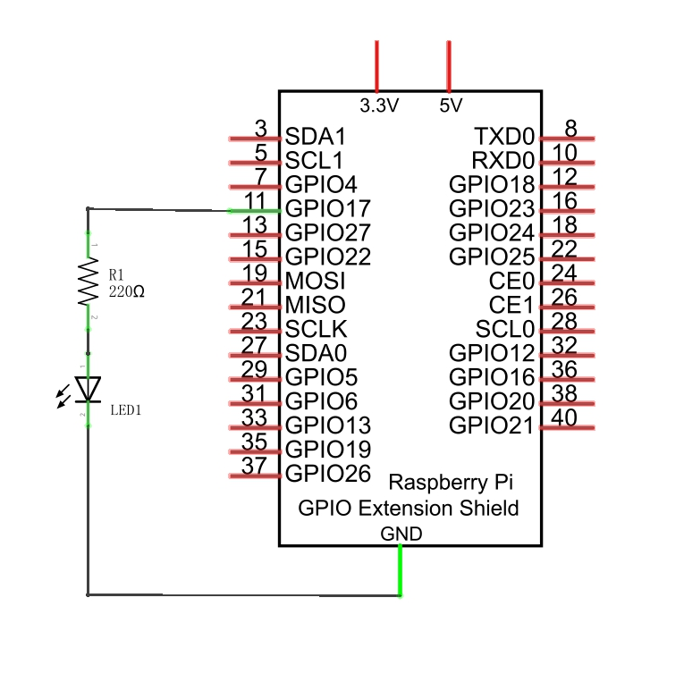
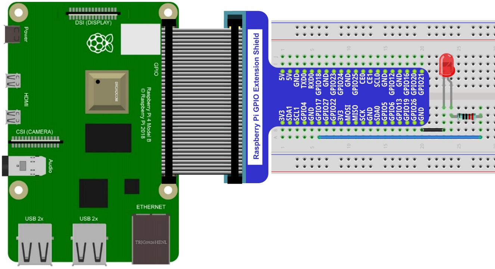
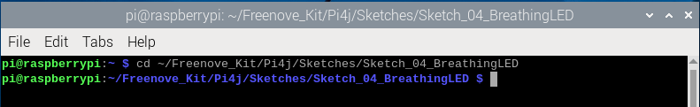
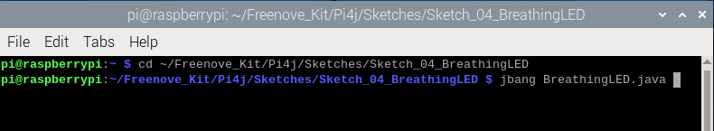
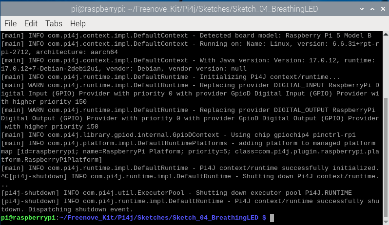
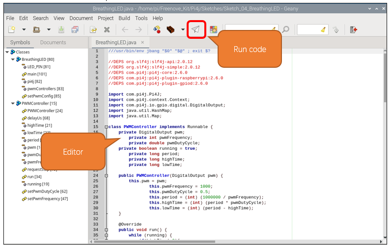

##############################################################################
Chapter Analog & PWM
##############################################################################

In previous chapters, we learned that a Push Button Switch has two states: Pressed (ON) and Released (OFF), and an LED has a Light ON and OFF state. Is there a middle or intermediated state? We will next learn how to create an intermediate output state to achieve a partially bright (dim) LED.

First, let us learn how to control the brightness of an LED.

Project Breathing LED
****************************************************************

We describe this project as a Breathing Light. This means that an LED that is OFF will then turn ON gradually and then gradually turn OFF like "breathing". Okay, so how do we control the brightness of an LED to create a Breathing Light? We will use PWM to achieve this goal.

Component List
================================================================

+-------------------------------------------------+-------------------------------------------------+
|1. Raspberry Pi (with 40 GPIO) x1                |                                                 |     
|                                                 |   Jumper Wires x2                               |       
|2. GPIO Extension Board & Ribbon Cable x1        |                                                 |       
|                                                 |     |jumper-wire|                               |                                                            
|3. Breadboard x1                                 |                                                 |                                                                 
+-------------------------------------------------+-------------------------------------------------+
|  LED x1                                         |   Resistor 220Ω x 1                             |
|                                                 |                                                 |
|   |LED|                                         |    |res-220R-hori|                              |
+-------------------------------------------------+-------------------------------------------------+

.. |jumper-wire| image:: ../_static/imgs/jumper-wire.png
.. |res-220R-hori| image:: ../_static/imgs/res-220R-hori.png
    :width: 60%
.. |LED| image:: ../_static/imgs/red-led.png
    :width: 20%

Component Knowledge
================================================================

Analog & Digital
----------------------------------------------------------------

An Analog Signal is a continuous signal in both time and value. On the contrary, a Digital Signal **or discrete-time signal is a time series consisting of a sequence of quantities** . Most signals in life are analog signals. A familiar example of an Analog Signal would be how the temperature throughout the day is continuously changing and could not suddenly change instantaneously from 0℃ to 10℃. However, Digital Signals can instantaneously change in value. This change is expressed in numbers as 1 and 0 (the basis of binary code). Their differences can more easily be seen when compared when graphed as below.

.. image:: ../_static/imgs/analog-digital.png
        :width: 100%

Note that the Analog signals are curved waves and the Digital signals are “Square Waves”. 

In practical applications, we often use binary as the digital signal, that is a series of 0's and 1's. Since a binary signal only has two values (0 or 1) it has great stability and reliability. Lastly, both analog and digital signals can be converted into the other.

PWM
----------------------------------------------------------------

PWM, Pulse-Width Modulation, is a very effective method for using digital signals to control analog circuits. Digital processors cannot directly output analog signals. PWM technology makes it very convenient to achieve this conversion (translation of digital to analog signals).

PWM technology uses digital pins to send certain frequencies of square waves, that is, the output of high levels and low levels, which alternately last for a while. The total time for each set of high levels and low levels is generally fixed, which is called the period (Note: the reciprocal of the period is frequency). The time of high level outputs are generally called “pulse width”, and the duty cycle is the percentage of the ratio of pulse duration, or pulse width (PW) to the total period (T) of the waveform. The longer the output of high levels last, the longer the duty cycle and the higher the corresponding voltage in the analog signal will be. The following figures show how the analog signal voltages vary between 0V-5V (high level is 5V) corresponding to the pulse width 0%-100%:

.. image:: ../_static/imgs/duty-cycle.png
        :width: 100%

The longer the PWM duty cycle is, the higher the output power will be. Now that we understand this relationship, we can use PWM to control the brightness of an LED or the speed of DC motor and so on.

It is evident, from the above, that PWM is not actually analog but the effective value of voltage is equivalent to the corresponding analog value. Therefore, by using PWM, we can control the output power of to an LED and control other devices and modules to achieve multiple effects and actions.

In RPi, GPIO18 pin has the ability to output to hardware via PWM with a 10-bit accuracy. This means that 100% of the pulse width can be divided into 210=1024 equal parts.

The wiringPi library of C provides both a hardware PWM and a software PWM method.

The hardware PWM only needs to be configured, does not require CPU resources and is more precise in time control. The software PWM requires the CPU to work continuously by using code to output high level and low level. This part of the code is carried out by multi-threading, and the accuracy is relatively not high enough. 

In order to keep the results running consistently, we will use PWM.

Circuit
================================================================

+------------------------------------------------------------------------------------------------+
|   Schematic diagram                                                                            |
|                                                                                                |
|   |java_pwm_Sc|                                                                                |
+------------------------------------------------------------------------------------------------+
|   Hardware connection. If you need any support,please feel free to contact us via:             |
|                                                                                                |
|   support@freenove.com                                                                         | 
|                                                                                                |
|   |java_pwm_Fr|                                                                                |
+------------------------------------------------------------------------------------------------+

Sketch
================================================================

In this chapter, we will learn how to make the LED to present a breathing effect.

Sketch_04_BreathingLED
----------------------------------------------------------------

First, enter where the project is located:

.. code-block:: console

    $ cd ~/Freenove_Kit/Pi4j/Sketches/Sketch_04_BreathingLED

You can enter the command to run the code.

.. code-block:: console

    $ jbang BreathingLED.java

When the code is running, you can see the LED lights up from dim to bright and then from bright to dim, and the process repeats.

Press Ctrl-C to exit the code.

You can open the code with Geany to view and edit it.

.. code-block:: console

    $ geany BreathingLED.java

Click the icon to run the code.

If the code fails to run, please check :ref:`Geany Configuration<Geany_Configuration>`.

The following is program code:

.. literalinclude:: ../../../freenove_Kit/Pi4j/Sketches/Sketch_04_BreathingLED/BreathingLED.java
    :linenos: 
    :language: java
    :dedent:

Use JBange to run the script and automatically process the declared dependencies.

.. literalinclude:: ../../../freenove_Kit/Pi4j/Sketches/Sketch_04_BreathingLED/BreathingLED.java
    :linenos: 
    :language: java
    :lines: 1-7
    :dedent:

Import Pi4J library, context management, digital output interface, HashMap class, and Map interface.

.. literalinclude:: ../../../freenove_Kit/Pi4j/Sketches/Sketch_04_BreathingLED/BreathingLED.java
    :linenos: 
    :language: java
    :lines: 9-13
    :dedent:

Pi4j only has 4 hardware PWM pins, and the use of these pins is greatly limited, so we use software PWM to control the LED. Although software PWM is not as precise as hardware PWM, it can be applied to any GPIO.

To implement software PWM, we have written a PWMController class to control the GPIO output of PWM. Since PWMController implements the Runnable interface, it can be used to create a Thread object, passing an instance of PWMController as the target to the Thread constructor, and then starting this thread. In this way, the run method of PWMController will be executed in a new thread, allowing it to perform PWM control tasks concurrently.

.. code-block:: python
    :linenos:

	class PWMController implements Runnable {  
        ......
    }

Define variables to configure PWM's parameters.

.. literalinclude:: ../../../freenove_Kit/Pi4j/Sketches/Sketch_04_BreathingLED/BreathingLED.java
    :linenos: 
    :language: java
    :lines: 16-22
    :dedent:

Constructor, to initialize various parameters of the PWM controller.

.. literalinclude:: ../../../freenove_Kit/Pi4j/Sketches/Sketch_04_BreathingLED/BreathingLED.java
    :linenos: 
    :language: java
    :lines: 24-31
    :dedent:

This is a simple delay method in microsecond.

.. literalinclude:: ../../../freenove_Kit/Pi4j/Sketches/Sketch_04_BreathingLED/BreathingLED.java
    :linenos: 
    :language: java
    :lines: 68-73
    :dedent:

The functions to set PWM frenqunency.

.. literalinclude:: ../../../freenove_Kit/Pi4j/Sketches/Sketch_04_BreathingLED/BreathingLED.java
    :linenos: 
    :language: java
    :lines: 47-60
    :dedent:

The functions to set PWM duty cycle.

.. literalinclude:: ../../../freenove_Kit/Pi4j/Sketches/Sketch_04_BreathingLED/BreathingLED.java
    :linenos: 
    :language: java
    :lines: 62-66
    :dedent:
    
@Override means that the run method overrides the method in the parent class or implements the interface. 

This method allows the pin to output PWM signals.

.. literalinclude:: ../../../freenove_Kit/Pi4j/Sketches/Sketch_04_BreathingLED/BreathingLED.java
    :linenos: 
    :language: java
    :lines: 33-45
    :dedent:
    
Request to stop the PWM controller. The PWMController class is used in the thread. When running is false, exit the thread.

.. literalinclude:: ../../../freenove_Kit/Pi4j/Sketches/Sketch_04_BreathingLED/BreathingLED.java
    :linenos: 
    :language: java
    :lines: 75-77
    :dedent:

Define the pins that control PWM and create an integer Map variable pwmControllers to store the mapping of PWMController objects.

.. literalinclude:: ../../../freenove_Kit/Pi4j/Sketches/Sketch_04_BreathingLED/BreathingLED.java
    :linenos: 
    :language: java
    :lines: 81-83
    :dedent:

The PWM configuration function only needs to fill in the GPIO number in the parameter. The code will automatically apply for a PWMController object and create a corresponding thread to run it. At the same time, the PWMController is stored in pwmControllers and then the thread is started.

.. code-block:: c
    :linenos:

    public static void setPwmConfig(int pin) throws Exception {  
        DigitalOutput led = pi4j.dout().create(pin);  
        PWMController pwmController = new PWMController(led);  
        Thread pwmThread = new Thread(pwmController, "PWM LED Controller " + pin);  
        pwmControllers.put(pin, pwmController);  
        pwmThread.start();  
        ......
    }

Add JVM shutdown hook to ensure PWM controller is stopped on JVM shutdown.

.. literalinclude:: ../../../freenove_Kit/Pi4j/Sketches/Sketch_04_BreathingLED/BreathingLED.java
    :linenos: 
    :language: java
    :lines: 91-99
    :dedent:

The main program, which is used to test the effect of making the LED breathe.

.. code-block:: c
    :linenos:

    public static void main(String[] args) throws Exception {  
        ......
    }  

Configure PWM and associate it with pin.

.. code-block:: c

    setPwmConfig(LED_PIN);  

Obtain PWM controller corresponding to the pin.

.. code-block:: c

    PWMController BreathingLed = pwmControllers.get(LED_PIN);  

The duty cycle value is changed every 10 milliseconds, so that the LED cycles from dark to bright and then from bright to dark.

.. literalinclude:: ../../../freenove_Kit/Pi4j/Sketches/Sketch_04_BreathingLED/BreathingLED.java
    :linenos: 
    :language: java
    :lines: 104-118
    :dedent:

When exiting the main loop, first close all PWM controller threads and then close the pi4j context.

.. literalinclude:: ../../../freenove_Kit/Pi4j/Sketches/Sketch_04_BreathingLED/BreathingLED.java
    :linenos: 
    :language: java
    :lines: 119-124
    :dedent: