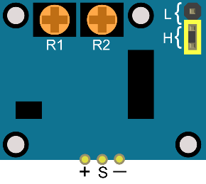
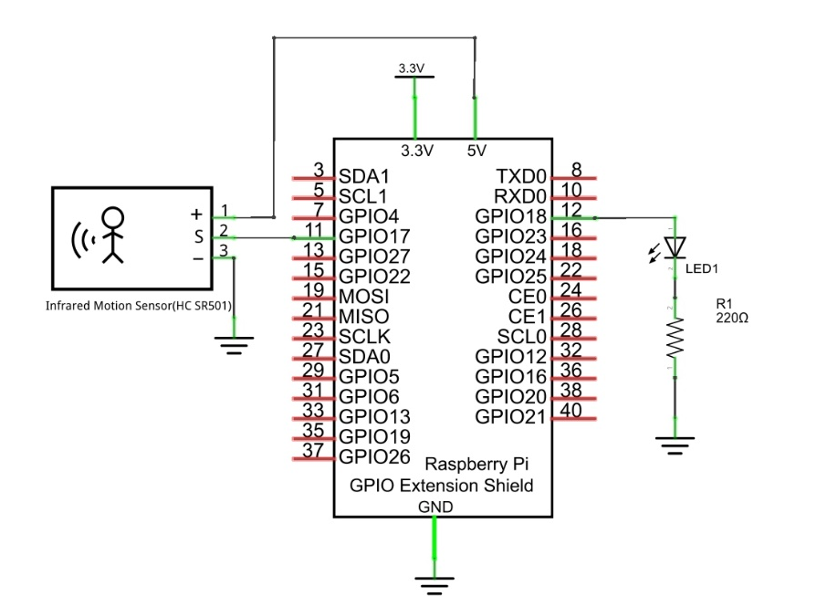
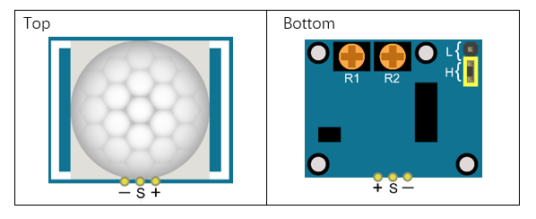
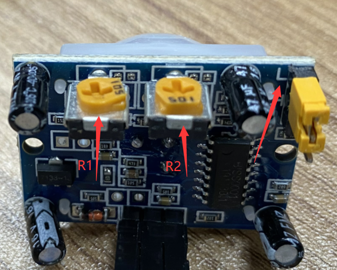
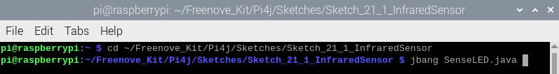
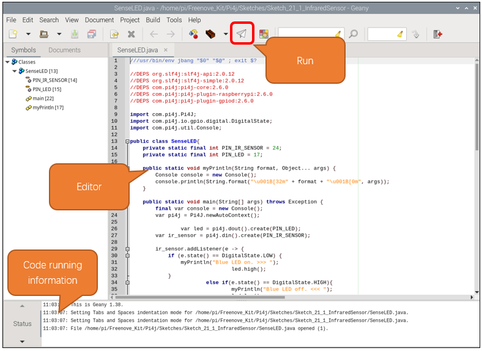

##############################################################################
Chapter Infrared Motion Sensor
##############################################################################

In this chapter, we will learn a widely used sensor, Infrared Motion Sensor. 

Project PIR Infrared Motion Detector with LED Indicator
****************************************************************

In this project, we will make a Motion Detector, with the human body infrared pyroelectric sensors.

When someone is in close proximity to the Motion Detector, it will automatically light up and when there is no one close by, it will be out.

This Infrared Motion Sensor can detect the infrared spectrum (heat signatures) emitted by living humans and animals.

Component List
================================================================

+-------------------------------------------------+-------------------------------------------------+
|1. Raspberry Pi (with 40 GPIO) x1                |                                                 |     
|                                                 |   Jumper Wires x5                               |       
|2. GPIO Extension Board & Ribbon Cable x1        |                                                 |       
|                                                 |     |jumper-wire|                               |                                                            
|3. Breadboard x1                                 |                                                 |                                                                 
+-----------------------------+-------------------+--------------+----------------------------------+
| HC SR501 x1                 | LED x1                           | Resistor 220Ω x1                 |
|                             |                                  |                                  |
|  |HC_SR501|                 |  |red-led|                       |  |res-220R|                      |
+-----------------------------+----------------------------------+----------------------------------+

.. |jumper-wire| image:: ../_static/imgs/jumper-wire.png
.. |red-led| image:: ../_static/imgs/red-led.png
    :width: 40%
.. |HC_SR501| image:: ../_static/imgs/HC_SR501.png
    :width: 70%
.. |res-220R| image:: ../_static/imgs/res-220R.png
    :width: 20%

Component Knowledge
================================================================

==============  ======================  ==========================

|HC_SR501|        |HC_SR501_bottom|       |HC_SR501_Schematic|

==============  ======================  ==========================

.. |HC_SR501| image:: ../_static/imgs/HC_SR501.png

.. |HC_SR501_Schematic| image:: ../_static/imgs/HC_SR501_Schematic.png

Description: 

1.	Working voltage: 5v-20v(DC) Static current: 65uA.

2.	Automatic Trigger. When a living body enters into the active area of sensor, the module will output high level (3.3V). When the body leaves the sensor’s active detection area, it will output high level lasting for time period T, then output low level(0V). Delay time T can be adjusted by the potentiometer R1.

3.	Induction block time: the induction will stay in block condition and does not induce external signal at lesser time intervals (less than delay time) after outputting high level or low level 

4.	Initialization time: the module needs about 1 minute to initialize after being powered ON. During this period, it will alternately output high or low level. 

5.	One characteristic of this sensor is when a body moves close to or moves away from the sensor's dome edge, the sensor will work at high sensitively. When a body moves close to or moves away from the sensor’s dome in a vertical direction (perpendicular to the dome), the sensor cannot detect well (please take note of this deficiency). Actually this makes sense when you consider that this sensor is usually placed on a celling as part of a security product. Note: The Sensing Range (distance before a body is detected) is adjusted by the potentiometer.

We can regard this sensor as a simple inductive switch when in use.

Circuit
================================================================

.. table:: 
    :width: 100%
    :class: product-table

+-------------------------------------------------------------------------------------------------+
|   Schematic diagram                                                                             |
|                                                                                                 |
|   |HC_SR501_Sc|                                                                                 |
+-------------------------------------------------------------------------------------------------+
|   Hardware connection. If you need any support,please feel free to contact us via:              |
|                                                                                                 |
|   support@freenove.com                                                                          |
|                                                                                                 |
|   |HC_SR501_Fr|                                                                                 |
|                                                                                                 |
| :xx-large:`How to use this sensor?`                                                             |
|                                                                                                 |
|   |HC_SR501_T_B|                                                                                |
| Description:                                                                                    |
|                                                                                                 |
| 1. You can choose non-repeatable trigger modes or repeatable modes.                             |
|                                                                                                 |
|   L: non-repeatable trigger mode. The module output high level after sensing a body, then when  |
|   the delay                                                                                     | 
|                                                                                                 |   
|   time is over, the module will output low level. During high level time, the sensor            |
|   no longer actively                                                                            |
|                                                                                                 |
|   senses bodies.                                                                                |
|                                                                                                 |    
|   H: repeatable trigger mode. The distinction from the L                                        |
|   mode is that it can sense a body until that body                                              |
|                                                                                                 |
|   leaves. After this, it starts to time and                                                     |
|   output low level after delaying T time.                                                       |
|                                                                                                 |
| 2. R1 is used to adjust HIGH level lasting time when sensor detects human motion, 1.2s\-320s.   |
|                                                                                                 |
| 3. R2 is used to adjust the maxmum distance the sensor can detect, 3~5m.                        |
|                                                                                                 |
| :red:`Here we connect L and adjust R1 and R2 like below to do this project.`                    |
|                                                                                                 |
| :red:`Put you hand close and away from the sensor slowly. Obsever the LED in previous circuit.` |
|                                                                                                 |
| :red:`It need some time between two detections.`                                                |
|                                                                                                 |
| |HC_SR501_1|                                                                                    |
+-------------------------------------------------------------------------------------------------+

.. |HC_SR501_Fr| image:: ../_static/imgs/HC_SR501_Fr.png

Sketch
================================================================

In this section, we will utilize an infrared motion sensor to control an LED, where the sensor will function as a motion-activated switch. The code is quite analogous to our previous project "Push Button Switch and LED." However, unlike the button which outputs a low signal when pressed, the infrared motion sensor outputs a high signal upon detecting motion. Consequently, when the sensor outputs a high level, the LED will illuminate or turn off.

Sketch_21_1_InfraredSensor
----------------------------------------------------------------

First, enter where the project is located:

.. code-block:: console

    $ cd ~/Freenove_Kit/Pi4j/Sketches/Sketch_21_1_InfraredSensor

.. image:: ../_static/imgs/java_infrared.png
    :align: center

Enter the command to run the code.

.. code-block:: console

    $ jbang SenseLED.java

Once the code is running, you can observe whether the LED turns on or off by moving away from or closer to the infrared motion sensor.

The terminal will continuously display the LED status, as shown below:

.. image:: ../_static/imgs/java_infrared_exit.png
    :align: center

Press Ctrl+C to exit the program.

You can run the following command to open the code with Geany to view and edit it.

.. code-block:: console

    $ geany SenseLED.java

Click the icon to run the code.

If the code fails to run, please check :doc:`Geany Configuration`.

The following is program code:

.. literalinclude:: ../../../freenove_Kit/Pi4j/Sketches/Sketch_21_1_InfraredSensor/SenseLED.java
    :linenos: 
    :language: java
