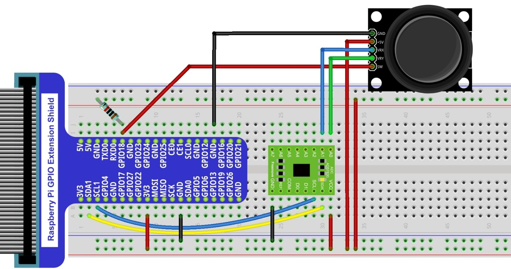
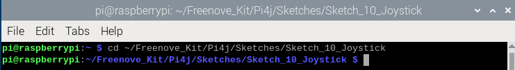
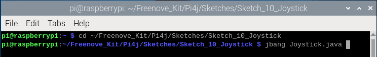
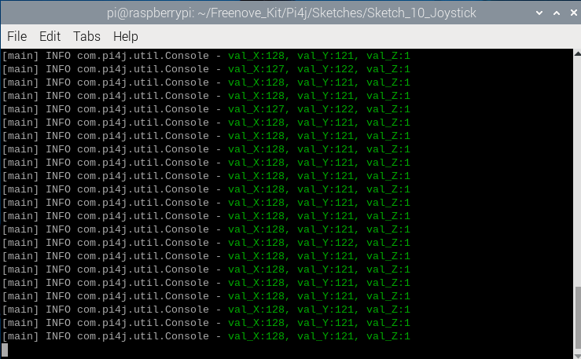
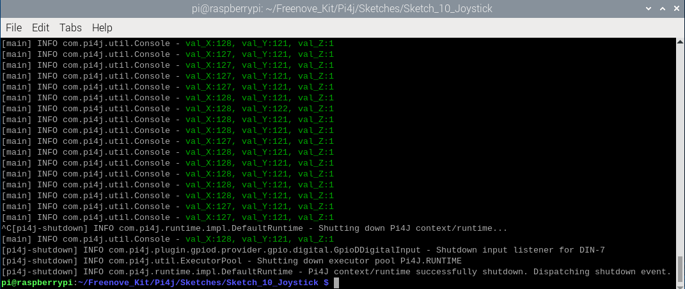
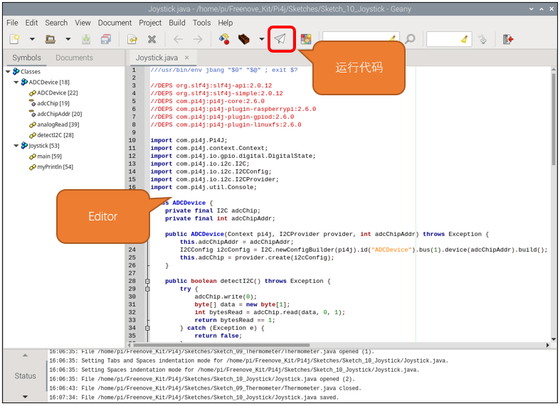

##############################################################################
Chapter Joystick
##############################################################################

In an earlier chapter, we learned how to use Rotary Potentiometer. We will now learn about joysticks, which are electronic modules that work on the same principle as the Rotary Potentiometer.

Project Joystick
****************************************************************

In this project, we will read the output data of a joystick and display it to the Terminal screen.

Component List
================================================================

+---------------------------------------------------------------+
|1. Raspberry Pi x1                                             |
|                                                               |
|2. GPIO Extension Board & Ribbon Cable x1                      |
|                                                               |
|3. Breadboard x1                                               |
+===============================+===============================+
| Joystick  x1                  |   Resistor 10kΩ x3            |
|                               |                               |
| |joystick|                    |  |Resistor-10kΩ|              |
+-------------------------------+-------------------------------+
| ADC module x1                                                 |
|                                                               |
|  |ADC-module-2|                                               |
|                                                               |
+---------------------------------------------------------------+
|   Jumper x18                                                  |
|                                                               |
|    |jumper-wire|                                              |
+---------------------------------------------------------------+

.. |jumper-wire| image:: ../_static/imgs/jumper-wire.png
.. |Resistor-10kΩ| image:: ../_static/imgs/Resistor-10kΩ.png
.. |joystick| image:: ../_static/imgs/joystick.png
.. |ADC-module-1| image:: ../_static/imgs/ADC-module-1.png
.. |ADC-module-2| image:: ../_static/imgs/ADC-module-2.png

Component knowledge
================================================================

Joystick
----------------------------------------------------------------

A Joystick is a kind of input sensor used with your fingers. You should be familiar with this concept already as they are widely used in gamepads and remote controls. It can receive input on two axes (Y and or X) at the same time (usually used to control direction on a two dimensional plane). And it also has a third direction capability by pressing down (Z axis/direction).

.. image:: ../_static/imgs/joystick-2.png
        :width: 70%
        :align: center

This is accomplished by incorporating two rotary potentiometers inside the Joystick Module at 90 degrees of each other, placed in such a manner as to detect shifts in direction in two directions simultaneously and with a Push Button Switch in the “vertical” axis, which can detect when a User presses on the Joystick.

.. image:: ../_static/imgs/joystick-fritizing.png
        :width: 70%
        :align: center

When the Joystick data is read, there are some differences between the axes: data of X and Y axes is analog, which needs to use the ADC. The data of the Z axis is digital, so you can directly use the GPIO to read this data or you have the option to use the ADC to read this.

Circuit
================================================================

+------------------------------------------------------------------------------------------------+
|   Schematic diagram                                                                            |
|                                                                                                |
|   |ADS7830-Schematic-6|                                                                        |
+------------------------------------------------------------------------------------------------+
|   Hardware connection. If you need any support,please feel free to contact us via:             |
|                                                                                                |
|   support@freenove.com                                                                         |
|                                                                                                |
|   |ADS7830-fritizing-7|                                                                        |
+------------------------------------------------------------------------------------------------+

.. |ADS7830-Schematic-6| image:: ../_static/imgs/ADS7830-Schematic-6.png

Sketch
================================================================

In this project, we will learn the usage of joystick.

Sketch_10_Joystick
----------------------------------------------------------------

First, enter where the project is located:

.. code-block:: console
    
    $ cd ~/Freenove_Kit/Pi4j/Sketches/Sketch_10_Joystick

You can enter the command to run the code.

.. code-block:: console
    
    $ jbang Joystick.java

After running the code, the Raspberry Pi will obtain the ADC values of the X-axis and Y-axis of the joystick sensor, as well as the value of the Z-axis, and print them out in the terminal.

Press Ctrl+C to exit the program.

    
You can open the code with Geany to view and edit it.

.. code-block:: console
    
    $ geany Joystick.java

Click the icon to run the code.

If the code fails to run, please check :doc:`Geany Configuration`.

The following is program code:

.. literalinclude:: ../../../freenove_Kit/Pi4j/Sketches/Sketch_10_Joystick/Joystick.java
    :linenos: 
    :language: java

Configure the Raspberry Pi's I2C to obtain the ADC values of the x-axis and y-axis of the joystick sensor, and configure the Z-axis to be associated with GPIO7 of the Raspberry Pi.

.. literalinclude:: ../../../freenove_Kit/Pi4j/Sketches/Sketch_10_Joystick/Joystick.java
    :linenos: 
    :language: java
    :lines: 60-72

The joystick sensor is associated with channel 5 and channel 6 of ADS7830, and its data is acquired every 100 milliseconds and the collected values are printed on the terminal.

.. literalinclude:: ../../../freenove_Kit/Pi4j/Sketches/Sketch_10_Joystick/Joystick.java
    :linenos: 
    :language: java
    :lines: 80-89

