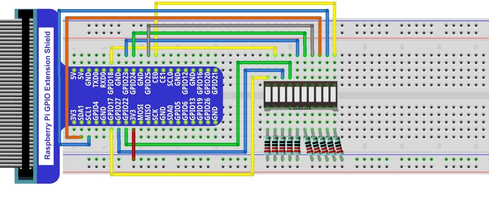

##############################################################################
Chapter Flowing Light
##############################################################################

We have learned how to control one LED to blink. Next, we will learn how to control a number of LEDs

Project Flowing Water Light
****************************************************************

In this project, we use a number of LEDs to make a flowing water light.

Component List
================================================================

+--------------------------------------------------+---------------------------------------------------+
|1. Raspberry Pi (with 40 GPIO) x1                 |                                                   |
|                                                  | Jumper Wires x6                                   |
|2. GPIO Extension Board & Ribbon Cable x1         |                                                   |
|                                                  |  |jumper-wire|                                    |
|3. Breadboard x1                                  |                                                   |
+--------------------------------------------------+---------------------------------------------------+
|  Bar Graph LED x1                                | Resistor 220Ω x10                                 |
|                                                  |                                                   |
|   |LED-BAR|                                      |  |res-220R-hori|                                  |
+--------------------------------------------------+---------------------------------------------------+

.. |jumper-wire| image:: ../_static/imgs/jumper-wire.png
.. |LED-BAR| image:: ../_static/imgs/LED-BAR.png
    :width: 60%
.. |res-220R-hori| image:: ../_static/imgs/res-220R-hori.png
    :width: 60%

Component knowledge
================================================================
Let us learn about the basic features of these components to use and understand them better.

Bar Graph LED
----------------------------------------------------------------
A Bar Graph LED has 10 LEDs integrated into one compact component. The two rows of pins at its bottom are paired to identify each LED like the single LED used earlier. 

.. image:: ../_static/imgs/LED_BAR_NUM.png
        :align: center

Circuit
================================================================
A reference system of labels is used in the circuit diagram below. Pins with the same network label are connected together.

Schematic diagram             

.. image:: ../_static/imgs/LED-Graph-Sch.png                                                                
        :width: 100% 
                   

Hardware connection. If you need any support, please feel free to contact us via: support@freenove.com

.. note:: 
        :red:`If LEDbar doesn't work, rotate LEDbar 180° to try. The label is random.`

In this circuit, the cathodes of the LEDs are connected to the GPIO, which is different from the previous circuit. The LEDs turn ON when the GPIO output is low level in the program. 

Sketch
================================================================

In this chapter, we will introduce how to control multiple LEDs with various GPIOs, and make the LEDs present a flowing effect.

Sketch_02_FlowingLight
----------------------------------------------------------------

First, enter where the project is located:

.. code-block:: console

    $ cd ~/Freenove_Kit/Pi4j/Sketches/Sketch_02_FlowingLight

Enter the command to run the code.

.. code-block:: console

    $ jbang FlowingLight.java

When the code is running, you can see the LedBar lights up in a flowing effect.

On the Raspberry Pi Terminal, you can see messages printed.

.. image:: ../_static/imgs/java_flow_mes.png
    :align: center

Press CTRL+C to exit the code.

You can view and edit the code with Geany by running the following command.

.. code-block:: console

    $ geany FlowingLight.java

Click the icon to run the code.

If the code fails to run, please check :doc:`Geany Configuration`.

The following is program code:

.. literalinclude:: ../../../freenove_Kit/Pi4j/Sketches/Sketch_02_FlowingLight/FlowingLight.java
    :linenos: 
    :language: java

Import the classes of Pi4J library for GPIO control and simple console output.

.. literalinclude:: ../../../freenove_Kit/Pi4j/Sketches/Sketch_02_FlowingLight/FlowingLight.java
    :linenos: 
    :language: java
    :lines: 9-11

Define an array that includes the GPIO numbers connecting to LEDs.

.. literalinclude:: ../../../freenove_Kit/Pi4j/Sketches/Sketch_02_FlowingLight/FlowingLight.java
    :linenos: 
    :language: java
    :lines: 14-15

Create a DigitalOutput array based on the GPIO array that controls the LEDs, and create a DigitalOutput instance for each pin.

.. literalinclude:: ../../../freenove_Kit/Pi4j/Sketches/Sketch_02_FlowingLight/FlowingLight.java
    :linenos: 
    :language: java
    :lines: 21-24

Iterate through all LEDs and turn them off (set to low level).

.. literalinclude:: ../../../freenove_Kit/Pi4j/Sketches/Sketch_02_FlowingLight/FlowingLight.java
    :linenos: 
    :language: java
    :lines: 30-32

Use 'currentLed' to record the position of the LED that is lit, recalculate the position of the lit LED every 100 milliseconds, and print a prompt message to the console. At the same time, turn off all LEDs except the LED at the position recorded by 'currentLed'.

.. literalinclude:: ../../../freenove_Kit/Pi4j/Sketches/Sketch_02_FlowingLight/FlowingLight.java
    :linenos: 
    :language: java
    :lines: 27-36
