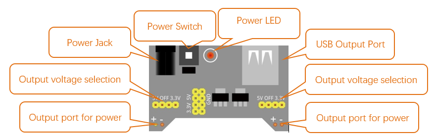
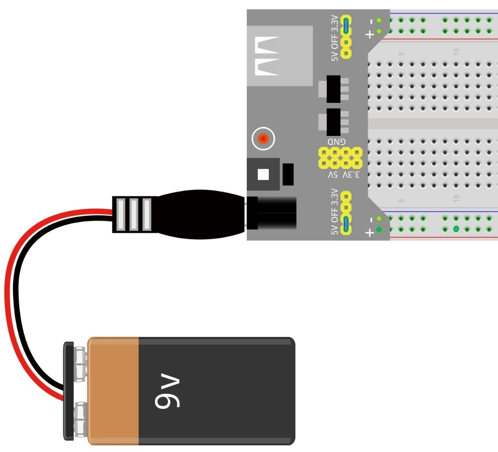

##############################################################################
Chapter Motor & Driver
##############################################################################

In this chapter, we will learn about DC Motors and DC Motor Drivers and how to control the speed and direction of a DC Motor.

Project 13.1 Control a DC Motor with a Potentiometer
****************************************************************

In this project, a potentiometer will be used to control a DC Motor. When the Potentiometer is at the midpoint position, the DC Motor will STOP, and when the Potentiometer is turned in either direction of this midpoint, the DC Motor speed increases until it reached the endpoint where the DC Motor achieves its maximum speed. When the Potentiometer is turned “Left” of the midpoint the DC Motor will ROTATE in one direction and when turned “Right” the DC Motor will ROTATE in the opposite direction. 

Component List
================================================================

Breadboard Power Module 

+-------------------------------------------------+-------------------------------------------------+
|1. Raspberry Pi (with 40 GPIO) x1                |                                                 |     
|                                                 |   Jumper Wires x23                              |       
|2. GPIO Extension Board & Ribbon Cable x1        |                                                 |       
|                                                 |     |jumper-wire|                               |                                                            
|3. Breadboard x1                                 |                                                 |                                                                 
+-------------------------------------------------+-------------------------------------------------+
| Breadboard Power Module x1                      | 9V Battery (you provide) & 9V Battery Cable     |
|                                                 |                                                 |
|  |power-module|                                 |  |Battery_cable|                                |                           
+-------------------------------------------------+-------------------------------------------------+
| ADC module x1                                   | L293D IC Chip                                   |
|                                                 |                                                 |
|  |ADC-module-2|                                 | |L2983_chip|                                    |
+-----------------------------+-------------------+--------------+----------------------------------+
| DC Motor x1                 | Rotary Potentiometer x1          | Resistor 10kΩ x2                 |
|                             |                                  |                                  |
|  |DC_Motor_Module|          |  |Rotary-potentiometer|          |  |Resistor-10kΩ|                 |
+-----------------------------+----------------------------------+----------------------------------+

.. |jumper-wire| image:: ../_static/imgs/jumper-wire.png
.. |Resistor-10kΩ| image:: ../_static/imgs/Resistor-10kΩ.png
    :width: 30%
.. |power-module| image:: ../_static/imgs/power-module.png
    :width: 60%
.. |ADC-module-1| image:: ../_static/imgs/ADC-module-1.png
    :width: 30%
.. |ADC-module-2| image:: ../_static/imgs/ADC-module-2.png
    :width: 30%
.. |Battery_cable| image:: ../_static/imgs/Battery_cable.png
.. |Rotary-potentiometer| image:: ../_static/imgs/Rotary-potentiometer.png
    :width: 70%
.. |L2983_chip| image:: ../_static/imgs/L2983_chip.png
    :width: 40%

Component knowledge
================================================================

Breadboard Power Module 
----------------------------------------------------------------

Breadboard Power Module is an independent circuit board, which can provide independent 5V or 3.3V power to the breadboard when building circuits. It also has built-in power protection to avoid damaging your RPi module. The schematic diagram below identifies the important features of this Power Module:

Here is an acceptable connection between Breadboard Power Module and Breadboard using a 9V battery and the provided power harness:

DC Motor
----------------------------------------------------------------

DC Motor is a device that converts electrical energy into mechanical energy. DC Motors consist of two major parts, a Stator and the Rotor. The stationary part of a DC Motor is the Stator and the part that Rotates is the Rotor. The Stator is usually part of the outer case of motor (if it is simply a pair of permanent magnets), and it has terminals to connect to the power if it is made up of electromagnet coils. Most Hobby DC Motors only use Permanent Magnets for the Stator Field. The Rotor is usually the shaft of motor with 3 or more electromagnets connected to a commutator where the brushes (via the terminals 1 & 2 below) supply electrical power, which can drive other mechanical devices. The diagram below shows a small DC Motor with two terminal pins.

.. image:: ../_static/imgs/DC-Motor.png
    :align: center

When a DC Motor is connected to a power supply, it will rotate in one direction. If you reverse the polarity of the power supply, the DC Motor will rotate in opposite direction. This is important to note.

.. image:: ../_static/imgs/DC-Motor-1.png
    :align: center

L293D
----------------------------------------------------------------

L293D is an IC Chip (Integrated Circuit Chip) with a 4-channel motor drive. You can drive a Unidirectional DC Motor with 4 ports or a Bi-Directional DC Motor with 2 ports or a Stepper Motor (Stepper Motors are covered later in this Tutorial).

Port description of L293D module is as follows:

+----------+--------------+------------------------------------------------------------------+
| Pin name | Pin number   |                    Description                                   |   
+==========+==============+==================================================================+
| In x     | 2, 7, 10, 15 | Channel x digital signal input pin                               |                   
+----------+--------------+------------------------------------------------------------------+                                                  
|          |              | Channel x output pin, input high or low level                    |
| Out x    | 3, 6, 11, 14 |                                                                  |
|          |              | according to In x pin, getsconnected to +Vmotor or 0V            |                                      
+----------+--------------+------------------------------------------------------------------+
| Enable1  | 1            | Channel 1 and Channel 2 enable pin, high level enable            |                                     
+----------+--------------+------------------------------------------------------------------+                                                   
| Enable2  | 9            | Channel 3 and Channel 4 enable pin, high level enable            |                                     
+----------+--------------+------------------------------------------------------------------+
| 0V       | 4, 5, 12, 13 | Power Cathode (GND)                                              | 
+----------+--------------+------------------------------------------------------------------+
| +V       | 16           | Positive Electrode (VCC) of power supply, supply voltage 4.5~36V |
+----------+--------------+------------------------------------------------------------------+                                                  
|          |              | Positive Electrode of load power supply, provide power           |
| +Vmotor  | 8            |                                                                  |
|          |              | supply for the Out pin x, the supply voltage is +V~36V           |                                      
+----------+--------------+------------------------------------------------------------------+ 

.. seealso::
    
    For more details, please see the datasheet for this IC Chip.

When using the L293D to drive a DC Motor, there are usually two connection options.

The following connection option uses one channel of the L239D, which can control motor speed through the PWM, However the motor then can only rotate in one direction.

The following connection uses two channels of the L239D: one channel outputs the PWM wave, and the other channel connects to GND. Therefore, you can control the speed of the motor. When these two channel signals are exchanged, not only controls the speed of motor, but also can control the direction of the motor.

In practical use the motor is usually connected to channel 1 and by outputting different levels to in1 and in2 to control the rotational direction of the motor, and output to the PWM wave to Enable1 port to control the motor's rotational speed. If the motor is connected to channel 3 and 4 by outputting different levels to in3 and in4 to control the motor's rotation direction, and output to the PWM wave to Enable2 pin to control the motor's rotational speed.

Circuit
================================================================

Use caution when connecting this circuit because the DC Motor is a high-power component. :red:`Do not use the power provided by the RPi to power the motor directly, as this may cause permanent damage to your RPi!`` The logic circuit can be powered by the RPi's power or an external power supply, which should share a common ground with RPi.

+------------------------------------------------------------------------------------------------+
|   Schematic diagram                                                                            |
|                                                                                                |
|   |Motor-ADS7830-Sc|                                                                           |
+------------------------------------------------------------------------------------------------+
|   Hardware connection. If you need any support,please feel free to contact us via:             |
|                                                                                                |
|   support@freenove.com                                                                         |
|                                                                                                |
|   |Motor-ADS7830-Fr|                                                                           |
+------------------------------------------------------------------------------------------------+

Sketch
================================================================

In this chapter, we will learn how to use the potentiometer to control the rotation speed and direction of the DC motor.

Sketch_11_Motor
----------------------------------------------------------------

First, enter where the project is located:

.. code-block:: console
    
    $ cd ~/Freenove_Kit/Pi4j/Sketches/Sketch_11_Motor

Enter the command to run the code.

.. code-block:: console
    
    $ jbang Motor.java

When the code is running, Raspberry Pi will obtain the value of the potentiometer and control the direct of the motor accordingly.

Press Ctrl+C to exit the code.

You can run the following command to open the code with Geany to view and edit it.

.. code-block:: console
    
    $ geany Motor.java

Click the icon to run the code.

.. image:: ../_static/imgs/java_Motor_code.png
    :align: center

If the code fails to run, please check :doc:`Geany Configuration`.

The following is program code:

.. literalinclude:: ../../../freenove_Kit/Pi4j/Sketches/Sketch_11_Motor/Motor.java
    :linenos: 
    :language: java

The range of ADC value is 0-255, with 128 as the middle value. If the ADC value is greater than 128, the Raspberry Pi controls the motor to rotate forward. The larger the ADC value, the faster the motor speed. Conversely, if the ADC value is less than 128, the Raspberry Pi controls the motor to rotate backward. The smaller the ADC value, the faster the motor speed.

.. literalinclude:: ../../../freenove_Kit/Pi4j/Sketches/Sketch_11_Motor/Motor.java
    :linenos: 
    :language: java
    :lines: 150-171

The ADC value at the potentiometer is obtained every 100 milliseconds, and the ADC value is sent as a parameter to the motor function to control the direction and speed of the motor, and the ADC value is printed out in the terminal.

.. literalinclude:: ../../../freenove_Kit/Pi4j/Sketches/Sketch_11_Motor/Motor.java
    :linenos: 
    :language: java
    :lines: 182-187

