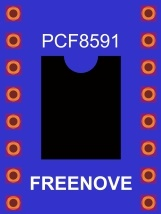

##############################################################################
Chapter Photoresistor & LED
##############################################################################

Earlier we learned how to use ADC and PWM. In this chapter, we learn to control the brightness of an LED by using a potentiometer.

Project Soft Light
****************************************************************

In this project, we will make a soft light. We will use an ADC Module to read ADC values of a potentiometer and map it to duty cycle ratio of the PWM used to control the brightness of an LED. Then you can change the brightness of an LED by adjusting the potentiometer.

Component List
================================================================

+---------------------------------------------------------------------------------+
|1. Raspberry Pi (with 40 GPIO) x1                                                |     
|                                                                                 |       
|2. GPIO Extension Board & Ribbon Cable x1                                        |       
|                                                                                 |                                                            
|3. Breadboard x1                                                                 |                                                                 
+=================================================+===============================+
| Rotary potentiometer x1                         |   Resistor 10kΩ x2            |
|                                                 |                               |
| |Rotary-potentiometer|                          |  |Resistor-10kΩ|              |                           
+-------------------------------------------------+-------------------------------+
| ADC module x1                                   |   LED x1                      |
|                                                 |                               |
| |ADC-module-2|                                  |   |red-led|                   |                   
|                                                 |                               |  
+-------------------------------------------------+-------------------------------+
|   Jumper Wire M/M x17                                                           |
|                                                                                 | 
|      |jumper-wire|                                                              |
+---------------------------------------------------------------------------------+

.. |jumper-wire| image:: ../_static/imgs/jumper-wire.png
    :width: 70%
.. |Resistor-10kΩ| image:: ../_static/imgs/Resistor-10kΩ.png
    :width: 20%
.. |Rotary-potentiometer| image:: ../_static/imgs/Rotary-potentiometer.png
    :width: 25%

.. |ADC-module-2| image:: ../_static/imgs/ADC-module-2.png
.. |red-led| image:: ../_static/imgs/red-led.png
    :width: 30%

Circuit with ADS7830
================================================================

+------------------------------------------------------------------------------------------------+
|   Schematic diagram                                                                            |
|                                                                                                |
|   |ADS7830-Schematic-2|                                                                        |
+------------------------------------------------------------------------------------------------+
|   Hardware connection. If you need any support,please feel free to contact us via:             |
|                                                                                                |
|   support@freenove.com                                                                         |
|                                                                                                |
|   |ADS7830-fritizing-2|                                                                        |
+------------------------------------------------------------------------------------------------+

Sketch
================================================================

In this project, we will change the brightness of the LED based on the light intensity received by the photoresistor.

Sketch_08_Nightlamp
----------------------------------------------------------------

First, enter where the project is located:

.. code-block:: console
    
    $ cd ~/Freenove_Kit/Pi4j/Sketches/Sketch_08_Nightlamp

Enter the command to run the code.

.. code-block:: console
    
    $ jbang Nightlamp.java

When the code is running, use light to illuminate the photosensitive module, or cover the photosensitive module with your hand, and you can observe that the brightness of the LED on the board changes accordingly.

On the terminal, you can see the ADC and voltage values of the photoresistor are printed.

Press Ctrl+C to exit the program.

You can open the code with Geany with the following command to view and edit it.

.. code-block:: console
    
    $ geany Nightlamp.java

Click the icon to run the code.

.. literalinclude:: ../../../freenove_Kit/Pi4j/Sketches/Sketch_08_Nightlamp/Nightlamp.java
    :linenos: 
    :language: java

The ADC value at the photosensor is obtained every 100 milliseconds, converted into a PWM duty cycle value for controlling the LED, and then a prompt message is printed on the terminal.

.. literalinclude:: ../../../freenove_Kit/Pi4j/Sketches/Sketch_08_Nightlamp/Nightlamp.java
    :linenos: 
    :language: java
    :lines: 158-168