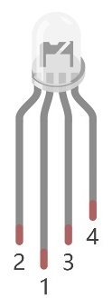

##############################################################################
Chapter RGB LED
##############################################################################

In this chapter, we will learn how to control a RGB LED.

An RGB LED has 3 LEDs integrated into one LED component. It can respectively emit Red, Green and Blue light. In order to do this, it requires 4 pins (this is also how you identify it). The long pin (1) is the common which is the Anode (+) or positive lead, the other 3 are the Cathodes (-) or negative leads. A rendering of a RGB LED and its electronic symbol are shown below. We can make RGB LED emit various colors of light and brightness by controlling the 3 Cathodes (2, 3 & 4) of the RGB LED

.. list-table::
   :widths: 50 50
   :align: center

   * - |RGB-LED-real|
     - |RGB-LED-sc|

.. |RGB-LED-sc| image:: ../_static/imgs/RGB-LED-sc.png
    :width: 70%

Red, Green, and Blue light are called 3 Primary Colors when discussing light (Note: for pigments such as paints, the 3 Primary Colors are Red, Blue and Yellow). When you combine these three Primary Colors of light with varied brightness, they can produce almost any color of visible light. Computer screens, single pixels of cell phone screens, neon lamps, etc. can all produce millions of colors due to phenomenon.

.. image:: ../_static/imgs/RGB.png
        :width: 50%
        :align: center

.. container:: centered
    
    RGB

If we use a three 8 bit PWM to control the RGB LED, in theory, we can create 28*28*28=16777216 (16 million) colors through different combinations of RGB light brightness.

Next, we will use RGB LED to make a multicolored LED. 

Project Multicolored LED
****************************************************************

Component List
================================================================
    
+------------------------------------------------------+------------------------------------------------------+
|    Raspberry Pi (with 40 GPIO) x1                    |        RGB LED x1                                    |
|                                                      |                                                      |   
|    GPIO Extension Board & Ribbon Cable x1            |       |RGB-LED-real|                                 |
|                                                      |                                                      |
|    Breadboard x1                                     |                                                      |
+------------------------------------------------------+------------------------------------------------------+
|                    Jumper Wire                       |                   Resistor 220Ω x3                   |
|                                                      |                                                      |
|   |jumper-wire|                                      |    |res-220R-hori|                                   |        
+------------------------------------------------------+------------------------------------------------------+

.. |jumper-wire| image:: ../_static/imgs/jumper-wire.png
.. |res-220R-hori| image:: ../_static/imgs/res-220R-hori.png

Circuit
================================================================

+------------------------------------------------------------------------------------------------+
|   Schematic diagram                                                                            |
|                                                                                                |
|   |RGB-LED-Scbematic|                                                                          |
+------------------------------------------------------------------------------------------------+
|   Hardware connection. If you need any support,please feel free to contact us via:             |
|                                                                                                |
|   support@freenove.com                                                                         | 
|                                                                                                |
|   |RGB-LED-fritizing|                                                                          |
+------------------------------------------------------------------------------------------------+

.. |RGB-LED-Scbematic| image:: ../_static/imgs/RGB-LED-Scbematic.png
    :width: 80%
.. |RGB-LED-fritizing| image:: ../_static/imgs/RGB-LED-fritizing.png

.. note:: 
    In this kit, the RGB led is Common anode. The voltage difference between LED will make it work. There is no visible GND. The GPIO ports can also receive current while in output mode.If circuit above doesn’t work, the RGB LED may be common cathode. Please try following wiring.There is no need to modify code for random color.

.. image:: ../_static/imgs/RGB-LED-fritizing2.png
    :width: 100%
    :align: center

Sketch
================================================================

In this chapter, we will control the RGB LED with 3 PWMs.

Sketch_05_RainbowLED
----------------------------------------------------------------

First, enter where the project is located:

.. code-block:: console

    $ cd ~/Freenove_Kit/Pi4j/Sketches/Sketch_05_RainbowLED

Enter the command to run the code.

.. code-block:: console

    $ jbang RainbowLED.java

When the code is running, the RGB LED randomly emits various colors.

.. image:: ../_static/imgs/RGB-LED-fritizing.png
    :align: center

Press Ctr+C to exit the program.

You can open the code with Geany to view and edit it, with the following command.

.. code-block:: console

    $ geany RainbowLED.java

Click the icon to run the code.

If the code fails to run, please check :doc:`Geany Configuration`.

The following is program code:

.. literalinclude:: ../../../freenove_Kit/Pi4j/Sketches/Sketch_05_RainbowLED/RainbowLED.java
    :linenos: 
    :language: java

Import Pi4j library, context management, digital output interface, HashMap class and Map interface, and random function library.

.. literalinclude:: ../../../freenove_Kit/Pi4j/Sketches/Sketch_05_RainbowLED/RainbowLED.java
    :linenos: 
    :language: java
    :lines: 9-15

Initialize the pins corresponding to the RGB lights and print a stack trace if an exception occurs.

.. literalinclude:: ../../../freenove_Kit/Pi4j/Sketches/Sketch_05_RainbowLED/RainbowLED.java
    :linenos: 
    :language: java
    :lines: 102-110

Configure the RGB colored lights and adjust the brightness of the LED by adjusting the duty cycle of PWM.

.. literalinclude:: ../../../freenove_Kit/Pi4j/Sketches/Sketch_05_RainbowLED/RainbowLED.java
    :linenos: 
    :language: java
    :lines: 112-121

Create a console instance, define an array of GPIO pins for LED connections, and create a random number generator instance.

.. literalinclude:: ../../../freenove_Kit/Pi4j/Sketches/Sketch_05_RainbowLED/RainbowLED.java
    :linenos: 
    :language: java
    :lines: 124-126

Initialize the array of GPIO pins connected to the LEDs, generate 3 new random numbers every 500 milliseconds as brightness values for the RGB lights, and print prompt messages on the console.

.. literalinclude:: ../../../freenove_Kit/Pi4j/Sketches/Sketch_05_RainbowLED/RainbowLED.java
    :linenos: 
    :language: java
    :lines: 128-138

At the end of the program, stop all PWM controllers and close the Pi4J context.

.. literalinclude:: ../../../freenove_Kit/Pi4j/Sketches/Sketch_05_RainbowLED/RainbowLED.java
    :linenos: 
    :language: java
    :lines: 139-144
   