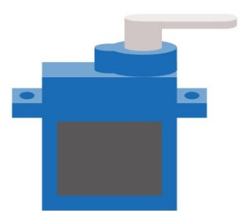
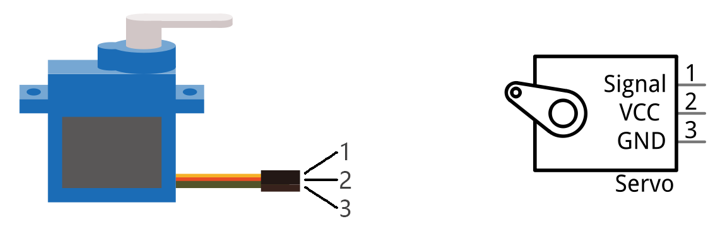
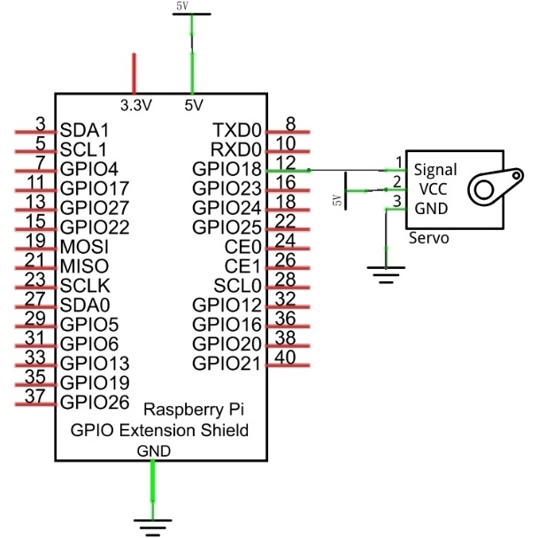
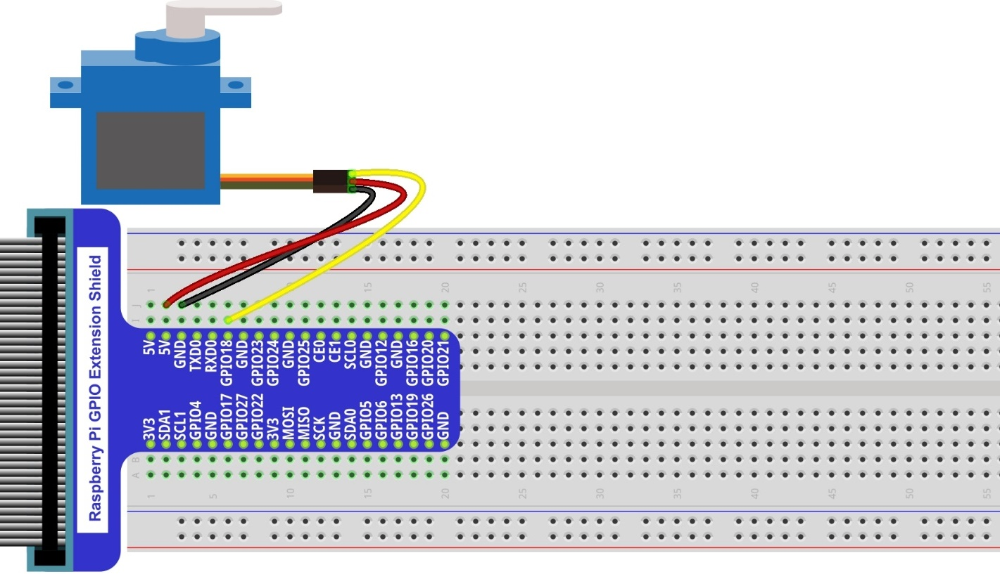
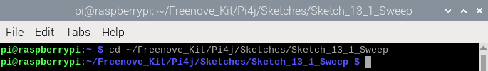
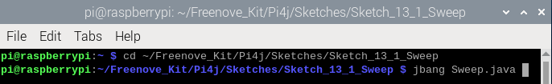
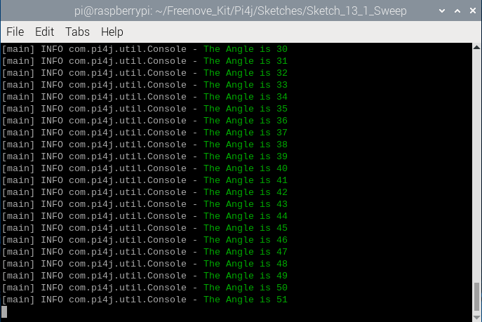
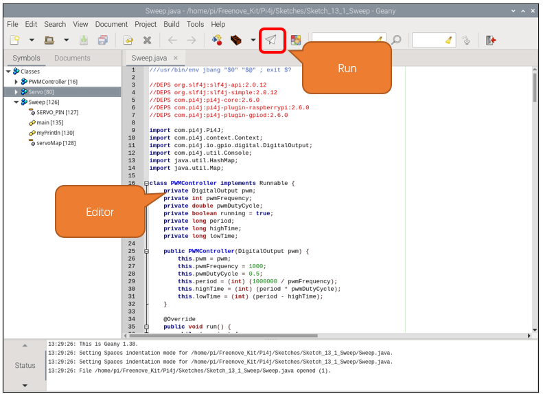

##############################################################################
Chapter Servo
##############################################################################

Previously, we learned how to control the speed and rotational direction of a DC Motor. In this chapter, we will learn about Servos which are a rotary actuator type motor that can be controlled rotate to specific angles.

Project Servo Sweep
****************************************************************

First, we need to learn how to make a Servo rotate.

Component List
================================================================

+-------------------------------------------------+-------------------------------------------------+
|1. Raspberry Pi (with 40 GPIO) x1                |                                                 |     
|                                                 | Servo x1                                        |       
|2. GPIO Extension Board & Ribbon Cable x1        |                                                 |       
|                                                 |  |Servo|                                        |                                                            
|3. Breadboard x1                                 |                                                 |                                                                 
+-------------------------------------------------+-------------------------------------------------+
|  Jumper Wires x3                                                                                  |
|                                                                                                   |
|  |jumper-wire|                                                                                    |                           
+---------------------------------------------------------------------------------------------------+

.. |jumper-wire| image:: ../_static/imgs/jumper-wire.png
    :width: 70%

Component knowledge
================================================================

Servo
----------------------------------------------------------------

Servo is a compact package which consists of a DC Motor, a set of reduction gears to provide torque, a sensor and control circuit board. Most Servos only have a 180-degree range of motion via their “horn”. Servos can output higher torque than a simple DC Motor alone and they are widely used to control motion in model cars, model airplanes, robots, etc. Servos have three wire leads which usually terminate to a male or female 3-pin plug. Two leads are for electric power: Positive (2-VCC, Red wire), Negative (3-GND, Brown wire), and the signal line (1-Signal, Orange wire) as represented in the Servo provided in your Kit.

We will use a 50Hz PWM signal with a duty cycle in a certain range to drive the Servo. The lasting time 0.5ms-2.5ms of PWM single cycle high level corresponds to the Servo angle 0 degrees - 180 degree linearly. Part of the corresponding values are as follows:

Note: the lasting time of high level corresponding to the servo angle is absolute instead of accumulating. For example, the high level time lasting for 0.5ms correspond to the 0 degree of the servo. If the high level time lasts for another 1ms, the servo rotates to 45 degrees.

.. table:: 
    :width: 100%
    :widths: 50 50
    :align: center

================  ================
 High level time  Servo angle
================  ================
0.5ms             0 degree
1ms               45 degree
1.5ms             90 degree
2ms               135 degree
2.5ms             180 degree
================  ================

When you change the Servo signal value, the Servo will rotate to the designated angle.

Circuit
================================================================

Use caution when supplying power to the Servo it should be 5V. Make sure you do not make any errors when connecting the Servo to the power supply.

+------------------------------------------------------------------------------------------------+
|   Schematic diagram                                                                            |
|                                                                                                |
|   |Servo-Sc|                                                                                   |
+------------------------------------------------------------------------------------------------+
|   Hardware connection. If you need any support,please feel free to contact us via:             |
|                                                                                                |
|   support@freenove.com                                                                         |
|                                                                                                |
|   |Servo-Fr|                                                                                   |
+------------------------------------------------------------------------------------------------+

Sketch
================================================================

In this chapter, we will learn how to control the servo to rotate at the range of 0 to 180 degrees.

Sketch_13_1_Sweep
----------------------------------------------------------------

First, enter where the project is located:

.. code-block:: console
    
    $ cd ~/Freenove_Kit/Pi4j/Sketches/Sketch_13_1_Sweep

Enter the command to run the code.

.. code-block:: console
    
    $ jbang Sweep.java

When the code is running, you can see the servo rotate between 0 to 180 degrees.

Meanwhile, the messages are printed on the terminal.

Press Ctrl+C to exit the code.

You can run the following command to open the code with Geany to view and edit it.

.. code-block:: console
    
    $ geany Sweep.java

Click the icon to run the code.

If the code fails to run, please check :doc:`Geany Configuration`.

The following is program code:

.. literalinclude:: ../../../freenove_Kit/Pi4j/Sketches/Sketch_13_1_Sweep/Sweep.java
    :linenos: 
    :language: java

Servo constructor, initializes the servo control pins, and adds a JVM shutdown hook to ensure that the PWM controller and Pi4J context are properly closed when the program exits.

.. literalinclude:: ../../../freenove_Kit/Pi4j/Sketches/Sketch_13_1_Sweep/Sweep.java
    :linenos: 
    :language: java
    :lines: 85-102
    
Set the PWM duty cycle according to the angle to control the servo to rotate to the specified position.

.. literalinclude:: ../../../freenove_Kit/Pi4j/Sketches/Sketch_13_1_Sweep/Sweep.java
    :linenos: 
    :language: java
    :lines: 112-118

Initialize the servo controller and store it in servoMap.

.. code-block:: python

    servoMap.put(SERVO_PIN, new Servo(SERVO_PIN));

Get the servo controller from servoMap.

.. code-block:: python

    Servo servo = servoMap.get(SERVO_PIN);

The signal period of the servo is 20ms. According to the formula f=1/T, the frequency of the servo is set to 50Hz.

To control the servo to rotate to 0 degrees, a 1.5ms high level is required. 1.5ms/20ms=0.075, so the duty cycle of the servo is 0.075. Similarly, if you want the servo to rotate to 180 degrees, a 2.5ms high level is required, 2.5ms/20ms=0.375. You only need to modify the duty cycle value to control the rotation of the servo.

.. code-block:: python

    servo.setFrequency(50);
    servo.setDutyCycle(0.075);

The main code controls the servo to rotate between 0-180 degrees and prints prompt information on the terminal interface.

.. literalinclude:: ../../../freenove_Kit/Pi4j/Sketches/Sketch_13_1_Sweep/Sweep.java
    :linenos: 
    :language: java
    :lines: 145-156

