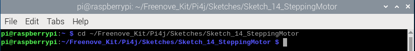

##############################################################################
Chapter Stepper Motor
##############################################################################

Thus far, we have learned about DC Motors and Servos. A DC motor can rotate constantly in on direction but we cannot control the rotation to a specific angle. On the contrary, a Servo can rotate to a specific angle but cannot rotate constantly in one direction. In this chapter, we will learn about a Stepper Motor which is also a type of motor. A Stepper Motor can rotate constantly and also to a specific angle. Using a Stepper Motor can easily achieve higher accuracies in mechanical motion.

Project Stepper Motor
****************************************************************

In this project, we will learn how to drive a Stepper Motor, and understand its working principle.

Component List
================================================================

+--------------------------------------------------+-------------------------------------------------+
|1. Raspberry Pi (with 40 GPIO) x1                 |                                                 |     
|                                                  | Jumper Wires x12                                |       
|2. GPIO Extension Board & Ribbon Cable x1         |                                                 |       
|                                                  |  |jumper-wire|                                  |                                                            
|3. Breadboard x1                                  |                                                 |                                                                 
+--------------------------------------------------+-------------------------------------------------+
| Stepper Motor x1                                 | ULN2003 Stepper Motor Driver x1                 |
|                                                  |                                                 |
|  |stepper_Motor|                                 |  |stepper_Motor_Driver|                         |                           
+--------------------------------------------------+-------------------------------------------------+
| 9V battery (prepared by yourself) & battery line | Breadboard Power module x1                      |
|                                                  |                                                 |
|  |Battery_cable|                                 |  |power-module|                                 |                           
+--------------------------------------------------+-------------------------------------------------+

.. |jumper-wire| image:: ../_static/imgs/jumper-wire.png

.. |stepper_Motor| image:: ../_static/imgs/stepper_Motor.png
    :width: 70%
.. |Battery_cable| image:: ../_static/imgs/Battery_cable.png
.. |power-module| image:: ../_static/imgs/power-module.png

Component knowledge
================================================================

Stepper Motor
----------------------------------------------------------------

Stepper Motors are an open-loop control device, which converts an electronic pulse signal into angular displacement or linear displacement. In a non-overload condition, the speed of the motor and the location of the stops depends only on the pulse signal frequency and number of pulses and is not affected by changes in load as with a DC Motor. A small Four-Phase Deceleration Stepper Motor is shown here:

.. image:: ../_static/imgs/steppter_Motor_1.png
    :align: center

The electronic schematic diagram of a Four-Phase Stepper Motor is shown below:

.. image:: ../_static/imgs/stepper_Motor_2.png
    :align: center

The outside case or housing of the Stepper Motor is the Stator and inside the Stator is the Rotor. There is a specific number of individual coils, usually an integer multiple of the number of phases the motor has, when the Stator is powered ON, an electromagnetic field will be formed to attract a corresponding convex diagonal groove or indentation in the Rotor’s surface. The Rotor is usually made of iron or a permanent magnet. Therefore, the Stepper Motor can be driven by powering the coils on the Stator in an ordered sequence (producing a series of “steps” or stepped movements).

A common driving sequence is shown here:

.. image:: ../_static/imgs/stepper_Motor_3.png
    :align: center

In the sequence above, the Stepper Motor rotates by a certain angle at once, which is called a “step”. By controlling the number of rotational steps, you can then control the Stepper Motor's rotation angle. By defining the time between two steps, you can control the Stepper Motor's rotation speed. When rotating clockwise, the order of coil powered on is: A -> B -> C -> D -> A ->... . And the rotor will rotate in accordance with this order, step by step, called four-steps, four-part. If the coils is powered ON in the reverse order, D -> C -> B -> A -> D ->… , the rotor will rotate in counter-clockwise direction.

There are other methods to control Stepper Motors, such as: connect A phase, then connect A B phase, the stator will be located in the center of A B, which is called a half-step. This method can improve the stability of the Stepper Motor and reduces noise. Tise sequence of powering the coils looks like this: A -> AB -> B -> BC -> C -> CD -> D -> DA -> A ->... , the rotor will rotate in accordance to this sequence ar, a half-step at a time, called four-steps, eight-part. Conversely, if the coils are powered ON in the reverse order the Stepper Motor will rotate in the opposite direction.

The stator in the Stepper Motor we have supplied has 32 magnetic poles. Therefore, to complete one full revolution requires 32 full steps. The rotor (or output shaft) of the Stepper Motor is connected to a speed reduction set of gears and the reduction ratio is 1:64. Therefore, the final output shaft (exiting the Stepper Motor’s housing) requires 32 X 64 = 2048 steps to make one full revolution.

ULN2003 Stepper Motor driver
----------------------------------------------------------------

A ULN2003 Stepper Motor Driver is used to convert weak signals into more powerful control signals in order to drive the Stepper Motor. In the illustration below, the input signal IN1-IN4 corresponds to the output signal A-D, and 4 LEDs are integrated into the board to indicate the state of these signals. The PWR interface can be used as a power supply for the Stepper Motor. By default, PWR and VCC are connected.

.. image:: ../_static/imgs/stepper_Motor_Driver_1.png
    :align: center

Circuit
================================================================

When building the circuit, note that rated voltage of the Stepper Motor is 5V, and we need to use the breadboard power supply independently, (Caution do not use the RPi power supply). Additionally, the breadboard power supply needs to share Ground with Rpi.

+------------------------------------------------------------------------------------------------+
|   Schematic diagram                                                                            |
|                                                                                                |
|   |stepper_Motor_Sc|                                                                           |
+------------------------------------------------------------------------------------------------+
|   Hardware connection. If you need any support,please feel free to contact us via:             |
|                                                                                                |
|   support@freenove.com                                                                         |
|                                                                                                |
|   |stepper_Motor_Fr|                                                                           |
+------------------------------------------------------------------------------------------------+

.. |stepper_Motor_Sc| image:: ../_static/imgs/stepper_Motor_Sc.png
.. |stepper_Motor_Fr| image:: ../_static/imgs/stepper_Motor_Fr.png

Sketch
================================================================

In this project, we will use a stepper motor.

Sketch_14_SteppingMotor
----------------------------------------------------------------

First, enter where the project is located:

.. code-block:: console
    
    $ cd ~/Freenove_Kit/Pi4j/Sketches/Sketch_14_SteppingMotor

Enter the command to run the code.

.. code-block:: console
    
    $ jbang SteppingMotor.java

When the code is running, you can observe that the stepper motor first rotates one circle forward, then one circle reversely, and repeats this process back and forth.

On the terminal, you can see the messages printed.

Press Ctrl+C to exit the program.

You can run the following command to open the code with Geany to view and edit it.

.. code-block:: console
    
    $ geany SteppingMotor.java

Click the icon to run the code.

If the code fails to run, please check :ref:`Geany Configuration<Geany_Configuration>`.

The following is program code:

.. literalinclude:: ../../../freenove_Kit/Pi4j/Sketches/Sketch_14_SteppingMotor/SteppingMotor.java
    :linenos: 
    :language: java
    :dedent:

Define the GPIO pins for motor control and the GPIO outputs used to control the motors.

.. literalinclude:: ../../../freenove_Kit/Pi4j/Sketches/Sketch_14_SteppingMotor/SteppingMotor.java
    :linenos: 
    :language: java
    :lines: 17-18
    :dedent:

Define the motor's rotation direction and the array of step sequences for clockwise and counter-clockwise directions.

.. literalinclude:: ../../../freenove_Kit/Pi4j/Sketches/Sketch_14_SteppingMotor/SteppingMotor.java
    :linenos: 
    :language: java
    :lines: 20-22
    :dedent:

Constructor, initialize GPIO pins.

.. literalinclude:: ../../../freenove_Kit/Pi4j/Sketches/Sketch_14_SteppingMotor/SteppingMotor.java
    :linenos: 
    :language: java
    :lines: 24-29
    :dedent:

Control the stepper motor to execute a one-step sequence cycle.

.. literalinclude:: ../../../freenove_Kit/Pi4j/Sketches/Sketch_14_SteppingMotor/SteppingMotor.java
    :linenos: 
    :language: java
    :lines: 31-44
    :dedent:

The stepper motor driving function controls the direction of motor rotation, the execution time of each stepping action, and the number of stepping sequences to execute.

.. literalinclude:: ../../../freenove_Kit/Pi4j/Sketches/Sketch_14_SteppingMotor/SteppingMotor.java
    :linenos: 
    :language: java
    :lines: 46-50
    :dedent:

Stepper motor stop function that stops the motor.

.. literalinclude:: ../../../freenove_Kit/Pi4j/Sketches/Sketch_14_SteppingMotor/SteppingMotor.java
    :linenos: 
    :language: java
    :lines: 52-56
    :dedent:

Implement the AutoCloseable interface to ensure that resources are released when they are no longer needed.

.. literalinclude:: ../../../freenove_Kit/Pi4j/Sketches/Sketch_14_SteppingMotor/SteppingMotor.java
    :linenos: 
    :language: java
    :lines: 58-66
    :dedent:

Initialize stepper motor controller.

.. code-block:: python
    :linenos:

    motorControl = new StepMotor();  

Add JVM shutdown hook to ensure motors are stopped on program exit.

.. code-block:: python
    :linenos:

    Runtime.getRuntime().addShutdownHook(new Thread(motorControl::motorStop)); 

First, control the stepper motor to rotate forward one circle, then pause for 500 milliseconds, then control the stepper motor to rotate reversely one circle, then pause for 500 milliseconds, and repeat this process.

.. literalinclude:: ../../../freenove_Kit/Pi4j/Sketches/Sketch_14_SteppingMotor/SteppingMotor.java
    :linenos: 
    :language: java
    :lines: 82-87
    :dedent:

If a thread termination exception or other exception occurs, it will be printed out on the terminal interface.

.. code-block:: python
    :linenos:

    catch (InterruptedException e) { 
        Thread.currentThread().interrupt(); 
        myPrintln("Interrupted: %s", e.getMessage());  
    } catch (Exception e) { 
        myPrintln("Error: %s", e.getMessage());  
    }

Make sure the resources are released when the program ends.

.. code-block:: python
    :linenos:

    finally {  
        if (motorControl != null) {  
            try {  
                motorControl.close();  
            } catch (Exception ex) {  
                ex.printStackTrace();  
            }  
        }  
    }  
