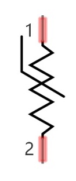
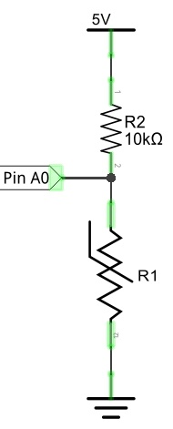
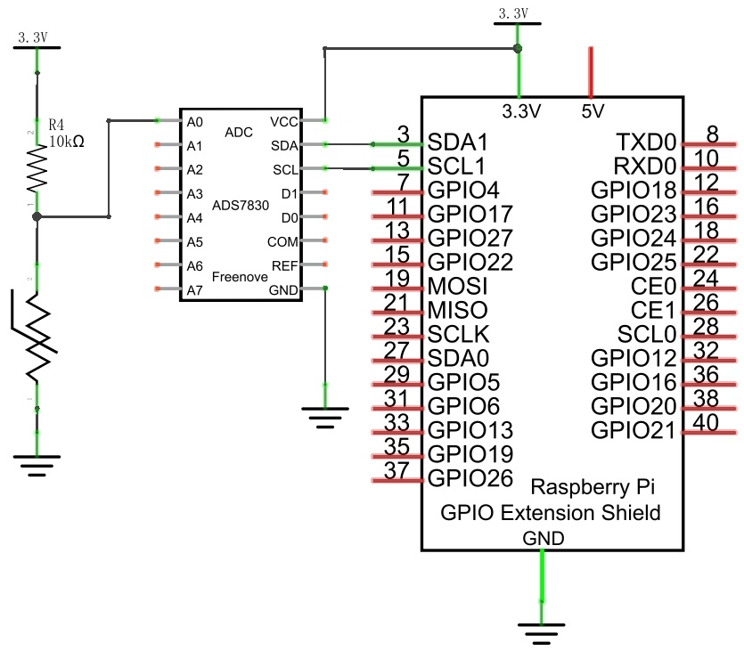
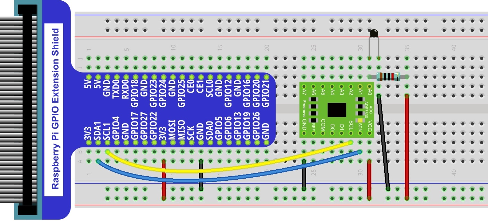
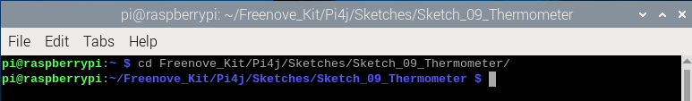
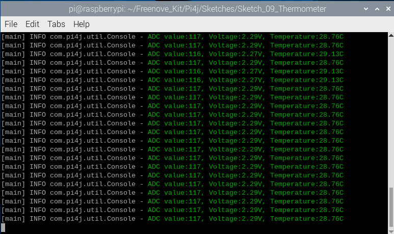
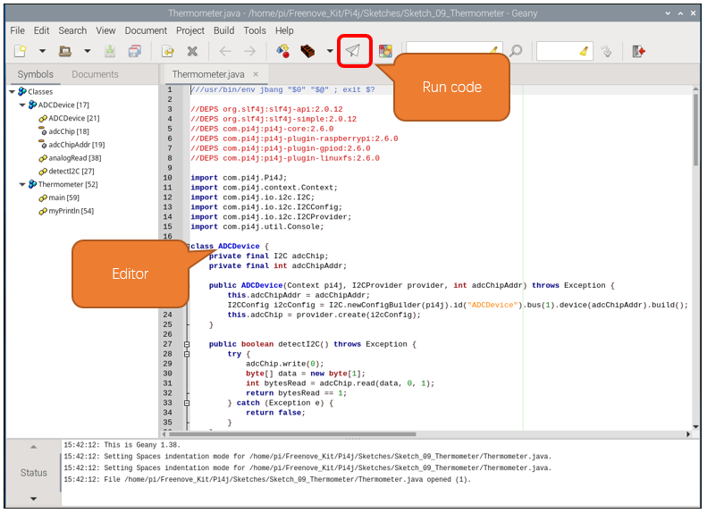

##############################################################################
Chapter Thermistor
##############################################################################

In this chapter, we will learn about Thermistors which are another kind of Resistor.

Project Thermometer
****************************************************************

A Thermistor is a type of Resistor whose resistance value is dependent on temperature and changes in temperature. Therefore, we can take advantage of this characteristic to make a Thermometer.

Component List
================================================================

.. table:: 
    :width: 50%
    :widths: 20 50
    :align: center

+---------------------------------------------------------------+
|1. Raspberry Pi (with 40 GPIO) x1                              |     
|                                                               |       
|2. GPIO Extension Board & Ribbon Cable x1                      |       
|                                                               |                                                            
|3. Breadboard x1                                               |                                                                 
+===============================+===============================+
| Thermistor x1                 |   Resistor 10kΩ x2            |
|                               |                               |
| |Thermistor|                  |  |Resistor-10kΩ|              |                           
+-------------------------------+-------------------------------+
| ADC module x1                                                 |
|                                                               |
|  |ADC-module-2|                                               |                   
|                                                               |  
+---------------------------------------------------------------+
|   Jumper Wire M/M x14                                         |
|                                                               | 
|      |jumper-wire|                                            |
+---------------------------------------------------------------+

.. |jumper-wire| image:: ../_static/imgs/jumper-wire.png
.. |Resistor-10kΩ| image:: ../_static/imgs/Resistor-10kΩ.png

.. |ADC-module-2| image:: ../_static/imgs/ADC-module-2.png

.. _ck:

Component knowledge
================================================================

Thermistor
----------------------------------------------------------------

Thermistor is a temperature sensitive resistor. When it senses a change in temperature, the resistance of the Thermistor will change. We can take advantage of this characteristic by using a Thermistor to detect temperature intensity. A Thermistor and its electronic symbol are shown below.

The relationship between resistance value and temperature of a thermistor is:

.. container:: centered

    :xx-large:`Rt=R*EXP [B*(1/T2-1/T1)]`

- Where:
    - Rt is the thermistor resistance under T2 temperature;
    - R is in the nominal resistance of thermistor under T1 temperature;
    - EXP[n] is nth power of e;
    - B is for thermal index;
    - T1, T2 is Kelvin temperature (absolute temperature). Kelvin temperature=273.15 + Celsius temperature.

For the parameters of the Thermistor, we use: B=3950, R=10k, T1=25.

The circuit connection method of the Thermistor is similar to photoresistor, as the following:

We can use the value measured by the ADC converter to obtain the resistance value of Thermistor, and then we can use the formula to obtain the temperature value.

Therefore, the temperature formula can be derived as:

.. container:: centered

    :xx-large:`T2 = 1/(1/T1 + ln(Rt/R)/B)`

Circuit
================================================================

The circuit of this project is similar to the one in last chapter. The only difference is that the Photoresistor is replaced by the Thermistor.

+------------------------------------------------------------------------------------------------+
|   Schematic diagram                                                                            |
|                                                                                                |
|   |ADS7830-Schematic-5|                                                                        |
+------------------------------------------------------------------------------------------------+
|   Hardware connection. If you need any support,please feel free to contact us via:             |
|                                                                                                |
|   support@freenove.com                                                                         |
|                                                                                                |
|   |ADS7830-fritizing-6|                                                                        |
|                                                                                                |
|    **Thermistor has longer pins than the one shown in circuit.**                               |
+------------------------------------------------------------------------------------------------+

Sketch
================================================================

In this project, we will collect the ADC value of the thermistor and calculate its temperature.

Sketch_09_Thermometer
----------------------------------------------------------------

First, enter where the project is located:

.. code-block:: console
    
    $ cd ~/Freenove_Kit/Pi4j/Sketches/Sketch_09_Thermometer

Enter the command to run the code.

.. code-block:: console
    
    $ jbang Thermometer.java

After running the code, the Raspberry Pi will obtain the ADC value of the thermistor and convert it into voltage and temperature values, as shown in the figure below.

Press Ctrl+C to exit the program.

.. image:: ../_static/imgs/java_thermometer_exit.png
    :align: center

You can open the code with Geany to view and edit it.

.. code-block:: console
    
    $ geany Thermometer.java

Click the icon to run the code.

If the code fails to run, please check Geany Configuration.

The following is program code:

.. literalinclude:: ../../../freenove_Kit/Pi4j/Sketches/Sketch_09_Thermometer/Thermometer.java
    :linenos: 
    :language: java

Get the ADC value of the thermistor every 100 milliseconds, convert the ADC value into a temperature value according to the formula introduced at :ref:`component knowledge<ck>` section, and print the relevant information on the terminal.

.. literalinclude:: ../../../freenove_Kit/Pi4j/Sketches/Sketch_09_Thermometer/Thermometer.java
    :linenos: 
    :language: java
    :lines: 65-78

