##############################################################################
Get Started
##############################################################################
Get Started
****************************************************************

**Thank you for choosing Freenove products!**

After you download the ZIP file we provide. Unzip it and you will get a folder contains several files and folders.

There are three PDF files:

*   | Tutorial.pdf
    | It contains basic operations such as installing system for Raspberry Pi.
    | The code in this PDF is in C.
*	| Tutorial_GPIOZero.pdf
    | It contains basic operations such as installing system for Raspberry Pi.
    | The code in this PDF is in Python.
*	| Processing.pdf in Freenove_Complete_Starter_Kit_for_Raspberry_Pi\Processing
    | The code in this PDF is in Java.

We recommend you to start with Tutorial.pdf or Tutorial_GPIOZero.pdf first.

If you want to start with Processing.pdf or skip some chapters of Tutorial.pdf, you need to finish necessary steps in **Chapter 7 AD/DA** of **Tutorial.pdf** first.

##############################################################################
Remove the Chips
##############################################################################

Remove the Chips
****************************************************************
Some chips and modules are inserted into the breadboard to protect their pins.

You need to remove them from breadboard before use. (There is no need to remove GPIO Extension Board.)

Please find a tool (like a little screw driver) to handle them like below:

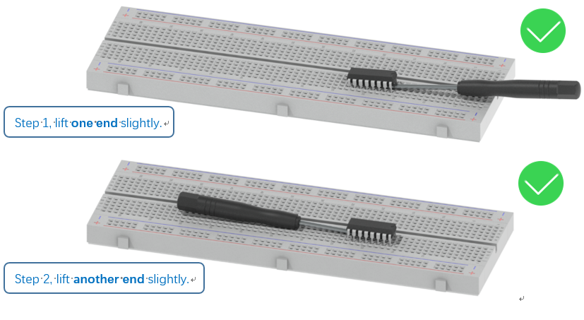
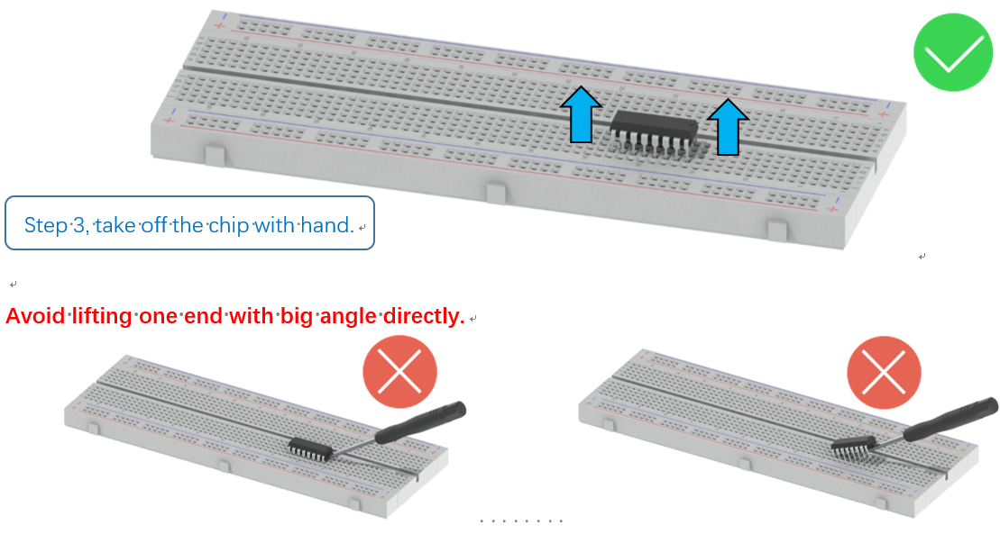

Get Support and Offer Input
****************************************************************
Freenove provides free and responsive product and technical support, including but not limited to:

* Product quality issues 
* Product use and build issues
* Questions regarding the technology employed in our products for learning and education
* Your input and opinions are always welcome
* We also encourage your ideas and suggestions for new products and product improvements

For any of the above, you may send us an email to: :blue:`support@freenove.com`

Safety and Precautions
****************************************************************
Please follow the following safety precautions when using or storing this product:

* Keep this product out of the reach of children under 6 years old. 
* This product should be used only when there is adult supervision present as young children lack necessary judgment regarding safety and the consequences of product misuse. 
* This product contains small parts and parts, which are sharp. This product contains electrically conductive parts. Use caution with electrically conductive parts near or around power supplies, batteries and powered (live) circuits.
* When the product is turned ON, activated or tested, some parts will move or rotate. To avoid injuries to hands and fingers, keep them away from any moving parts!
* It is possible that an improperly connected or shorted circuit may cause overheating. Should this happen, immediately disconnect the power supply or remove the batteries and do not touch anything until it cools down! When everything is safe and cool, review the product tutorial to identify the cause.
* Only operate the product in accordance with the instructions and guidelines of this tutorial, otherwise parts may be damaged or you could be injured.
* Store the product in a cool dry place and avoid exposing the product to direct sunlight.
* After use, always turn the power OFF and remove or unplug the batteries before storing.

About Freenove
****************************************************************
Freenove provides open source electronic products and services worldwide.

Freenove is committed to assist customers in their education of robotics, programming and electronic circuits so that they may transform their creative ideas into prototypes and new and innovative products. To this end, our services include but are not limited to:

* Educational and Entertaining Project Kits for Robots, Smart Cars and Drones
* Educational Kits to Learn Robotic Software Systems for Arduino, Raspberry Pi and micro: bit
* Electronic Component Assortments, Electronic Modules and Specialized Tools
* **Product Development and Customization Services**

You can find more about Freenove and get our latest news and updates through our website:

http://www.freenove.com

Copyright
****************************************************************
All the files, materials and instructional guides provided are released under 
`Creative Commons Attribution-NonCommercial-ShareAlike 3.0 Unported License <https://creativecommons.org/licenses/by-nc-sa/3.0/>`_ . 
A copy of this license can be found in the folder containing the Tutorial and software files associated with this product.

This means you can use these resource in your own derived works, in part or completely, but **NOT for the intent or purpose of commercial use**.

Freenove brand and logo are copyright of Freenove Creative Technology Co., Ltd. and cannot be used without written permission.

.. image:: ../_static/imgs/freenove-logo.png
        :width: 100px

Raspberry Pi® is a trademark of Raspberry Pi Foundation (https://www.raspberrypi.org/).

##############################################################################
Preface
##############################################################################

Raspberry Pi is a low cost, **credit card sized computer** that plugs into a computer monitor or TV, and uses a standard keyboard and mouse. 
It is an incredibly capable little device that enables people of all ages to explore computing, 
and to learn how to program in a variety of computer languages like Scratch and Python. 
It is capable of doing everything you would expect from a desktop computer, such as browsing the internet, 
playing high-definition video content, creating spreadsheets, performing word-processing, 
and playing video games. For more information, you can refer to `Raspberry Pi official website <https://www.raspbrrypi.com>`_. 
For clarification, this tutorial will also reference Raspberry Pi as RPi, RPI and RasPi.

In this tutorial, most chapters consist of Components List, **Component Knowledge, Circuit, and Code**. We provide C code for each project in this tutorial. After completing this tutorial, you can learn Java by reading Processing.pdf.

This kit does not contain :doc:`Raspberry and its accessories <./install-system Required Components>`. You can also use the components and modules in this kit to create projects of your own design.
 
Additionally, if you encounter any issues or have questions about this tutorial or the contents of kit, you can always contact us for free technical support at:

support@freenove.com

##############################################################################
Raspberry Pi
##############################################################################

So far, at this writing, Raspberry Pi has advanced to its fifth generation product offering. Version changes are accompanied by increases in upgrades in hardware and capabilities. 

The A type and B type versions of the first generation products have been discontinued due to various reasons. What is most important is that other popular and currently available versions are consistent in the order and number of pins and their assigned designation of function, making compatibility of peripheral devices greatly enhanced between versions.

Below are the raspberry pi pictures and model pictures supported by this product. They have 40 pins.

.. table:: 
    :width: 100%
    :widths: 50 50

    ================================================================================    ================================================================================
    Practicality picture of Raspberry Pi 5                                              Model diagram of Raspberry Pi 5
    ================================================================================    ================================================================================
    |raspberrypi5-real|                                                                 |raspberrypi5-frzz|
    Practicality picture of Raspberry Pi 4B                                              Model diagram of Raspberry Pi 4B
    |raspberrypi4b-real|                                                                 |raspberrypi4b-frzz|
    Practicality picture of Raspberry Pi 3B+                                              Model diagram of Raspberry Pi 3B+
    |raspberrypi3p-real|                                                                 |raspberrypi3p-frzz|
    Practicality picture of Raspberry Pi 3B                                              Model diagram of Raspberry Pi 3B
    |raspberrypi3b-real|                                                                 |raspberrypi3b-frzz|
    Practicality picture of Raspberry Pi 2B                                              Model diagram of Raspberry Pi 2B
    |raspberrypi2b-real|                                                                 |raspberrypi2b-frzz|
    Practicality picture of Raspberry Pi 1B+                                              Model diagram of Raspberry Pi 1B+
    |raspberrypi1p-real|                                                                 |raspberrypi1p-frzz|
    Practicality picture of Raspberry Pi 3A+                                              Model diagram of Raspberry Pi 3A+
    |raspberrypi3a-real|                                                                 |raspberrypi3a-frzz|
    Practicality picture of Raspberry Pi 1A+                                              Model diagram of Raspberry Pi 1A+
    |raspberrypi1a-real|                                                                 |raspberrypi1a-frzz|
    Practicality picture of Raspberry Pi Zero W                                              Model diagram of Raspberry Pi 5
    |raspberrypi0w-real|                                                                 |raspberrypi0w-frzz|
    Practicality picture of Raspberry Pi Zero                                              Model diagram of Raspberry Pi 5
    |raspberrypi0-real|                                                                 |raspberrypi0-frzz|
    ================================================================================    ================================================================================

.. |raspberrypi5-real| image:: ../_static/imgs/raspberrypi5-real.jpg
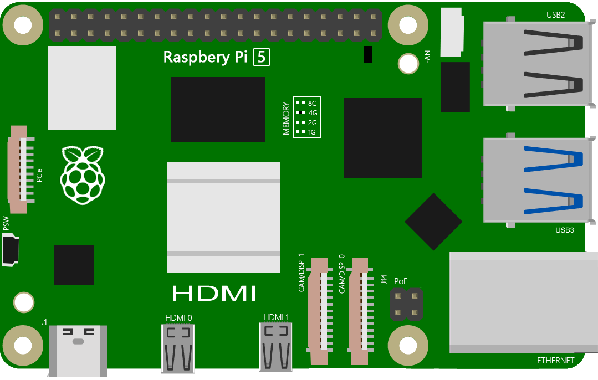

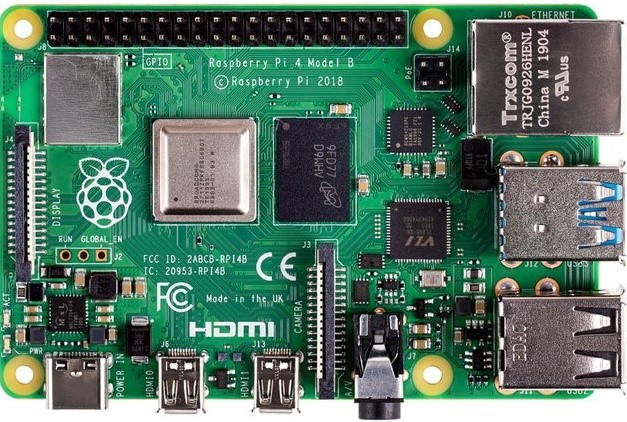
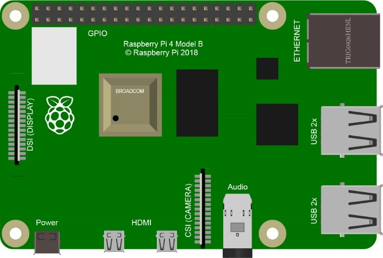

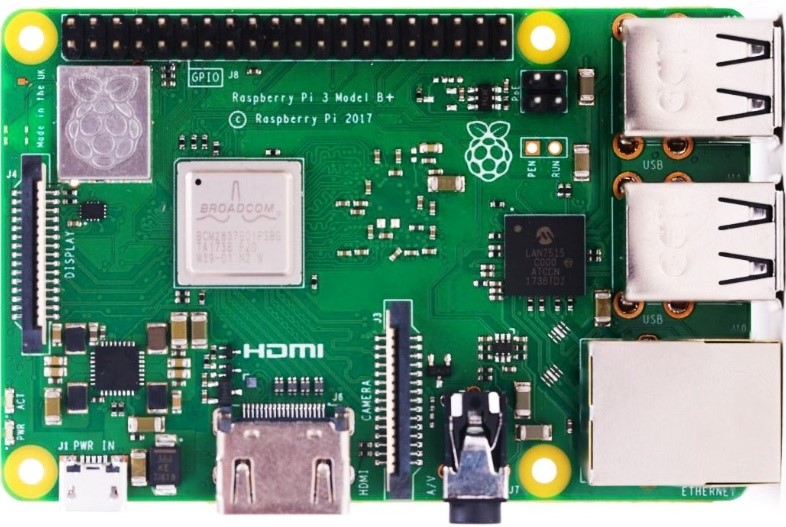
.. |raspberrypi3p-frzz| image:: ../_static/imgs/raspberrypi3p-frz.jpg

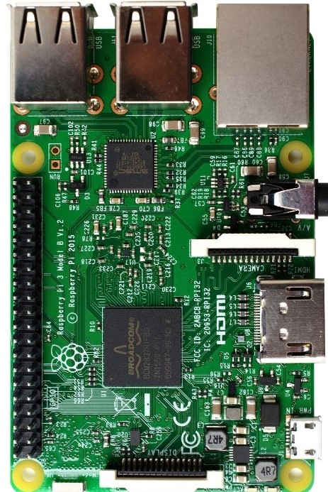
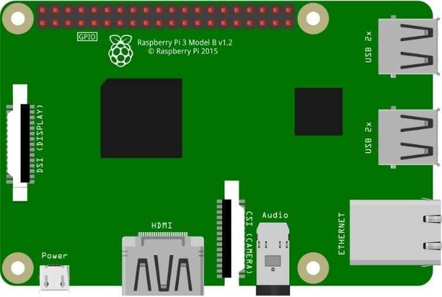

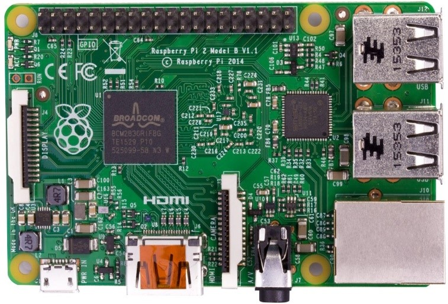
.. |raspberrypi2b-frzz| image:: ../_static/imgs/raspberrypi2b-frz.jpg

.. |raspberrypi1p-real| image:: ../_static/imgs/raspberrypi1-real.jpg
.. |raspberrypi1p-frzz| image:: ../_static/imgs/raspberrypi1-frz.jpg

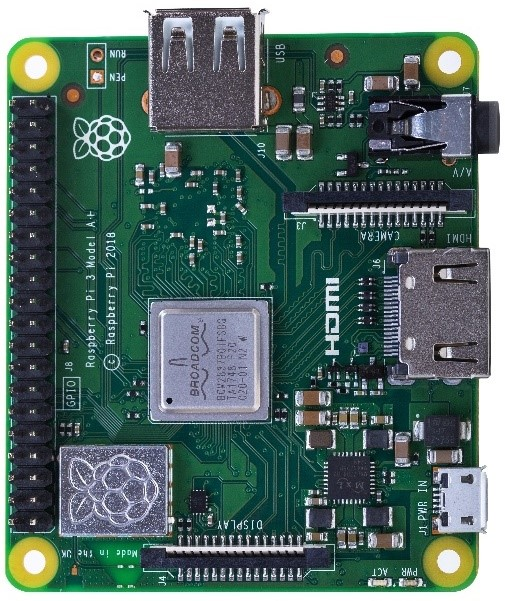
.. |raspberrypi3a-frzz| image:: ../_static/imgs/raspberrypi3a-frz.jpg

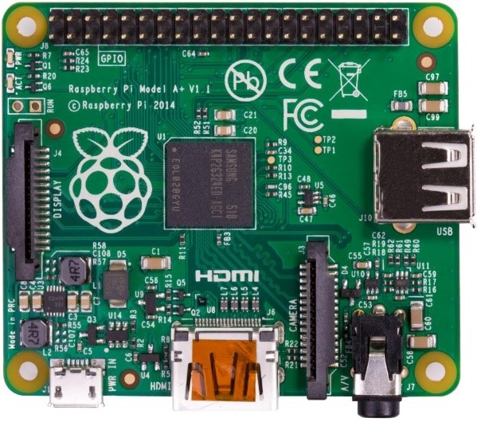
.. |raspberrypi1a-frzz| image:: ../_static/imgs/raspberrypi1a-frz.jpg

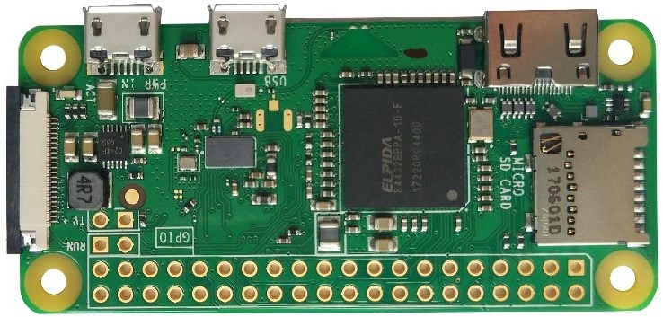
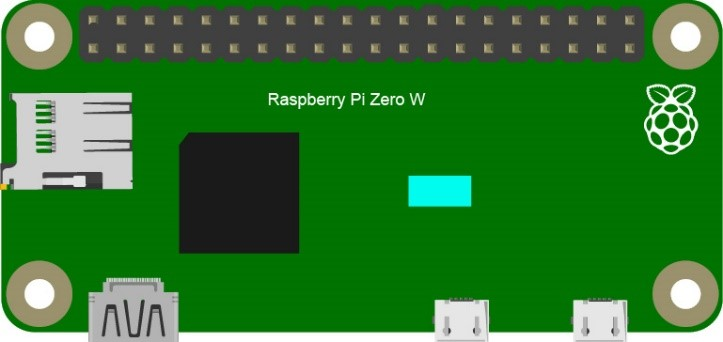

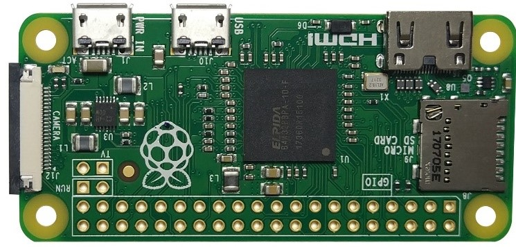
.. |raspberrypi0-frzz| image:: ../_static/imgs/raspberrypi0-frz.jpg

Below are the raspberry pi pictures and model pictures supported by this product. They have 40 pins.

Hardware interface diagram of RPi 5 is shown below: 

.. image:: ../_static/imgs/raspberrypi5-interface.jpg
    :width: 100%

Hardware interface diagram of RPi 4B is shown below:

.. image:: ../_static/imgs/raspberrypi4-interface.jpg
    :width: 100%

Hardware interface diagram of RPi 3B+/3B/2B/1B+:

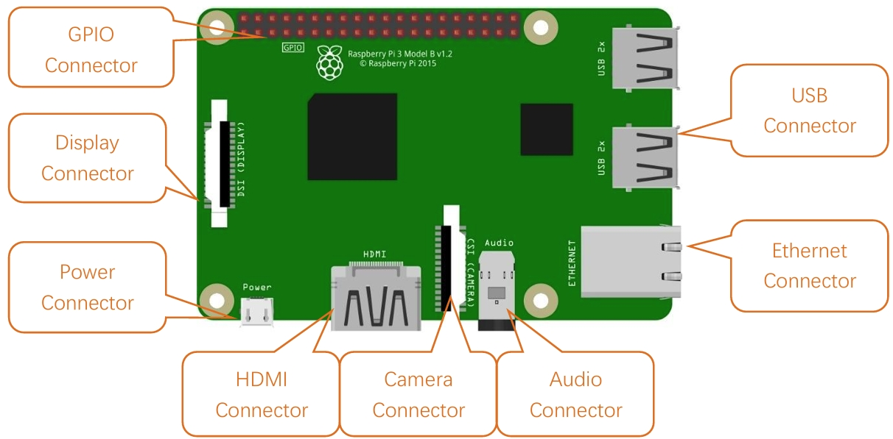

Hardware interface diagram of RPi 3A+/A+:

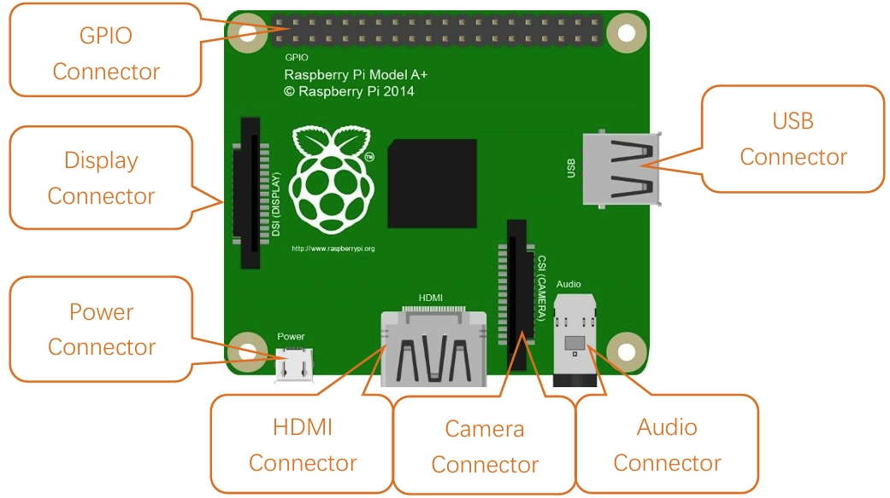

Hardware interface diagram of RPi Zero/Zero W/Zero 2 W:

.. image:: ../_static/imgs/raspberrypi0-interface.jpg
    :width: 100%

##############################################################################
Installing an Operating System
##############################################################################

The first step is to install an operating system on your RPi so that it can be programmed and function. 
If you have installed a system in your RPi, you can start from :doc:`Preparation<java_preparation>`.

Component List 
****************************************************************

Required Components
================================================================

.. list-table:: 
    :width: 100%
    :widths: 50 50
    :class: product-table

    *   -   Any Raspberry Pi with 40 GPIO
        -   5V/3A Power Adapter. Note: Different versions of Raspberry Pi have different power requirements (please check the power requirements for yours on the chart in the following page.)
    *   -   |raspberrypi5-real|
        -   |5v3a-power-adapter|
    *   -   Micro or Type-C USB Cable x1
        -   Micro SD Card (TF Card) x1, Card Reader x1
    *   -   |usb-cable|
        -   |tf-card-reader|

.. |raspberrypi5-real| image:: ../_static/imgs/raspberrypi5-real.jpg

.. |tf-card-reader| image:: ../_static/imgs/tf-card-reader.png

Power requirements of various versions of Raspberry Pi are shown in following table:

+-------------------------+----------------------------------+----------------------------------------------------+------------------------------------------------+
| Product                 | Recommended PSU current capacity | Maximum total USB peripheral current draw          | Typical bare-board active current consumption  |
+=========================+==================================+====================================================+================================================+
| Raspberry Pi 1 Model A  | 700mA                            | 500mA                                              | 200mA                                          |
+-------------------------+----------------------------------+----------------------------------------------------+------------------------------------------------+
| Raspberry Pi 1 Model B  | 1.2A                             | 500mA                                              | 500mA                                          |
+-------------------------+----------------------------------+----------------------------------------------------+------------------------------------------------+
| Raspberry Pi 1 Model A+ | 700mA                            | 500mA                                              | 180mA                                          |
+-------------------------+----------------------------------+----------------------------------------------------+------------------------------------------------+
| Raspberry Pi 1 Model B+ | 1.8A                             | 1.2A                                               | 330mA                                          |
+-------------------------+----------------------------------+----------------------------------------------------+------------------------------------------------+
| Raspberry Pi 2 Model B  | 1.8A                             | 1.2A                                               | 350mA                                          |
+-------------------------+----------------------------------+----------------------------------------------------+------------------------------------------------+
| Raspberry Pi 3 Model B  | 2.5A                             | 1.2A                                               | 400mA                                          |
+-------------------------+----------------------------------+----------------------------------------------------+------------------------------------------------+
| Raspberry Pi 3 Model A+ | 2.5A                             | Limited by PSU, board, and connector ratings only. | 350mA                                          |
+-------------------------+----------------------------------+----------------------------------------------------+------------------------------------------------+
| Raspberry Pi 3 Model B+ | 2.5A                             | 1.2A                                               | 500mA                                          |
+-------------------------+----------------------------------+----------------------------------------------------+------------------------------------------------+
| Raspberry Pi 4 Model B  | 3.0A                             | 1.2A                                               | 600mA                                          |
+-------------------------+----------------------------------+----------------------------------------------------+------------------------------------------------+
| Raspberry Pi 5          | 5.0A                             | 1.6A (600mA if using a 3A power supply)            | 800mA                                          |
+-------------------------+----------------------------------+----------------------------------------------------+------------------------------------------------+
| Raspberry Pi 400        | 3.0A                             | 1.2A                                               | 800mA                                          |
+-------------------------+----------------------------------+----------------------------------------------------+------------------------------------------------+
| Raspberry Pi Zero       | 1.2A                             | Limited by PSU, board, and connector ratings only  | 100mA                                          |
+-------------------------+----------------------------------+----------------------------------------------------+------------------------------------------------+

.. seealso:: 
    For more details, please refer to https://www.raspberrypi.org/help/faqs/#powerReqs

In addition, RPi also needs an Ethernet network cable used to connect it to a WAN (Wide Area Network).

The Raspberry Pi 5 provides 1.6A of power to downstream USB peripherals when connected to a power supply capable of 5A at +5V (25W). When connected to any other compatible power supply, the Raspberry Pi 5 restricts downstream USB devices to 600mA of power.

Optional Components
****************************************************************

Under normal circumstances, there are two ways to login to Raspberry Pi: 

1) Using a stand-alone monitor. 
2) Using a remote desktop or laptop computer monitor “sharing” the PC monitor with your RPi.

Required Accessories for Monitor
================================================================

If you choose to use an independent monitor, mouse and keyboard, you also need the following accessories:
1. A display with a HDMI interface
2. A Mouse and a Keyboard with an USB interface

As to Pi Zero and Pi Zero W, you also need the following accessories:
1.	A Mini-HDMI to HDMI Adapter and Cable.
2.	A Micro-USB to USB-A Adapter and Cable (Micro USB OTG Cable). 
3.	A USB HUB.
4.	USB to Ethernet Interface or USB Wi-Fi receiver. 

For different Raspberry Pi Modules, the optional items may vary slightly but they all aim to convert the interfaces to Raspberry Pi standards.

+----------------------------------------------------------+--------------------------------------------+----------------------+----------------------+-----------------------+----------+-----------+-------+-------+
|                                                          | Pi Zero                                    | Pi A+                | Pi Zero W            | Pi 3A+                | Pi B+/2B | Pi 3B/3B+ | Pi 4B | Pi 5  |
+==========================================================+============================================+======================+======================+=======================+==========+===========+=======+=======+
| Monitor                                                  | Yes (All)                                                                                                                                               |
+----------------------------------------------------------+                                                                                                                                                         +
| Mouse                                                    |                                                                                                                                                         |
+----------------------------------------------------------+                                                                                                                                                         +
| Keyboard                                                 |                                                                                                                                                         |
+----------------------------------------------------------+--------------------------------------------+----------------------+----------------------+-----------------------+----------+-----------+-------+-------+
| Micro-HDMI to HDMI Adapter & Cable                       | Yes                                        | No                   | Yes                  | No                    | No       | No        | No    | No    |
+----------------------------------------------------------+--------------------------------------------+----------------------+----------------------+-----------------------+----------+-----------+-------+-------+
| Micro-HDMI to HDMI Adapter & Cable                       | No                                         | Yes                  |                      |                       |          |           |       |       |
+----------------------------------------------------------+--------------------------------------------+----------------------+----------------------+-----------------------+----------+-----------+-------+-------+
| Micro-USB to USB-A Adapter & Cable (Micro USB OTG Cable) | Yes                                        | No                   | Yes                  | No                    |          |           |       |       |
+----------------------------------------------------------+--------------------------------------------+----------------------+----------------------+-----------------------+----------+-----------+-------+-------+
| USB HUB                                                  | Yes                                        | Yes                  | Yes                  | Yes                   | No       | No        | No    | No    |
+----------------------------------------------------------+--------------------------------------------+----------------------+----------------------+-----------------------+----------+-----------+-------+-------+
| USB to Ethernet Interface                                | select one from two or select two from two | optional             | Internal Integration | Internal Integration  |          |           |       |       |
+----------------------------------------------------------+--------------------------------------------+----------------------+----------------------+-----------------------+----------+-----------+-------+-------+
| USB Wi-Fi Receiver                                       |                                            | Internal Integration | optional             |                       |          |           |       |       |
+----------------------------------------------------------+--------------------------------------------+----------------------+----------------------+-----------------------+----------+-----------+-------+-------+

Required Accessories for Remote Desktop
================================================================

+----------------------------------------------------------+---------+-----------+-------+--------+----------+----------------+
|                                                          | Pi Zero | Pi Zero W | Pi A+ | Pi 3A+ | Pi B+/2B | Pi 3B/3B+/4B/5 |
+==========================================================+=========+===========+=======+========+==========+================+
| Micro-USB to USB-A Adapter & Cable (Micro USB OTG Cable) | Yes     | Yes       | No    | NO                                 |
+----------------------------------------------------------+---------+-----------+-------+                                    +
| USB to Ethernet interface                                | Yes     | Yes       | Yes   |                                    |
+----------------------------------------------------------+---------+-----------+-------+--------+----------+----------------+

Raspberry Pi OS
****************************************************************

.. note:: 
    | **Without Screen - Use Raspberry Pi - under Windows PC:** https://youtu.be/YND0RUuP-to
    | **With Screen - Use Raspberry Pi - under Windows PC:** https://youtu.be/HEywFsFrj3I

Automatically Method
================================================================

| You can follow the official method to install the system for raspberry pi via visiting link below:
| https://projects.raspberrypi.org/en/projects/raspberry-pi-setting-up/2
| In this way, the system will be downloaded **automatically** via the application. 

Manually Method
================================================================

After installing the Imager Tool in the **link above**. You can **also** download the system **manually** first. 

Visit https://www.raspberrypi.org/downloads/

And then the zip file is downloaded. 

Write System to Micro SD Card 
----------------------------------------------------------------

First, put your Micro SD card into card reader and connect it to USB port of PC. 

Then open imager toll. Clicked Choose Device.

Select a Raspberry PI Device based on your Raspberry PI version. It will help us filter out the right version of the system for the Raspberry PI.

Clicked Operating System. 

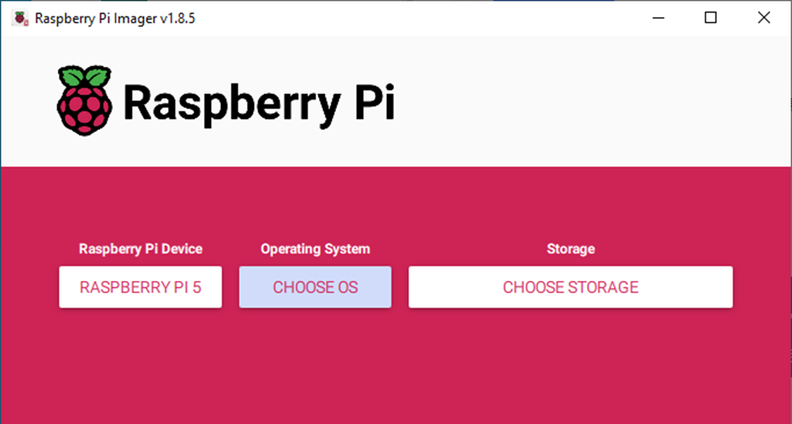

Choose system that you just downloaded in Use custom.

Choose the SD card. Then click “Next”. 

You can configure the Raspberry PI according to your needs.

Enable ssh and configure WiFi
================================================================
On the GENERAL screen, configure your information based on your actual situation.
Enable SSH on the SERVICES page.

Click Save, in the new screen, click Yes, wait for SD to brush into the Raspberry system.

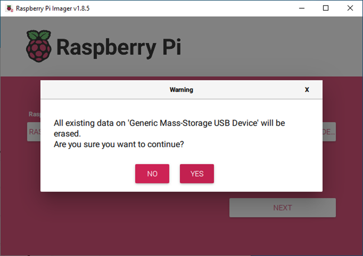

Insert SD card
================================================================
Then remove SD card from card reader and insert it into Raspberry Pi.

Connect to the power supply and wait for the Raspberry PI to turn on.

Getting Started with Raspberry Pi
****************************************************************

Monitor desktop
================================================================
If you do not have a spare monitor, please skip to next section `Remote desktop & VNC`_. If you have a spare monitor, please follow the steps in this section. 

After the system is written successfully, take out Micro SD Card and put it into the SD card slot of RPi. Then connect your RPi to the monitor through the HDMI port, attach your mouse and keyboard through the USB ports, attach a network cable to the network port and finally, connect your power supply (making sure that it meets the specifications required by your RPi Module Version. Your RPi should start (power up). Later, after setup, you will need to enter your user name and password to login. The default user name: pi; password: raspberry. After login, you should see the following screen.

.. image:: ../_static/imgs/install-system-14.png

**Congratulations!** You have successfully installed the RASPBERRY PI OS operating system on your RPi.

Raspberry Pi 5, 4B, 3B+/3B integrates a Wi-Fi adaptor. You can use it to connect to your Wi-Fi. Then you can use the wireless remote desktop to control your RPi. This will be helpful for the following work. Raspberry Pi of other models can use wireless remote desktop through accessing an external USB wireless card.

Remote desktop & VNC
================================================================

**If you have logged in Raspberry Pi via display, you can skip to** `VNC Viewer & VNC`_.

If you don't have a spare display, mouse and keyboard for your RPi, you can use a remote desktop to share a display, keyboard, and mouse with your PC. Below is how to use: 
`MAC OS remote desktop`_ and `Windows OS remote desktop`_.

MAC OS Remote Desktop
----------------------------------------------------------------

Open the terminal and type following command. :red:`If this command doesn't work, please move to next page.`

.. code-block:: console

    $ ssh pi@raspberrypi.local

The password is **raspberry** by default, case sensitive. You may need to type **yes** during the process.

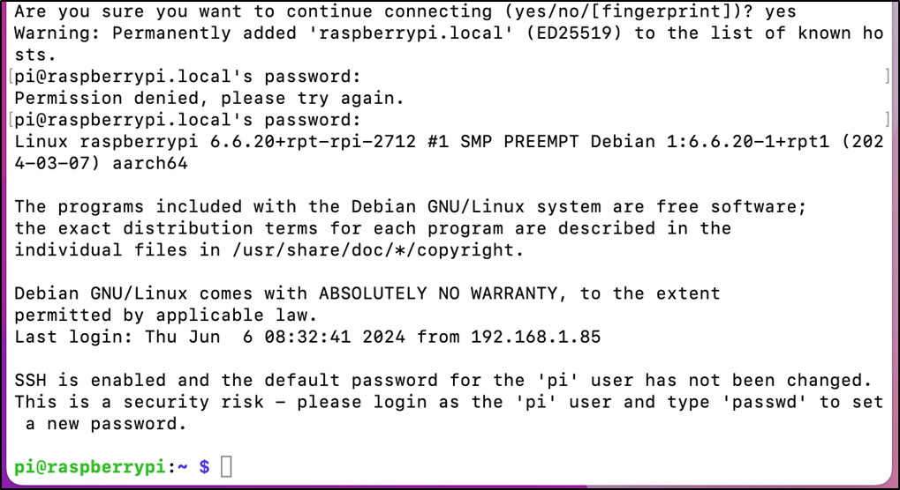

You can also use the IP address to log in Pi. 

Enter **router** client to **inquiry IP address** named **“raspberry pi”**. For example, I have inquired to **my RPi IP address, and it is “192.168.1.95".**

Open the terminal and type following command.

.. code-block:: console

    $ ssh pi@192.168.1.95

When you see :red:`pi@raspberrypi:`:blue:`~ $`, you have logged in Pi successfully. Then you can skip to next section.

Then you can skip to `VNC Viewer & VNC`_.

Windows OS Remote Desktop
----------------------------------------------------------------
**If you are using win10, you can use follow way to login Raspberry Pi without desktop.**
Press `Win+R`. Enter `cmd`. Then use this command to check IP:

.. code-block:: console

    $ ping -4 raspberrypi.local

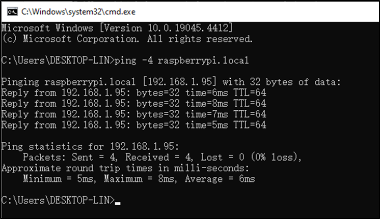

| Then 192.168.1.147 is my Raspberry Pi IP.
| Or enter **router** client to **inquiry IP address** named **“raspberrypi”**. For example, I have inquired to **my RPi IP address, and it is “192.168.1.95".**

.. code-block:: console
    
    $ ssh pi@xxxxxxxxxxx(IP address)

Enter the following command:

.. code-block:: console
    
    $ ssh pi@192.168.1.95

VNC Viewer & VNC
----------------------------------------------------------------

Enable VNC
^^^^^^^^^^^^^^^^^^^^^^^^^^^^^^^^^^^^^^^^^^^^^^^^^^^^^^^^^^^^^^^^

Type the following command. And select Interface Options->P5 VNC -> Enter->Yes->OK. Here Raspberry Pi may need be restarted, and choose ok. Then open VNC interface. 

.. code-block:: console
    
    $ sudo raspi-config

| Then download and install VNC Viewer according to your computer system by click following link:
| https://www.realvnc.com/en/connect/download/viewer/
| After installation is completed, open VNC Viewer. And click File -> New Connection. Then the interface is shown below. 

| Enter ip address of your Raspberry Pi and fill in a name. Then click OK.
| Then on the VNC Viewer panel, double-click new connection you just created, 

and the following dialog box pops up.  

Enter username: **pi** and Password: **raspberry**. And click OK.     

Here, you have logged in to Raspberry Pi successfully by using VNC Viewer

If there is black window, please `set resolution`_.

set resolution
^^^^^^^^^^^^^^^^^^^^^^^^^^^^^^^^^^^^^^^^^^^^^^^^^^^^^^^^^^^^^^^^
You can also set other resolutions. 

If you don't know what resolution to set properly, you can try 1920x1080.

In addition, your VNC Viewer window may zoom your Raspberry Pi desktop. You can change it. On your VNC View control panel, click right key. And select Properties->Options label->Scaling. Then set proper scaling. 

Here, you have logged in to Raspberry Pi successfully by using VNC Viewer and operated proper setting.

Raspberry Pi 5/4B/3B+/3B integrates a Wi-Fi adaptor.If you did not connect Pi to WiFi. You can connect it to wirelessly control the robot.

.. image:: ../_static/imgs/install-system-34.png