##############################################################################
0. Chapter Preparation
##############################################################################

Why “Chapter 0”? Because in program code the first number is 0. We choose to follow this rule. In this chapter, we will do some necessary foundational preparation work: Start your Raspberry Pi and install some necessary libraries. 

Linux Command
****************************************************************

 `Download the code  <https://github.com/Freenove/Freenove_Ultimate_Starter_Kit_for_Raspberry_Pi/archive/refs/heads/master.zip>`_ 

Raspberry Pi OS is based on the Linux Operation System. Now we will introduce you to some frequently used Linux commands and rules.

First, open the Terminal. All commands are executed in Terminal. 

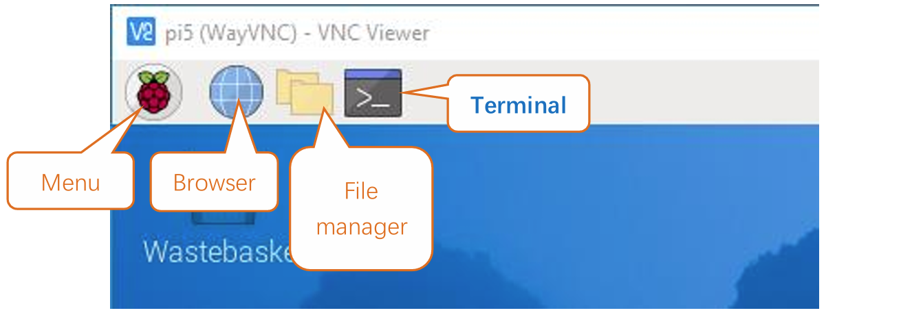

When you click the Terminal icon, following interface appears.

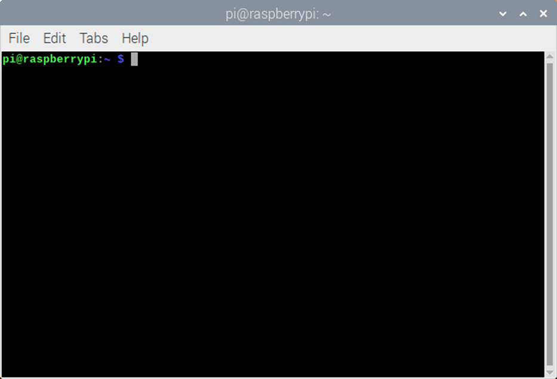

**Note: The Linux is case sensitive.**

First, type ``ls`` into the Terminal and press the “Enter” key. The result is shown below:

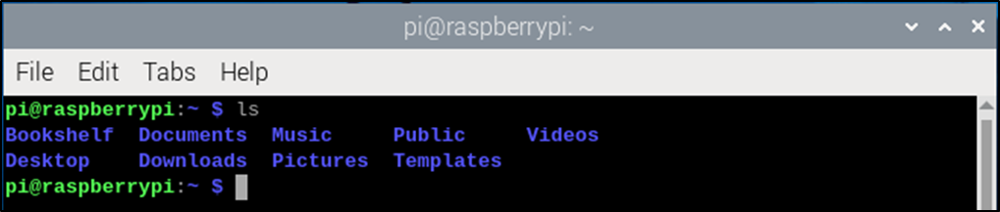

The ``ls`` command lists information about the files (the current directory by default).

Content between ``$`` and ``pi@raspberrypi:`` is the current working path. ``~`` represents the user directory, which refers to ``/home/pi`` here. 

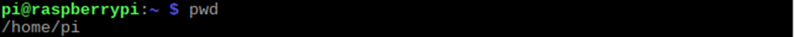

``cd`` is used to change directory. / represents the root directory. 

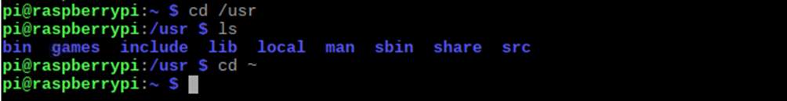

Later in this Tutorial, we will often change the working path. Typing commands under the wrong directory may cause errors and break the execution of further commands. 

Many frequently used commands and instructions can be found in the following reference table.
    
+---------------+--------------------------------------------------------------------------------------------------+
| Command       | instruction                                                                                      |
+===============+==================================================================================================+
| ls            | Lists information about the FILEs (the current directory by default) and entries alphabetically. |
+---------------+--------------------------------------------------------------------------------------------------+
| cd            | Changes directory                                                                                |
+---------------+--------------------------------------------------------------------------------------------------+
| sudo + cmd    | Executes cmd under root authority                                                                |
+---------------+--------------------------------------------------------------------------------------------------+
| ./            | Under current directory                                                                          |
+---------------+--------------------------------------------------------------------------------------------------+
| gcc           | GNU Compiler Collection                                                                          |
+---------------+--------------------------------------------------------------------------------------------------+
| git clone URL | Use git tool to clone the contents of specified repository, and URL in the repository address.   |
+---------------+--------------------------------------------------------------------------------------------------+

There are many commands, which will come later. 

.. seealso:: 
    For more details about commands. You can refer to:
    http://www.linux-commands-examples.com

Shortcut Key
================================================================
Now, we will introduce several commonly used shortcuts that are very useful in Terminal.

1. **Up and Down Arrow Keys:** Pressing “↑” (the Up key) will go backwards through the command history and pressing “↓” (the Down Key) will go forwards through the command history.

2. **Tab Key:** The Tab key can automatically complete the command/path you want to type. When there is only one eligible option, the command/path will be completely typed as soon as you press the Tab key even you only type one character of the command/path. 

As shown below, under the '~' directory, you enter the Documents directory with the “cd” command. After typing “cd D”, pressing the Tab key (there is no response), pressing the Tab key again then all the files/folders that begin with “D” will be listed. Continue to type the letters "oc" and then pressing the Tab key, the “Documents” is typed automatically.

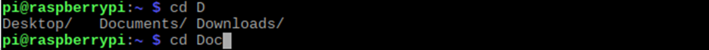

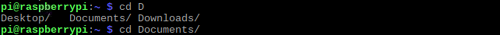

Pi4j Introduction
================================================================

Pi4J is a Java I/O library specially designed for Raspberry Pi platform.

The Pi4J project aims to provide Java programs with access, control and communication to the core I/O functions of the Raspberry Pi, enabling Java programmers to easily access and control the full I/O capabilities of the Raspberry Pi platform. It abstracts the low-level native integration and interrupt monitoring to enable Java programmers to focus on implementing their application business logic.

It is recommended to use JBang to run pi4j code. JBang allows you to execute Java code with dependencies as a single file without the need for a full Maven or Gradle project. You also don’t need to compile your code. So it’s a very easy way to get started with Java and Pi4J.

https://www.pi4j.com/examples/jbang/

To learn more about Pi4J, please refer to the documentation linked below:

https://www.pi4j.com/documentation/

Download Code
****************************************************************

Run the following command to download the code to Raspberry Pi.

.. code-block:: console

    $ cd ~
    $ git clone --depth 1 https://github.com/Freenove/Freenove_Projects_Kit_for_Raspberry_Pi.git

Run the command to rename the folder.

.. code-block:: console

    $ mv Freenove_Projects_Kit_for_Raspberry_Pi/ Freenove_Kit/

Installation of JBang
****************************************************************

Run the following commands one by one to install jbang.

.. code-block:: console

    $ cd ~/Freenove_Kit/Pi4j/Lib
    $ python setup.py

:red:`note that sudo is not applicable here.`

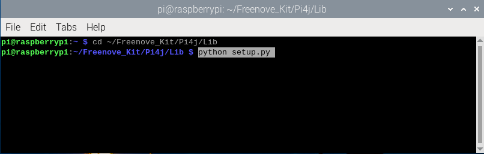

The built-in default-jdk library is not complete, so we need to uninstall and reinstall it.

Enter 'Y' to uninstall it.

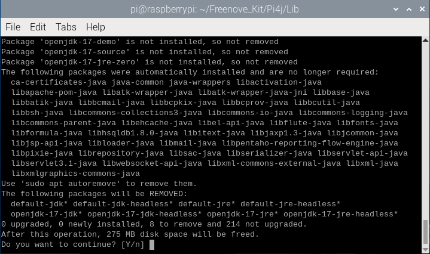

Enter 'Y' again to install the full default-jdk library.

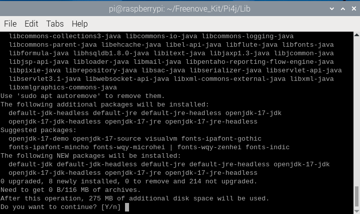

When you see the messages below, it indicates that the installation is almost finished.

You can run the following commands one by one to check whether jbang is installed.

.. code-block:: console

    $ source ~/.bashrc
    $ jbang --version

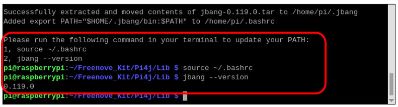

When you see the results as above, it means that jbang is already installed.

Installation of Geany 
****************************************************************

Geany is installed on Raspberry Pi OS by default.

You can run the following command to see if Geany is installed.

.. code-block:: console

    $ geany --version

If geany is not installed on your OS, please run the following command to install it.

.. code-block:: console

    $ sudo apt-get install geany

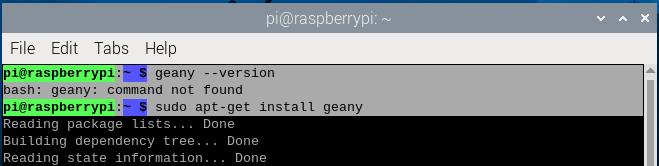

Geany Configuration
****************************************************************

Run the command to open Geany software.

.. code-block:: console

    $ geany

As can be seen below, Geany is open after the command is run.

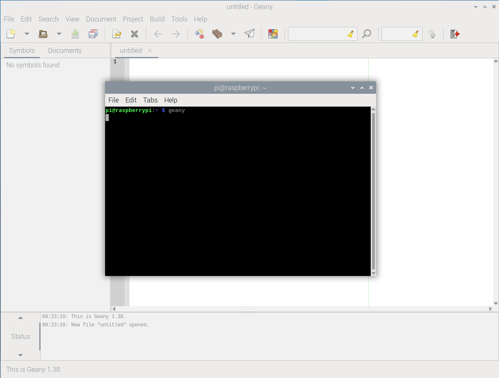

Click Build -> Set Build Commands on the menu bar.

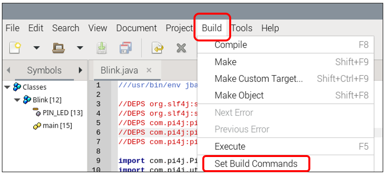

In the pop-up window, enter the following command.

.. code-block:: console

    $ ~/.jbang/bin/jbang "%f"

The detailed operation is as illustrated below:

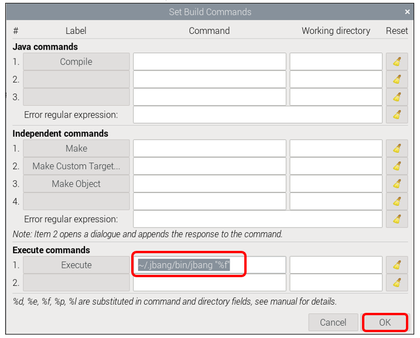

So far, you can use Geany to open, edit, and run the code of the Pi4J tutorial.