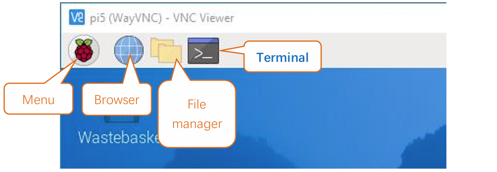
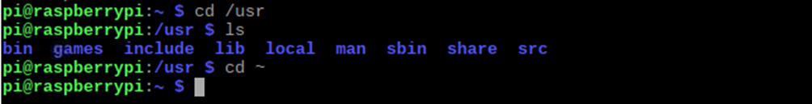
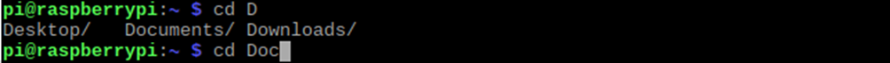

.. _python_preparation:

##############################################################################
0. Chapter Preparation
##############################################################################

Why “Chapter 0”? Because in program code the first number is 0. We choose to follow this rule. In this chapter, we will do some necessary foundational preparation work: Start your Raspberry Pi and install some necessary libraries. 

Linux Command
****************************************************************

Raspberry Pi OS is based on the Linux Operation System. Now we will introduce you to some frequently used Linux commands and rules.

First, open the Terminal. All commands are executed in Terminal. 

When you click the Terminal icon, following interface appears.

.. image:: ../_static/p00-imgs/chapter00-02.png

**Note: The Linux is case sensitive.**

First, type ``ls`` into the Terminal and press the “Enter” key. The result is shown below:

.. image:: ../_static/p00-imgs/chapter00-03.png

The ``ls`` command lists information about the files (the current directory by default).

Content between ``$`` and ``pi@raspberrypi:`` is the current working path. ``~`` represents the user directory, which refers to ``/home/pi`` here. 

.. image:: ../_static/p00-imgs/chapter00-04.png

``cd`` is used to change directory. / represents the root directory. 

Later in this Tutorial, we will often change the working path. Typing commands under the wrong directory may cause errors and break the execution of further commands. 

Many frequently used commands and instructions can be found in the following reference table.
    
+---------------+--------------------------------------------------------------------------------------------------+
| Command       | instruction                                                                                      |
+===============+==================================================================================================+
| ls            | Lists information about the FILEs (the current directory by default) and entries alphabetically. |
+---------------+--------------------------------------------------------------------------------------------------+
| cd            | Changes directory                                                                                |
+---------------+--------------------------------------------------------------------------------------------------+
| sudo + cmd    | Executes cmd under root authority                                                                |
+---------------+--------------------------------------------------------------------------------------------------+
| ./            | Under current directory                                                                          |
+---------------+--------------------------------------------------------------------------------------------------+
| gcc           | GNU Compiler Collection                                                                          |
+---------------+--------------------------------------------------------------------------------------------------+
| git clone URL | Use git tool to clone the contents of specified repository, and URL in the repository address.   |
+---------------+--------------------------------------------------------------------------------------------------+

There are many commands, which will come later. 

.. seealso:: 
    For more details about commands. You can refer to:
    http://www.linux-commands-examples.com

Shortcut Key
================================================================
Now, we will introduce several commonly used shortcuts that are very useful in Terminal.

1. **Up and Down Arrow Keys:** Pressing “↑” (the Up key) will go backwards through the command history and pressing “↓” (the Down Key) will go forwards through the command history.

2. **Tab Key:** The Tab key can automatically complete the command/path you want to type. When there is only one eligible option, the command/path will be completely typed as soon as you press the Tab key even you only type one character of the command/path. 

As shown below, under the '~' directory, you enter the Documents directory with the “cd” command. After typing “cd D”, pressing the Tab key (there is no response), pressing the Tab key again then all the files/folders that begin with “D” will be listed. Continue to type the letters "oc" and then pressing the Tab key, the “Documents” is typed automatically.

.. image:: ../_static/p00-imgs/chapter00-07.png

Install GPIO Zero Python library
****************************************************************

GPIO Zero is a simple interface to GPIO devices with Raspberry Pi. GPIO Zero is installed by default in the Raspberry Pi OS desktop image, and the Raspberry Pi Desktop image for PC/Mac, both available from raspberrypi.org. Follow these guides to installing on Raspberry Pi OS Lite and other operating systems.

GPIO Zero Python library Installation Steps

To install the GPIO Zero Python library, please open the Terminal and then follow the steps and commands below.  

Note: For a command containing many lines, execute them one line at a time.

Enter the following commands **one by one** in the **terminal** to install GPIO Zero:

.. code-block:: console
    
    $ sudo apt-get update
    $ sudo apt install python3-gpiozero

If you're using another operating system on your Raspberry Pi, you may need to use pip to install GPIO Zero instead. Install pip using get-pip and then type:

.. code-block:: console
    
    $ sudo pip3 install gpiozero

Run the gpiozero command to check the installation:

.. code-block:: console
    
    $ pinout  -r REVISION

That should give you some confidence that the installation was a success.

Obtain the Project Code
********************************

After the above installation is completed, you can visit our official website (http://www.freenove.com) or our GitHub resources at (https://github.com/freenove) to download the latest available project code. 

In this tutorial, we provide Python language code for each project.

This is the method for obtaining the code:

In the pi directory of the RPi terminal, enter the following command.

.. code-block:: console
    
    $ cd
    $ git clone --depth 1 https://github.com/freenove/Freenove_Complete_Starter_Kit_for_Raspberry_Pi

:green:`(There is no need for a password. If you get some errors, please check your commands.)`

After the download is completed, a new folder "Freenove_Complete_Starter_Kit_for_Raspberry_Pi" is 

generated, which contains all of the tutorials and required code.

:red:`This folder name seems a little too long. We can simply rename it by using the following command.`

.. code-block:: console
    
    $ mv Freenove_Complete_Starter_Kit_for_Raspberry_Pi Freenove_Kit

"Freenove_Kit" is now the new and much shorter folder name.

If you have no experience with Python, we suggest that you refer to this website for basic information and knowledge. 

https://python.swaroopch.com/basics.html

Python2 & Python3
***************************

Python code, used in our kits, can now run on Python2 and Python3. Python3 is recommend. If you want to use Python2, please make sure your Python version is 2.7 or above. Python2 and Python3 are not fully compatible. However, Python2.6 and Python2.7 are transitional versions to python3, therefore you can also use Python2.6 and 2.7 to execute some Python3 code.

You can type “python2” or “python3” respectively into Terminal to check if python has been installed. Press Ctrl-Z to exit.

Type "python", and Terminal shows that it links to python3.

Set Python3 as default python 
====================================

First, execute python to check the default python on your raspberry Pi. Press Ctrl-Z to exit.

If it is python3, you can skip this section.

If it is python2, you need execute the following commands to set default python to python3.

1.	Enter directory /usr/bin 

.. code-block:: console
    
    $ cd /usr/bin

2.	Delete the originalpython link.

.. code-block:: console
    
    $ sudo rm python

3.	Create new python links to python.

.. code-block:: console
    
    $ sudo ln -s python3 python

4.	Check python. Press Ctrl-Z to exit.

.. code-block:: console
    
    $ python

.. image:: ../_static/imgs/00_06.png
    :align: center

If you want to set python2 as default python in other projects, just repeat the commands above and change python3 to python2.

Shortcut Key
----------------------------

Now, we will introduce several shortcuts that are very :red:`useful` and :red:`commonly` used in terminal.

1. **up and down arrow keys.** History commands can be quickly brought back by using up and down arrow keys, which are very useful when you need to reuse certain commands.

When you need to type commands, pressing "↑" will go backwards through the history of typed commands, and pressing "↓" will go forwards through the history of typed command.

2. **Tab key.** The Tab key can automatically complete the command/path you want to type. When there are multiple commands/paths conforming to the already typed letter, pressing Tab key once won't have any result. And pressing Tab key again will list all the eligible options. This command/path will be completely typed as soon as you press the Tab key when there is only one eligible option.

As shown below, under the '~' directory, enter the Documents directory with the “cd” command. After typing “cd D”, press Tab key, then there is no response. Press Tab key again, then all the files/folders that begin with “D” is listed. Continue to type the character "oc", then press the Tab key, and then “Documents” is completely typed automatically.

