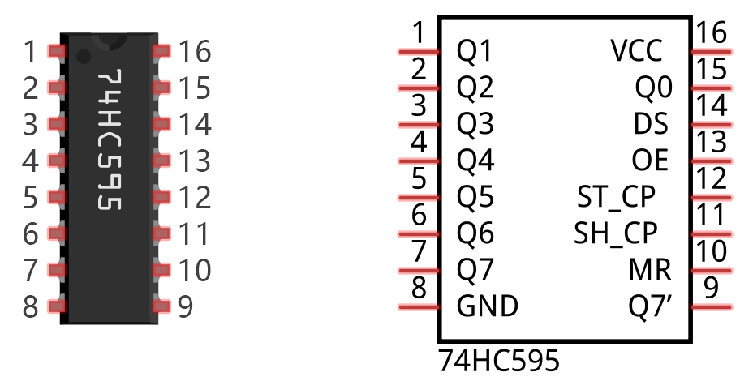

################################################################
Chapter 74HC595 & LED Bar Graph
################################################################

We have used LED Bar Graph to make a flowing water light, in which 10 GPIO ports of RPi are occupied. More GPIO ports mean that more peripherals can be connected to RPi, so GPIO resource is very precious. Can we make flowing water light with less GPIO ports? In this chapter, we will learn a component, 74HC595, which can achieve the target.

Project FollowLight
****************************************************************

Now let us learn how to use the 74HC595 IC Chip to make a flowing water light using less GPIO.

Component List
================================================================

+-------------------------------------------------+-------------------------------------------------+
|1. Raspberry Pi (with 40 GPIO) x1                |                                                 |     
|                                                 |   Jumper Wires x17                              |       
|2. GPIO Extension Board & Ribbon Cable x1        |                                                 |       
|                                                 |     |jumper-wire|                               |                                                            
|3. Breadboard x1                                 |                                                 |                                                                 
+-----------------------------+-------------------+--------------+----------------------------------+
| 74HC595 x1                  | Bar Graph LED x1                 | Resistor 220Ω x8                 |
|                             |                                  |                                  |
|  |74HC595|                  |  |LED-BAR|                       |  |res-220R|                      |
+-----------------------------+----------------------------------+----------------------------------+

.. |jumper-wire| image:: ../_static/imgs/jumper-wire.png
.. |74HC595| image:: ../_static/imgs/74HC595.png
    :width: 20%
.. |LED-BAR| image:: ../_static/imgs/LED-BAR.png
    :width: 100%
.. |res-220R| image:: ../_static/imgs/res-220R.png
    :width: 15%

Component knowledge
================================================================

A 74HC595 chip is used to convert serial data into parallel data. A 74HC595 chip can convert the serial data of one byte into 8 bits, and send its corresponding level to each of the 8 ports correspondingly. With this characteristic, the 74HC595 chip can be used to expand the IO ports of a Raspberry Pi. At least 3 ports on the RPI board are required to control the 8 ports of the 74HC595 chip.

The ports of the 74HC595 chip are described as follows:

+----------+--------------+---------------------------------------------------------------------------+
| Pin name | Pin number   |                    Description                                            |   
+==========+==============+===========================================================================+
| Q0-Q7    | 15, 1-7      | Parallel Data Output                                                      |                   
+----------+--------------+---------------------------------------------------------------------------+                                                  
| VCC      | 16           | The Positive Electrode of the Power Supply, the Voltage is 2~6V           |
+----------+--------------+---------------------------------------------------------------------------+  
| GND      | 8            | The Negative Electrode of Power Supply                                    |
+----------+--------------+---------------------------------------------------------------------------+  
| DS       | 14           | Serial Data Input                                                         |                                      
+----------+--------------+---------------------------------------------------------------------------+
|          |              | Enable Output,                                                            |
|          |              |                                                                           |
| OE       | 13           | When this pin is in high level, Q0-Q7 is in high resistance state         |  
|          |              |                                                                           |  
|          |              | When this pin is in low level, Q0-Q7 is in output mode                    |                                       
+----------+--------------+---------------------------------------------------------------------------+                                                   
|          |              | Parallel Update Output: when its electrical level is rising,              | 
| ST_CP    | 12           |                                                                           |  
|          |              | it will update the parallel data output.                                  |                                      
+----------+--------------+---------------------------------------------------------------------------+
|          |              | Serial Shift Clock: when its electrical level is rising,                  |
| SH_CP    | 11           |                                                                           |
|          |              | it will update the parallel data output.                                  | 
+----------+--------------+---------------------------------------------------------------------------+
|          |              | Remove Shift Register: When this pin is in low level,                     | 
| MR       | 10           |                                                                           |
|          |              | the content in shift register will be cleared.                            | 
+----------+--------------+---------------------------------------------------------------------------+                                                  
|  Q7      | 9            | Serial Data Output: it can be connected to more 74HC595 chips in series.  |                                   
+----------+--------------+---------------------------------------------------------------------------+ 

.. seealso::

    For more details, please refer to the datasheet on the 74HC595 chip.

Circuit
================================================================

+------------------------------------------------------------------------------------------------+
|   Schematic diagram                                                                            |
|                                                                                                |
|   |74HC595-Sc|                                                                                 |
+------------------------------------------------------------------------------------------------+
|   Hardware connection. If you need any support,please feel free to contact us via:             |
|                                                                                                |
|   support@freenove.com                                                                         |
|                                                                                                |
|   |74HC595-Fr|                                                                                 | 
+------------------------------------------------------------------------------------------------+

.. |74HC595-Sc| image:: ../_static/imgs/74HC595-Sc.png
.. |74HC595-Fr| image:: ../_static/imgs/74HC595-Fr.png

Sketch
================================================================

Sketch LightWater
----------------------------------------------------------------

First, observe the result after running the sketch, and then learn about the code in detail.

1.	Use Processing to open the file Sketch_10_1_1_LightWater.

.. code-block:: console    
    
    $ processing ~/Freenove_Kit/Processing/Sketches/Sketch_10_1_1_LightWater/Sketch_10_1_1_LightWater.pde

2.	Click on "RUN" to run the code.

After the program is executed, Display Window shows a virtual LED Bar Graph, which will bright at the same rate and in the same way as the LED Bar Graph in the circuit. Dragging the progress bar can adjust the flow rate of light water.

.. image:: ../_static/imgs/LightWater.png
    :align: center

This project contains a lot of code files, and the core code is contained in the file Sketch_10_1_1_LightWater. The other files only contain some custom classes.

.. image:: ../_static/imgs/LightWater_code.png
    :align: center

The following is program code:

.. literalinclude:: ../../../freenove_Kit/Processing/Sketches/Sketch_10_1_1_LightWater/Sketch_10_1_1_LightWater.pde
    :linenos: 
    :language: java

First define the GPIO pin connected to 74HC595, the ProgressBar class object, IC74HC595 class object, and some other variables.

.. literalinclude:: ../../../freenove_Kit/Processing/Sketches/Sketch_10_1_1_LightWater/Sketch_10_1_1_LightWater.pde
    :linenos: 
    :language: java
    :lines: 9-17
    :dedent:

In the function setup(), instantiate ProgressBar class object and IC74HC595 class object.

.. literalinclude:: ../../../freenove_Kit/Processing/Sketches/Sketch_10_1_1_LightWater/Sketch_10_1_1_LightWater.pde
    :linenos: 
    :language: java
    :lines: 20-22
    :dedent:

In the function draw(), set the background, text, and other information and draw the progress bar.

.. literalinclude:: ../../../freenove_Kit/Processing/Sketches/Sketch_10_1_1_LightWater/Sketch_10_1_1_LightWater.pde
    :linenos: 
    :language: java
    :lines: 26-29
    :dedent:

Then according to the speed of followlight, calculate the data “leds” for 74HC595, and write it to 74HC595, then LEDBar Graph is turned on.

.. literalinclude:: ../../../freenove_Kit/Processing/Sketches/Sketch_10_1_1_LightWater/Sketch_10_1_1_LightWater.pde
    :linenos: 
    :language: java
    :lines: 31-37
    :dedent:

Finally, according to the variable leds, draw the virtual LEDBar Graph on Display Window.

.. literalinclude:: ../../../freenove_Kit/Processing/Sketches/Sketch_10_1_1_LightWater/Sketch_10_1_1_LightWater.pde
    :linenos: 
    :language: java
    :lines: 39-48
    :dedent:

About class IC74HC595:

.. py:function:: class IC74HC595

    This is a custom class that is used to operate integrated circuit 74HC595.

    **public IC74HC595(int dPin, int lPin, int cPin)** 

    Constructor. The parameters are for the GPIO pins connected to 74HC595.
    
    **public void write(int order,int value)**

    Used to write data to 74HC595, and the 74HC595 output port will output these data immediately.