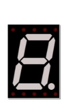

################################################################
Chapter 74HC595 & Seven-segment display.
################################################################

In this chapter, we will learn a new component, Seven-segment display (SSD).

Project Seven -segment display
****************************************************************

We will use 74HC595 to control Seven-segment display (SSD) and make it display decimal character "0-9".

Component List
================================================================

+-------------------------------------------------+-------------------------------------------------+
|1. Raspberry Pi (with 40 GPIO) x1                |                                                 |     
|                                                 |   Jumper Wires x18                              |       
|2. GPIO Extension Board & Ribbon Cable x1        |                                                 |       
|                                                 |     |jumper-wire|                               |                                                            
|3. Breadboard x1                                 |                                                 |                                                                 
+-----------------------------+-------------------+--------------+----------------------------------+
| 74HC595 x1                  | Bar Graph LED x1                 | Resistor 220Ω x8                 |
|                             |                                  |                                  |
|  |74HC595|                  |  |7_Segment_Display|             |  |res-220R|                      |
+-----------------------------+----------------------------------+----------------------------------+

.. |jumper-wire| image:: ../_static/imgs/jumper-wire.png
.. |74HC595| image:: ../_static/imgs/74HC595.png
    :width: 40%

.. |res-220R| image:: ../_static/imgs/res-220R.png
    :width: 20%

Component knowledge
================================================================

7-segment display
----------------------------------------------------------------

A 7-Segment Display is a digital electronic display device. There is a figure "8" and a decimal point represented, which consists of 8 LEDs. The LEDs have a Common Anode and individual Cathodes. Its internal structure and pin designation diagram is shown below:

.. image:: ../_static/imgs/7_Segment_Display_1.png
    :align: center

As we can see in the above circuit diagram, we can control the state of each LED separately. Also, by combining LEDs with different states of ON and OFF, we can display different characters (Numbers and Letters). For example, to display a “0”: we need to turn ON LED segments A, B, C, D, E and F, and turn OFF LED segments G and DP.

.. image:: ../_static/imgs/7_Segment_Display_2.png
    :align: center

In this project, we will use a 7-Segment Display with a Common Anode. Therefore, when there is an input low level to an LED segment the LED will turn ON. Defining segment “A” as the lowest level and segment “DP” as the highest level, from high to low would look like this: “DP”, “G”, “F”, “E”, “D”, “C”, “B”, “A”. Character "0" corresponds to the code: 1100 0000b=0xc0.

Circuit
================================================================

+------------------------------------------------------------------------------------------------+
|   Schematic diagram                                                                            |
|                                                                                                |
|   |7_Segment_Sc|                                                                               |
+------------------------------------------------------------------------------------------------+
|   Hardware connection. If you need any support,please feel free to contact us via:             |
|                                                                                                |
|   support@freenove.com                                                                         |
|                                                                                                |
|   |7_Segment_Fr|                                                                               | 
+------------------------------------------------------------------------------------------------+

.. |7_Segment_Sc| image:: ../_static/imgs/7_Segment_Sc.png
.. |7_Segment_Fr| image:: ../_static/imgs/7_Segment_Fr.png

Sketch
================================================================

Sketch SSD
----------------------------------------------------------------

First observe the result after running the sketch, and then learn about the code in detail.

1.	Use Processing to open the file Sketch_11_1_1_SSD.

.. code-block:: console    
    
    $ processing ~/Freenove_Kit/Processing/Sketches/Sketch_11_1_1_SSD/Sketch_11_1_1_SSD.pde

2.	Click on "RUN" to run the code.

After the program is executed, both Display Window and SSD in the circuit show the same number. And they have the same rate to display number "0-9" constantly. Dragging the progress bar can adjust the speed it increases.

.. image:: ../_static/imgs/SSD.png
    :align: center

This project contains a lot of code files, and the core code is contained in the file Sketch_11_1_1_SSD. The other files only contain some custom classes.

.. image:: ../_static/imgs/SSD_code.png
    :align: center

The following is program code:

.. literalinclude:: ../../../freenove_Kit/Processing/Sketches/Sketch_11_1_1_SSD/Sketch_11_1_1_SSD.pde
    :linenos: 
    :language: c

The project code is similar to the previous chapter. The difference is that in this project the data output by 74HC595 is the fixed coding information of SSD. First, the character "0-9" is defined as code of common anode SSD.

.. code-block:: c

    final int[] numCode = {0xc0, 0xf9, 0xa4, 0xb0, 0x99, 0x92, 0x82, 0xf8, 0x80, 0x90};

In the function draw(), the data is output at a certain speed. At the same time the Display Window outputs the same character.

.. literalinclude:: ../../../freenove_Kit/Processing/Sketches/Sketch_11_1_1_SSD/Sketch_11_1_1_SSD.pde
    :linenos: 
    :language: c
    :lines: 36-44
    :dedent:

By creating the font "mFont", we change the font of the characters on Display Window. The font ".vlw" file is created by clicking the "Create Font" on the menu bar, which is saved in the data folder of current Sketch.

.. code-block:: c

    PFont mFont;
    ......
    mFont = loadFont("DigifaceWide-100.vlw");  //create DigifaceWide font

For more details about loadFont(), please refer to "Help -> Reference -> loadFont()" or the official website: `loadFont() <https://processing.org/reference/loadFont_.html>`_

By creating an empty font, you can reset the font to default font.

.. code-block:: c

    textFont(createFont("", 100));  //default font

.. include:: 74HC595 & 4-7-Segment Display.rst