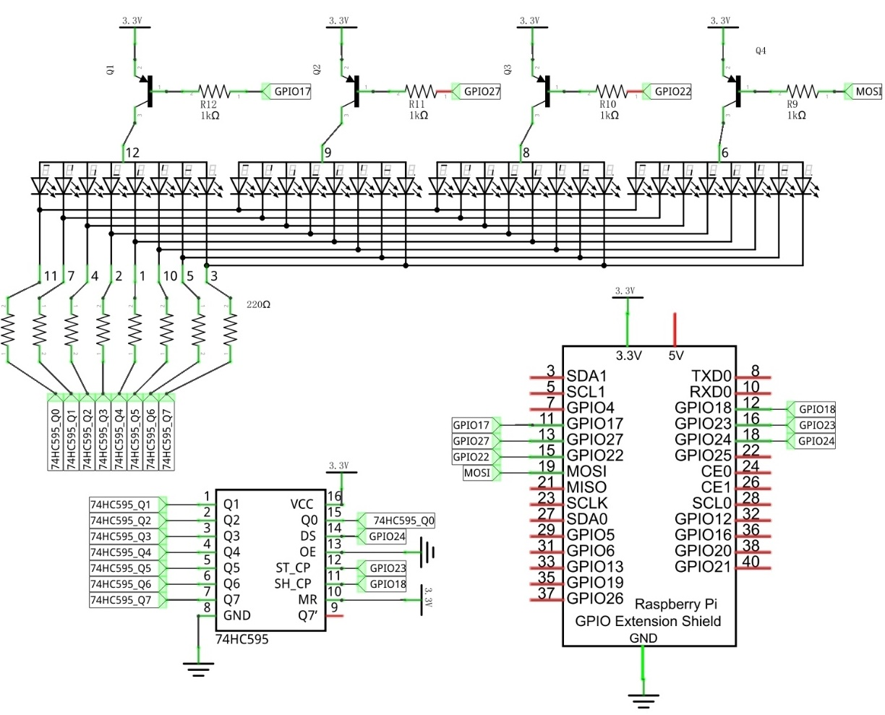
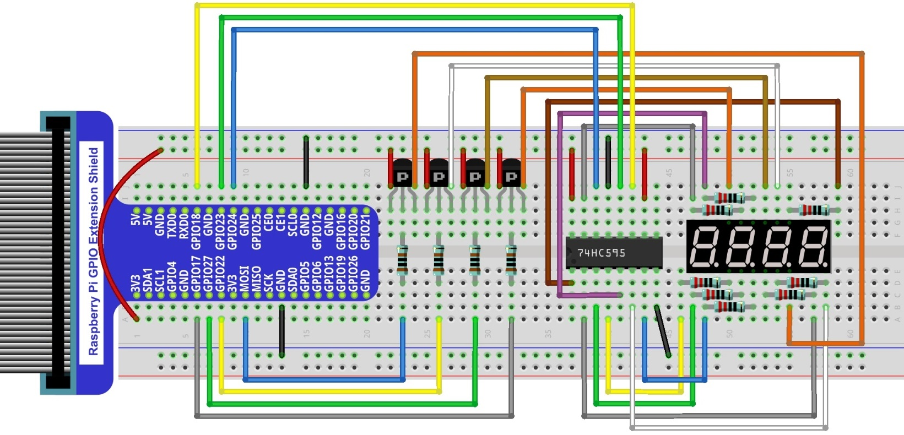

################################################################
Chapter 74HC595 & Seven-segment display.
################################################################

In this chapter, we will learn a new component, Seven-segment display (SSD).

Project Seven -segment display
****************************************************************

We will use 74HC595 to control Seven-segment display (SSD) and make it display decimal character "0-9".

Component List
================================================================

+-------------------------------------------------+-------------------------------------------------+
|1. Raspberry Pi (with 40 GPIO) x1                |                                                 |     
|                                                 |   Jumper Wires x18                              |       
|2. GPIO Extension Board & Ribbon Cable x1        |                                                 |       
|                                                 |     |jumper-wire|                               |                                                            
|3. Breadboard x1                                 |                                                 |                                                                 
+-----------------------------+-------------------+--------------+----------------------------------+
| 74HC595 x1                  | Bar Graph LED x1                 | Resistor 220Ω x8                 |
|                             |                                  |                                  |
|  |74HC595|                  |  |7_Segment_Display|             |  |res-220R|                      |
+-----------------------------+----------------------------------+----------------------------------+

.. |jumper-wire| image:: ../_static/imgs/jumper-wire.png
.. |74HC595| image:: ../_static/imgs/74HC595.png
    :width: 40%
.. |7_Segment_Display| image:: ../_static/imgs/7_Segment_Display.png
    :width: 100%
.. |res-220R| image:: ../_static/imgs/res-220R.png
    :width: 20%

Component knowledge
================================================================

7-segment display
----------------------------------------------------------------

A 7-Segment Display is a digital electronic display device. There is a figure "8" and a decimal point represented, which consists of 8 LEDs. The LEDs have a Common Anode and individual Cathodes. Its internal structure and pin designation diagram is shown below:

.. image:: ../_static/imgs/7_Segment_Display_1.png
    :align: center

As we can see in the above circuit diagram, we can control the state of each LED separately. Also, by combining LEDs with different states of ON and OFF, we can display different characters (Numbers and Letters). For example, to display a “0”: we need to turn ON LED segments A, B, C, D, E and F, and turn OFF LED segments G and DP.

.. image:: ../_static/imgs/7_Segment_Display_2.png
    :align: center

In this project, we will use a 7-Segment Display with a Common Anode. Therefore, when there is an input low level to an LED segment the LED will turn ON. Defining segment “A” as the lowest level and segment “DP” as the highest level, from high to low would look like this: “DP”, “G”, “F”, “E”, “D”, “C”, “B”, “A”. Character "0" corresponds to the code: 1100 0000b=0xc0.

Circuit
================================================================

+------------------------------------------------------------------------------------------------+
|   Schematic diagram                                                                            |
|                                                                                                |
|   |7_Segment_Sc|                                                                               |
+------------------------------------------------------------------------------------------------+
|   Hardware connection. If you need any support,please feel free to contact us via:             |
|                                                                                                |
|   support@freenove.com                                                                         |
|                                                                                                |
|   |7_Segment_Fr|                                                                               | 
+------------------------------------------------------------------------------------------------+

.. |7_Segment_Fr| image:: ../_static/imgs/7_Segment_Fr.png

Sketch
================================================================

Sketch 11.1.1 SSD
----------------------------------------------------------------

First observe the result after running the sketch, and then learn about the code in detail.

1.	Use Processing to open the file Sketch_11_1_1_SSD.

.. code-block:: console    
    
    $ processing ~/Freenove_Kit/Processing/Sketches/Sketch_11_1_1_SSD/Sketch_11_1_1_SSD.pde

2.	Click on "RUN" to run the code.

After the program is executed, both Display Window and SSD in the circuit show the same number. And they have the same rate to display number "0-9" constantly. Dragging the progress bar can adjust the speed it increases.

This project contains a lot of code files, and the core code is contained in the file Sketch_11_1_1_SSD. The other files only contain some custom classes.

The following is program code:

.. literalinclude:: ../../../freenove_Kit/Code/Processing_Code/Sketches/Sketch_11_1_1_SSD/Sketch_11_1_1_SSD.pde
    :linenos: 
    :language: c

The project code is similar to the previous chapter. The difference is that in this project the data output by 74HC595 is the fixed coding information of SSD. First, the character "0-9" is defined as code of common anode SSD.

.. code-block:: c

    final int[] numCode = {0xc0, 0xf9, 0xa4, 0xb0, 0x99, 0x92, 0x82, 0xf8, 0x80, 0x90};

In the function draw(), the data is output at a certain speed. At the same time the Display Window outputs the same character.

.. literalinclude:: ../../../freenove_Kit/Code/Processing_Code/Sketches/Sketch_11_1_1_SSD/Sketch_11_1_1_SSD.pde
    :linenos: 
    :language: c
    :lines: 36-44

By creating the font "mFont", we change the font of the characters on Display Window. The font ".vlw" file is created by clicking the "Create Font" on the menu bar, which is saved in the data folder of current Sketch.

.. code-block:: c

    PFont mFont;
    ......
    mFont = loadFont("DigifaceWide-100.vlw");  //create DigifaceWide font

For more details about loadFont(), please refer to "Help->Reference->loadFont()" or the official website: https://processing.org/reference/loadFont_.html 

By creating an empty font, you can reset the font to default font.

.. code-block:: c

    textFont(createFont("", 100));  //default font

Project 4-Digit 7-Segment Display
****************************************************************

Now, let's try to control more-than-one digit displays by using a Four 7-Segment Display in one project.

Component List
================================================================

+-------------------------------------------------+-------------------------------------------------+
|1. Raspberry Pi (with 40 GPIO) x1                |                                                 |     
|                                                 |   Jumper Wires x18                              |       
|2. GPIO Extension Board & Ribbon Cable x1        |                                                 |       
|                                                 |     |jumper-wire|                               |                                                            
|3. Breadboard x1                                 |                                                 |                                                                 
+-----------------------------+-------------------+--------------+----------------------------------+
| 74HC595 x1                  | Resistor 1KΩ x4                  | Resistor 220Ω x8                 |
|                             |                                  |                                  |
|  |74HC595|                  |  |Resistor-1kΩ|                  |  |res-220R|                      |
+-----------------------------+-------------------+--------------+----------------------------------+
| 4-Digit 7-Segment Display x1                    | PNP transistor x4                               |       
|                                                 |                                                 |                                                            
|  |4_7_Segment_Display|                          |  |PNP|                                          | 
+-------------------------------------------------+-------------------------------------------------+

.. |jumper-wire| image:: ../_static/imgs/jumper-wire.png
.. |74HC595| image:: ../_static/imgs/74HC595.png
    :width: 30%
.. |4_7_Segment_Display| image:: ../_static/imgs/4_7_Segment_Display.png
    :width: 70%
.. |res-220R| image:: ../_static/imgs/res-220R.png
    :width: 20%
.. |PNP| image:: ../_static/imgs/PNP.png
.. |Resistor-1kΩ| image:: ../_static/imgs/Resistor-1kΩ.png
    :width: 25%

Component knowledge
================================================================

4 Digit 7-Segment Display
----------------------------------------------------------------

A 4 Digit 7-segment display integrates four 7-Segment Displays into one module, therefore it can display more characters. All of the LEDs contained have a Common Anode and individual Cathodes. Its internal structure and pin designation diagram is shown below:

.. image:: ../_static/imgs/4_7_Segment_Display_1.png
    :align: center
    :width: 60%

The internal electronic circuit is shown below, and all 8 LED cathode pins of each 7-Segment Display are connected together.

.. image:: ../_static/imgs/4_7_Segment_Display_2.png
    :align: center

Display method of 4 Digit 7-segment display is similar to 1 Digit 7-segment display. The difference between them is that the 4-Digit displays each Digit is visible in turn, one by one and not together. We need to first send high level to the common end of the first Digit Display, and send low level to the remaining three common ends, and then send content to 8 LED cathode pins of the first Digit Display. At this time, the first 7-Segment Display will show visible content and the remaining three will be OFF.

Similarly, the second, third and fourth 7-Segment Displays will show visible content in turn by scanning the display. Although the four number characters are displayed in turn separately, this process is so very fast that it is unperceivable to the naked eye. This is due to the principle of optical afterglow effect and the vision persistence effect in human sight. This is how we can see all 4 number characters at the same time. However, if each number character is displayed for a longer period, you will be able to see that the number characters are displayed separately. 

Circuit
================================================================

+------------------------------------------------------------------------------------------------+
|   Schematic diagram                                                                            |
|                                                                                                |
|   |4_7_Segment_Sc|                                                                             |
+------------------------------------------------------------------------------------------------+
|   Hardware connection                                                                          |
|                                                                                                |
|   |4_7_Segment_Fr|                                                                             | 
+------------------------------------------------------------------------------------------------+

Sketch
================================================================

In this project, open an independent thread to control the FDSSD. The uncertainty of the system time slice allocation may lead FDSS to flash on the display, which is a normal phenomenon. For details about display principle of FDSSD, please refer to our C and Python manual.

Sketch 11.2.1 FDSSD
----------------------------------------------------------------

First observe the result after running the sketch, and then learn about the code in detail.
1.	Use Processing to open the file Sketch_11_2_1_FDSSD.

.. code-block:: console    
    
    $ processing ~/Freenove_Kit/Processing/Sketches/Sketch_11_2_1_FDSSD/Sketch_11_2_1_FDSSD.pde

2.	Click on "RUN" to run the code.

After the program is executed, Display Window and FDSSD in the circuit will show same figures, and they have the same add-self rate. They will constantly show the number of "0-9999" circularly. And dragging the progress bar can change the rate. 

.. image:: ../_static/imgs/FD_SSD.png
    :align: center

This project contains several code files, as shown below:

.. image:: ../_static/imgs/FD_SSD_code.png
    :align: center

The following is program code:

.. literalinclude:: ../../../freenove_Kit/Code/Processing_Code/Sketches/Sketch_11_2_1_FDSSD/Sketch_11_2_1_FDSSD.pde
    :linenos: 
    :language: c

This project code is similar to the previous section "SSD". The difference is that this project needs to control four SSD. The four coanodes of four SSD is controlled by four GPIO through 4 transistors. First, the four GPIO should be defined.

.. code-block:: c
    
    int[] digitPin = {17, 27, 22, 10};

In a separate thread, make the FDSSD display numbers in scan mode. Subfunction display() is used to make FDSSD display a four-digit number.

.. code-block:: c
    
    thread("displaySSD");
    ......
    void displaySSD() {
        while (true) {
            display(index);
        }
    }

Other contents of the program are the same as the previous section "SSD".
