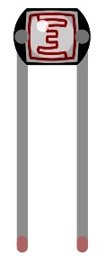

################################################################
Chapter ADC & LED
################################################################

In this chapter, we will combine ADC and PWM to control the brightness of LED.

Project SoftLight
****************************************************************

In this project, we will make a softlight, which uses a potentiometer to control the brightness of LED.

Component List
================================================================

+---------------------------------------------------------------------------------+
|1. Raspberry Pi (with 40 GPIO) x1                                                |     
|                                                                                 |       
|2. GPIO Extension Board & Ribbon Cable x1                                        |       
|                                                                                 |                                                            
|3. Breadboard x1                                                                 |                                                                 
+=================================================+===============================+
| Rotary potentiometer x1                         |   Resistor 10kΩ x2            |
|                                                 |                               |
| |Rotary-potentiometer|                          |  |Resistor-10kΩ|              |                           
+-------------------------------------------------+-------------------------------+
| ADC module x1 (Only one)                        |   LED x1                      |
|                                                 |                               |
| |ADC-module-1|   :xx-large:`or`  |ADC-module-2| |   |red-led|                   |                   
|                                                 |                               |  
+-------------------------------------------------+-------------------------------+
|   Jumper Wire M/M x17                                                           |
|                                                                                 | 
|      |jumper-wire|                                                              |
+---------------------------------------------------------------------------------+

.. |jumper-wire| image:: ../_static/imgs/jumper-wire.png
    :width: 70%
.. |Resistor-10kΩ| image:: ../_static/imgs/Resistor-10kΩ.png
    :width: 15%
.. |Rotary-potentiometer| image:: ../_static/imgs/Rotary-potentiometer.png
    :width: 25%
.. |ADC-module-1| image:: ../_static/imgs/ADC-module-1.png
.. |ADC-module-2| image:: ../_static/imgs/ADC-module-2.png
.. |red-led| image:: ../_static/imgs/red-led.png
    :width: 35%

Circuit with ADS7830
================================================================

+------------------------------------------------------------------------------------------------+
|   Schematic diagram                                                                            |
|                                                                                                |
|   |ADS7830-Schematic-2|                                                                        |
+------------------------------------------------------------------------------------------------+
|   Hardware connection. If you need any support,please feel free to contact us via:             |
|                                                                                                |
|   support@freenove.com                                                                         |
|                                                                                                |
|   |ADS7830-fritizing-2|                                                                        |
+------------------------------------------------------------------------------------------------+

.. |ADS7830-Schematic-2| image:: ../_static/imgs/ADS7830-Schematic-2.png
.. |ADS7830-fritizing-2| image:: ../_static/imgs/ADS7830-fritizing-2.png

Circuit with PCF8591
================================================================

+------------------------------------------------------------------------------------------------+
|   Schematic diagram                                                                            |
|                                                                                                |
|   |PCF8591-Schematic-2|                                                                        |
+------------------------------------------------------------------------------------------------+
|   Hardware connection.                                                                         |
|                                                                                                |
|   |PCF8591-fritizing-2|                                                                        |
+------------------------------------------------------------------------------------------------+

.. |PCF8591-fritizing-2| image:: ../_static/imgs/PCF8591-fritizing-2.png

Sketch
================================================================

If you did not configure I2C, please refer to Chapter 6. If you did, please move on.

Sketch SoftLight
----------------------------------------------------------------

First, observe the result after running the sketch, and then learn about the code in detail.

1.	Use Processing to open the file Sketch_07_1_1_SoftLight.

.. code-block:: console

    $ processing ~/Freenove_Kit/Processing/Sketches/Sketch_07_1_1_SoftLight/Sketch_07_1_1_SoftLight.pde
    
2.	Click on "RUN" to run the code.

After the program is executed, the Display Window will show the voltage value of potentiometer, the ADC value and an LED pattern. Rotate potentiometer to change the voltage value and the brightness of the LED.

This project contains a lot of code files, and the core code is contained in the file Sketch_07_1_1_SoftLight. The other files only contain some custom classes.

The following is program code:

.. literalinclude:: ../../../freenove_Kit/Processing/Sketches/Sketch_07_1_1_SoftLight/Sketch_07_1_1_SoftLight.pde
    :linenos: 
    :language: java

In this project code, get the ADC value of the potentiometer, then map it into the PWM duty cycle of LED to control its brightness. In Display Window, the color filled in LED pattern changes to simulate the brightness change of LED.

.. literalinclude:: ../../../freenove_Kit/Processing/Sketches/Sketch_07_1_1_SoftLight/Sketch_07_1_1_SoftLight.pde
    :linenos: 
    :language: java
    :lines: 25-28
    :dedent:

Project NightLamp
****************************************************************

A Photoresistor is very sensitive to the amount of light present. We can take advantage of the characteristic to make a nightlight with the following function. When the ambient light is less (darker environment), the LED will automatically become brighter to compensate and when the ambient light is greater (brighter environment) the LED will automatically dim to compensate.

Component List
================================================================

+-------------------------------------------------+-------------------------------+
|1. Raspberry Pi (with 40 GPIO) x1                |    220Ω x1                    |     
|                                                 |                               |       
|2. GPIO Extension Board & Ribbon Cable x1        |   |res-220R|                  |       
|                                                 |                               |                                                            
|3. Breadboard x1                                 |                               |                                                                 
+-------------------------------------------------+-------------------------------+
| Jumper Wire M/M                                 |   Resistor 10kΩ x3            |
|                                                 |                               |
| |jumper-wire|                                   |  |Resistor-10kΩ|              |                           
+-------------------------------------------------+-------------------------------+
| ADC module x1 (Only one)                                                        |
|                                                                                 |
| |ADC-module-1|   :xx-large:`or`  |ADC-module-2|                                 |                   
+-------------------------------------------------+-------------------------------+
| Phtotresistor x1                                |  LED x1                       |
|                                                 |                               |
|   |Phtotresistor|                               |   |red-led|                   |                    
+-------------------------------------------------+-------------------------------+

.. |res-220R| image:: ../_static/imgs/res-220R.png
    :width: 20%

Circuit with ADS7830
================================================================

The circuit used is similar to the Soft light project. The only difference is that the input signal of the AIN0 pin of ADC changes from a Potentiometer to a combination of a Photoresistor and a Resistor.

+------------------------------------------------------------------------------------------------+
|   Schematic diagram                                                                            |
|                                                                                                |
|   |ADS7830-Schematic-4|                                                                        |
+------------------------------------------------------------------------------------------------+
|   Hardware connection. If you need any support,please feel free to contact us via:             |
|                                                                                                |
|   support@freenove.com                                                                         |
|                                                                                                |
|   |ADS7830-fritizing-5|                                                                        |
|                                                                                                |
|    **Video:** https://youtu.be/r6p3zhXsyko                                                     |
+------------------------------------------------------------------------------------------------+

.. |ADS7830-Schematic-4| image:: ../_static/imgs/ADS7830-Schematic-4.png

Circuit with PCF8591
================================================================

The circuit used is similar to the Soft light project. The only difference is that the input signal of the AIN0 pin of ADC changes from a Potentiometer to a combination of a Photoresistor and a Resistor.

+------------------------------------------------------------------------------------------------+
|   Schematic diagram                                                                            |
|                                                                                                |
|   |PCF8591-Schematic-4|                                                                        |
+------------------------------------------------------------------------------------------------+
|   Hardware connection.                                                                         |
|                                                                                                |
|   |PCF8591-fritizing-4|                                                                        |
+------------------------------------------------------------------------------------------------+

.. |PCF8591-fritizing-4| image:: ../_static/imgs/PCF8591-fritizing-4.png

The formula for calculating temperature according to the circuit is shown below:

.. math:: T2 = 1/(1/T1 + ln(Rt/R)/B)

Sketch
================================================================

The project code is the same as the previous section "SoftLight" except for the title.