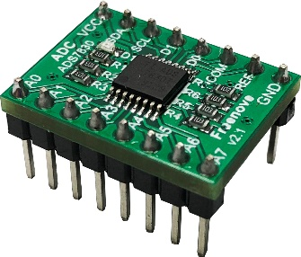
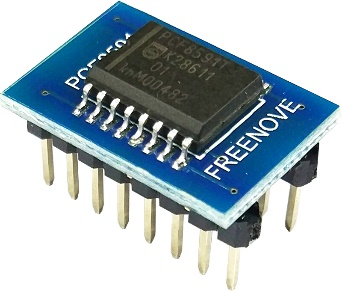
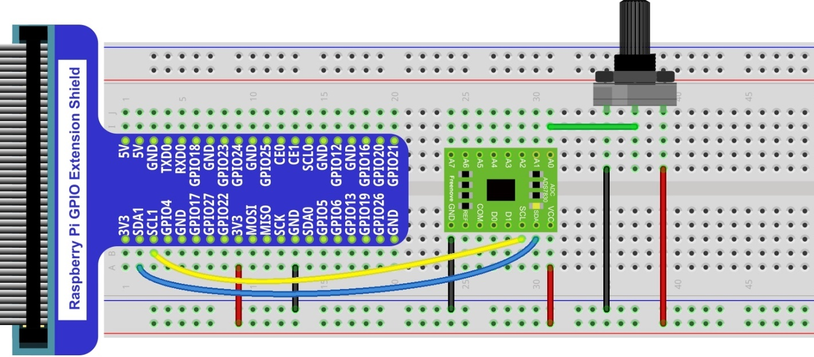
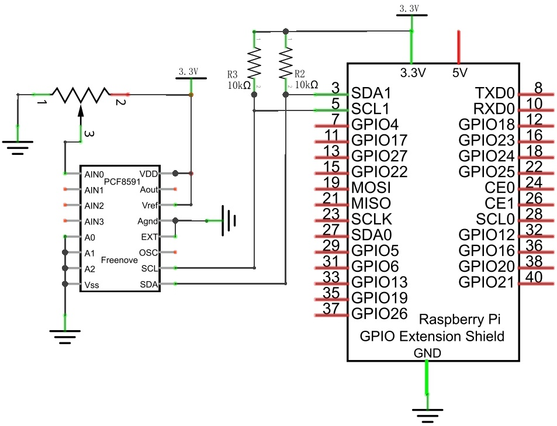
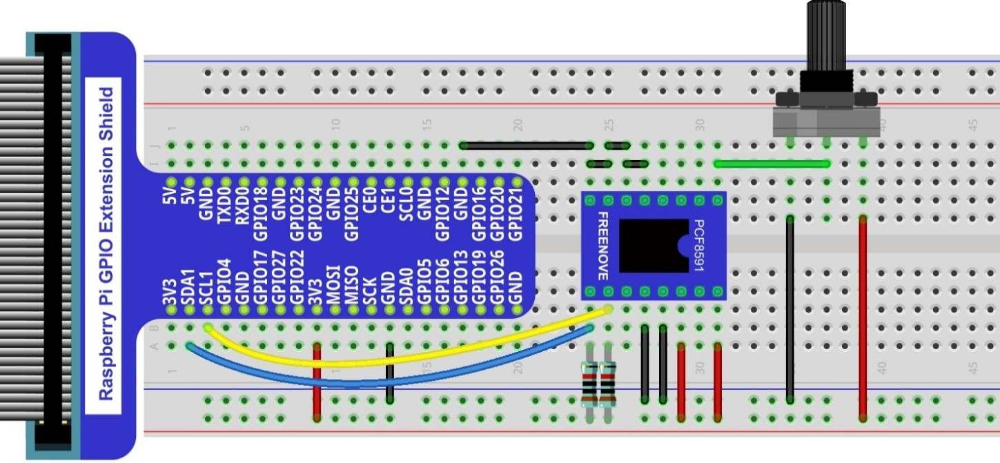
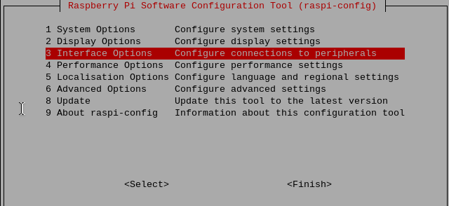
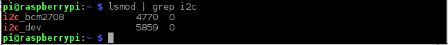
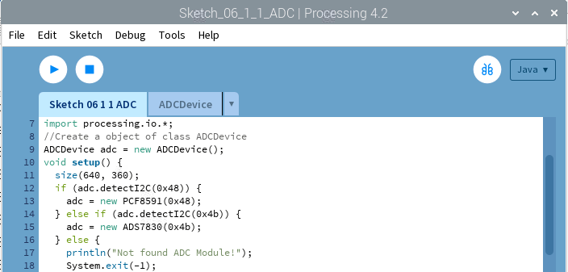

################################################################
Chapter ADC Module
################################################################

In this chapter we will learn how to use an ADC module.

Project Voltmeter
****************************************************************

This project uses an ADC module to read potentiometer voltage value and display the value on Display Window.

Component List
================================================================

+---------------------------------------------------------------+
|1. Raspberry Pi (with 40 GPIO) x1                              |     
|                                                               |       
|2. GPIO Extension Board & Ribbon Cable x1                      |       
|                                                               |                                                            
|3. Breadboard x1                                               |                                                                 
+===============================+===============================+
| Rotary potentiometer x1       |   Resistor 10kΩ x2            |
|                               |                               |
| |Rotary-potentiometer|        |  |Resistor-10kΩ|              |                           
+-------------------------------+-------------------------------+
| ADC module x1                                                 |
|                                                               |
|   |ADC-module-1|   :xx-large:`or`  |ADC-module-2|             |                   
|                                                               |  
+---------------------------------------------------------------+
|   Jumper Wire                                                 |
|                                                               | 
|      |jumper-wire|                                            |
+---------------------------------------------------------------+

.. |jumper-wire| image:: ../_static/imgs/jumper-wire.png
    :width: 70%   
.. |Resistor-10kΩ| image:: ../_static/imgs/Resistor-10kΩ.png
    :width: 15%
.. |Rotary-potentiometer| image:: ../_static/imgs/Rotary-potentiometer.png
    :width: 35%
.. |ADC-module-1| image:: ../_static/imgs/ADC-module-1.png
.. |ADC-module-2| image:: ../_static/imgs/ADC-module-2.png

This product contains only one ADC module, there are two types, PCF8591 and ADS7830. For the projects described in this tutorial, they function the same. Please build corresponding circuits according to the ADC module found in your Kit.

+---------------------------------------------------------------+----------------------------------------------------------------+
|                      ADC module: PCF8591                      |                      ADC module: ADS7830                       |                                 
+===============================+===============================+===============================+================================+
|         Model diagram         |         Actual Picture        |         Model diagram         |         Actual Picture         |
|                               |                               |                               |                                |
||ADC-module-1|                 ||PCF8591|                      ||ADC-module-2|                 ||ADS7830|                       |                           
+-------------------------------+-------------------------------+-------------------------------+--------------------------------+

Circuit with ADS7830 
================================================================

+------------------------------------------------------------------------------------------------+
|   Schematic diagram                                                                            |
|                                                                                                |
|   |ADS7830-Schematic|                                                                          |
+------------------------------------------------------------------------------------------------+
|   Hardware connection. If you need any support,please feel free to contact us via:             |
|                                                                                                |
|   support@freenove.com                                                                         |
|                                                                                                |
|   **This product contains only one ADC module.**                                               |
|                                                                                                |
|   |ADS7830-fritizing|                                                                          |
+------------------------------------------------------------------------------------------------+

.. |ADS7830-Schematic| image:: ../_static/imgs/ADS7830-Schematic.png
        :width: 80%

Circuit with PCF8591
================================================================

+------------------------------------------------------------------------------------------------+
|   Schematic diagram                                                                            |
|                                                                                                |
|   |PCF8591-Schematic|                                                                          |
+------------------------------------------------------------------------------------------------+
|   Hardware connection.                                                                         |
|                                                                                                |
|   |PCF8591-fritizing|                                                                          |
|                                                                                                |
| Please keep the **chip mark** consistent to make the chips under right direction and position. |
+------------------------------------------------------------------------------------------------+

Configure I2C and Install Smbus 
================================================================

Enable I2C
----------------------------------------------------------------

The I2C interface in Raspberry Pi is disabled by default. You will need to open it manually and enable the I2C interface as follows:

Type command in the Terminal:

.. code-block:: console
    
    $ sudo raspi-config

Then open the following dialog box:

Choose “3 Interfacing Options” then “I4 I2C” then “Yes” and then “Finish” in this order and restart your RPi. The I2C module will then be started.

Type a command to check whether the I2C module is started:

.. code-block:: console

    $ lsmod | grep i2c

If the I2C module has been started, the following content will be shown. “bcm2708" refers to the CPU model. Different models of Raspberry Pi display different contents depending on the CPU installed:

Install I2C-Tools
----------------------------------------------------------------

Next, type the command to install I2C-Tools. It is available with the Raspberry Pi OS by default.

.. code-block:: console

    $ sudo apt-get install i2c-tools

I2C device address detection:

.. code-block:: console

    $ i2cdetect -y 1

When you are using the PCF8591 Module, the result should look like this:

Here, 48 (HEX) is the I2C address of ADC Module (PCF8591).

When you are using ADS, the result should look like this:

.. image:: ../_static/imgs/Enable-I2C-4.png
        :width: 100%
        :align: center

Here, 4b (HEX) is the I2C address of ADC Module (ADS7830).

Sketch 6.1.1 ADC
----------------------------------------------------------------

First, observe the result after running the sketch, and then learn about the code in detail.

1.	Use Processing to open the file Sketch_06_1_1_ADC.

.. code-block:: console

    $ processing ~/Freenove_Kit/Processing/Sketches/Sketch_06_1_1_ADC/Sketch_06_1_1_ADC.pde

2.	Click on "RUN" to run the code.

After the program is executed, Display Window shows the voltage value of the potentiometer and the ADC value. Rotate the potentiometer to change the voltage output by potentiometer.

This project contains a lot of code files, and the core code is contained in the file Sketch_06_1_1_ADC. The other files only contain some custom classes.

The following is program code:

.. literalinclude:: ../../../freenove_Kit/Code/Processing_Code/Sketches/Sketch_06_1_1_ADC/Sketch_06_1_1_ADC.pde
    :linenos: 
    :language: java

The code of this project mainly uses PCF8591 class member function analogRead() to read ADC.

.. literalinclude:: ../../../freenove_Kit/Code/Processing_Code/Sketches/Sketch_06_1_1_ADC/Sketch_06_1_1_ADC.pde
    :linenos: 
    :language: java
    :lines: 23-24

About class ADCDevice, PCF8591, ADS7830:

.. c:function:: class ADCDevice 

    This is a base class, and all ADC module classes are subclasses of it. It provides two basic member functions.

    public int analogRead(int chn)
    
    This is a unified function name. Different chips have different implement methods. Therefore, specific method is implemented in subclasses.

    public boolean detectI2C(int addr)
    
    Used to detect I2C device with a given address. If it exists, it returns true, otherwise it returns false.

.. c:function:: class PCF8591 extends ADCDevice

    This is a custom class that is used to operate the ADC and DAC of PCF8591.

    public PCF8591(int addr)

    Constructor, used to create a PCF8591 class object, parameters for the I2C PCF8591 device address.

    public int analogRead(int chn)

    Used to read ADC value of one channel of PCF8591, the parameter CHN indicates the channel number: 0,1,2,3.

    public byte[] analogRead()

    To read ADC values of all channels of PCF8591.

    public void analogWrite(int data)

    Write a DAC value to PCF8591.

.. c:function:: class ADS7830 extends ADCDevice

    This is a custom class that is used to operate the ADC of ADS7830.
    
    public ADS7830(int addr)

    Constructor, used to create a ADS7830 class object, parameters for the I2C ADS7830 device address.
    
    public int analogRead(int chn)
    
    Used to read ADC value of one channel of ADS7830, the parameter CHN indicates the channel number: 0,1,2,3,4,5,6,7.
