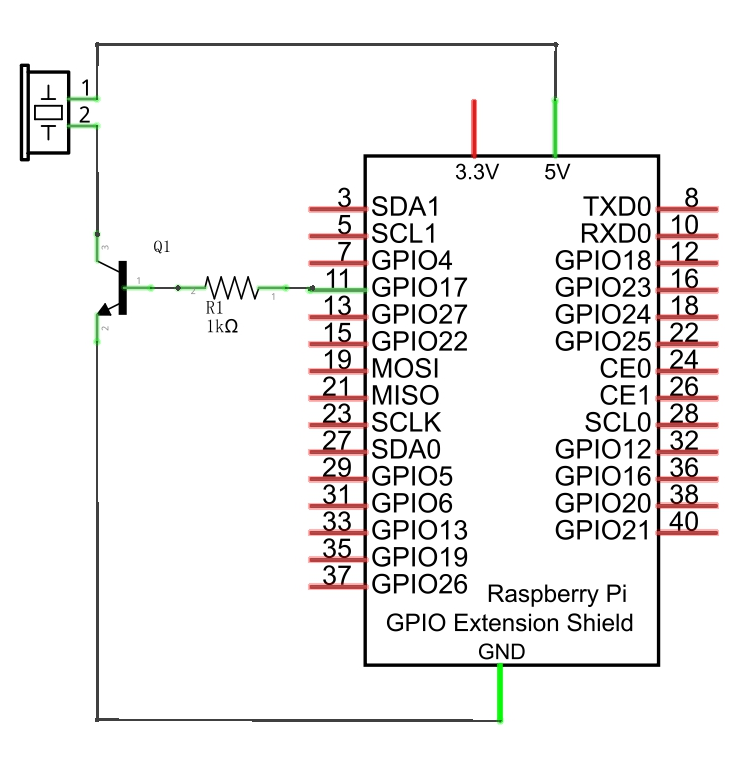
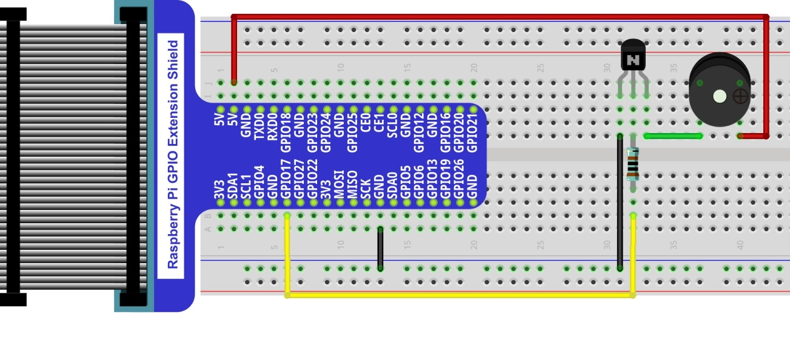
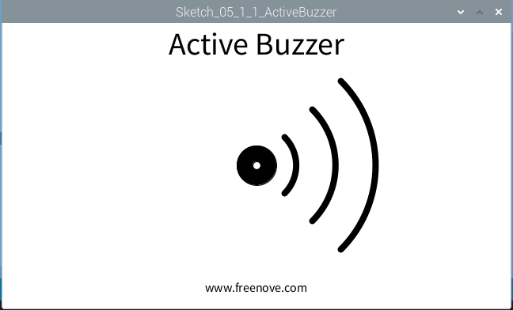

################################################################
Chapter Buzzer
################################################################

In this chapter, we will learn about buzzers and the sounds they make. And in our next project, we will use an active buzzer to make a doorbell and a passive buzzer to make an alarm.

Project Doorbell
****************************************************************
We will make a doorbell with this functionality: when the Push Button Switch is pressed the buzzer sounds and when the button is released, the buzzer stops. This is a momentary switch function.

+-----------------------------------------------------------+
|    Raspberry Pi (with 40 GPIO) x1                         |     
|                                                           |       
|    GPIO Extension Board & Ribbon Cable x1                 |       
|                                                           |                                                            
|    Breadboard x1                                          |                                                                 
+---------------------------+-------------------------------+
| Jumper Wire               |   Active buzzer x1            |
|                           |                               |
|  |jumper-wire|            |  |Active-buzzer|              |                       
+---------------------------+-------------------------------+
| NPN transistorx1          | Resistor 10kΩ x2              |
|                           |                               |
| |NPN-transistor|          | |Resistor-10kΩ|               |
+-----------------------------------------------------------+

.. |jumper-wire| image:: ../_static/imgs/jumper-wire.png
    :width: 30%
.. |Resistor-10kΩ| image:: ../_static/imgs/Resistor-10kΩ.png
    :width: 20%
.. |Active-buzzer| image:: ../_static/imgs/Active-buzzer.png
    :width: 30%
.. |NPN-transistor| image:: ../_static/imgs/NPN-transistor.png
    :width: 30%

Circuit
================================================================

+------------------------------------------------------------------------------------------------+
|  Schematic diagram with RPi GPIO Extension Shield                                              |
|                                                                                                |
|   |pr_Buzzer_Sc|                                                                               |
+------------------------------------------------------------------------------------------------+
|   Hardware connection. If you need any support,please feel free to contact us via:             |
|                                                                                                |
|   support@freenove.com                                                                         | 
|                                                                                                |
|   |pr_Buzzer_Fr|                                                                               |
+------------------------------------------------------------------------------------------------+

.. note:: 
    in this circuit, the power supply for the buzzer is 5V, and pull-up resistor of the push button switch is connected to the 3.3V power feed. Actually, the buzzer can work when connected to the 3.3V power feed but this will produce a weak sound from the buzzer (not very loud).

Sketch
================================================================

Sketch 5.1.1 ActiveBuzzer
----------------------------------------------------------------

First, observe the result after running the sketch, and then learn about the code in detail.

1.	Use Processing to open the file Sketch_05_1_1_ActiveBuzzer.

.. code-block:: console    
    
    $ processing ~/Freenove_Kit/Processing/Sketches/Sketch_05_1_1_ActiveBuzzer/Sketch_05_1_1_ActiveBuzzer.pde

2.	Click on "RUN" to run the code.

After the program is executed, use the mouse to click on any position of the Display Window, then Active Buzzer begins to sound and arc graphics (Schematic of sounding) will appear next to the buzzer pattern on Display Window. Click the mouse again, then Active Buzzer stops sounding and arc graphics disappear.

The following is program code:

.. literalinclude:: ../../../freenove_Kit/Code/Processing_Code/Sketches/Sketch_05_1_1_ActiveBuzzer/Sketch_05_1_1_ActiveBuzzer.pde
    :linenos: 
    :language: java

Code in this project is logically the same as previous "MouseLED" project. And the difference is that this project needs to draw the buzzer pattern and arc graphics after the buzzer sounding.

