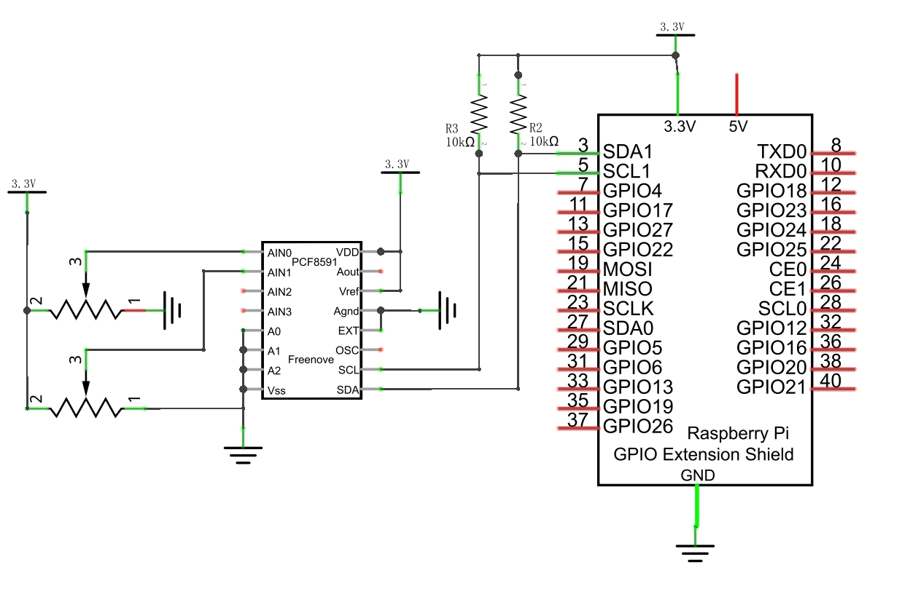
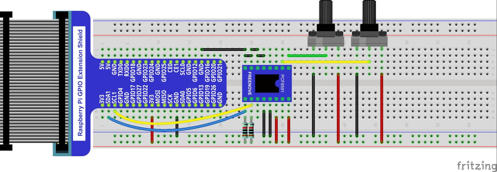
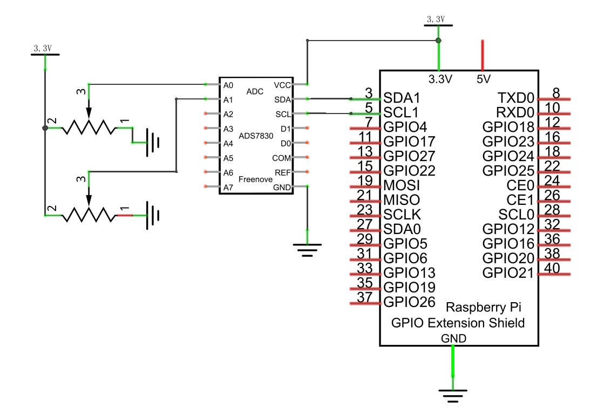
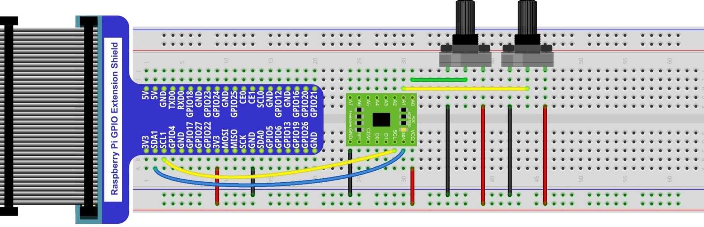
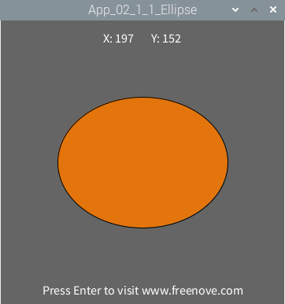

################################################################
Chapter Thermistor
################################################################

In this chapter, we will use a potentiometer to make the graphics change in Processing.

App Ellipse
****************************************************************

This project uses two potentiometers to control the size and shape of an ellipse respectively.

Component List
================================================================

+---------------------------------------------------------------+
|1. Raspberry Pi x1                                             |
|                                                               |
|2. GPIO Extension Board & Ribbon Cable x1                      |
|                                                               |
|3. Breadboard x1                                               |
+===============================+===============================+
| Rotary potentiometer x2       |   Resistor 10kΩ x2            |
|                               |                               |
| |Rotary-potentiometer|        |  |Resistor-10kΩ|              |
+-------------------------------+-------------------------------+
| ADC module x1                                                 |
|                                                               |
|   |ADC-module-1|   :xx-large:`or`  |ADC-module-2|             |
|                                                               |
+---------------------------------------------------------------+
|   Jumper M/M                                                  |
|                                                               |
|      |jumper-wire|                                            |
+---------------------------------------------------------------+

.. |jumper-wire| image:: ../_static/imgs/jumper-wire.png
.. |Resistor-10kΩ| image:: ../_static/imgs/Resistor-10kΩ.png
.. |Rotary-potentiometer| image:: ../_static/imgs/Rotary-potentiometer.png
.. |ADC-module-1| image:: ../_static/imgs/ADC-module-1.png
.. |ADC-module-2| image:: ../_static/imgs/ADC-module-2.png

Circuit with PCF8591
================================================================

Note that the power supply voltage of ADC module in this circuit is 5V.

+------------------------------------------------------------------------------------------------+
|   Schematic diagram                                                                            |
|                                                                                                |
|   |Graphics_PCF8591_Sc|                                                                        |
+------------------------------------------------------------------------------------------------+
|   Hardware connection. If you need any support,please feel free to contact us via:             |
|                                                                                                |
|   support@freenove.com                                                                         | 
|                                                                                                |
|   |Graphics_PCF8591_Fr|                                                                        |
+------------------------------------------------------------------------------------------------+

Circuit with ADS7830
================================================================

Note that the power supply voltage of ADC module in this circuit is 5V.

+------------------------------------------------------------------------------------------------+
|   Schematic diagram                                                                            |
|                                                                                                |
|   |Graphics_ADS7830_Sc|                                                                          |
+------------------------------------------------------------------------------------------------+
|   Hardware connection. If you need any support,please feel free to contact us via:             |
|                                                                                                |
|   support@freenove.com                                                                         | 
|                                                                                                |
|   |oscilloscope_Fr_1|                                                                          |
+------------------------------------------------------------------------------------------------+

Sketch
================================================================

Sketch 2.1.1 Ellipse
----------------------------------------------------------------

1.	Use Processing to open the file Sketch_02_1_1_Ellipse.

.. code-block:: console    
    
    $ processing ~/Freenove_Kit/Processing/Apps/App_02_1_1_Ellipse/App_02_1_1_Ellipse.pde

2.	Click on "RUN" to run the code.

After the program is executed, Display Window displays as below. Rotating potentiometer can change the shape and size of the ellipse.

