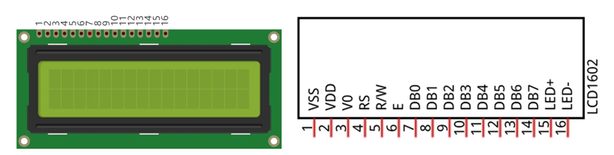
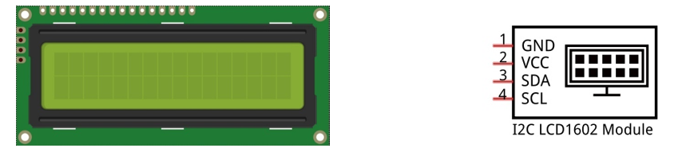
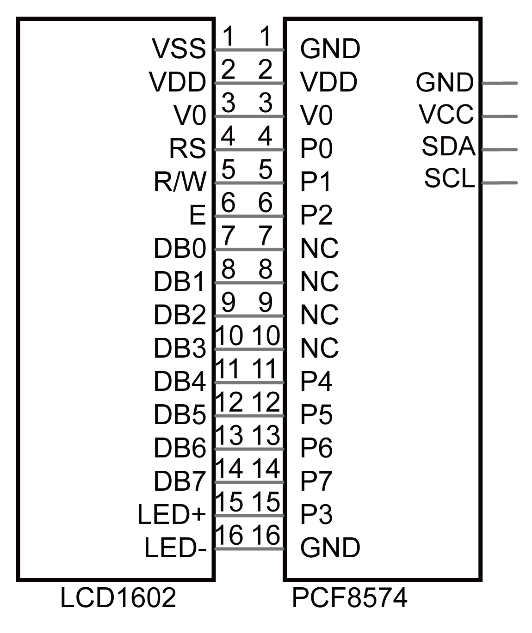
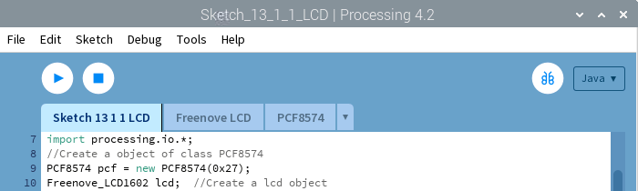

################################################################
Chapter I2C-LCD1602
################################################################

In this chapter, we will learn about the LCD1602 Display Screen

Project I2C LCD1602
****************************************************************

There are LCD1602 display screen and the I2C LCD. We will introduce both of them in this chapter. But what we use in this project is an I2C LCD1602 display screen. The LCD1602 Display Screen can display 2 lines of characters in 16 columns. It is capable of displaying numbers, letters, symbols, ASCII code and so on. As shown below is a monochrome LCD1602 Display Screen along with its circuit pin diagram

I2C LCD1602 Display Screen integrates a I2C interface, which connects the serial-input & parallel-output module to the LCD1602 Display Screen. This allows us to only use 4 lines to operate the LCD1602.

The serial-to-parallel IC chip used in this module is PCF8574T (PCF8574AT), and its default I2C address is 0x27(0x3F). You can also view the RPI bus on your I2C device address through command "i2cdetect -y 1" (refer to the "configuration I2C" section below). 

Below is the PCF8574 chip pin diagram and its module pin diagram:

.. image:: ../_static/imgs/PCF8574.png
    :align: center

PCF8574 module pins and LCD1602 pins correspond to each other and connected to each other:

Because of this, as stated earlier, we only need 4 pins to control the16 pins of the LCD1602 Display Screen through the I2C interface.

In this project, we will use the I2C LCD1602 to display some static characters and dynamic variables.

Component List
================================================================

+-------------------------------------------------+-------------------------------------------------+
|1. Raspberry Pi (with 40 GPIO) x1                |                                                 |     
|                                                 |   Jumper Wires x4                               |       
|2. GPIO Extension Board & Ribbon Cable x1        |                                                 |       
|                                                 |     |jumper-wire|                               |                                                            
|3. Breadboard x1                                 |                                                 |                                                                 
+-------------------------------------------------+-------------------------------------------------+
| I2C LCD1602 Module x1                                                                             |
|                                                                                                   |
|  |LCD1602|                                                                                        |
+---------------------------------------------------------------------------------------------------+

.. |jumper-wire| image:: ../_static/imgs/jumper-wire.png
.. |LCD1602| image:: ../_static/imgs/LCD1602.png

Circuit
================================================================

Note that the power supply for I2C LCD1602 in this circuit is 5V.

+------------------------------------------------------------------------------------------------+
|   Schematic diagram                                                                            |
|                                                                                                |
|   |LCD1602_Sc|                                                                                 |
+------------------------------------------------------------------------------------------------+
|   Hardware connection. If you need any support,please feel free to contact us via:             |
|                                                                                                |
|   support@freenove.com                                                                         |
|                                                                                                |
|   |LCD1602_Fr|                                                                                 | 
+------------------------------------------------------------------------------------------------+

.. |LCD1602_Sc| image:: ../_static/imgs/LCD1602_Sc.png
.. |LCD1602_Fr| image:: ../_static/imgs/LCD1602_Fr.png

.. note::
    It is necessary to configure 12C and install Smbus first (see :doc:`Chapter 7 ADC <ADC>` for details)

Sketch
================================================================

Sketch 13.1.1 LCD
----------------------------------------------------------------

First observe the results of the code and the phenomenon, and then learn the code in detail.

1.	Use Processing to open the file Sketch_13_1_1_LCD.

.. code-block:: console    
    
    $ processing ~/Freenove_Kit/Processing/Sketches/Sketch_13_1_1_LCD/Sketch_13_1_1_LCD.pde

2.	Click on "RUN" to run the code.

After the program is executed, both LCD in the circuit and the Display Window will show the current time and date.

.. image:: ../_static/imgs/pr_LCD.png
    :align: center

This project contains a lot of code files, and the core code is contained in the file Sketch_13_1_1_LCD. The other files only contain some custom classes.

The following is program code:

.. literalinclude:: ../../../freenove_Kit/Code/Processing_Code/Sketches/Sketch_13_1_1_LCD/Sketch_13_1_1_LCD.pde
    :linenos: 
    :language: c

First create a PCF8574 class object “pcf”, and take “pcf” as a parameter to create an LCD1602 class object. And then define the variable “time” to store date and time. Display window needs not refresh frequently. Therefore, the frame rate can be set to 1Hz or 2Hz.

.. literalinclude:: ../../../freenove_Kit/Code/Processing_Code/Sketches/Sketch_13_1_1_LCD/Sketch_13_1_1_LCD.pde
    :linenos: 
    :language: c
    :lines: 10-18

In the function draw(), get the current time and date, and display them on the LCD1602 and Display Window.

.. literalinclude:: ../../../freenove_Kit/Code/Processing_Code/Sketches/Sketch_13_1_1_LCD/Sketch_13_1_1_LCD.pde
    :linenos: 
    :language: c
    :lines: 19-31

Reference
----------------------------------------------------------------

.. c:function:: class PCF8574

    This is a custom class that is used to control the integrated circuit PCF8574.
    
    **public PCF8574(int addr)**
   
    Constructor, used to create a PCF8574 class object. The parameter represents the I2C device address of PCF8574.
   
    **public int digitalRead(int pin)**
    
    Used to read the value(HIGH/LOW) of one of the ports.
    
    **public int readByte()**
   
    Used to read values of all ports.
  
    **public void digitalWrite(int pin, int val)**
  
    Write data(HIGH/LOW) to a port.
   
    **public void writeByte(int data)**

    Write data to all ports.

.. c:function:: class Freenove_LCD

    This is a custom class that is currently only used to control the I2C-LCD1602 connected to PCF8574.
    
    **public Freenove_LCD1602(PCF8574 ipcf)**
    
    Constructor, used to create Freenove_LCD1602 class object. The parameter is for PCF8574 class object.
    
    **public void putChar(char data)**
   
    Write a character to the LCD screen.
   
    **public void puts(String str)**
   
    Write a string to the LCD screen.
   
    **public void display(boolean state)**
    
    Turn on/off LCD.
   
    **public void lcdCursor(boolean state)**
  
    Turn on/off Cursor.
   
    **public void cursorBlink(boolean state)**
   
    Turn on/off Cursor Blink. 
   
    **public void position(int x, int y)**
  
    Set the location of Cursor.
  
    **public void home()**
   
    Set the Cursor to home.
   
    **public void lcdClear()**
   
    Clear the screen.
   
    **public void backLightON()  &  public void backLightOFF()**
  
    Turn on/off the backlight.
  
    **public void scrollDisplayLeft()  &  public void scrollDisplayRight()**
 
    Shift screen of a unit to left/right.
  
    **public void leftToRight()  &  public void rightToLeft()**
   
    Set text direction to be from left to right / from right to left.
 
    **public void autoScroll()  &  public void noAutoScroll()**
   
    Automatic shifting screen/turn off automatic shifting screen.
