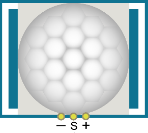
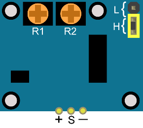
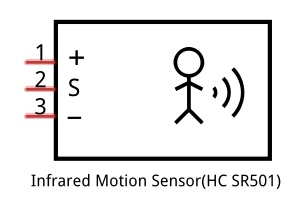
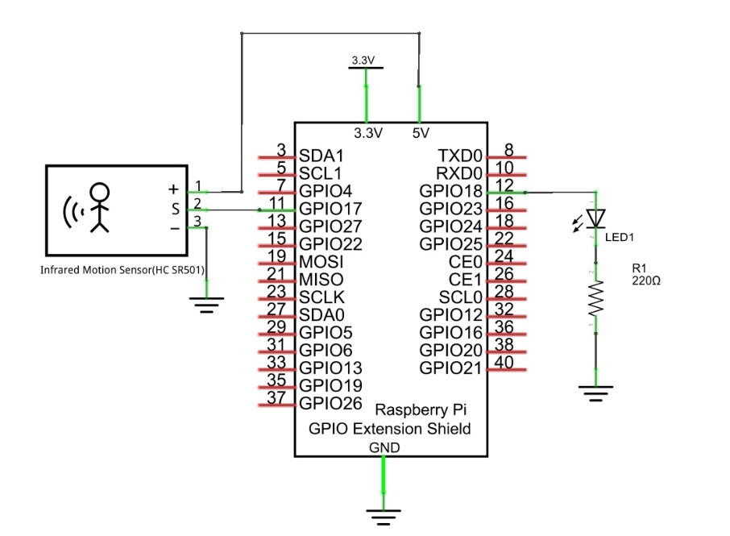
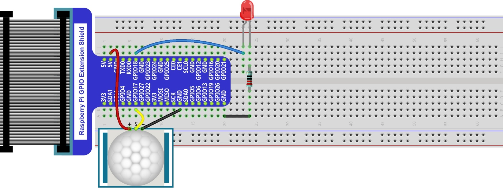
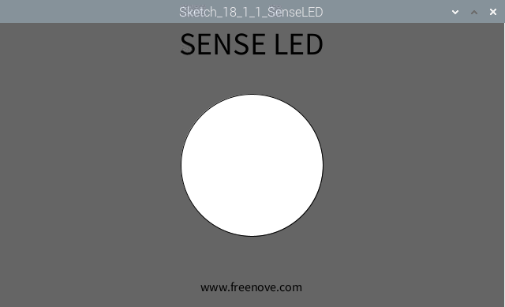

################################################################
Chapter Infrared Motion Sensor
################################################################

In this chapter, we will learn a widely used sensor, Infrared Motion Sensor. 

Project PIR Infrared Motion Detector with LED Indicator
****************************************************************

In this project, we will make a Motion Detector, with the human body infrared pyroelectric sensors.

When someone is in close proximity to the Motion Detector, it will automatically light up and when there is no one close by, it will be out.

This Infrared Motion Sensor can detect the infrared spectrum (heat signatures) emitted by living humans and animals.

Component List
================================================================

+-------------------------------------------------+-------------------------------------------------+
|1. Raspberry Pi (with 40 GPIO) x1                |                                                 |     
|                                                 |   Jumper Wires x5                               |       
|2. GPIO Extension Board & Ribbon Cable x1        |                                                 |       
|                                                 |     |jumper-wire|                               |                                                            
|3. Breadboard x1                                 |                                                 |                                                                 
+-----------------------------+-------------------+--------------+----------------------------------+
| HC SR501 x1                 | LED x1                           | Resistor 220Ω x1                 |
|                             |                                  |                                  |
|  |HC_SR501|                 |  |red-led|                       |  |res-220R|                      |
+-----------------------------+----------------------------------+----------------------------------+

.. |jumper-wire| image:: ../_static/imgs/jumper-wire.png
.. |red-led| image:: ../_static/imgs/red-led.png
    :width: 40%

.. |res-220R| image:: ../_static/imgs/res-220R.png
    :width: 20%

Component Knowledge
================================================================

==============  ======================  ==========================

|HC_SR501|        |HC_SR501_bottom|       |HC_SR501_Schematic|

==============  ======================  ==========================

Description: 

1.	Working voltage: 5v-20v(DC) Static current: 65uA.

2.	Automatic Trigger. When a living body enters into the active area of sensor, the module will output high level (3.3V). When the body leaves the sensor’s active detection area, it will output high level lasting for time period T, then output low level(0V). Delay time T can be adjusted by the potentiometer R1.

3.	Induction block time: the induction will stay in block condition and does not induce external signal at lesser time intervals (less than delay time) after outputting high level or low level 

4.	Initialization time: the module needs about 1 minute to initialize after being powered ON. During this period, it will alternately output high or low level. 

5.	One characteristic of this sensor is when a body moves close to or moves away from the sensor's dome edge, the sensor will work at high sensitively. When a body moves close to or moves away from the sensor’s dome in a vertical direction (perpendicular to the dome), the sensor cannot detect well (please take note of this deficiency). Actually this makes sense when you consider that this sensor is usually placed on a celling as part of a security product. Note: The Sensing Range (distance before a body is detected) is adjusted by the potentiometer.

We can regard this sensor as a simple inductive switch when in use.

Circuit
================================================================

+-------------------------------------------------------------------------------------------------+
|   Schematic diagram                                                                             |
|                                                                                                 |
|   |HC_SR501_Sc|                                                                                 |
+-------------------------------------------------------------------------------------------------+
|   Hardware connection. If you need any support,please feel free to contact us via:              |
|                                                                                                 |
|   support@freenove.com                                                                          |
|                                                                                                 |
|   |HC_SR501_Fr|                                                                                 |
+-------------------------------------------------------------------------------------------------+

Sketch
================================================================

Sketch SenseLED
----------------------------------------------------------------

First, observe the result after running the sketch, and then learn about the code in detail.

1.	Use Processing to open the file Sketch_18_1_1_SenseLED.

.. code-block:: console    
    
    $ processing ~/Freenove_Kit/Processing/Sketches/Sketch_18_1_1_SenseLED/Sketch_18_1_1_SenseLED.pde

2.	Click on "RUN" to run the code.

After the program is executed, Display Window shows the following interface, where the middle circle indicates the LED. Color of the circle is white when LED is off, green when LED is on.

The following is program code:

.. literalinclude:: ../../../freenove_Kit/Processing/Sketches/Sketch_18_1_1_SenseLED/Sketch_18_1_1_SenseLED.pde
    :linenos: 
    :language: c
    :dedent:

In this project, the code is relatively simple. In the function draw(), read level of sensor pin. When it is a high level, LED is turned on. At the same time the filled color will be changed to green. When the level is low, LED turns off and the filled color turns white. Finally, it draws a circle.

.. literalinclude:: ../../../freenove_Kit/Processing/Sketches/Sketch_18_1_1_SenseLED/Sketch_18_1_1_SenseLED.pde
    :linenos: 
    :language: c
    :lines: 17-29
    :dedent: