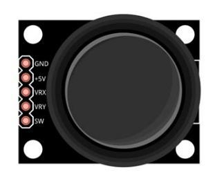
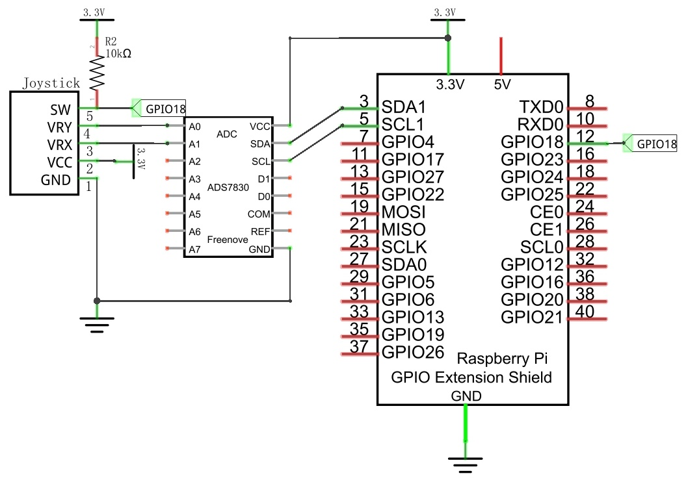
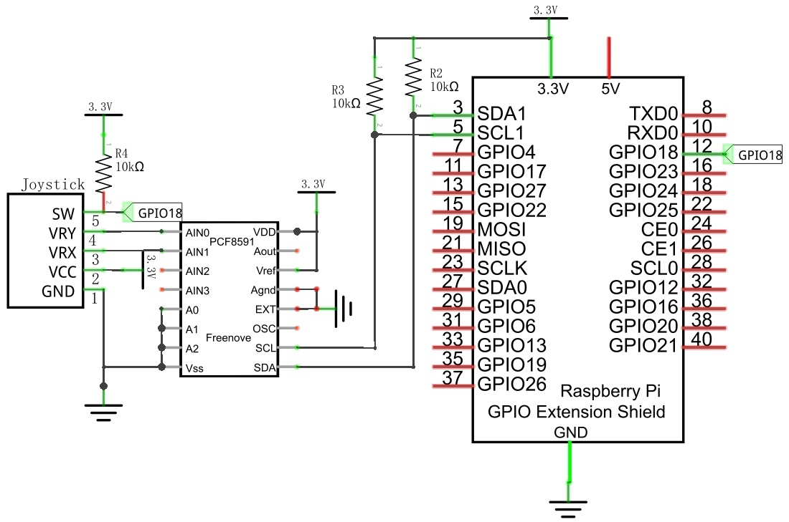
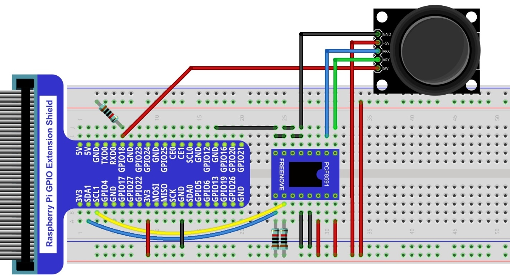

################################################################
Chapter Joystick
################################################################

In an earlier chapter, we learned how to use Rotary Potentiometer. We will now learn about joysticks, which are electronic modules that work on the same principle as the Rotary Potentiometer.

Project Joystick
****************************************************************

In this project, we will read the output data of a joystick and display it to the Terminal screen.

Component List
================================================================

+---------------------------------------------------------------+
|1. Raspberry Pi x1                                             |     
|                                                               |       
|2. GPIO Extension Board & Ribbon Cable x1                      |       
|                                                               |                                                            
|3. Breadboard x1                                               |                                                                 
+===============================+===============================+
| Joystick  x1                  |   Resistor 10kΩ x3            |
|                               |                               |
| |joystick|                    |  |Resistor-10kΩ|              |                           
+-------------------------------+-------------------------------+
| ADC module x1                                                 |
|                                                               |
|   |ADC-module-1|   :xx-large:`or`  |ADC-module-2|             |                   
|                                                               |  
+---------------------------------------------------------------+
|   Jumper x18                                                  |
|                                                               | 
|      |jumper-wire|                                            |
+---------------------------------------------------------------+

.. |jumper-wire| image:: ../_static/imgs/jumper-wire.png
.. |Resistor-10kΩ| image:: ../_static/imgs/Resistor-10kΩ.png

.. |ADC-module-1| image:: ../_static/imgs/ADC-module-1.png
.. |ADC-module-2| image:: ../_static/imgs/ADC-module-2.png

Component knowledge
================================================================

Joystick
----------------------------------------------------------------

A Joystick is a kind of input sensor used with your fingers. You should be familiar with this concept already as they are widely used in gamepads and remote controls. It can receive input on two axes (Y and or X) at the same time (usually used to control direction on a two dimensional plane). And it also has a third direction capability by pressing down (Z axis/direction).

.. image:: ../_static/imgs/joystick-2.png
        :width: 70%
        :align: center

This is accomplished by incorporating two rotary potentiometers inside the Joystick Module at 90 degrees of each other, placed in such a manner as to detect shifts in direction in two directions simultaneously and with a Push Button Switch in the “vertical” axis, which can detect when a User presses on the Joystick.

.. image:: ../_static/imgs/joystick-fritizing.png
        :width: 70%
        :align: center

When the Joystick data is read, there are some differences between the axes: data of X and Y axes is analog, which needs to use the ADC. The data of the Z axis is digital, so you can directly use the GPIO to read this data or you have the option to use the ADC to read this.

Circuit with ADS7830
================================================================

+------------------------------------------------------------------------------------------------+
|   Schematic diagram                                                                            |
|                                                                                                |
|   |ADS7830-Schematic-6|                                                                        |
+------------------------------------------------------------------------------------------------+
|   Hardware connection. If you need any support,please feel free to contact us via:             |
|                                                                                                |
|   support@freenove.com                                                                         |
|                                                                                                |
|   |ADS7830-fritizing-7|                                                                        |
|                                                                                                |
|    **Thermistor has longer pins than the one shown in circuit.**                               |
+------------------------------------------------------------------------------------------------+

.. |ADS7830-fritizing-7| image:: ../_static/imgs/ADS7830-fritizing-7.png

Circuit with PCF8591
================================================================

+------------------------------------------------------------------------------------------------+
|   Schematic diagram                                                                            |
|                                                                                                |
|   |PCF8591-Schematic-6|                                                                        |
+------------------------------------------------------------------------------------------------+
|   Hardware connection. If you need any support,please feel free to contact us via:             |
|                                                                                                |
|   support@freenove.com                                                                         |
|                                                                                                |
|   |PCF8591-fritizing-6|                                                                        |
+------------------------------------------------------------------------------------------------+

Sketch
================================================================

Sketch 14.1.1 Joystick
----------------------------------------------------------------

First observe the result after running the sketch, and then learn about the code in detail.

1.	Use Processing to open the file Sketch_14_1_1_Joystick.

.. code-block:: console    
    
    $ processing ~/Freenove_Kit/Processing/Sketches/Sketch_14_1_1_Joystick/Sketch_14_1_1_Joystick.pde

2.	Click on "RUN" to run the code.

After the program is executed, Display Window shows the current relative position of Joystick. And the upper left corner shows ADC value of three axes of the Joystick.

When the button of Z axis is pressed, the circle will change its filled color.

This project contains several code files, as shown below:

.. literalinclude:: ../../../freenove_Kit/Code/Processing_Code/Sketches/Sketch_14_1_1_Joystick/Sketch_14_1_1_Joystick.pde
    :linenos: 
    :language: c

In function draw(), the ADC value of three axes Joystick is read. And the ADC value of X and Y directions are mapped into the position of the circle, and the ADC value of Z axis is mapped into the filled color of the circle.

.. literalinclude:: ../../../freenove_Kit/Code/Processing_Code/Sketches/Sketch_14_1_1_Joystick/Sketch_14_1_1_Joystick.pde
    :linenos: 
    :language: c
    :lines: 30-52

