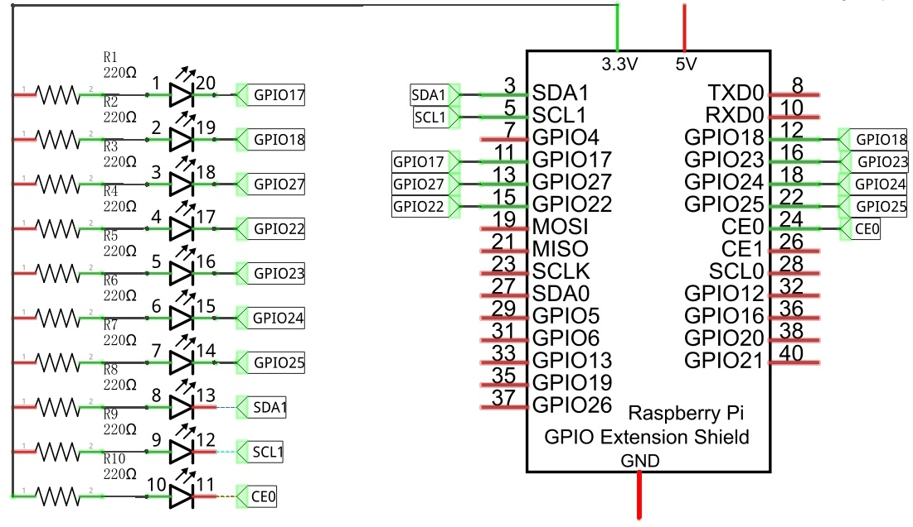

################################################################
Chapter LED Bar Graph
################################################################

We have learned how to control one LED to blink. Next, we will learn how to control a number of LEDs

Project FollowLight
****************************************************************

In this project, we will use the mouse to control the LED Bar Graph

Component List
================================================================

+--------------------------------------------------+---------------------------------------------------+
|1. Raspberry Pi (with 40 GPIO) x1                 |                                                   |
|                                                  | Jumper Wires x6                                   |
|2. GPIO Extension Board & Ribbon Cable x1         |                                                   |
|                                                  |  |jumper-wire|                                    |
|3. Breadboard x1                                  |                                                   |
+--------------------------------------------------+---------------------------------------------------+
|  Bar Graph LED x1                                | Resistor 220Ω x10                                 |
|                                                  |                                                   |
|   |LED-BAR|                                      |  |res-220R-hori|                                  |
+--------------------------------------------------+---------------------------------------------------+

.. |jumper-wire| image:: ../_static/imgs/jumper-wire.png
.. |LED-BAR| image:: ../_static/imgs/LED-BAR.png
    :width: 60%
.. |res-220R-hori| image:: ../_static/imgs/res-220R-hori.png
    :width: 60%

Component knowledge
================================================================
Let us learn about the basic features of these components to use and understand them better.

Bar Graph LED
----------------------------------------------------------------
A Bar Graph LED has 10 LEDs integrated into one compact component. The two rows of pins at its bottom are paired to identify each LED like the single LED used earlier. 

.. image:: ../_static/imgs/LED_BAR_NUM.png
        :align: center

Circuit
================================================================
A reference system of labels is used in the circuit diagram below. Pins with the same network label are connected together.

Schematic diagram             

                   

In this circuit, the cathodes of LEDs are connected to the GPIO, which is different from the previous circuit. Therefore, the LEDs turn ON when the GPIO outputs low level in the program.

.. image:: ../_static/imgs/LED-Graph-Fritzing.png                                                                
        :width: 100%   

.. note:: 
        :red:`If LEDbar doesn't work, rotate LEDbar 180° to try. The label is random.`

In this circuit, the cathodes of the LEDs are connected to the GPIO, which is different from the previous circuit. The LEDs turn ON when the GPIO output is low level in the program. 

Sketch
================================================================

Sketch 2.1.1 FollowLight
----------------------------------------------------------------

First, observe the result after running the sketch, and then learn about the code in detail.

1.	Use Processing to open the file Sketch_02_1_1_FollowLight.

.. code-block:: console    
    
    $ processing ~/Freenove_Kit/Processing/Sketches/Sketch_02_1_1_FollowLight/Sketch_02_1_1_FollowLight.pde

2.	Click on "RUN" to run the code.

After the program is executed, slide the mouse in the Display Window, then the state of LED Bar Graph will be changed, as shown below.

The following is program code:

.. literalinclude:: ../../../freenove_Kit/Code/Processing_Code/Sketches/Sketch_02_1_1_FollowLight/Sketch_02_1_1_FollowLight.pde
    :linenos: 
    :language: java

In the function draw(), we draw 10 rectangles to represent 10 LEDs of LED Bar Graph. We make rectangles on the left of mouse filled with red, corresponding LEDs turned ON. And make We make rectangles on the right of mouse filled with red, corresponding LEDs turned OFF. In this way, when slide the mouse to right, the more LEDs on the left of mouse will be turned ON. When to the left, the reverse is the case.

The following is program code:

.. literalinclude:: ../../../freenove_Kit/Code/Processing_Code/Sketches/Sketch_02_1_1_FollowLight/Sketch_02_1_1_FollowLight.pde
    :linenos: 
    :language: java
    :lines: 24-35