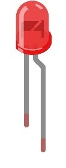
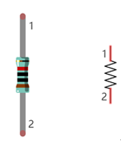
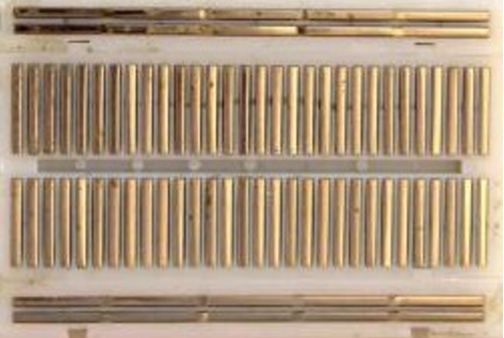

################################################################
Chapter LED
################################################################

We will still start from Blink LED in this chapter, and also learn the usage of some commonly used functions of Processing Software.

Project Blink
****************************************************************

In this project, we will use RPi to control blinking a common LED.

Component List
================================================================

.. table::
    :align: center
    :width: 80%
    :class: table-line

    +-----------------------------------------------------------+
    |    Raspberry Pi x 1                                       |     
    |                                                           |       
    |     |raspberrypi5|                                        | 
    +-----------------------------------------------------------+
    | Breadboard x1                                             |
    |                                                           |
    |  |breadborad-830|                                         |                         
    +--------------------------------------+--------------------+
    |  GPIO Extension Board & Ribbon Cable | Resistor 220Ω x1   |
    |                                      |                    | 
    |   |extension-board|                  |  |res-220R|        |
    +--------------------------------------+-------+------------+
    | Jumper                                       | LED x1     | 
    |                                              |            | 
    | **Specific quantity depends on the circuit.**| |red-led|  | 
    |                                              |            | 
    | |jumper-wire|                                |            | 
    +----------------------------------------------+------------+

.. |raspberrypi5| image:: ../_static/imgs/raspberrypi5.png
    :width: 40%
.. |jumper-wire| image:: ../_static/imgs/jumper-wire.png
    :width: 60%
.. |extension-board| image:: ../_static/imgs/raspberrypi-extension-board.jpg
    :width: 50%
.. |breadborad-830| image:: ../_static/imgs/breadborad-830.jpg
    :width: 60%

.. |res-220R| image:: ../_static/imgs/res-220R.png
    :width: 30%

In the components list, 3B GPIO, Extension Shield Raspberry and Breadboard are necessary for each project. Later, they will be reference by text only (no images as in above).

Circuit
================================================================

Build the circuit according to the circuit and hardware diagrams. After the circuit is built and verified correct, connect the RPi to GPIO Extension Shield. 

.. caution:: 

    CAUTION: Avoid any possible short circuits (especially connecting 5V or GND, 3.3V and GND)! 

.. warning:: 

    WARNING: A short circuit can cause high current in your circuit, create excessive component heat and cause permanent damage to your RPi!

1. **Schematic diagram**

.. image:: ../_static/imgs/blink-sch.png
    :height: 400
    :align: center

2. **Hardware connection** 

.. image:: ../_static/imgs/blink-hdc.png
    :height: 400
    :align: center

|

.. raw:: html

   <iframe style="display: block; margin: 0 auto;" height="421.875" width="750" src="https://www.youtube.com/embed/N2diyg_Anc0" frameborder="0" allowfullscreen></iframe>

|

.. tip:: 
     
     :red:`If you need any support, please contact us via:` :blue:`support@freenove.com`

Because the numbering of the GPIO Extension Shield is the same as that of the RPi GPIO, future hardware connection diagrams will only show that part of breadboard and GPIO Extension Shield.

.. image:: ../_static/imgs/blink-real.png
    :width: 100%
    :align: center

.. note:: 

    If you have a fan, you can connect it to 5V GND of breadboard via jumper wires.

**How to distinguish resistors?**

There are only three kind of resistors in this kit.

1. The one with *1 red ring* is 10KΩ \

    .. image:: ../_static/imgs/res-10K-hori.png
        :height: 17

2. The one with *1 red ring* is 220Ω

    .. image:: ../_static/imgs/res-220R-hori.png
        :height: 20

3. The one with *1 red ring* is 1KΩ

    .. image:: ../_static/imgs/res-1K-hori.png
        :height: 20

.. note:: 

    Future hardware connection diagrams will only show that part of breadboard and GPIO Extension Shield.

Component knowledge
================================================================

LED
----------------------------------------------------------------

An LED is a type of diode. All diodes only work if current is flowing in the correct direction and have two Poles. An LED will only work (light up) if the longer pin (+) of LED is connected to the positive output from a power source and the shorter pin is connected to the negative (-) output, which is also referred to as Ground (GND). This type of component is known as "Polar" (think One-Way Street).

All common 2 lead diodes are the same in this respect. Diodes work only if the voltage of its positive electrode is higher than its negative electrode and there is a narrow range of operating voltage for most all common diodes of 1.9 and 3.4V. If you use much more than 3.3V the LED will be damaged and burnt out.

.. image:: ../_static/imgs/led-describe.png
    :width: 100%
    :align: center

.. note:: 

    Note: LEDs cannot be directly connected to a power supply, which usually ends in a damaged component. A resistor with a specified resistance value must be connected in series to the LED you plan to use.

Resistor
----------------------------------------------------------------

Resistors use Ohms (Ω) as the unit of measurement of their resistance (R). 1MΩ=1000kΩ, 1kΩ=1000Ω.

A resistor is a passive electrical component that limits or regulates the flow of current in an electronic circuit.

On the left, we see a physical representation of a resistor, and the right is the symbol used to represent the presence of a resistor in a circuit diagram or schematic.

The bands of color on a resistor is a shorthand code used to identify its resistance value. For more details of resistor color codes, please refer to the card in the kit package.

With a fixed voltage, there will be less current output with greater resistance added to the circuit. The relationship between Current, Voltage and Resistance can be expressed by this formula: I=V/R known as Ohm's Law where I = Current, V = Voltage and R = Resistance. Knowing the values of any two of these allows you to solve the value of the third.

In the following diagram, the current through R1 is: 

.. math:: I=U/R=5V/10kΩ=0.0005A=0.5mA.

.. image:: ../_static/imgs/res-current.png
    :align: center

.. warning:: 

    Never connect the two poles of a power supply with anything of low resistance value (i.e. a metal object or bare wire) this is a Short and results in high current that may damage the power supply and electronic components.

.. note:: 

    Unlike LEDs and Diodes, Resistors have no poles and re non-polar (it does not matter which direction you insert them into a circuit, it will work the same)

Resistor
----------------------------------------------------------------

Here we have a small breadboard as an example of how the rows of holes (sockets) are electrically attached. The left picture shows the ways the pins have shared electrical connection and the right picture shows the actual internal metal, which connect these rows electrically.

.. image:: ../_static/imgs/breadborad-top-wire.png
    :width: 48%

GPIO Extension Board
----------------------------------------------------------------

GPIO board is a convenient way to connect the RPi I/O ports to the breadboard directly. The GPIO pin sequence on Extension Board is identical to the GPIO pin sequence of RPi. 

.. image:: ../_static/imgs/raspberrypi-extension-describe.png
    :width: 90%

Sketch
================================================================

Sketch Blink
----------------------------------------------------------------

Because the resource folder name is too long, for convenience, the folder will be named as "Freenove_Kit".

If you have already renamed it, skip this command. Assume the absolute path is "/ home / pi" or "~ /", execute the following command in the user directory.

.. code-block:: console

    $ mv Freenove_Ultimate_Starter_Kit_for_Raspberry_Pi/ Freenove_Kit/

First, observe the result after running the sketch, and then learn about the code in detail.

Use Processing to open the file Sketch_01_1_1_Blink. :red:`(The following is only one line of command. There is a Space after Processing.)`

.. code-block:: console

    $ processing ~/Freenove_Kit/Processing/Sketches/Sketch_01_1_1_Blink/Sketch_01_1_1_Blink.pde

Before using this command, please set the command, otherwise Processing cannot be opened.

Click on "RUN" to run the code.

You can also open it as follows.

Click Raspberry Pi file manager. Find the file under path: 

**/home/pi/Freenove_Kit/Processing/Sketches/Sketch_01_1_1_Blink**

And then right-click it and select Processing.

After the program is executed, LED will start Blinking and the background of Display window will change with the change of LED state.

The following is program code:

.. literalinclude:: ../../../freenove_Kit/Processing/Sketches/Sketch_01_1_1_Blink/Sketch_01_1_1_Blink.pde
    :linenos: 
    :language: java
    :dedent:

Processing code usually have two functions: setup() and draw(), where the function setup() is only executed once while the function draw() will be executed repeatedly. In the function setup(), size(100, 100) specifies the size of the Display Window to 100x100pixl. FrameRate(1) specifies the refresh rate of Display Window to once per second, which means the draw() function will be executed once per second. GPIO.pinMode (ledPin, GPIO.OUTPUT) is used to set ledPin to output mode.

.. literalinclude:: ../../../freenove_Kit/Processing/Sketches/Sketch_01_1_1_Blink/Sketch_01_1_1_Blink.pde
    :linenos: 
    :language: java
    :lines: 12-16
    :dedent:

In draw() function, each execution will invert the variable "ledState". When "ledState" is true, LED is turned ON, and the background color of display window is set to red. And when the "ledState" is false, the LED is turned OFF and the background color of display window is set to gray. Since the function draw() is executed once per second, the background color of Display Window and the state of LED will also change once per second. This process will repeat in an endless loop to achieve the effect of blinking.

.. literalinclude:: ../../../freenove_Kit/Processing/Sketches/Sketch_01_1_1_Blink/Sketch_01_1_1_Blink.pde
    :linenos: 
    :language: java
    :lines: 18-27
    :dedent:

The following is brief descriptions of some functions:

.. py:function:: setup()

    The setup() function is run once when the program starts.

.. py:function:: draw()

    It is called directly after the setup() function. The draw() function continuously executes the lines of code within its block until the program stops or noLoop() is called. draw() is called automatically and should never be called explicitly.

.. py:function:: size()

    Defines width and height of the display window in pixels.

.. py:function:: framerate()

    Specifies the number of frames to be displayed every second.

.. py:function:: background()

    Set the color of the background of the display window.

.. py:function:: GPIO.pinMode()

    Configures a pin to act either as input or output.

.. py:function:: GPIO.digitalWrite()

    Sets an output pin to be either high or low.

All functions used in this code can be found in the Reference of Processing Software, in which built-in functions are described in details, and there are some sample programs. It is recommended that beginners learn more about usage and function of those functions. The localization of Reference can be opened with the following steps: click the menu bar "Help"->"Reference".

Then the following page will be displayed in the web browser:

Or you can directly access to the official website for reference:http://processing.org/reference/

Project MouseLED
****************************************************************

In this project, we will use the mouse to control the state of LED.

The components and circuits of this project are the same as the previous section.

Sketch
================================================================

Sketch MouseLED
----------------------------------------------------------------

First, observe the result after running the sketch, and then learn the code in detail.

1.	Use Processing to open the file Sketch_01_2_1_MouseLED.

.. code-block:: console    
    
    $ processing ~/Freenove_Kit/Processing/Sketches/Sketch_01_2_1_MouseLED/Sketch_01_2_1_MouseLED.pde

2.	Click on "RUN" to run the code.

After the program is executed, the LED is in OFF-state, and background color of Display window is gray. Click the grey area of the Display Window with the mouse, LED is turned ON and Display window background color becomes red. Click on the Display Window again, the LED is turned OFF and the background color becomes gray, as shown below.

The following is program code:

.. literalinclude:: ../../../freenove_Kit/Processing/Sketches/Sketch_01_2_1_MouseLED/Sketch_01_2_1_MouseLED.pde
    :linenos: 
    :language: java

The function mouseClicked() in this code is used to capture the mouse click events. Once the mouse is clicked, the function will be executed. We can change the state of the variable "ledState" in this function to realize controlling LED by clicking on the mouse.

.. literalinclude:: ../../../freenove_Kit/Processing/Sketches/Sketch_01_2_1_MouseLED/Sketch_01_2_1_MouseLED.pde
    :linenos: 
    :language: java
    :lines: 27-29
    :dedent:

Freenove Car, Robot and other products for Raspberry Pi
================================================================

We also have car and robot kits for Raspberry Pi. You can visit our website for details.

https://www.amazon.com/freenove

**FNK0043**--:green:`Freenove 4WD Smart Car Kit for Raspberry Pi`

.. raw:: html

   <iframe style="display: block; margin: 0 auto;" height="421.875" width="750" src="https://www.youtube.com/embed/4Zv0GZUQjZc" frameborder="0" allowfullscreen></iframe>
  
**FNK0050**--:green:`Freenove Robot Dog Kit for Raspberry Pi`

.. raw:: html

   <iframe style="display: block; margin: 0 auto;" height="421.875" width="750" src="https://www.youtube.com/embed/7BmIZ8_R9d4" frameborder="0" allowfullscreen></iframe>

**FNK0052**--:green:`Freenove_Big_Hexapod_Robot_Kit_for_Raspberry_Pi`

.. raw:: html

   <iframe style="display: block; margin: 0 auto;" height="421.875" width="750" src="https://www.youtube.com/embed/LvghnJ2DNZ0" frameborder="0" allowfullscreen></iframe>