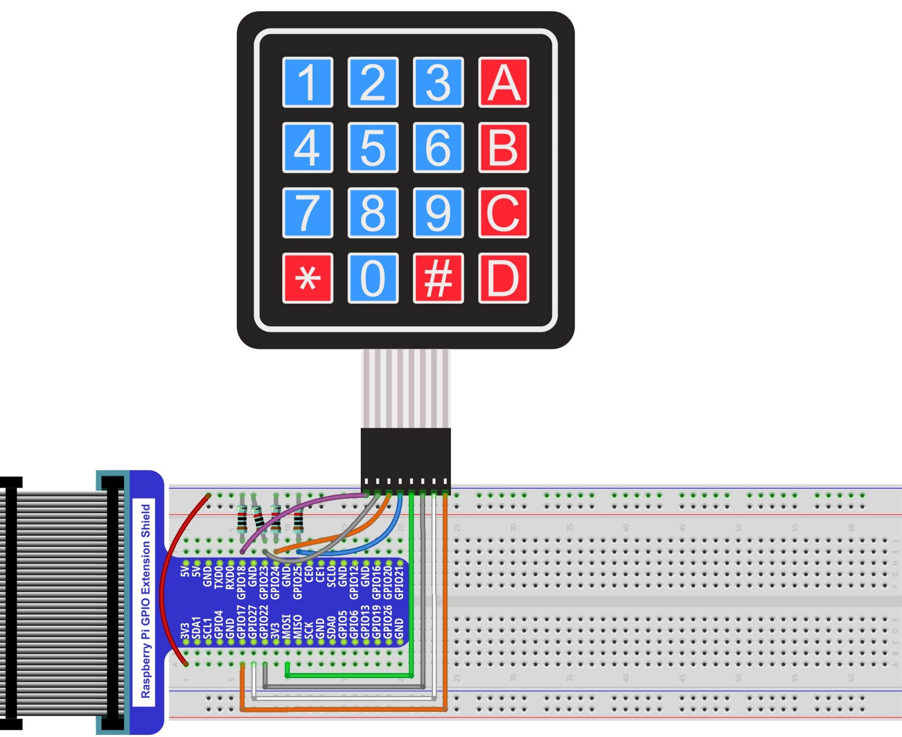
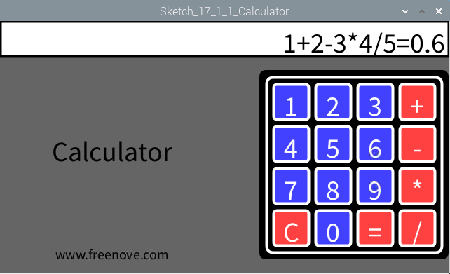

################################################################
Chapter Matrix Keypad
################################################################

Earlier we learned about a single Push Button Switch. In this chapter, we will learn about Matrix Keyboards, which integrates a number of Push Button Switches as Keys for the purposes of Input.

Project 22.1 Matrix Keypad
****************************************************************

In this project, we will attempt to get every key code on the Matrix Keypad to work.

Component List
================================================================

+-------------------------------------------------+-------------------------------------------------+
|1. Raspberry Pi (with 40 GPIO) x1                |                                                 |     
|                                                 | 4x4 Matrix Keypad x1                            |       
|2. GPIO Extension Board & Ribbon Cable x1        |                                                 |       
|                                                 |  |Keypad|                                       |                                                            
|3. Breadboard x1                                 |                                                 |                                                                 
+-------------------------------------------------+                                                 |
| Jumper wire                                     |                                                 |
|                                                 |                                                 |
|  |jumper-wire|                                  |                                                 |
+-------------------------------------------------+                                                 |
| Resistor 10kΩ x4                                |                                                 |
|                                                 |                                                 |
|  |Resistor-10kΩ|                                |                                                 |
+-------------------------------------------------+-------------------------------------------------+

.. |jumper-wire| image:: ../_static/imgs/jumper-wire.png
    :width: 50%
.. |Resistor-10kΩ| image:: ../_static/imgs/Resistor-10kΩ.png
    :width: 15%
.. |Keypad| image:: ../_static/imgs/Keypad.png

Component knowledge
================================================================

4x4 Matrix Keypad
----------------------------------------------------------------

A Keypad Matrix is a device that integrates a number of keys in one package. As is shown below, a 4x4 Keypad Matrix integrates 16 keys (think of this as 16 Push Button Switches in one module):

.. image:: ../_static/imgs/Keypad_1.png
    :align: center

Similar to the integration of an LED Matrix, the 4x4 Keypad Matrix has each row of keys connected with one pin and this is the same for the columns. Such efficient connections reduce the number of processor ports required. The internal circuit of the Keypad Matrix is shown below.

.. image:: ../_static/imgs/Keypad_2.png
    :align: center

The method of usage is similar to the Matrix LED, by using a row or column scanning method to detect the state of each key's position by column and row. Take column scanning method as an example, send low level to the first 1 column (Pin1), detect level state of row 5, 6, 7, 8 to judge whether the key A, B, C, D are pressed. Then send low level to column 2, 3, 4 in turn to detect whether other keys are pressed. Therefore, you can get the state of all of the keys.

Circuit
================================================================

+------------------------------------------------------------------------------------------------+
|   Schematic diagram                                                                            |
|                                                                                                |
|   |Keypad_Sc|                                                                                  |
+------------------------------------------------------------------------------------------------+
|   Hardware connection. If you need any support,please feel free to contact us via:             |
|                                                                                                |
|   support@freenove.com                                                                         |
|                                                                                                |
|   |Keypad_Fr|                                                                                  | 
+------------------------------------------------------------------------------------------------+

.. |Keypad_Sc| image:: ../_static/imgs/Keypad_Sc.png

Sketch
================================================================

Sketch 17.1.1 Calculator
----------------------------------------------------------------

First observe the result after running the sketch, and then learn about the code in detail.

1.	Use Processing to open the file Sketch_17_1_1_Calculator.

.. code-block:: console    
    
    $ processing ~/Freenove_Kit/Processing/Sketches/Sketch_17_1_1_Calculator/Sketch_17_1_1_Calculator.pde

2.	Click on "RUN" to run the code.

After the program is executed, Display Window shows the following interface, where the character "A, B, C, D, *, #" on the real Keypad is replaced by the character "+, -, *, /, C, =” on the virtual Keypad.

Calculator achieves the basic operation of add, subtract, multiply and divide. Button "C" means Clear, namely, clear the current content. When a button is pressed, the color of the corresponding button on the virtual keyboard will be turned into green, which indicates that the button is pressed.

This project contains several code files, as shown below:

The following is program code:

.. literalinclude:: ../../../freenove_Kit/Code/Processing_Code/Sketches/Sketch_17_1_1_Calculator/Sketch_17_1_1_Calculator.pde
    :linenos: 
    :language: c

In the code, first define key code of the Keypad, and the GPIO connected to the Keypad. Then create a Keypad class object based on the information, and finally create a Calculator class object according to the Keypad class object.

.. literalinclude:: ../../../freenove_Kit/Code/Processing_Code/Sketches/Sketch_17_1_1_Calculator/Sketch_17_1_1_Calculator.pde
    :linenos: 
    :language: c
    :lines: 9-17

In draw(), use cc.process() to obtain the key code of Keypad and for processing. And then draw the display area and virtual Keypad.

.. literalinclude:: ../../../freenove_Kit/Code/Processing_Code/Sketches/Sketch_17_1_1_Calculator/Sketch_17_1_1_Calculator.pde
    :linenos: 
    :language: c
    :lines: 21-27

Reference
----------------------------------------------------------------

.. c:function:: void drawKeypad(int x, int y)

    Used to draw a Keypad with (x, y) on the upper left corner.

.. c:function:: void drawDisplay(String content)

    The function at the top of the window to draw a calculator display area, and in the area of the right alignment display content.

.. c:function:: class Key

    This is a custom class that defines the associated attribute owned by a key. There are only some member variables and a constructor in this class.

.. c:function:: class Keypad

    This is a custom class that defines the methods to use keypad.
    
    **public Keypad(char[] usrKeyMap, int[] row_Pins, int[] col_Pins)**
    
    Constructor, the parameters are: key code of keyboard, row pins, column pins.
    
    **public char getKey()**
    
    Get the key code of the pressed key. If no key is pressed, the return value is '\0'.
    
    **public void setDebounceTime(int ms)**
    
    Set the debounce time. And the default time is 10ms.
    
    **public void setHoldTime(int ms)**

    Set the time when the key holds stable state after pressed.
    
    **public boolean isPressed(char keyChar)**
    
    Judge wether the key with code "keyChar" is pressed.
    
    **public char waitForKey()**
    
    Wait for a key to be pressed, and return key code of the pressed key.
    
    **public int getState()**
    
    Get state of the keys.
    
    **boolean keyStateChanged()**
    
    Judge whether there is a change of key state, then return True or False.

.. c:function:: class Calculator

    This is a custom class that defines the rules and calculating methods of the calculator.
    
    **String contentStr = "";**

    Member variable that saves the current processing results of the calculator, which will be directly displayed in the display area.
    
    **public Calculator(Keypad kp)**
    
    Constructor. the parameter is for the Keypad class object.
    
    **public void process()**
    
    Gets the key code of the key, and makes the corresponding judgment and processing. The Processing results are stored in the member variable “contentStr”.
    
    **public double parse(String content)**
    
    This is the core of the calculator. It is to parse a string of four fundamental operations and return its double-precision floating-point number equivalent.. For example, enter a string "1+2-3*4/5", then return value of 0.6.
