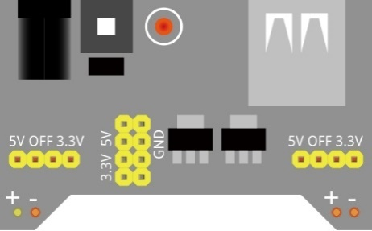
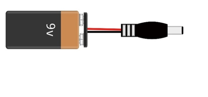
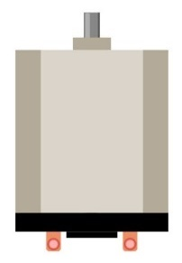
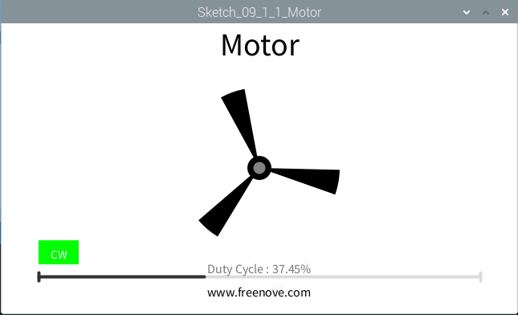

################################################################
Chapter LED Motor & Driver
################################################################

In this chapter, we will learn how to use a DC motor, including how to control the speed and direction of the motor.

Project Motor
****************************************************************

In this project, we use L293D to drive the DC motor. We can click on the button in the Processing Display Window to control motor direction, and drag the progress bar to control the motor speed.

+-------------------------------------------------+-------------------------------------------------+
|1. Raspberry Pi (with 40 GPIO) x1                |                                                 |     
|                                                 |   Jumper Wires x22                              |       
|2. GPIO Extension Board & Ribbon Cable x1        |                                                 |       
|                                                 |     |jumper-wire|                               |                                                            
|3. Breadboard x1                                 |                                                 |                                                                 
+-------------------------------------------------+-------------------------------------------------+
| Breadboard Power Module x1                      | 9V Battery (you provide) & 9V Battery Cable     |
|                                                 |                                                 |
|  |power-module|                                 |  |Battery_cable|                                |                           
+-------------------------------------------------+-------------------------------------------------+
| L293D IC Chip                                   | DC Motor x1                                     |
|                                                 |                                                 |
| |L2983_chip|                                    |  |DC_Motor_Module|                              |
+-------------------------------------------------+-------------------------------------------------+

.. |jumper-wire| image:: ../_static/imgs/jumper-wire.png

.. |L2983_chip| image:: ../_static/imgs/L2983_chip.png
    :width: 40%

Circuit
================================================================

Use caution: when connecting this circuit, because the DC Motor is a high-power component, :red:`do not use the power provided by the RPi to power the motor directly, as this may cause permanent damage to your RPi!`The logic circuit can be powered by the RPi's power or an external power supply, which should share a common ground with RPi.

+------------------------------------------------------------------------------------------------+
|   Schematic diagram                                                                            |
|                                                                                                |
|   |pr_MD_Sc|                                                                                   |
+------------------------------------------------------------------------------------------------+
|   Hardware connection.                                                                         |
|                                                                                                |
|   |pr_MD_Fr|                                                                                   |
+------------------------------------------------------------------------------------------------+

.. |pr_MD_Sc| image:: ../_static/imgs/pr_MD_Sc.png
.. |pr_MD_Fr| image:: ../_static/imgs/pr_MD_Fr.png

Sketch
================================================================

Sketch 9.1.1 Motor
----------------------------------------------------------------

First, observe the result after running the sketch, and then learn about the code in detail.

1.	Use Processing to open the file Sketch_09_1_1_Motor.

.. code-block:: console    
    
    $ processing ~/Freenove_Kit/Processing/Sketches/Sketch_09_1_1_Motor/Sketch_09_1_1_Motor.pde

2.	Click on "RUN" to run the code.

After the program is executed, a virtual fan, a button and a progress bar are shown on Display Window. Dragging the progress bar can change the motor speed, and the virtual fan will rotate with different speed accordingly. Clicking Button with mouse can change the motor rotation direction.

This project contains a lot of code files, and the core code is contained in the file Sketch_09_1_1_Motor. The other files only contain some custom classes.

The following is program code:

.. literalinclude:: ../../../freenove_Kit/Code/Processing_Code/Sketches/Sketch_09_1_1_Motor/Sketch_09_1_1_Motor.pde
    :linenos: 
    :language: java

First define the GPIO pin connected to the Motor, motor class object, the L293D class object, the ProgressBar class object, the Button class object, and some variables.

.. literalinclude:: ../../../freenove_Kit/Code/Processing_Code/Sketches/Sketch_09_1_1_Motor/Sketch_09_1_1_Motor.pde
    :linenos: 
    :language: java
    :lines: 9-19

Initialize the ProgressBar and Button in setup().

.. literalinclude:: ../../../freenove_Kit/Code/Processing_Code/Sketches/Sketch_09_1_1_Motor/Sketch_09_1_1_Motor.pde
    :linenos: 
    :language: java
    :lines: 15-26

In function draw(), draw all the contents to be displayed. Then set the motor speed, as well as the speed of virtual fan according to the progress of progress bar. And set the motor direction according to the button flag.

.. literalinclude:: ../../../freenove_Kit/Code/Processing_Code/Sketches/Sketch_09_1_1_Motor/Sketch_09_1_1_Motor.pde
    :linenos: 
    :language: java
    :lines: 29-49

In the mousePressed(), determine whether the Button is clicked on. If the mouse clicked on the Button, then change the motor direction and the text and color of Button. We have learned how to drag ProgressBar before, so here is no introduction.

.. literalinclude:: ../../../freenove_Kit/Code/Processing_Code/Sketches/Sketch_09_1_1_Motor/Sketch_09_1_1_Motor.pde
    :linenos: 
    :language: java
    :lines: 66-76

Subfunction drawFan(float angle) is used to draw a three-blade fan, based on an initial angle. And the angle between each two blades is 120°. Changing the value of “angle” can make the fan rotate to different angles.

.. literalinclude:: ../../../freenove_Kit/Code/Processing_Code/Sketches/Sketch_09_1_1_Motor/Sketch_09_1_1_Motor.pde
    :linenos: 
    :language: java
    :lines: 51-61

Reference
----------------------------------------------------------------

.. c:function:: class MOTOR

    This is a custom class that is used to operate the motor controlled by L293D.
    
    public MOTOR(int pin1, int pin2, int enablePin)
    
    Constructor, the first two parameters are GPIO pins connected to the L293D pin, and the enablePin is used to create a PWM pin within the range of 0-100 and with frequency of 100Hz.
    
    public void start(int dir, int speed)
    
    Used to drive motor. Parameter dir represents the rotation direction, whose value is CW, CCW, STOP. Parameter speed is used to decide the duty cycle of PWM. Its value is within the range of 0-100.

**About class BUTTON:**

.. c:function:: class BUTTON

    This is a custom class that is used to create a Button.
    
    public BUTTON(int ix, int iy, int iw, int ih)
    
    Constructor, used to create a BUTTON class object. The parameters are for the location and size of the button to be created.
    
    public void create()

    Used to draw Button.
    
    public void setBgColor(int ir, int ig, int ib)
    
    Used to set Button color.

    public void setText(String str)
    
    Used to set Button text.
    
    public void setTextColor(int ir, int ig, int ib)
    
    Used to set text color.
