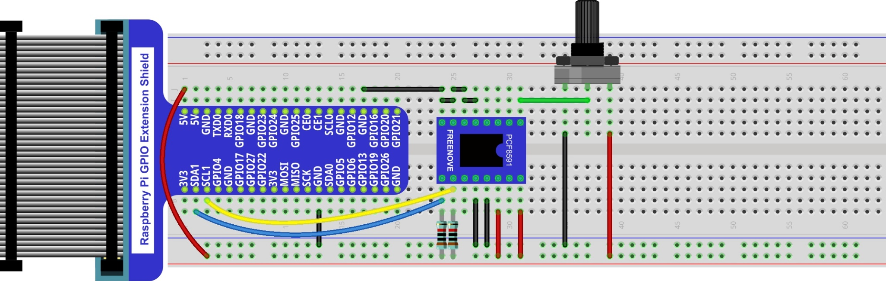

################################################################
App Oscilloscope
################################################################

We have used the ADC module to read the voltage of potentiometer to achieve the function of a voltmeter before. In this chapter, we will make a more complex virtual instrument, oscilloscope. Oscilloscope is a widely used electronic measuring instrument. It can get the electrical signals that cannot be observed directly into visible images to facilitate the analysis and study of various electrical signals changing process.

App 1.1 Oscilloscope
****************************************************************

Now, let's make an oscilloscope.

Component List
================================================================

+---------------------------------------------------------------+
|1. Raspberry Pi x1                                             |
|                                                               |
|2. GPIO Extension Board & Ribbon Cable x1                      |
|                                                               |
|3. Breadboard x1                                               |
+===============================+===============================+
| Rotary potentiometer x1       |   Resistor 10kΩ x3            |
|                               |                               |
| |Rotary-potentiometer|        |  |Resistor-10kΩ|              |
+-------------------------------+-------------------------------+
| ADC module x1                                                 |
|                                                               |
|   |ADC-module-1|   :xx-large:`or`  |ADC-module-2|             |
|                                                               |
+---------------------------------------------------------------+
|   Jumper M/M                                                  |
|                                                               |
|      |jumper-wire|                                            |
+---------------------------------------------------------------+

.. |jumper-wire| image:: ../_static/imgs/jumper-wire.png
.. |Resistor-10kΩ| image:: ../_static/imgs/Resistor-10kΩ.png
.. |Rotary-potentiometer| image:: ../_static/imgs/Rotary-potentiometer.png
.. |ADC-module-1| image:: ../_static/imgs/ADC-module-1.png
.. |ADC-module-2| image:: ../_static/imgs/ADC-module-2.png

Circuit with PCF8591
================================================================

Note that the power supply voltage of ADC module in this circuit is 5V.

+------------------------------------------------------------------------------------------------+
|   Schematic diagram                                                                            |
|                                                                                                |
|   |oscilloscope_Sc|                                                                            |
+------------------------------------------------------------------------------------------------+
|   Hardware connection. If you need any support,please feel free to contact us via:             |
|                                                                                                |
|   support@freenove.com                                                                         | 
|                                                                                                |
|   |oscilloscope_Fr|                                                                            |
+------------------------------------------------------------------------------------------------+

Circuit with ADS7830
================================================================

Note that the power supply voltage of ADC module in this circuit is 5V.

+------------------------------------------------------------------------------------------------+
|   Schematic diagram                                                                            |
|                                                                                                |
|   |oscilloscope_Sc_1|                                                                          |
+------------------------------------------------------------------------------------------------+
|   Hardware connection. If you need any support,please feel free to contact us via:             |
|                                                                                                |
|   support@freenove.com                                                                         | 
|                                                                                                |
|   |oscilloscope_Fr_1|                                                                          |
+------------------------------------------------------------------------------------------------+

Sketch
================================================================

Sketch 1.1.1 Oscilloscope
----------------------------------------------------------------

1.	Use Processing to open the file Sketch_01_1_1_Oscilloscope.

.. code-block:: console    
    
    $ processing ~/Freenove_Kit/Processing/Apps/App_01_1_1_Oscilloscope/App_01_1_1_Oscilloscope.pde

2.	Click on "RUN" to run the code.

After the program is executed, Display Window displays as follows. Rotating potentiometer can make the following waveform.

The left side of the software interface is a voltage scale, which is used to indicate the voltage of the waveform.

The "1000ms" on top left corner is the time of a square, and you can press "↑" and "↓" key on keyboard to adjust it.

The "0.00V" on top right corner is the voltage value of current signal.

You can press the space bar on keyboard to pause the display of waveform, which is easy to view and analysis.

We believe that with the help of this oscilloscope, you can have a more intuitive understanding of the actual work of some electronic circuits. It will help you complete the project and facilitate troubleshooting.. You can export this sketch to an application used as a tool.