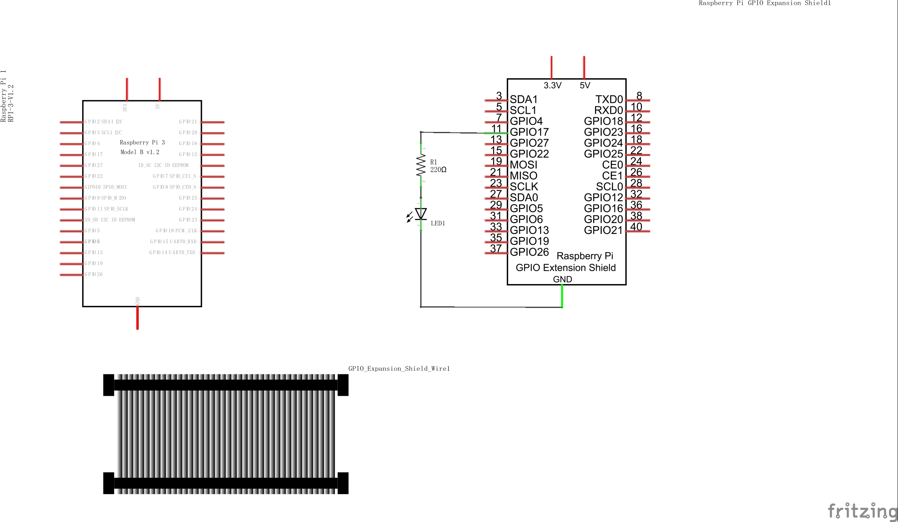
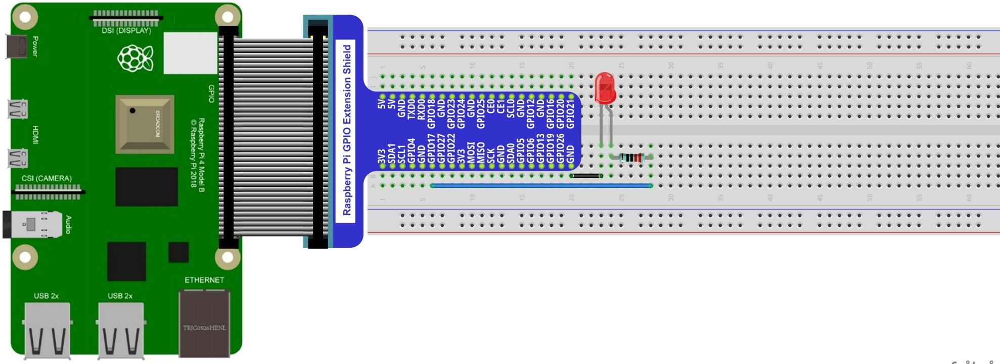
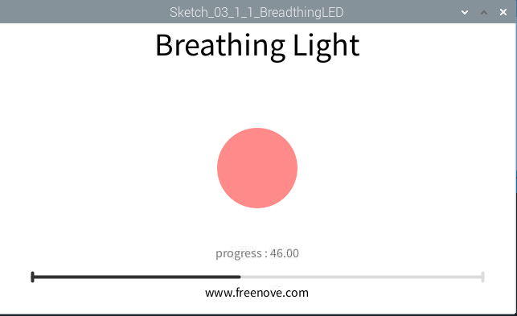
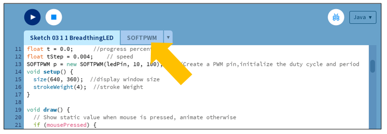

################################################################
Chapter PWM
################################################################

In previous chapters, we learned that a Push Button Switch has two states: Pressed (ON) and Released (OFF), and an LED has a Light ON and OFF state. Is there a middle or intermediated state? We will next learn how to create an intermediate output state to achieve a partially bright (dim) LED.

First, let us learn how to control the brightness of an LED.

Project Breathing LED
****************************************************************

We describe this project as a Breathing Light. This means that an LED that is OFF will then turn ON gradually and then gradually turn OFF like "breathing". Okay, so how do we control the brightness of an LED to create a Breathing Light? We will use PWM to achieve this goal.

Component List
================================================================

1. Raspberry Pi (with 40 GPIO) x1
GPIO Extension Board & Ribbon Cable x1
Breadboard x1

2. Jumper Wire x 1

.. image:: ../_static/imgs/jumper-wire.png
        :width: 25%

3. LED x1

.. image:: ../_static/imgs/red-led.png
        :width: 5%

4. Resistor 220Ω x 1

.. image:: ../_static/imgs/res-220R-hori.png
        :width: 15%

Circuit
================================================================
    
==================  ================================================
Schematic diagram   Hardware connection. If you need any support,
 
                    please feel free to contact us via: 
                    
                    support@freenove.com

|pr_PWM_Sc|         |pr_PWM_Fr|
==================  ================================================

Sketch
================================================================

Sketch 3.1.1 BreathingLED
----------------------------------------------------------------

First, observe the result after running the sketch, and then learn about the code in detail.

1.	Use Processing to open the file Sketch_03_1_1_BreathingLED.

.. code-block:: console    
    
    $ processing ~/Freenove_Kit/Processing/Sketches/Sketch_03_1_1_BreadthingLED/Sketch_03_1_1_BreadthingLED.pde

2.	Click on "RUN" to run the code.

After the program is executed, the LED in the circuit will be brightened gradually, and the color of LED pattern in Display Window will deepen gradually at the same time. The progress bar under the paten shows the percentage of completion, and clicking on the inside of window with the mouse can change the progress.

The following is program code:

.. literalinclude:: ../../../freenove_Kit/Code/Processing_Code/Sketches/Sketch_03_1_1_BreadthingLED/Sketch_03_1_1_BreadthingLED.pde
    :linenos: 
    :language: java

First, use SOFTPWM class to create a PWM pin, which is used to control the brightness of LED. Then define a variable “t” and a variable “tStep” to control the PWM duty cycle and the rate at which “t” increases.

.. literalinclude:: ../../../freenove_Kit/Code/Processing_Code/Sketches/Sketch_03_1_1_BreadthingLED/Sketch_03_1_1_BreadthingLED.pde
    :linenos: 
    :language: java
    :lines: 11-13

In the function draw, if there is a click detected, the coordinate in X direction of the mouse will be mapped into the duty cycle “t”; Otherwise, duty cycle “t” will be increased gradually and PWM with the duty cycle will be output.

.. literalinclude:: ../../../freenove_Kit/Code/Processing_Code/Sketches/Sketch_03_1_1_BreadthingLED/Sketch_03_1_1_BreadthingLED.pde
    :linenos: 
    :language: java
    :lines: 19-27

The next code is designed to draw a circle filled with colors in different depth according to the “t” value, which is used to simulate LEDs with different brightness.

.. literalinclude:: ../../../freenove_Kit/Code/Processing_Code/Sketches/Sketch_03_1_1_BreadthingLED/Sketch_03_1_1_BreadthingLED.pde
    :linenos: 
    :language: java
    :lines: 32-33

The last code is designed to draw the progress bar and the percentage of the progress.

.. literalinclude:: ../../../freenove_Kit/Code/Processing_Code/Sketches/Sketch_03_1_1_BreadthingLED/Sketch_03_1_1_BreadthingLED.pde
    :linenos: 
    :language: java
    :lines: 39-48

In processing software, you will see a tag page "SOFTPWM" in addition to the above code.

Reference
----------------------------------------------------------------

.. c:function:: class SOFTPWM

    public SOFTPWM(int iPin, int dc, int pwmRange):
    
    Constructor, used to create a PWM pin, set the pwmRange and initial duty cycle. The minimum of pwmRange is 0.1ms. So pwmRange=100 means that the PWM duty cycle is 0.1ms*100=10ms.
    
    public void softPwmWrite(int value)
    
    Set PMW duty cycle.
    
    public void softPwmStop()
    
    Stop outputting PWM.
