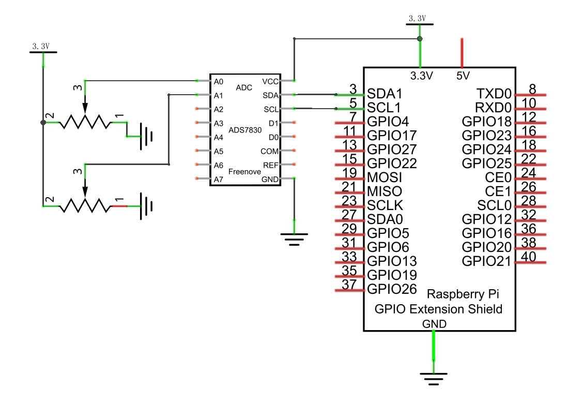
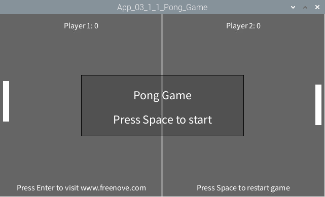

################################################################
Chapter Thermistor
################################################################

In this chapter, we will play a Pong Game.

App Pong Game
****************************************************************

Now, let's create and experience our own game.

Component List
================================================================

+---------------------------------------------------------------+
|1. Raspberry Pi x1                                             |
|                                                               |
|2. GPIO Extension Board & Ribbon Cable x1                      |
|                                                               |
|3. Breadboard x1                                               |
+===============================+===============================+
| Rotary potentiometer x2       |   Resistor 10kΩ x2            |
|                               |                               |
| |Rotary-potentiometer|        |  |Resistor-10kΩ|              |
+-------------------------------+-------------------------------+
| ADC module x1                                                 |
|                                                               |
|   |ADC-module-1|   :xx-large:`or`  |ADC-module-2|             |
|                                                               |
+---------------------------------------------------------------+
|   Jumper M/M                                                  |
|                                                               |
|      |jumper-wire|                                            |
+---------------------------------------------------------------+

.. |jumper-wire| image:: ../_static/imgs/jumper-wire.png
.. |Resistor-10kΩ| image:: ../_static/imgs/Resistor-10kΩ.png
.. |Rotary-potentiometer| image:: ../_static/imgs/Rotary-potentiometer.png
.. |ADC-module-1| image:: ../_static/imgs/ADC-module-1.png
.. |ADC-module-2| image:: ../_static/imgs/ADC-module-2.png

Circuit with PCF8591
================================================================

Note that the power supply voltage of ADC module in this circuit is 5V.

+------------------------------------------------------------------------------------------------+
|   Schematic diagram                                                                            |
|                                                                                                |
|   |Graphics_PCF8591_Sc|                                                                        |
+------------------------------------------------------------------------------------------------+
|   Hardware connection. If you need any support,please feel free to contact us via:             |
|                                                                                                |
|   support@freenove.com                                                                         | 
|                                                                                                |
|   |Graphics_PCF8591_Fr|                                                                        |
+------------------------------------------------------------------------------------------------+

.. |Graphics_PCF8591_Sc| image:: ../_static/imgs/Graphics_PCF8591_Sc.png
.. |Graphics_PCF8591_Fr| image:: ../_static/imgs/Graphics_PCF8591_Fr.png

Circuit with ADS7830
================================================================

Note that the power supply voltage of ADC module in this circuit is 5V.

+------------------------------------------------------------------------------------------------+
|   Schematic diagram                                                                            |
|                                                                                                |
|   |Graphics_ADS7830_Sc|                                                                        |
+------------------------------------------------------------------------------------------------+
|   Hardware connection. If you need any support,please feel free to contact us via:             |
|                                                                                                |
|   support@freenove.com                                                                         | 
|                                                                                                |
|   |oscilloscope_Fr_1|                                                                          |
+------------------------------------------------------------------------------------------------+

.. |Graphics_ADS7830_Fr| image:: ../_static/imgs/Graphics_ADS7830_Fr.png

Sketch
================================================================

Sketch 3.1.1 PongGame
----------------------------------------------------------------

1.	Use Processing to open the file Sketch_03_1_1_PongGame.

.. code-block:: console    
    
    $ processing ~/Freenove_Kit/Processing/Apps/App_03_1_1_Pong_Game/App_03_1_1_Pong_Game.pde

2.	Click on "RUN" to run the code.

After the program is executed, Display Window displays as below.

Pressing the space bar keyboard can start the game. Then you can try to rotate the potentiometer to control the movement of paddles:

Use potentiometer to control the movement of paddle to hit back the ball. The rules are the same as the classic Pong game:

The game will be over when one side gets three points. Pressing the space can restart the game:

You can restart the game by pressing the space bar at any time during the game.