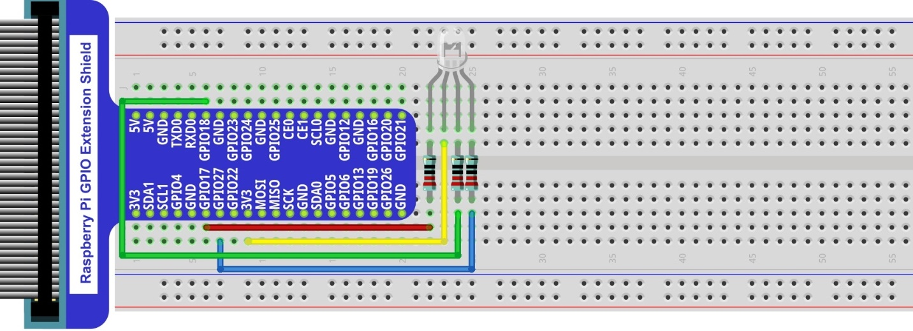
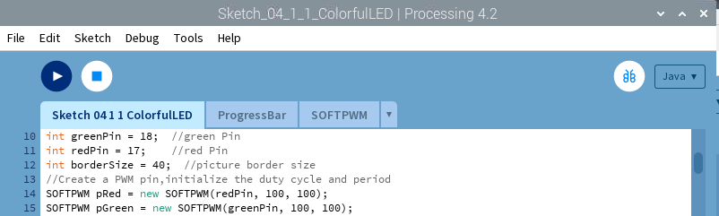

################################################################
Chapter RGBLED
################################################################

In this chapter, we will learn how to use RGBLED.

Project Multicolored LED
****************************************************************

This project will make a Multicolored LED, namely, use Processing to control the color of RGBLED.

Component List
================================================================
    
+--------------------------------------------+--------------------+
|    Raspberry Pi (with 40 GPIO) x1          | RGB LED x1         |
|                                            |                    |   
|    GPIO Extension Board & Ribbon Cable x1  |  |RGB-LED-real|    |
|                                            |                    |
|    Breadboard x1                           |                    |
+--------------------------------------------+--------------------+
|  Jumper Wire                               | Resistor 220Ω x3   |
|                                            |                    |
|   |jumper-wire|                            |  |res-220R-hori|   |        
+--------------------------------------------+--------------------+

.. |jumper-wire| image:: ../_static/imgs/jumper-wire.png
.. |res-220R-hori| image:: ../_static/imgs/res-220R-hori.png
.. |RGB-LED-real| image:: ../_static/imgs/RGB-LED-real.png

Circuit
================================================================

+-------------------------------------------------------------------------------------+
|   Schematic diagram                                                                 |
|                                                                                     |
|   |RGB-LED-Scbematic|                                                               |
+-------------------------------------------------------------------------------------+
|   Hardware connection. If you need any support,please feel free to contact us via:  |
|                                                                                     |
|   support@freenove.com                                                              | 
|                                                                                     |
|   |RGB-LED-fritizing|                                                               |
+-------------------------------------------------------------------------------------+

.. |RGB-LED-Scbematic| image:: ../_static/imgs/RGB-LED-Scbematic.png
    :width: 80%

Sketch
================================================================

Sketch 4.1.1 ColorfulLED
----------------------------------------------------------------

First, observe the result after running the sketch, and then learn about the code in detail.

1.	Use Processing to open the file Sketch_04_1_1_ColorfulLED.

.. code-block:: console    
    
    $ processing ~/Freenove_Kit/Processing/Sketches/Sketch_04_1_1_ColorfulLED/Sketch_04_1_1_ColorfulLED.pde

2.	Click on "RUN" to run the code.

After the program is executed, RGBLED is in OFF-state. And in Display Window, the pattern used to simulate LED is black. Red, Green and Blue progress bars are at 0%. By using mouse to click on and drag any progress bar, you can set the PWM duty cycle of color channels, and then RGBLED in the circuit will show corresponding colors. At the same time, the pattern in Display Window will show the same color.

    
This project contains a lot of code files, and the core code is contained in the file Sketch_04_1_1_ColorfulLED. The other files only contain some custom classes.

The following is program code:

.. literalinclude:: ../../../freenove_Kit/Code/Processing_Code/Sketches/Sketch_04_1_1_ColorfulLED/Sketch_04_1_1_ColorfulLED.pde
    :linenos: 
    :language: java
    :lines: 14-18

In the code, first create three PWM pins and three progress bars to control RGBLED.

.. literalinclude:: ../../../freenove_Kit/Code/Processing_Code/Sketches/Sketch_04_1_1_ColorfulLED/Sketch_04_1_1_ColorfulLED.pde
    :linenos: 
    :language: java
    :lines: 20-31

And then in function setup(), define position and length of progress bar according to the size of Display Window, and set the name of each progress bar.

.. literalinclude:: ../../../freenove_Kit/Code/Processing_Code/Sketches/Sketch_04_1_1_ColorfulLED/Sketch_04_1_1_ColorfulLED.pde
    :linenos: 
    :language: java
    :lines: 33-43

System functions mousePressed(), mouseReleased() and mouseDragged() are used to determine whether the mouse drags the progress bar and set the schedule. If the mouse button is pressed in a progress bar, then the mousePressed () sets the progress flag rgbMouse to true, mouseDragged (mouseX) maps progress value to set corresponding PWM. When the mouse is released, mouseReleased() sets the progress flag rgbMouse to false.

.. literalinclude:: ../../../freenove_Kit/Code/Processing_Code/Sketches/Sketch_04_1_1_ColorfulLED/Sketch_04_1_1_ColorfulLED.pde
    :linenos: 
    :language: java
    :lines: 45-72

Reference
----------------------------------------------------------------

.. c:function:: class ProgressBar

    This is a custom class that is used to create a progress bar.

    public ProgressBar(int ix, int iy, int barlen)

    Constructor, used to create ProgressBar, the parameters for coordinates X, Y and length of ProgressBar.
    
    public void setTitle(String str)
    
    Used to set the name of progress bar, which will be displayed in the middle of the progress bar.
    
    public void setProgress(float pgress)

    Used to set the progress of progress bar. The parameter: 0<pgress<1.0.
    
    public void create() & public void create(float pgress)

    Used to draw progress bar.
