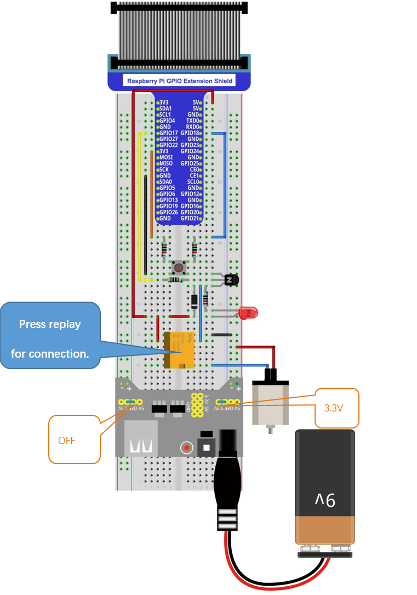

################################################################
Chapter Relay & Motor
################################################################

In this chapter, we will learn a kind of special switch module, Relay Module.

Project Relay & Motor
****************************************************************

In this project, we will use a Push Button Switch indirectly to control the DC Motor via a Relay.

+-------------------------------------------------+-------------------------------------------------+
|1. Raspberry Pi (with 40 GPIO) x1                |                                                 |     
|                                                 |   Jumper Wires x11                              |       
|2. GPIO Extension Board & Ribbon Cable x1        |                                                 |       
|                                                 |     |jumper-wire|                               |                                                            
|3. Breadboard x1                                 |                                                 |                                                                 
+-------------------------------------------------+-------------------------------------------------+
| Breadboard Power Module x1                      | 9V Battery (you provide) & 9V Battery Cable     |
|                                                 |                                                 |
|  |power-module|                                 |  |Battery_cable|                                |                           
+-----------------------------+-------------------+--------------+----------------------------------+
| Resistor 10kΩ x2            | Resistor 1kΩ x1                  | Resistor 220Ω x1                 |
|                             |                                  |                                  |
|  |Resistor-10kΩ|            |  |Resistor-1kΩ|                  |  |res-220R|                      |
+-----------------------------+----------------------------------+----------------------------------+
| NPN-transistor x1           | Relay x1                         | Motor x1                         |
|                             |                                  |                                  |
|  |NPN-transistor|           |  |Relay|                         |  |DC_Motor_Module|               |
+-----------------------------+----------------------------------+----------------------------------+
| Push button x1              | LED x1                           | Diode x1                         |
|                             |                                  |                                  |
|  |button-small|             |  |red-led|                       |  |Diode|                         |
+-----------------------------+----------------------------------+----------------------------------+

.. |jumper-wire| image:: ../_static/imgs/jumper-wire.png
.. |Resistor-10kΩ| image:: ../_static/imgs/Resistor-10kΩ.png
    :width: 10%
.. |power-module| image:: ../_static/imgs/power-module.png
    :width: 60%
.. |res-220R| image:: ../_static/imgs/res-220R.png
    :width: 18%
.. |Resistor-1kΩ| image:: ../_static/imgs/Resistor-1kΩ.png
    :width: 25%
.. |Battery_cable| image:: ../_static/imgs/Battery_cable.png
.. |NPN-transistor| image:: ../_static/imgs/NPN-transistor.png
    :width: 30%
.. |button-small| image:: ../_static/imgs/button-small.jpg
    :width: 30%
.. |DC_Motor_Module| image:: ../_static/imgs/DC_Motor_Module.png
    :width: 50%
.. |Diode| image:: ../_static/imgs/Diode.png
    :width: 20%
.. |Relay| image:: ../_static/imgs/Relay.png
    :width: 70%
.. |red-led| image:: ../_static/imgs/red-led.png
    :width: 50%

Component knowledge
================================================================

Relay
----------------------------------------------------------------

Relays are a type of Switch that open and close circuits electromechanically or electronically. Relays control one electrical circuit by opening and closing contacts in another circuit using an electromagnet to initiate the Switch action. When the electromagnet is energized (powered), it will attract internal contacts completing a circuit, which act as a Switch. Many times Relays are used to allow a low powered circuit (and a small low amperage switch) to safely turn ON a larger more powerful circuit. They are commonly found in automobiles, especially from the ignition to the starter motor.
The following is a basic diagram of a common Relay and the image and circuit symbol diagram of the 5V relay used in this project:

Pin 5 and pin 6 are internally connected to each other. When the coil pin3 and pin 4 are connected to a 5V power supply, pin 1 will be disconnected from pins 5 & 6 and pin 2 will be connected to pins 5 & 6. Pin 1 is called Closed End and pin 2 is called the Open End.

Inductor
----------------------------------------------------------------

The symbol of Inductance is “L” and the unit of inductance is the “Henry” (H). Here is an example of how this can be encountered: 1H=1000mH, 1mH=1000μH.
An Inductor is a passive device that stores energy in its Magnetic Field and returns energy to the circuit whenever required. An Inductor is formed by a Cylindrical Core with many Turns of conducting wire (usually copper wire). Inductors will hinder the changing current passing through it. When the current passing through the Inductor increases, it will attempt to hinder the increasing movement of current; and when the current passing through the inductor decreases, it will attempt to hinder the decreasing movement of current. So the current passing through an Inductor is not transient.

.. image:: ../_static/imgs/Inductor.png
    :align: center

The circuit for a Relay is as follows: The coil of Relay can be equivalent to an Inductor, when a Transistor is present in this coil circuit it can disconnect the power to the relay, the current in the Relay's coil does not stop immediately, which affects the power supply adversely. To remedy this, diodes in parallel are placed on both ends of the Relay coil pins in opposite polar direction. Having the current pass through the diodes will avoid any adverse effect on the power supply.

Circuit
================================================================

Use caution with the power supply voltage needed for the components in this circuit. The Relay requires a power supply voltage of 5V, and the DC Motor only requires 3.3V. Additionally, there is an LED present, which acts as an indicator (ON or OFF) for the status of the Relay's active status.

+------------------------------------------------------------------------------------------------+
|   Schematic diagram                                                                            |
|                                                                                                |
|   |Relay-Sc|                                                                                   |
+------------------------------------------------------------------------------------------------+
|   Hardware connection. If you need any support,please feel free to contact us via:             |
|                                                                                                |
|   support@freenove.com                                                                         |
|                                                                                                |
|   |Relay-Fr|                                                                                   |
+------------------------------------------------------------------------------------------------+

.. |Relay-Sc| image:: ../_static/imgs/Relay-Sc.png

Sketch
================================================================

Sketch 15.1.1 Relay
----------------------------------------------------------------

First observe the result after running the sketch, and then learn about the code in detail.

1.	Use Processing to open the file Sketch_15_1_1_Relay.

.. code-block:: console    
    
    $ processing ~/Freenove_Kit/Processing/Sketches/Sketch_15_1_1_Relay/Sketch_15_1_1_Relay.pde

2.	Click on "RUN" to run the code.

After the program is executed, Display Window shows the fan pattern used to simulate the motor and a Button for the controlling of the relay.

Click on the button on Display Window or press the button in the circuit, the relay is opened and the motor is drived. Press the Button again, then the reverse is the case.

This project contains several code files, as shown below:

The following is program code:

.. literalinclude:: ../../../freenove_Kit/Code/Processing_Code/Sketches/Sketch_15_1_1_Relay/Sketch_15_1_1_Relay.pde
    :linenos: 
    :language: c
    
First define pins corresponding to the key and relay.

.. literalinclude:: ../../../freenove_Kit/Code/Processing_Code/Sketches/Sketch_15_1_1_Relay/Sketch_15_1_1_Relay.pde
    :linenos: 
    :language: c
    :lines: 9-13

In the function setup(),Display Window and virtual button are initialized.

.. literalinclude:: ../../../freenove_Kit/Code/Processing_Code/Sketches/Sketch_15_1_1_Relay/Sketch_15_1_1_Relay.pde
    :linenos: 
    :language: c
    :lines: 16-22

In the function draw(), scan entity buttons. If the button is pressed, then execute the subfunction relayAction(), in which the state of Relay and virtual buttons will be changed. And then draw the virtual buttons and fan blades.

.. literalinclude:: ../../../freenove_Kit/Code/Processing_Code/Sketches/Sketch_15_1_1_Relay/Sketch_15_1_1_Relay.pde
    :linenos: 
    :language: c
    :lines: 24-42

Reference
----------------------------------------------------------------

.. c:function:: class SingleKey

This is a custom class that is used to control the state of an independent single key.

**public SingleKey(int Pin)**

Constructor, used to create a SingleKey class object. The parameter represents the GPIO pin number connected to the key.

**void keyScan()**

Used to detect key state. If the key is pressed, the member variable isPressed will be turned to true, and corresponding GPIO pin number will be assigned to the global variable keyValue. Otherwise, isPressed is false, keyValue is -1.
