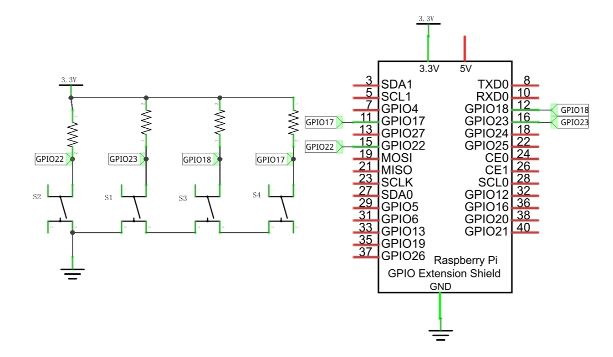
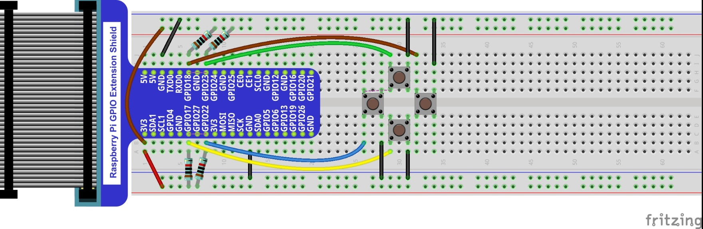
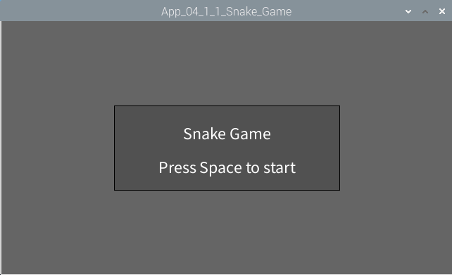
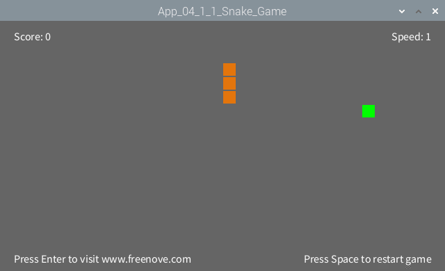
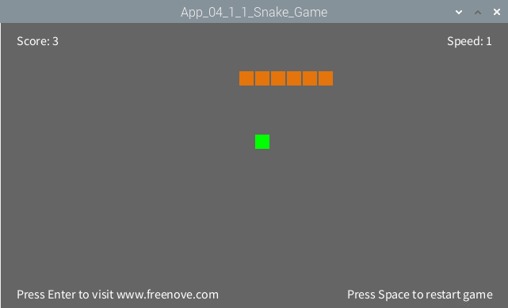
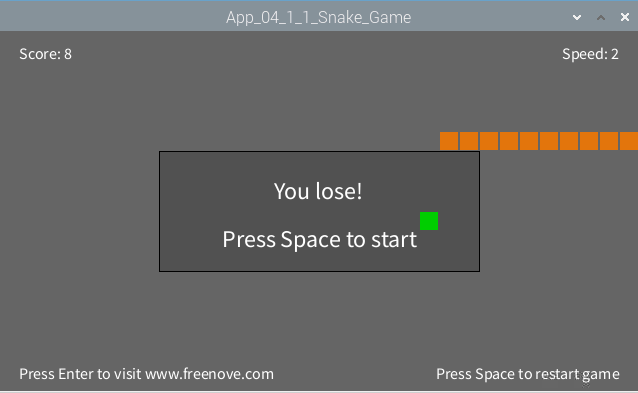

################################################################
Chapter Thermistor
################################################################

In this chapter, we will play a classic game, snake.

App Snake Game
****************************************************************

Now, let's create and experience our own game.

Component List
================================================================

+-------------------------------------------------+-------------------------------------------------+
|1. Raspberry Pi (with 40 GPIO) x1                |                                                 |     
|                                                 | Jumper Wires x36                                |       
|2. GPIO Extension Board & Ribbon Cable x1        |                                                 |       
|                                                 |  |jumper-wire|                                  |                                                            
|3. Breadboard x1                                 |                                                 |                                                                 
+-------------------------------------------------+-------------------------------------------------+
| Push button x4                                  | Resistor 10kΩ x1                                |
|                                                 |                                                 |
|  |button-small|                                 |  |Resistor-10kΩ|                                |
+-------------------------------------------------+-------------------------------------------------+

.. |jumper-wire| image:: ../_static/imgs/jumper-wire.png
.. |Resistor-10kΩ| image:: ../_static/imgs/Resistor-10kΩ.png
.. |button-small| image:: ../_static/imgs/button-small.jpgg
    :width: 50%

Circuit
================================================================

+------------------------------------------------------------------------------------+
|   Schematic diagram                                                                |
|                                                                                    |
|   |snake_game_Sc|                                                                  |
+------------------------------------------------------------------------------------+
|   Hardware connection. If you need any support,please feel free to contact us via: |
|                                                                                    |
|   support@freenove.com                                                             | 
|                                                                                    |
|   |snake_game_Fr|                                                                  |
+------------------------------------------------------------------------------------+

Sketch
================================================================

Sketch 4.1.1 SnakeGame
----------------------------------------------------------------

1.	Use Processing to open the file Sketch_04_1_1_SnakeGame.

.. code-block:: console    
    
    $ processing ~/Freenove_Kit/Processing/Apps/App_04_1_1_Snake_Game/App_04_1_1_Snake_Game.pde

2.	Click on "RUN" to run the code.

After the program is executed, Display Window displays as below.

Pressing the space can start the game:

    
You can control the movement direction of the snake through the four buttons in circuit or four arrow keys on the keyboard. The rules are the same as the classic Snake game:

When game is over, pressing the space can restart the game:

You can restart the game by pressing the space bar at any time during the game.